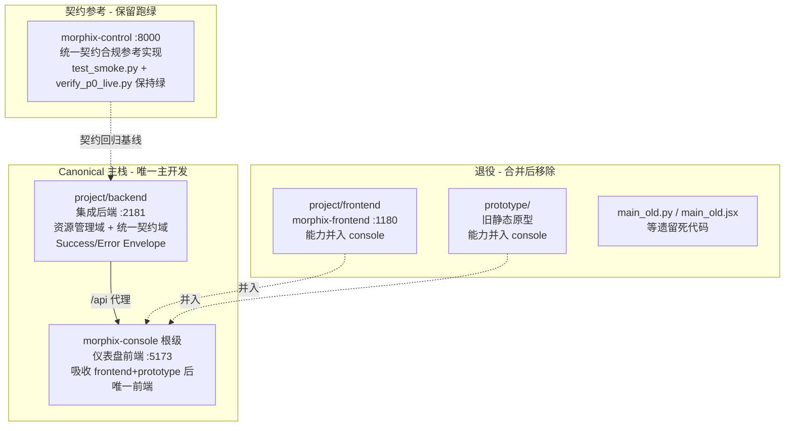

# PRD-工程收敛增量（Incremental Convergence PRD）

> 本文档为**增量 PRD**，仅描述「工程收敛」这一变更，不重新推导 Morphix 整体产品。
> 产品原意以 `PRD-私域运营AI协同平台-多项目版.md` / `PRD-无代码编排工作流.md` / `overview.md` 等既有文档为准，本文不与之冲突。
> 本文件所有状态均基于 `2025-07-18` 对仓库 `/Users/stevenmac/Desktop/工作目录/Morphix/` 的实地核对（git、目录结构、源码、契约文件）。

---

## 一、收敛目标

**一句话目标**：消除「两套后端 + 三套前端」并存导致的重复开发与契约漂移，确立唯一可开发的 canonical 主栈，并保留 morphix-control 作为统一契约的合规参考实现。

**收敛后的目标态**：
- **单 canonical 后端可达**：`project/backend` 成为唯一主开发后端，对外覆盖「资源管理域（bots/channels/conversations/knowledge/materials/sops/tags/workflows）+ 统一契约域（control/runtime/device/internal/auth）」全部路径，并统一采用 `openapi-morphix-unified.yaml` 的 `SuccessEnvelope`/`ErrorEnvelope` 与 5 套 `securitySchemes`。
- **单 canonical 前端**：根级 `morphix-console` 成为唯一前端主栈，吸收 `project/frontend` 与 `prototype` 的全部独有能力后，二者退役。
- **morphix-control 作为契约参考仍绿**：保留其 P0 主链路契约测试（`test_smoke.py` / `verify_p0_live.py`）跑通为绿，作为统一契约的「活参考」，但不再作为主开发栈。
- **本地起动命令唯一**：一条命令起动 canonical 后端 + canonical 前端，契约不再漂移。

---

## 二、用户故事

- **作为平台维护者**，我希望工程栈收敛为唯一主栈，以便新功能只做一份、不再在两套后端/三套前端间重复实现，降低长期维护成本。
- **作为开发者**，我希望本地起动命令唯一、契约真相源唯一（`openapi-morphix-unified.yaml`），以便联调不再因实现分叉而产生契约漂移与对接歧义。
- **作为运营/实施人员**，我希望控制台（morphix-console）集成 Bots、会话工作台、渠道托管、客户管理、数据概览等全部能力，以便在一个入口完成私域运营协同作业，而不必在原型/旧前端间切换。
- **作为架构评审者**，我希望 morphix-control 的契约测试持续为绿，以便在重构 canonical 后端时随时回归校验「是否仍满足统一契约」。

---

## 三、需求池（P0 / P1 / P2）

### P0（Must have）
1. **确立 canonical 主栈**：以 `project/backend`（集成后端）+ 根级 `morphix-console`（仪表盘前端）作为唯一主开发栈；其余后端/前端进入「合并→退役」流程。
2. **project/backend 对齐统一契约（最大 gap）**：实地核对显示 `project/backend` 当前实现 **0/33** 条统一契约路径（其路由器为资源风格：`/api/bots`、`/api/channel-accounts`、`/api/conversations`、`/api/workflows`、`/api/dashboard`… 且**未使用** `SuccessEnvelope`/`ErrorEnvelope`）。需将 `morphix-control` 的 `/api/control`、`/api/runtime`、`/api/device`、`/internal`、`/api/auth` 契约实现（含封套、5 套安全方案、幂等 Header、分页/错误码规范）并入 `project/backend`。
3. **解决概念重叠冲突**：`project/backend` 自有的 `/api/conversations` 与契约 `/api/control/conversations`、`/api/workflows/runs` 与 `/api/control/workflow-runs` 概念重叠但路径/封套不同，合并时须明确「弃用自有端点改用契约路径」或「并存并标注 Deprecated」。
4. **morphix-control 保留为参考并文档化**：保留其 `test_smoke.py`（P0 主链路契约测试）与 `verify_p0_live.py`，确保跑通为绿；在 `README.md` 明确其「统一契约合规参考实现」定位，不再作为主开发栈。
5. **project/frontend 与 prototype 独有功能并入 console 后退役**：实地核对显示 `morphix-console` 当前 **`src/` 目录为空**（仅有 package.json/vite.config.ts/tsconfig.json/index.html 脚手架）。需在其根 `src/` 中重建——（a）`project/frontend` 的 Bots（含 Knowledge/Material/Training 标签）、Home（数据概览）、Sessions（Audit/Handoff/MessageStream/RunTimeline）；（b）`prototype` 独有的渠道账号托管、渠道联系人、渠道会话托管、客户列表、数据概览（gauge/chart/data-panel）、渠道分布等页面；完成后 `project/frontend` 与 `prototype` 退役。

### P1（Should have）
1. **统一本地启动/构建脚本**：提供单一入口起动 canonical 后端（端口 2181）与 console（端口 5173）；`morphix-console` 的 `vite.config.ts` 需补齐 `/api` 代理指向 `127.0.0.1:2181`（当前无代理配置，而 `project/backend/run.sh` 与旧 `project/frontend` 均约定 2181）。
2. **统一 README / 文档入口**：根 `readme.md` 指向 canonical 主栈使用方式，并标注 `morphix-control`=参考、`project/frontend`+`prototype`=已退役。

### P2（Nice to have）
1. **清理死代码**：移除 `project/backend/app/main_old.py`、`project/frontend/src/main_old.jsx` 等遗留文件；`prototype` 退役后整体移除（保留截图可作为设计归档另行存放）。
2. **统一依赖管理**：对齐前端 React/路由栈——`project/frontend` 使用 `react-router-dom@7` + `lucide-react` 且依赖写 `latest`；`morphix-console` 当前为 `react-router-dom@6` 且无 `lucide-react`。收敛后锁定版本、消除 `latest`。

---

## 四、结构草图（收敛后目录 / 模块关系）

| 目录 / 模块 | 收敛动作 | 说明 |
|---|---|---|
| `project/backend/` | **保留（canonical）** | 主后端；吸收统一契约域实现 |
| 根级 `morphix-console/`（package.json 名 morphix-console，src 在根） | **保留（canonical）** | 主前端；从空脚手架搭建并吸收 frontend+prototype |
| `morphix-control/` | **保留为参考** | 跑通契约测试为绿；不再主开发 |
| `project/frontend/` | **合并后退役** | Bots/Home/Sessions 迁入 console |
| `prototype/` | **合并后退役** | 渠道/客户/数据概览页面迁入 console |
| `main_old.py` / `main_old.jsx` 等 | **清理** | 遗留死代码 |

---

## 五、待确认问题（请架构师 / 用户拍板）

1. **morphix-console 当前 `src/` 为空**（仅脚手架）。「合并到 console」是（A）把 `project/frontend` 现有 React 代码迁入并做 JS→TS 改造，还是（B）以 console 为基础全新搭建？二者工作量差异巨大，需先定方案再排期。
2. **project/backend 实现 0/33 条统一契约路径**，契约实现全在 morphix-control。收敛是否明确等于「把 morphix-control 的 control/runtime/device/internal/auth 契约实现整体移植进 project/backend，使其成为唯一后端」？移植范围≈整个编排/设备接入层，属大型改动。
3. **morphix-console 与 project/frontend 是否服务不同角色**（管理控制台 vs 运营工作台）？是否存在真实角色拆分需求，应保留两个前端而非合并为单一 console？
4. **prototype 必须保留的页面范围**：渠道账号托管 / 渠道联系人 / 渠道会话托管 / 客户列表 / 数据概览（gauge/chart/data-panel）/ 渠道分布，是否全部迁移，还是仅保留子集？近期提交已对齐「首页概览」，需确认重叠度。
5. **morphix-control 退役为参考后**，是否保留其 alembic 迁移与 `verify_p0_live.py`/测试库？还是将迁移逻辑合并进 `project/backend` 的迁移体系？
6. **路径/封套冲突处理**：`project/backend` 自有 `/api/conversations`、`/api/workflows/runs` 与契约 `/api/control/conversations`、`/api/control/workflow-runs` 概念重叠——合并时弃用自有端点、还是并存并标注 Deprecated？
