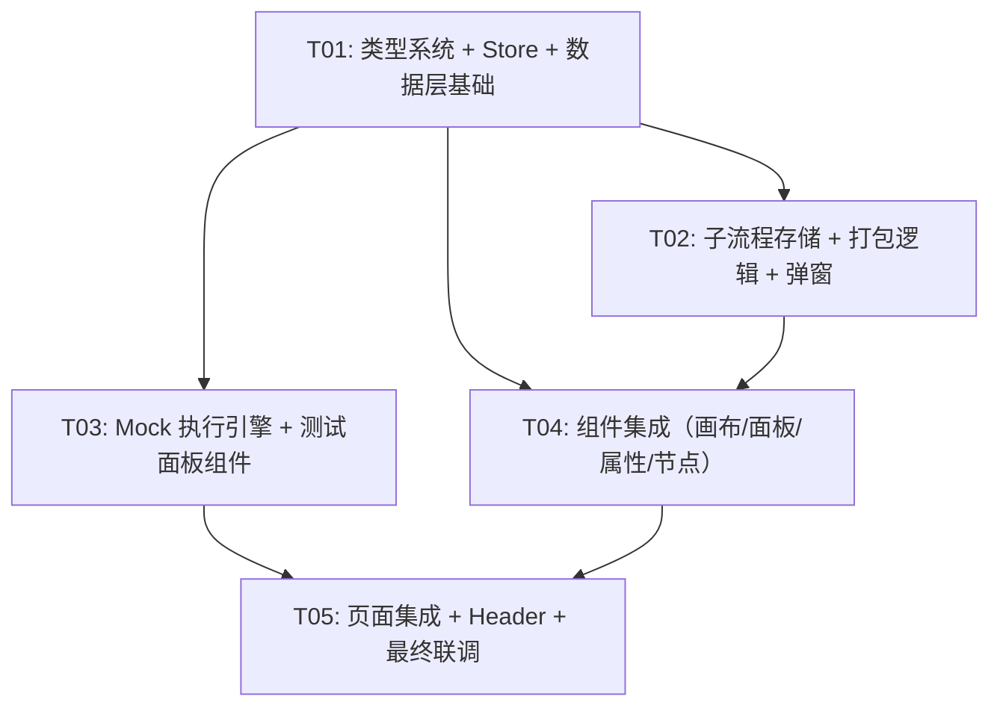

# 子流程打包复用 & 对话测试调试台 — 架构设计与任务分解

> **版本**：v1.0 | **日期**：2026-07-14 | **作者**：高见远（架构师）  
> **上游依赖**：`PRD-子流程与调试台MVP范围.md` v1.0  
> **代码基线**：React Flow 画布 + 13 节点 + Zustand store + localStorage 持久化

---

## 目录

1. [系统设计方案](#一系统设计方案)
2. [数据模型变更](#二数据模型变更)
3. [Mock 执行引擎设计](#三mock-执行引擎设计)
4. [文件清单](#四文件清单)
5. [任务列表](#五任务列表)
6. [共享知识](#六共享知识)
7. [待明确事项](#七待明确事项)

---

## 一、系统设计方案

### 1.1 组件树变更

```
OrchestratePage                              # 修改：集成 TestPanel、测试模式协调
├── OrchestrateHeader                        # 修改：新增[测试]/[退出测试]按钮
├── div.orchestrate-page__body               # 修改：测试模式下高度缩减
│   ├── NodePanel                            # 修改：复合Tab动态加载子流程列表
│   ├── FlowCanvas                           # 修改：子流程调用节点渲染、测试模式禁用交互+高亮
│   └── NodeInspector                        # 修改：子流程调用节点属性面板、测试模式下折叠
└── TestPanel (NEW, 条件渲染)                 # 新增：底部测试面板（320px，可拖拽）
    ├── TestPanelInput (NEW)                  # 新增：消息输入区 + 快捷预设
    └── TestPanelTrace (NEW)                  # 新增：执行时序 + 展开详情
                                             
# 弹窗层（Portal）
├── SubflowPackModal (NEW)                    # 新增："打包为子流程"配置弹窗
└── SubflowPreviewModal (NEW)                 # 新增：子流程内部只读 MiniMap 查看
```

### 1.2 数据流变更

```
┌─────────────────────────────────────────────────────────────────┐
│                        OrchestratePage                          │
│  ┌──────────────┐   ┌──────────────┐   ┌────────────────────┐  │
│  │  NodePanel   │   │  FlowCanvas  │   │   NodeInspector    │  │
│  │              │   │              │   │                    │  │
│  │ 子流程列表   │──▶│ drop→创建    │   │ subflowCall节点    │  │
│  │ (动态读取    │   │ subflowCall  │   │ → [展开查看内部]   │  │
│  │  localStorage│   │ 节点         │   │ → SubflowPreview   │  │
│  │  索引)       │   │              │   │    Modal           │  │
│  └──────────────┘   └──────┬───────┘   └────────────────────┘  │
│                            │                                     │
│           框选2+节点 → [打包为子流程] → SubflowPackModal          │
│                            │                                     │
│  ┌─────────────────────────┴──────────────────────────────────┐ │
│  │                    OrchestrateStore (Zustand)               │ │
│  │  + testMode: boolean                                       │ │
│  │  + debugSession: DebugSession | null                       │ │
│  │  + setTestMode() / setDebugSession() / resetDebugSession() │ │
│  └────────────────────────────────────────────────────────────┘ │
│                            │                                     │
│  ┌─────────────────────────┴──────────────────────────────────┐ │
│  │  TestPanel (testMode === true 时渲染)                       │ │
│  │  ┌─────────────────┐    ┌──────────────────────────────┐   │ │
│  │  │ TestPanelInput  │    │ TestPanelTrace               │   │ │
│  │  │ 消息 →          │───▶│ useMockExecution → trace[]   │   │ │
│  │  │ mockExecute()   │    │ 渲染时序列表 + 展开详情       │   │ │
│  │  └─────────────────┘    └──────────────────────────────┘   │ │
│  └────────────────────────────────────────────────────────────┘ │
└─────────────────────────────────────────────────────────────────┘

localStorage:
  morphix_workflow_{botId}     ← 主工作流（不变）
  morphix_subflow_{id}         ← 单个子流程定义（新增）
  morphix_subflow_index        ← 子流程 ID 列表（新增，用于面板加载）
```

### 1.3 Store 扩展

当前 `OrchestrateStore`：

```typescript
// 现有状态（不变）
activeTab, panelCollapsed, searchQuery, panelWidth
selectedNodeId, selectedEdgeId
botId, botName, lastEdited
```

扩展后：

```typescript
// 新增状态
testMode: boolean;                              // 是否处于测试模式
debugSession: DebugSession | null;              // 当前调试会话
testPanelHeight: number;                        // 测试面板高度（默认320px）

// 新增 Actions
setTestMode: (mode: boolean) => void;
setDebugSession: (session: DebugSession | null) => void;
resetDebugSession: () => void;
setTestPanelHeight: (height: number) => void;
```

---

## 二、数据模型变更

### 2.1 新增类型定义（追加到 `types/orchestrate.ts`）

```typescript
// ══════════════ 子流程相关 ══════════════

/** 子流程接口端口定义 */
export interface SubflowPortDef {
  key: string;              // 原始端口 key（inputs.key 或 outputs.varName）
  varName: string;          // 变量名
  dataType: PortDataType;   // 端口数据类型
  direction: 'input' | 'output';
  label: string;            // 显示名称
}

/** 子流程持久化格式（localStorage key: morphix_subflow_{id}） */
export interface SubflowPersisted {
  id: string;                     // 子流程唯一 ID，格式 subflow-{timestamp}-{random4}
  name: string;                   // 子流程名称（必填）
  desc: string;                   // 描述（选填）
  interface: {
    inputs: SubflowPortDef[];     // 暴露的输入接口
    outputs: SubflowPortDef[];    // 暴露的输出接口
  };
  nodes: SerializedNode[];        // 内部节点（ID 已重新生成，与主流程无冲突）
  edges: SerializedEdge[];        // 内部连线
  createdAt: string;              // ISO 8601
  updatedAt: string;              // ISO 8601
  version: number;                // 固定为 1，MVP 不做版本管理
}

/** 子流程索引（localStorage key: morphix_subflow_index） */
export type SubflowIndex = string[];  // 子流程 ID 列表

/** 子流程调用节点的 data 扩展 */
export interface SubflowCallNodeData extends NodeInstanceData {
  nodeType: 'subflowCall';
  subflowId: string;              // 引用的子流程 ID
  subflowName: string;            // 冗余存储，用于卡片显示
  subflowDesc: string;            // 冗余存储
  inputPortsCount: number;        // 输入端口数
  outputPortsCount: number;       // 输出端口数
  config: Record<string, string | number>;
  inputs: Record<string, string>;
}

// ══════════════ 调试台相关 ══════════════

/** 单节点执行记录 */
export interface NodeExecutionRecord {
  nodeId: string;                 // 节点 ID
  nodeName: string;               // 节点显示名称
  nodeType: string;               // 节点类型
  status: 'pending' | 'running' | 'success' | 'warning' | 'error';
  startedAt: string;              // ISO 8601
  finishedAt: string;             // ISO 8601
  durationMs: number;             // 模拟耗时（ms）
  inputs: Record<string, unknown>;  // 输入值快照
  outputs: Record<string, unknown>; // 输出值快照
  mockNote?: string;              // Mock 说明（如 "AI 对话节点返回预设 mock 回复"）
  error?: string;                 // 错误信息（status === 'error' 时）
}

/** 调试会话 */
export interface DebugSession {
  sessionId: string;              // 会话 ID，格式 debug-{timestamp}
  startedAt: string;              // ISO 8601
  status: 'idle' | 'running' | 'completed';
  trace: NodeExecutionRecord[];   // 执行轨迹
  totalDurationMs: number;        // 总耗时
  userMessage: string;            // 触发消息
}

/** 测试面板状态（内嵌于 OrchestrateStore，不独立持久化） */
export interface TestPanelState {
  height: number;                 // 面板高度（默认 320）
  inputMessage: string;           // 当前输入消息
  quickMessages: string[];        // 快捷消息列表
}
```

### 2.2 `OrchestrateStore` 接口扩展

```typescript
export interface OrchestrateStore {
  // ── 现有（不变）──
  activeTab: PanelTabKey;
  panelCollapsed: boolean;
  searchQuery: string;
  panelWidth: number;
  selectedNodeId: string | null;
  selectedEdgeId: string | null;
  botId: string;
  botName: string;
  lastEdited: string;
  setActiveTab: (tab: PanelTabKey) => void;
  setPanelCollapsed: (collapsed: boolean) => void;
  setSearchQuery: (query: string) => void;
  setPanelWidth: (width: number) => void;
  setSelectedNodeId: (id: string | null) => void;
  setSelectedEdgeId: (id: string | null) => void;
  setBotInfo: (id: string, name: string) => void;
  updateLastEdited: () => void;

  // ── 新增 ──
  testMode: boolean;
  debugSession: DebugSession | null;
  testPanelHeight: number;
  quickMessages: string[];          // 快捷消息预设
  setTestMode: (mode: boolean) => void;
  setDebugSession: (session: DebugSession | null) => void;
  resetDebugSession: () => void;
  setTestPanelHeight: (height: number) => void;
  setQuickMessages: (msgs: string[]) => void;
}
```

### 2.3 `subflowCall` 节点 Schema（追加到 `nodeDefinitions.ts`）

`subflowCall` 节点的端口是**动态的**——运行时根据引用的 `SubflowPersisted.interface` 生成。但在 `NODE_SCHEMAS` 中需要一个静态模板用于类型校验和兜底：

```typescript
subflowCall: {
  inputs: [
    // 动态生成，模板为空数组；实际端口根据子流程 interface.inputs 在渲染时注入
  ],
  outputs: [
    // 动态生成，模板为空数组；实际端口根据子流程 interface.outputs 在渲染时注入
  ],
  config: [
    { key: 'note', label: '说明', fieldType: 'note', required: false,
      placeholder: '子流程调用节点。端口由子流程定义动态生成。点击下方按钮查看内部结构。' },
  ],
}
```

### 2.4 `NodeInstanceData` 扩展

```typescript
export interface NodeInstanceData {
  nodeType: string;
  config: Record<string, string | number>;
  inputs: Record<string, string>;
  // 新增可选字段（仅 subflowCall 节点使用）
  subflowId?: string;
  subflowName?: string;
  subflowDesc?: string;
  inputPortsCount?: number;
  outputPortsCount?: number;
  [key: string]: unknown;
}
```

---

## 三、Mock 执行引擎设计

### 3.1 拓扑排序算法

```
算法：Kahn's Algorithm（BFS 拓扑排序）

输入：nodes[], edges[]
输出：topologicalOrder: string[]（nodeId 列表，按执行顺序排列）

步骤：
1. 构建邻接表 adj[sourceId] = targetId[] 和入度表 inDegree[nodeId] = 0
2. 遍历 edges，对每条边 e(source→target)：
   adj[source].push(target)
   inDegree[target]++
3. 初始化队列 queue = [所有 inDegree === 0 的 nodeId]
4. while queue 非空：
   a. 出队 nodeId → 加入 topologicalOrder
   b. 遍历 adj[nodeId] 中的每个 neighbor：
      inDegree[neighbor]--
      若 inDegree[neighbor] === 0 → 入队
5. 若 topologicalOrder.length !== nodes.length：
   存在环路 → 报错（标记为 error 状态）
6. 返回 topologicalOrder
```

### 3.2 节点 Mock 策略表

| 节点类型 | nodeType | Mock 函数 | Mock 输出 |
|---------|----------|----------|----------|
| 用户输入 | `userInput` | `mockUserInput` | `{ userChatInput: context.userChatInput, AIAnalyzeChatInput: "[Mock] " + context.userChatInput, msgType: "text" }` |
| AI 对话 | `aiChat` | `mockAiChat` | `{ aiReply: "[Mock] 这是 AI 对话节点的模拟回复。输入: " + JSON.stringify(inputs.userChatInput) }` |
| 知识库搜索 | `kbSearch` | `mockKbSearch` | `{ knowledges: [{ content: "[Mock] 知识库搜索结果", score: 0.95, kbId: "mock-kb-1" }] }` |
| 多重判断器 | `multiJudge` | `mockMultiJudge` | `{ result: 根据 config.mode 做前端匹配：文本匹配→includes，数值判断→eval }` |
| 正则提取 | `regexExtract` | `mockRegexExtract` | `{ extract: "mock_extracted", missing: false }` — 对上游值真实执行正则 |
| JSON 提取 | `jsonExtract` | `mockJsonExtract` | `{ fieldValue: "mock_value", missing: false }` — 对上游值真实执行 JSON.parse |
| 消息输出 | `msgOutput` | `mockMsgOutput` | `{}` — 空输出，标记 sent |
| 全局变量 | `globalVar` | `mockGlobalVar` | `{ "{变量名}": config 中的默认值或 inputs.value }` |
| 对话记录获取 | `chatHistory` | `mockChatHistory` | `{ chatHistory: [{ role: "user", content: "mock history 1" }, { role: "assistant", content: "mock reply 1" }] }` |
| 时间控制 | `timeControl` | `mockTimeControl` | `{ done: true }` — 跳过等待 |
| 设置客户属性 | `setCustomerAttr` | `mockSetCustomerAttr` | `{ customerProp: inputs.value ?? config 默认值 }` |
| 智能体嵌入 | `agentEmbed` | `mockAgentEmbed` | `{ aiReply: "[Mock] 智能体嵌入节点模拟输出" }` |
| 子流程调用 | `subflowCall` | `mockSubflowCall` | 递归执行子流程内部节点拓扑 → 汇总 interface.outputs |
| 其他输出节点 | `imageOutput`/`fileOutput`/`videoOutput`/`voiceOutput`/`linkCardOutput`/`markdownOutput`/`emailOutput`/`miniAppOutput` | `mockPassthrough` | `{}` — 空输出，标记 sent |
| 未实现节点 | 任何未匹配类型 | `mockUnimplemented` | 透传输入值，标记 ⚠ warning |

### 3.3 执行生命周期

```
用户点击 [发送] 或选择快捷消息
  │
  ▼
1. INIT: mockExecute(workflow, userMessage)
   ├─ 构建 DAG（nodes + edges）
   ├─ 拓扑排序 → executionOrder[]
   ├─ 初始化 context = { userChatInput: userMessage }
   └─ 创建 DebugSession { status: 'running', trace: [] }
  │
  ▼
2. EXECUTE（遍历 executionOrder 中的每个 nodeId）：
   ├─ a. 更新该节点 trace entry: status → 'running'
   ├─ b. 收集上游输出：遍历 edges，找出所有 source→target(nodeId) 的连线
   │      将 source 节点的 outputs 映射到 target 节点的 input port
   ├─ c. 查找 mock 函数：mockExecutors[nodeType] ?? mockUnimplemented
   ├─ d. 调用 mock 函数(context, nodeConfig, collectedInputs)
   ├─ e. 将返回的 outputs 写入 context[nodeId].outputs
   ├─ f. 更新 trace entry: status → 'success'|'warning'|'error'
   └─ g. 若 status === 'error'：继续执行后续节点（标记为 skipped）
  │
  ▼
3. COMPLETE:
   ├─ 设置 DebugSession.status = 'completed'
   ├─ 计算 totalDurationMs
   └─ 通过 setDebugSession() 更新 store → TestPanelTrace 响应式渲染
```

### 3.4 multiJudge 分支处理（简化策略）

当前 `multiJudge` 节点只有一个 output `result: boolean`，MVP 阶段不实现真正的条件分支跳转。策略：

1. multiJudge 正常执行并输出 boolean 结果
2. 所有下游节点均被执行（不做分支跳过）
3. 下游节点接收 `result` 值自行判断

> **后期迭代**：可扩展为双输出端口（resultTrue / resultFalse），mock 引擎据此跳过未激活分支。

### 3.5 subflowCall 递归执行

```
mockSubflowCall(context, nodeConfig, inputs):
  1. 从 localStorage 读取 SubflowPersisted（by subflowId）
  2. 构建子流程内部 DAG（subflow.nodes + subflow.edges）
  3. 将子流程 interface.inputs 映射到 context（从外部 inputs 取值）
  4. 对子流程内部节点执行拓扑排序
  5. 按拓扑序逐节点 mock 执行（复用同一套 mockExecutors）
  6. 收集子流程 interface.outputs 对应的值
  7. 返回汇总 outputs
```

---

## 四、文件清单

### 4.1 新增文件（10 个）

```
src/pages/Bots/Orchestrate/
├── components/
│   ├── SubflowPackModal.tsx              # 子流程打包配置弹窗
│   ├── SubflowPackModal.css
│   ├── SubflowPreviewModal.tsx           # 子流程只读预览弹窗（React Flow MiniMap）
│   ├── SubflowPreviewModal.css
│   ├── TestPanel.tsx                     # 测试面板主容器（底部，可拖拽高度）
│   ├── TestPanel.css
│   ├── TestPanelInput.tsx                # 消息输入区 + 快捷预设
│   ├── TestPanelTrace.tsx                # 执行时序列表 + 展开详情
│   └── TestPanelTrace.css
├── hooks/
│   ├── useSubflowPack.ts                 # 子流程打包逻辑
│   ├── useSubflowStorage.ts              # 子流程 localStorage CRUD
│   └── useMockExecution.ts               # Mock 执行引擎
└── data/
    └── mockExecutors.ts                  # 各节点类型的 mock 函数 map
```

### 4.2 修改文件（11 个）

| 文件 | 改动级别 | 改动说明 |
|------|---------|---------|
| `types/orchestrate.ts` | **重度** | 新增 SubflowPortDef、SubflowPersisted、SubflowIndex、SubflowCallNodeData、NodeExecutionRecord、DebugSession、TestPanelState；扩展 NodeInstanceData、OrchestrateStore |
| `store/orchestrateStore.ts` | **中度** | 新增 testMode、debugSession、testPanelHeight、quickMessages 状态及 actions |
| `data/nodeDefinitions.ts` | **轻度** | 追加 subflowCall 节点 schema 模板 |
| `data/panelNodes.ts` | **中度** | 移除 strongReminder 占位节点；复合 Tab "子流程调用" 分类改为空模板（运行时动态注入） |
| `components/FlowCanvas.tsx` | **重度** | 框选节点检测 → 显示"打包为子流程"工具栏按钮；subflowCall 节点渲染适配；测试模式下禁用交互 + 高亮当前执行节点 + 呼吸动画 |
| `components/CustomNode.tsx` | **中度** | 新增 subflowCall 节点类型渲染（动态端口 Handle + 名称/端口数副标题） |
| `components/NodePanel.tsx` | **中度** | 复合 Tab "子流程调用" 分类改为动态读取 useSubflowStorage 返回的已保存子流程列表 |
| `components/NodeInspector.tsx` | **中度** | 新增 subflowCall 节点属性面板（只读信息 + "展开查看内部"按钮）；测试模式下折叠为占位提示 |
| `components/OrchestrateHeader.tsx` | **轻度** | 新增"测试"按钮（与保存/导出并列）+ 测试模式下"退出测试"按钮 + 橙色测试标识 |
| `OrchestratePage.tsx` | **重度** | 集成 TestPanel 条件渲染；测试模式进入/退出流程（校验→切换模式→适配布局）；画布/面板/测试面板状态协调 |
| `OrchestratePage.css` | **中度** | 测试模式布局：`.orchestrate-page--test-mode` 下 body 高度缩减、TestPanel 区域样式 |

### 4.3 不涉及的文件

- `hooks/useWorkflowPersistence.ts` — 无需改动（子流程独立存储，不耦合主工作流）
- `hooks/useNodeDrag.ts` — 无需改动（subflowCall 节点的 drop 逻辑复用现有拖拽机制，仅需在 dataTransfer 中区分 subflow 拖入）
- `hooks/useValidation.ts` — 无需改动（subflowCall 节点无 required 输入端口，校验自然通过）
- `data/portTypes.ts` — 无需改动（端口类型体系不变）
- `data/defaultWorkflow.ts` — 无需改动
- `router.tsx` — 无需改动
- 所有后端代码 — 零改动

> **注意**：虽然 `useNodeDrag.ts` 不需要改动核心逻辑，但 `panelNodes.ts` 中移除了 `strongReminder` 占位，同时 `NodePanel.tsx` 中新增了对 subflow 拖入的特殊 dataTransfer 标记（`application/morphix-subflow-id`），这需要在拖拽处理中识别。

---

## 五、任务列表

> **硬性约束**：≤5 个任务，每个任务 ≥3 个文件，第一个任务为基础设施。

### 任务依赖关系



### T01 — 项目基础设施：类型系统 + Store 扩展 + 数据层

| 属性 | 值 |
|------|-----|
| **优先级** | P0 |
| **依赖** | 无 |

**涉及文件**：

| 文件 | 操作 |
|------|------|
| `types/orchestrate.ts` | **修改**：新增 SubflowPortDef、SubflowPersisted、SubflowIndex、SubflowCallNodeData、NodeExecutionRecord、DebugSession、TestPanelState；扩展 NodeInstanceData（+subflowId 等可选字段）；扩展 OrchestrateStore（+testMode、debugSession、testPanelHeight、quickMessages 及对应 actions） |
| `store/orchestrateStore.ts` | **修改**：新增 testMode（默认 false）、debugSession（默认 null）、testPanelHeight（默认 320）、quickMessages（默认内置 3 条）；新增 setTestMode、setDebugSession、resetDebugSession、setTestPanelHeight、setQuickMessages actions |
| `data/nodeDefinitions.ts` | **修改**：追加 `subflowCall` 节点 schema 模板（空 inputs/outputs + note config） |
| `data/panelNodes.ts` | **修改**：移除 strongReminder 占位节点；复合 Tab "子流程调用" 分类 nodes 改为空数组 `[]`（运行时动态注入） |

**完成标准**：
- [ ] 所有新增 TypeScript 类型编译无错误，IDE 智能提示完整
- [ ] Zustand store 新增状态可通过 React DevTools 观察
- [ ] `subflowCall` schema 可被 `NODE_SCHEMAS['subflowCall']` 正常访问
- [ ] 面板 "子流程调用" 分类为空（不再显示 strongReminder 占位）

---

### T02 — 子流程存储层 + 打包逻辑 + 配置弹窗 + 预览弹窗

| 属性 | 值 |
|------|-----|
| **优先级** | P0 |
| **依赖** | T01 |

**涉及文件**：

| 文件 | 操作 |
|------|------|
| `hooks/useSubflowPack.ts` | **新建**：实现 `analyzeSubflowInterface(nodes, edges, selectedNodeIds)` → 自动分析暴露的输入/输出端口；`packSubflow(name, desc, nodes, edges, selectedNodeIds, interface)` → 重新生成内部节点 ID、构建 SubflowPersisted、写入 localStorage、替换画布选中节点为 subflowCall 节点 |
| `hooks/useSubflowStorage.ts` | **新建**：实现 `loadSubflow(id): SubflowPersisted \| null`、`saveSubflow(data: SubflowPersisted): void`、`deleteSubflow(id): void`、`listSubflows(): SubflowPersisted[]`、`getSubflowIndex(): string[]` — 全部基于 localStorage key `morphix_subflow_{id}` 和 `morphix_subflow_index` |
| `components/SubflowPackModal.tsx` | **新建**：弹窗 UI — 名称输入（必填校验）、描述输入（选填）、输入/输出接口预览列表（自动分析结果，每项可勾选/取消）、[确认打包]/[取消] 按钮；确认后调用 useSubflowPack.packSubflow() |
| `components/SubflowPackModal.css` | **新建**：弹窗样式（与现有 modal 风格一致：圆角卡片、阴影、端口类型色标） |
| `components/SubflowPreviewModal.tsx` | **新建**：只读 React Flow 画布（800×600 Modal）— MiniMap + 只读节点渲染（复用 CustomNode 但禁用所有交互）+ 只读连线渲染 + [关闭] 按钮；接收 subflowId → 从 localStorage 读取 SubflowPersisted → 渲染内部 nodes/edges |
| `components/SubflowPreviewModal.css` | **新建**：预览弹窗样式（全屏遮罩、MiniMap 容器、只读画布样式） |

**完成标准**：
- [ ] 子流程可保存到 localStorage 并从 localStorage 正确加载
- [ ] 打包弹窗自动分析接口：未连线输入 → 暴露为输入接口，未连线输出 → 暴露为输出接口
- [ ] 打包确认后：画布上选中节点替换为 1 个 subflowCall 节点
- [ ] 预览弹窗正确展示子流程内部节点和连线拓扑（只读，不可编辑）
- [ ] 子流程索引 `morphix_subflow_index` 正确维护（增删同步）

---

### T03 — Mock 执行引擎 + 测试面板 UI 组件

| 属性 | 值 |
|------|-----|
| **优先级** | P0 |
| **依赖** | T01 |

**涉及文件**：

| 文件 | 操作 |
|------|------|
| `data/mockExecutors.ts` | **新建**：导出 `mockExecutors: Record<string, MockFunction>` — 包含所有 13 个节点类型的 mock 函数实现。每个函数签名：`(context: ExecutionContext, config: Record<string, unknown>, inputs: Record<string, unknown>) => Record<string, unknown>`。特殊处理：multiJudge 真实执行文本/数值匹配、regexExtract/jsonExtract 真实执行正则/JSON 解析、subflowCall 递归执行 |
| `hooks/useMockExecution.ts` | **新建**：实现 `mockExecute(nodes, edges, userMessage): DebugSession` — 包含：① `buildDAG()` 构建邻接表+入度表；② `topologicalSort()` Kahn 算法；③ `executeNode()` 收集上游输出→调用 mock 函数→写入 context→记录 trace；④ `createDebugSession()` 汇总执行轨迹；⑤ 环路检测 |
| `components/TestPanel.tsx` | **新建**：底部面板主容器 — 默认 320px 高度，顶部拖拽手柄（mousedown/mousemove/mouseup 调整高度，范围 200px~600px）；左侧 TestPanelInput + 右侧 TestPanelTrace 左右分栏布局；[清空上下文] 按钮；通过 useOrchestrateStore 读取 testMode 条件渲染 |
| `components/TestPanel.css` | **新建**：面板容器样式 — 固定底部、上边框阴影、拖拽手柄样式、左右分栏 grid |
| `components/TestPanelInput.tsx` | **新建**：消息输入区 — textarea（支持 Enter 发送 / Shift+Enter 换行）、[发送] 按钮、[清空] 按钮；快捷预设消息列表（"你好"、"我想了解产品"、"帮我查询订单" → 点击填充）；输入校验（空消息禁止发送）；调用 useMockExecution |
| `components/TestPanelTrace.tsx` | **新建**：执行时序列表 — 表格行（序号、节点名、状态图标 ✓/⚠/✗/⏳、输入摘要、输出摘要、耗时）；点击行展开详情卡（完整输入/输出 JSON + mock 说明）；总耗时展示；空状态占位（"尚未执行，请发送消息"） |
| `components/TestPanelTrace.css` | **新建**：执行列表样式 — 状态图标颜色、展开卡动画、JSON 格式化展示 |

**完成标准**：
- [ ] 所有 13 个节点类型 mock 函数正确实现且可单元测试
- [ ] 拓扑排序正确处理：线性链、分支、菱形汇聚
- [ ] 环路检测正确：存在环路时标记 error
- [ ] 发送消息后执行列表正确展示节点执行时序和状态
- [ ] 展开详情卡显示完整输入/输出 JSON
- [ ] 测试面板高度可拖拽调整，范围 200~600px

---

### T04 — 组件集成：画布工具栏 + 节点渲染 + 面板动态加载 + 属性面板

| 属性 | 值 |
|------|-----|
| **优先级** | P0 |
| **依赖** | T01、T02 |

**涉及文件**：

| 文件 | 操作 |
|------|------|
| `components/FlowCanvas.tsx` | **修改**：① 框选检测：监听 React Flow `onSelectionChange`，当选中 ≥2 个节点时，在画布上方浮现浮动工具栏（"打包为子流程"按钮）；② subflowCall 节点类型注册到 `nodeTypes`；③ 测试模式下：`nodesDraggable={false}`、`nodesConnectable={false}`、`elementsSelectable={false}`、`deleteKeyCode={null}`；④ 测试模式当前执行节点高亮：通过 `debugSession.trace` 找到 status==='running' 的节点，添加 CSS class `custom-node--executing`（橙色边框 + 呼吸动画）；⑤ 已执行节点角标 ✓ |
| `components/CustomNode.tsx` | **修改**：新增 `nodeType === 'subflowCall'` 分支渲染 — 动态读取子流程定义生成 Handle（interface.inputs → Left Handle，interface.outputs → Right Handle）；卡片标题显示 `data.subflowName`，副标题显示 `"X 入 / Y 出"`；端口颜色继承自 SubflowPortDef.dataType |
| `components/NodePanel.tsx` | **修改**：复合 Tab "子流程调用" 分类改为动态渲染 — 在组件内调用 `useSubflowStorage().listSubflows()` 获取已保存子流程列表，每个子流程渲染为可拖拽 NodeCard；拖拽时 dataTransfer 设置 `application/morphix-subflow-id` 和 JSON 序列化的子流程摘要 |
| `components/NodeInspector.tsx` | **修改**：① 新增 `nodeType === 'subflowCall'` 分支 — 显示子流程名称（只读）、描述（只读）、输入/输出接口列表（只读信息）；② [展开查看内部] 按钮 → 打开 SubflowPreviewModal；③ 测试模式下（`testMode === true`）折叠为占位提示"测试模式中，属性面板不可用" |
| `components/CustomNode.css` | **修改**：新增 `.custom-node--executing` 样式（橙色边框 2px + 呼吸动画 `@keyframes breathe`）、`.custom-node--executed` 样式（✓ 角标） |

**完成标准**：
- [ ] 画布框选 ≥2 节点后浮动工具栏显示"打包为子流程"按钮，点击打开 SubflowPackModal
- [ ] subflowCall 节点在画布上正确渲染（动态 Handle + 名称/端口数显示）
- [ ] 复合面板 "子流程调用" 显示已保存的子流程列表，可拖入画布
- [ ] 属性面板中子流程调用节点显示只读信息 + "展开查看内部"按钮可用
- [ ] 测试模式下画布节点不可拖拽/连线/删除
- [ ] 测试模式当前执行节点高亮（橙色呼吸动画）

---

### T05 — 页面集成 + Header 测试入口 + 最终联调

| 属性 | 值 |
|------|-----|
| **优先级** | P0 |
| **依赖** | T03、T04 |

**涉及文件**：

| 文件 | 操作 |
|------|------|
| `OrchestratePage.tsx` | **修改**：① 测试模式进入流程：`handleEnterTestMode()` → 调用 `validate(nodes, edges)` → 校验失败 toast+不进入 → 校验成功 → `setTestMode(true)` + 自动保存 → 布局切换；② 测试模式退出：`handleExitTestMode()` → `setTestMode(false)` + `resetDebugSession()` → 画布恢复编辑态；③ TestPanel 条件渲染：`{testMode && <TestPanel nodes={nodes} edges={edges} />}`；④ 测试模式下 body 添加 CSS class `orchestrate-page__body--test-mode`；⑤ 快捷消息预设通过 store 初始化 |
| `OrchestratePage.css` | **修改**：新增 `.orchestrate-page__body--test-mode` — 使用 `calc(100% - 320px)` 适配画布高度（或 CSS Grid `grid-template-rows: 1fr var(--test-panel-height)`）；测试面板过渡动画 |
| `components/OrchestrateHeader.tsx` | **修改**：① 新增 `onEnterTest` 和 `onExitTest` props；② `testMode` 为 false 时渲染 [测试] 按钮（与保存/导出并列，使用 Play 图标）；③ `testMode` 为 true 时渲染橙色 "测试模式" 标识徽章 + [退出测试] 按钮；④ 新增 `onEnterTest` 回调接口 |

**完成标准**：
- [ ] 点击 Header [测试] 按钮：校验通过 → 进入测试模式（画布只读 + 底部面板滑出）
- [ ] 校验失败：toast 提示错误，不进入测试模式
- [ ] 测试模式下画布高度适配，面板不被遮挡
- [ ] [退出测试] 恢复编辑态，测试面板消失
- [ ] 完整流程端到端可用：打包子流程 → 拖入画布 → 连线 → 进入测试 → 发送消息 → 查看执行轨迹 → 退出测试

---

## 六、共享知识

### 6.1 localStorage Key 规范

```
morphix_workflow_{botId}      主工作流持久化（不变，保持现有格式）
morphix_subflow_{id}           单个子流程定义（SubflowPersisted JSON）
morphix_subflow_index          子流程 ID 索引（JSON string[]）
```

### 6.2 子流程 ID 生成规则

```typescript
function generateSubflowId(): string {
  const ts = Date.now().toString(36);
  const rand = Math.random().toString(36).substring(2, 6);
  return `subflow-${ts}-${rand}`;
}
// 示例: "subflow-ln5x8k2q-a3f7"
```

### 6.3 子流程内部节点 ID 重生成规则

打包时所有内部节点 ID 从原始 `node-{n}` 格式重新生成为 `sf-{subflowId前8位}-node-{n}`，确保与主流程节点 ID 不冲突。边引用同步更新。

### 6.4 测试模式标识

- Store: `testMode: boolean`（唯一真实来源）
- 组件通过 `useOrchestrateStore(s => s.testMode)` 读取
- 不允许通过 props 传递 testMode（避免不一致）

### 6.5 调试会话 ID

```typescript
function generateSessionId(): string {
  return `debug-${Date.now()}`;
}
```

### 6.6 测试面板高度

- 默认值：320px
- 可调整范围：200px ~ 600px
- 存储位置：`OrchestrateStore.testPanelHeight`（会话级，不持久化）

### 6.7 快捷消息预设

```typescript
const DEFAULT_QUICK_MESSAGES = [
  '你好',
  '我想了解产品',
  '帮我查询订单',
];
```

存储于 `OrchestrateStore.quickMessages`，MVP 不提供用户自定义编辑入口（后续迭代扩展）。

### 6.8 数据透传约定

对于输出类节点（msgOutput、imageOutput 等），mock 执行返回空对象 `{}`，在 trace 中标记 `mockNote: "消息输出节点，mock 模式下不实际发送"`。

### 6.9 弹窗层级

- SubflowPackModal: z-index 1000
- SubflowPreviewModal: z-index 1100（在打包弹窗之上）
- TestPanel: z-index 100（在画布之上，在弹窗之下）

### 6.10 错误处理统一约定

所有 localStorage 操作包裹 try/catch，失败时 toast 提示用户，不静默失败。mock 执行中单个节点失败不终止整个流程，标记为 error 后继续执行后续节点。

---

## 七、待明确事项

以下问题来自 PRD 第六章但尚无明确结论，需团队对齐：

| # | 问题 | 当前假设 | 影响 |
|---|------|---------|------|
| 1 | **子流程调用节点删除行为** | 删除调用节点仅解除引用，子流程定义保留在 localStorage | 如改为联动删除，需在 `FlowCanvas.tsx` 删除逻辑中增加子流程索引清理 |
| 2 | **子流程输入接口分析边界** | 所有无上游连线的输入端口均暴露，用户在弹窗中手动取舍 | 如改为自动过滤"用户输入"节点，需调整 `useSubflowPack.ts` 分析逻辑 |
| 3 | **测试面板与属性面板共存** | 测试模式下属性面板折叠（只读提示），测试面板占据底部 | 如改为保留属性面板，需重新设计四象限布局 |
| 4 | **快捷消息来源** | 内置固定 3 条，后续支持用户自定义 | 如初期就需工作流配置读取，需扩展 Store 和 UI |
| 5 | **multiJudge 分支跳转** | MVP 阶段不实现条件分支跳过，所有下游节点均执行 | 如要求分支跳转，需改造 edges 模型（双输出端口）和拓扑算法 |

> **建议**：在下个迭代启动前，由 PM 对齐以上 5 个问题，本次 MVP 按"当前假设"列实现。

---

*文档版本：v1.0 | 生成时间：2026-07-14*
