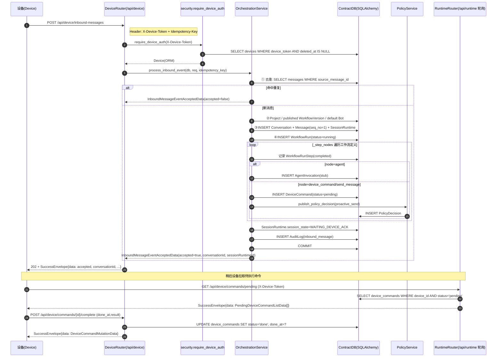

# 设计文档：工程收敛增量（design-工程收敛增量）

> 本文档为架构设计，仅给出方案、结构、接口与任务分解，**不含任何实现代码**。
> 依据：`PRD-工程收敛增量.md` + 对仓库 `/Users/stevenmac/Desktop/工作目录/Morphix/` 的实地核对（2025-07-18）。
> 已锁定决策（用户拍板，不再质疑）：① 把 `morphix-control` 的 33 条统一契约路径 + Success/Error 封套 + 5 套安全方案**整体移植进 `project/backend`**，使其成为唯一 canonical 后端；② 把 `project/frontend` 的 React 代码**迁入根级 `morphix-console` 并 JS→TS**，`prototype` 独有页面抽入 console 后退役；③ `morphix-control` 降级为「统一契约合规参考实现」，保留并跑绿其契约测试，不删除。

---

## 1. 实现方案 + 框架选型

### 1.1 后端移植策略（核心）

实地核对确认一个**关键冲突**：`project/backend` 与 `morphix-control` 的持久层范式完全不同。

| 维度 | `project/backend`（canonical 资源域） | `morphix-control`（契约参考域） |
|---|---|---|
| 持久层 | **裸 SQL**（`DatabaseBackend` 抽象，`?` 占位符，`query/execute`） | **SQLAlchemy ORM**（`Base`/`SessionLocal`/`get_db` + Alembic） |
| 建表 | `schema.py` 内 `init_schema`（CREATE TABLE IF NOT EXISTS） | Alembic migrations |
| 封套 | **无**（`return {"items":...}` 裸字典） | SuccessEnvelope / ErrorEnvelope（`ok()/fail()`） |
| 鉴权 | **无**（仅 CORS） | 5 套 securitySchemes |
| `conversations` 表 | `(id,name,channel,bot_id,state,intent,last_message,last_time)` | `(id,project_id,channel_account_id,conversation_type,subject,owner_type,handoff_status,current_bot_id,current_workflow_version_id,contact,...)` |
| `workflow_runs` 表 | `(id,conversation_id,workflow_id,status,trigger,config,started_at,finished_at)` | `(id,project_id,conversation_id,workflow_version_id,status,trigger_type,...)` |

> ⚠️ 两套 `conversations` / `workflow_runs` **表名相同但字段语义完全不同**（资源域=会话目录；契约域=编排运行时）。若共用同一 SQLite 文件，裸 SQL 的 `CREATE TABLE` 与 ORM 的元数据会直接撞车。

**采纳策略：双持久层、单进程、双库隔离（最小变更）**

- **资源域（已有，保持原样）**：`project/backend` 现有 `DatabaseBackend` 裸 SQL + repositories + `schema.py`，继续服务 `bots/channels/tags/knowledge/materials/sops/meta` 及**遗留** `/api/conversations`、`/api/workflows/runs`。库文件 `database/morphix_mvp.db`（裸 SQL 自管）。
- **契约域（移植，自包含）**：将 `morphix-control` 的 `core/`（envelope/responses/security/database）、`models`、`schemas`、`services`、`routers` **原样迁入** `project/backend/app/contract/` 包（import 由 `app.*` 改为 `app.contract.*`），使用**独立**的 SQLAlchemy 层 + Alembic，库文件 `database/morphix_contract.db`。
- **挂载**：在 `app/main.py` 中以 `APIRouter` 把 `app/contract/routers` 的 `control/runtime/device/internal/auth` 子路由挂到 `/api/control`、`/api/runtime`、`/api/device`、`/internal`、`/api/auth`，并注册 `ApiError` + `RequestValidationError` 异常处理器，使全站统一走 Success/Error 封套。

**为何不整体改写为 SQLAlchemy**：资源域 9 个 router + repositories 体量庞大，整体重写风险高、违背「最小变更 / 增量收敛」原则。双库隔离可让 morphix-control 代码**近乎逐字移植**，移植失败面最小。

**概念冲突处理（待确认问题 #6）**：遗留 `/api/conversations`、`/api/workflows/runs` **保留但标注 Deprecated**（代码注释 + README），继续服务即将退役的 `project/frontend`；**canonical 会话/运行以契约路径 `/api/control/conversations`、`/api/control/workflow-runs` 为准**，新 console 只调契约路径。退役后在 P2 清理遗留端点。

### 1.2 前端迁移策略（选项 A，已锁定）

`project/frontend` 是 **JS（.jsx）+ react-router-dom@7 + lucide-react@latest**；根级 `morphix-console` 是 **TS 脚手架（src 为空）+ react-router-dom@6 + 无 lucide**。

- **JS→TS 渐进迁移**：按页面将 `project/frontend/src` 的 `.jsx` 改写为 `morphix-console/src` 下的 `.tsx`，逐文件迁移（Bots/Home/Sessions + 各 tab、services、types、utils）。
- **依赖栈对齐**：`react-router-dom` 锁定 **@6.26.2**（由 7 降版，路由写法统一为 v6 风格）；**新增 `lucide-react` 并锁定版本**（禁用 `latest`）；React/TS/Vite 沿用 console 现有锁定版本。
- **prototype 独有页抽取**：`prototype/index.html` 是单体静态高保真原型（内联 CSS/JS），其「独有页面」需**用 React/TS 在 console 内重建**（非复制）：渠道账号托管、渠道联系人、渠道会话托管、客户列表、数据概览（gauge/chart/data-panel）、渠道分布。
- **退役**：console 验证通过后删除 `project/frontend` 与 `prototype`。

### 1.3 本地起动统一

- `vite.config.ts` 补齐 `/api` 代理 → `127.0.0.1:2181`（当前缺失）。
- `project/backend/config.py` 的 CORS 白名单加入 `http://localhost:5173` 与 `127.0.0.1:5173`（当前仅 1181/1182）。
- 后端 `run.sh` 仍起 2181；提供根级一键脚本（或 README 说明）同时起后端 + console。

---

## 2. 文件列表（相对路径，自仓库根）

### 2.1 新增：`project/backend/app/contract/`（移植 morphix-control，自包含）

```
project/backend/app/contract/__init__.py
project/backend/app/contract/envelope.py        # 移植：DTO(to_camel)/ApiEnvelope/ErrorObject/ApiError
project/backend/app/contract/responses.py      # 移植：ok()/fail()
project/backend/app/contract/security.py       # 移植：5 套鉴权依赖
project/backend/app/contract/database.py       # 移植：SQLAlchemy engine/SessionLocal/Base/get_db（指向 contract DB）
project/backend/app/contract/models.py         # 移植：14 个 ORM 模型
project/backend/app/contract/schemas.py       # 移植：~80 个 DTO
project/backend/app/contract/seed.py          # 移植：demo project/bot/published workflow
project/backend/app/contract/services/__init__.py
project/backend/app/contract/services/orchestration.py  # 移植：process_inbound_event/start_manual_run/_step_nodes
project/backend/app/contract/services/device.py
project/backend/app/contract/services/policy.py
project/backend/app/contract/services/agents.py
project/backend/app/contract/services/state.py
project/backend/app/contract/routers/__init__.py
project/backend/app/contract/routers/health.py
project/backend/app/contract/routers/auth.py        # /api/auth/dev-bootstrap（契约缺口补丁）
project/backend/app/contract/routers/control.py     # 17 路径
project/backend/app/contract/routers/management.py # 14 路径（contract-TBD）
project/backend/app/contract/routers/runtime.py    # 3 路径
project/backend/app/contract/routers/device.py     # 12 路径
project/backend/app/contract/routers/internal.py    # 3 路径
project/backend/app/contract/migrations/alembic.ini
project/backend/app/contract/migrations/env.py
project/backend/app/contract/migrations/versions/0000_baseline.py
project/backend/app/contract/migrations/versions/0001_add_status_sender_check.py
```

### 2.2 修改：`project/backend`

```
project/backend/app/main.py        # 注册 contract 路由；加 ApiError/RequestValidationError→封套 异常处理器；CORS 加 5173
project/backend/app/config.py      # 新增 CONTRACT_DB_PATH/DEV_MODE/DEVICE_PROVISIONING_KEY/TOKEN_TTL_SEC/HEARTBEAT_INTERVAL_SEC/COMMAND_POLL_INTERVAL_SEC；CORS 加 5173
project/backend/requirements.txt   # 新增 sqlalchemy / alembic / python-multipart
project/backend/app/routers/conversations.py  # 标注 Deprecated
project/backend/app/routers/workflows.py       # 标注 Deprecated
```

### 2.3 新增/修改：`morphix-console/`（根级，package.json name=morphix-console）

```
morphix-console/vite.config.ts                 # 修改：加 /api 代理→127.0.0.1:2181
morphix-console/package.json                   # 修改：react-router-dom 锁 @6；加 lucide-react 锁版本（去 latest）
morphix-console/src/main.tsx                  # 新增：入口
morphix-console/src/App.tsx                  # 新增：根布局
morphix-console/src/router.tsx               # 新增：v6 路由表
morphix-console/src/api/client.ts             # 新增：封套感知 fetch（解 {success,data,error}）
morphix-console/src/types/control.ts         # 新增：契约 DTO 类型（由 project/frontend 的 types/control.ts 迁移）
morphix-console/src/layout/Header.tsx        # 迁移自 project/frontend
morphix-console/src/layout/Sidebar.tsx      # 迁移自 project/frontend
morphix-console/src/pages/Bots/Bots.tsx     # 迁移 + Knowledge/Material/Training 三个 tab
morphix-console/src/pages/Home/Home.tsx     # 迁移（数据概览）
morphix-console/src/pages/Sessions/Sessions.tsx  # 迁移 + Audit/Handoff/MessageStream/RunTimeline tab
morphix-console/src/pages/Channels/ChannelAccounts.tsx   # 抽自 prototype：渠道账号托管
morphix-console/src/pages/Channels/ChannelContacts.tsx   # 抽自 prototype：渠道联系人
morphix-console/src/pages/Channels/ChannelSessions.tsx   # 抽自 prototype：渠道会话托管
morphix-console/src/pages/Customers/CustomerList.tsx     # 抽自 prototype：客户列表
morphix-console/src/pages/Overview/DataOverview.tsx      # 抽自 prototype：gauge/chart/data-panel
morphix-console/src/pages/Overview/ChannelDistribution.tsx # 抽自 prototype：渠道分布
```

### 2.4 删除（T05 最后执行）

```
project/frontend/            # 能力并入 console 后整体删除
prototype/                  # 能力并入 console 后整体删除（截图可另行归档）
project/backend/app/main_old.py   # P2 死代码
project/frontend/src/main_old.jsx # P2 死代码
```

### 2.5 修改（文档/P1）

```
readme.md                   # 指向 canonical 主栈；标注 morphix-control=参考、project/frontend+prototype=已退役
```

---

## 3. 数据结构与接口（类图）

> 说明：双库隔离下，资源域（裸 SQL，`DatabaseBackend`）与契约域（SQLAlchemy ORM）是**两套独立模型**，仅概念名重合。下方 `classDiagram` 用包边界区分，并标注核心差异与合并方案。

```mermaid
classDiagram
    %% ===== 共享封套层（两域共用约定，但仅契约域强制） =====
    class DTO {
        <<pydantic BaseModel>>
        +model_config: to_camel + populate_by_name
    }
    class ApiEnvelope {
        +request_id: str
        +success: bool
        +data: Any
        +error: Any
    }
    class ErrorObject {
        +code: str
        +message: str
        +details: list~dict~
    }
    class ApiError {
        +status_code: int
        +code: str
        +message: str
    }
    DTO <|-- ApiEnvelope
    DTO <|-- ErrorObject

    %% ===== 资源域（project/backend 裸 SQL，保持不变） =====
    package ResourceDomain {
        class ResourceConversation {
            <<raw SQL table: conversations>>
            id / name / channel / bot_id
            state / intent / last_message / last_time
        }
        class ResourceWorkflowRun {
            <<raw SQL table: workflow_runs>>
            id / conversation_id / workflow_id
            status / trigger / config / started_at / finished_at
        }
    }

    %% ===== 契约域（移植自 morphix-control，SQLAlchemy ORM） =====
    package ContractDomain {
        class ContractConversation {
            <<ORM: conversations>>
            id / project_id / channel_account_id
            conversation_type / subject / owner_type
            handoff_status / current_bot_id
            current_workflow_version_id / contact(JSON) / deleted_at
        }
        class ContractWorkflowRun {
            <<ORM: workflow_runs>>
            id / project_id / conversation_id
            workflow_version_id / status / trigger_type
            current_node_id / started_at / ended_at
        }
        class SessionRuntime {
            <<ORM>>
            conversation_id(1:1) / hosting_status
            session_state / handoff_status / active_run_id
        }
        class Message {
            <<ORM>>
            conversation_id / seq_no / sender_type
            message_type / content_text / source_message_id
        }
        class Device {
            <<ORM>>
            project_id / channel_account_id / device_token(uniq)
            token_expires_at / status / bind_code(uniq)
        }
        class DeviceCommand {
            <<ORM>>
            device_id / conversation_id / run_id
            command_type / payload(JSON) / status
            idempotency_key
        }
        class WorkflowVersion {
            <<ORM>>
            project_id / name / version / status / definition(JSON)
        }
        class Project { <<ORM>> id / name / status }
        class Bot { <<ORM>> id / project_id / name / status }
        class PolicyDecision { <<ORM>> run_id / decision_type / decision }
        class AgentInvocation { <<ORM>> run_id / agent_type / status }
    }

    %% ===== 服务与路由 =====
    class OrchestrationService {
        +process_inbound_event(db, req, key) InboundMessageEventAcceptedData
        +start_manual_run(db, req, key) WorkflowRunDetail
        -_step_nodes(...) bool
    }
    class DeviceService {
        +record_heartbeat(...) dict
        +pull_pending_commands(...) PendingDeviceCommandListData
        +ack_command(...) / complete_command(...) / fail_command(...)
    }
    class ControlRouter { /api/control/* 17 paths }
    class DeviceRouter { /api/device/* 12 paths }
    class RuntimeRouter { /api/runtime/* 3 paths }
    class InternalRouter { /internal/* 3 paths }
    class AuthRouter { /api/auth/dev-bootstrap }

    %% ===== 关系 =====
    ContractConversation "1" *-- "1" SessionRuntime : runtime
    ContractConversation "1" *-- "many" Message
    ContractConversation "1" *-- "many" ContractWorkflowRun
    ContractWorkflowRun "1" *-- "many" DeviceCommand
    ContractWorkflowRun "1" *-- "many" PolicyDecision
    ContractWorkflowRun "1" *-- "many" AgentInvocation
    Device "1" *-- "many" DeviceCommand
    Bot "1" --> "many" ContractWorkflowRun : version
    Project "1" --> "many" Bot
    WorkflowVersion "1" --> "many" ContractWorkflowRun

    ControlRouter ..> OrchestrationService : 调
    DeviceRouter ..> OrchestrationService : 调
    DeviceRouter ..> DeviceService : 调
    RuntimeRouter ..> OrchestrationService : 调
    OrchestrationService ..> DeviceCommand : 写
    ApiError ..> ApiEnvelope : 由 responses.fail 包装
```

**字段差异与合并方案（关键）**

| 概念 | 资源域（遗留，保留弃用） | 契约域（canonical，移植） | 合并结论 |
|---|---|---|---|
| 会话 | `conversations(id,name,channel,bot_id,state,intent,last_message,last_time)` | `conversations(id,project_id,channel_account_id,conversation_type,subject,owner_type,handoff_status,current_bot_id,current_workflow_version_id,contact,...)` | **不合并表**，双库隔离；语义不同（会话目录 vs 编排会话）。新功能只用契约域。 |
| 运行 | `workflow_runs(id,conversation_id,workflow_id,status,trigger,config,...)` | `workflow_runs(id,project_id,conversation_id,workflow_version_id,status,trigger_type,...)` | 同上，独立表。 |
| 设备 | 资源域无 | `devices` + `device_commands`（契约域核心） | 设备接入层完全来自契约域。 |

**契约 DTO 落位**：morphix-control 的 ~80 个 DTO（`DTO` 基类统一 `alias_generator=to_camel` + `populate_by_name=True`）整文件迁入 `app/contract/schemas.py`。Python 内部用 snake_case 访问，线格式自动 camelCase（`model_dump(by_alias=True)`）。请求体同样接受 camelCase（由 `populate_by_name` 支持）。

---

## 4. 程序调用流程（时序图）

以 PRD 主链路「**设备入站消息 → 编排 → 设备命令**」为例，画收敛后在 `project/backend` 内的调用流（契约域，走 `morphix_contract.db`）。



> 控制面查看：`GET /api/control/conversations/{id}`、`/workflow-runs/{id}`、`/node-executions`、`/policy-decisions` 由 `ControlRouter` 直接查同一 `ContractDB`，与上面写入链路一致。

---

## 5. 任务列表（有序、含依赖、按实现顺序）

> 硬约束：任务数 **≤ 5**；每任务 **≥ 3 个文件**；T01 必为「项目基础设施」。

### T01 — 项目基础设施 + 契约底座（独立）
- **范围**：建立 `app/contract/` 包骨架与运行底座，使进程内可同时跑两套持久层。
- **文件**：
  - `project/backend/app/contract/{envelope,responses,security,database,models,schemas,seed}.py`
  - `project/backend/app/contract/migrations/{alembic.ini,env.py,versions/0000_baseline.py,versions/0001_add_status_sender_check.py}`
  - `project/backend/app/config.py`（加 CONTRACT_DB_PATH/DEV_MODE/DEVICE_PROVISIONING_KEY/TOKEN_TTL_SEC/HEARTBEAT_INTERVAL_SEC/COMMAND_POLL_INTERVAL_SEC + CORS 加 5173）
  - `project/backend/requirements.txt`（加 sqlalchemy/alembic/python-multipart）
  - `morphix-console/vite.config.ts`（加 /api 代理→127.0.0.1:2181）
  - `morphix-console/package.json`（react-router-dom 锁 @6；加 lucide-react 锁版本）
- **依赖**：无（首任务）。
- **优先级**：P0。

### T02 — 移植统一契约域（control/runtime/device/internal/auth 路由 + 服务）
- **范围**：把 morphix-control 的 33 条契约路径 + 服务层原样迁入 `app/contract/`，挂到 `/api/control`、`/api/runtime`、`/api/device`、`/internal`、`/api/auth`；在 `app/main.py` 注册路由并加 `ApiError`/`RequestValidationError`→封套异常处理器。
- **文件**：
  - `project/backend/app/contract/routers/{health,auth,control,management,runtime,device,internal}.py`
  - `project/backend/app/contract/services/{orchestration,device,policy,agents,state}.py`
  - `project/backend/app/main.py`（注册 contract 路由 + 异常处理器）
- **依赖**：T01。
- **优先级**：P0。

### T03 — 资源域封套对齐 + 概念冲突处理
- **范围**：保留资源域裸 SQL 原样；将遗留 `/api/conversations`、`/api/workflows/runs` 标注 Deprecated（代码注释 + README）；明确 canonical=契约路径；核对 CORS/代理联调。
- **文件**：
  - `project/backend/app/routers/conversations.py`（Deprecated 标注）
  - `project/backend/app/routers/workflows.py`（Deprecated 标注）
  - `readme.md`（canonical/参考/退役 说明，先写占位，T05 补全）
- **依赖**：T01（envelope 可用）。
- **优先级**：P1。

### T04 — 前端迁移：console 骨架 + 搬 project/frontend（JS→TS）
- **范围**：建 console 入口/路由/布局/api 客户端（封套感知）/types；将 Bots/Home/Sessions 及其 tab、services、utils 由 `project/frontend` 迁移为 TS。
- **文件**：
  - `morphix-console/src/{main.tsx,App.tsx,router.tsx,api/client.ts,types/control.ts}`
  - `morphix-console/src/layout/{Header,Sidebar}.tsx`
  - `morphix-console/src/pages/Bots/*`、`pages/Home/Home.tsx`、`pages/Sessions/*`
- **依赖**：T01（代理）、T02（契约 API 就绪）、T03（资源 API）。
- **优先级**：P0。

### T05 — 抽 prototype 独有页 + 退役旧目录 + 回归验证
- **范围**：用 React/TS 重建 prototype 独有页（渠道账号托管/联系人/会话托管、客户列表、数据概览、渠道分布）；删除 `project/frontend` 与 `prototype`；跑回归（morphix-control `verify_p0_live.py` 仍绿、canonical 后端冒烟、console 构建）。
- **文件**：
  - `morphix-console/src/pages/Channels/{ChannelAccounts,ChannelContacts,ChannelSessions}.tsx`
  - `morphix-console/src/pages/Customers/CustomerList.tsx`
  - `morphix-console/src/pages/Overview/{DataOverview,ChannelDistribution}.tsx`
  - 删除 `project/frontend/`、`prototype/`、`project/backend/app/main_old.py`
  - `readme.md`（补全退役标注）
- **依赖**：T04。
- **优先级**：P0（回归）/ P2（清理）。

---

## 6. 依赖包列表

### 6.1 `project/backend`（新增，复用 morphix-control 版本线）
```
fastapi==0.116.1            # 保持
uvicorn[standard]==0.35.0    # 保持
pydantic==2.11.7            # 保持（与 morphix-control 的 to_camel 用法兼容）
pytest==8.3.4               # 保持
httpx==0.28.1               # 保持
sqlalchemy>=2.0,<3.0        # 新增：契约域 ORM（对齐 morphix-control .venv）
alembic>=1.13,<2.0         # 新增：契约域迁移
python-multipart>=0.0.9     # 新增：FastAPI form/文件上传兜底
```

### 6.2 `morphix-console`（对齐锁定，去 latest）
```
react==^18.3.1               # 保持
react-dom==^18.3.1          # 保持
react-router-dom==^6.26.2    # 由 @7 降版锁定 @6
lucide-react==^0.500.0      # 新增并锁定（原 frontend 写 latest，必须去 latest）
vite==^5.4.6               # 保持
typescript==^5.5.4          # 保持
@vitejs/plugin-react==^4.3.1 # 保持
@types/react==^18.3.5       # 保持
@types/react-dom==^18.3.0   # 保持
```

---

## 7. 共享知识（跨文件约定）

1. **线格式 / 访问约定**：契约域所有 DTO 继承 `DTO`，`alias_generator=to_camel` + `populate_by_name=True`。**线格式一律 camelCase**（如 `projectId`、`sessionState`、`deviceToken`）；Python 代码内 **snake_case** 访问。响应统一 `model_dump(by_alias=True)`。
2. **封套用法**：所有契约响应经 `responses.ok(data, status_code, request_id)` / `responses.fail(api_error)`；体结构 `{requestId, success, data, error}`，错误体 `{code, message, details?}`。异常在路由内 `raise ApiError(status_code, code, message)` 由 `main.py` 处理器统一包装。
3. **鉴权头约定（5 套）**：
   - ControlAuth：`Authorization: Bearer <token>` 或 `X-Control-Token`（MVP 契约路径**不强制**鉴权）
   - RuntimeAuth：`X-Runtime-Token`
   - DeviceAuth：`X-Device-Token`（查 `devices` 表）
   - InternalServiceAuth：`X-Internal-Service-Token`
   - DeviceProvisioningAuth：`X-Device-Provisioning-Key`
   - RBAC：`X-Role`（viewer/editor/admin/owner；写操作需 editor 及以上，否则 403）
   - 幂等：`Idempotency-Key`（≥8 字符，建议用于写操作）
4. **错误码枚举**：`NOT_FOUND(404)`、`UNAUTHORIZED(401)`、`FORBIDDEN(403)`、`INVALID_REQUEST(422)`、`HANDOFF_STATE_INVALID(409)`、`RUN_ALREADY_COMPLETED(409)`、`DEVICE_ALREADY_BOUND(409)`、`CONVERSATION_NOT_FOUND(404)`、`WORKFLOW_VERSION_NOT_FOUND(404)`、`PAYLOAD_INVALID(422)`。
5. **分页约定**：契约列表用 `{items, page, pageSize, total}`（offset 式）；消息流用游标 `{hasMore, nextBeforeSeq}`。资源域维持自有 `{items, page, pageSize, total, hasMore}`（不强行统一，避免破坏即将退役的前端）。
6. **双库边界（硬约定）**：资源域=`database/morphix_mvp.db`（裸 SQL，`init_schema` 自管）；契约域=`database/morphix_contract.db`（SQLAlchemy + Alembic，表结构由 morphix-control 模型逐字移植，`alembic upgrade head` 建表）。**两库表名可同名但互不可见**，禁止跨库 JOIN。

---

## 8. 待明确事项 + 风险评估

### 8.1 待明确事项（需主理人/用户拍板）
1. **双库 vs 单库**：本方案采用双库隔离规避 `conversations`/`workflow_runs` 表名撞车。若坚持单库，需把其中一套表重命名（更大改动）——请确认双库可接受。
2. **资源域是否也上封套**：本方案保持资源域裸字典（最小风险，因前端将退役）。是否要统一封套？建议 P2 退役后再统一。
3. **遗留端点去留**：建议仅 Deprecate 不删除；确认即可。
4. **morphix-control 迁移脚本**：其 Alembic 基线逐字复制进 `app/contract/migrations/`，morphix-control 自身迁移保留供其参考库使用。是否接受重复基线？
5. **token bootstrap**：契约的 control 路径 MVP 不鉴权，但 runtime/device/internal 需令牌；移植 `auth/dev-bootstrap` 端点发测试令牌，确认沿用。
6. **prototype 独有页清单**：以 PRD 列表 + `prototype/*.png` 截图交叉核对，可能存在遗漏，请在 T05 前 review 截图。

### 8.2 风险评估
| 风险 | 等级 | 说明 / 缓解 |
|---|---|---|
| **双持久层运维漂移** | 高 | 同一进程两套 schema 管理（裸 SQL vs Alembic），长期易漂移。缓解：契约域完全由 Alembic 拥有，资源域由 `init_schema` 拥有，文档固化边界，后续可再统一（超出本次范围）。 |
| **会话语义混淆** | 中 | 资源域 `conversations` 与契约域 `conversations` 同名不同义。缓解：Deprecate 资源域，canonical 只用契约路径，README 明示。 |
| **JS→TS 工作量** | 中 | `project/frontend` ~18 个文件 + prototype 单体 HTML 重建为 React/TS 组件，量较大。缓解：按页面分批（T04 迁 frontend，T05 重建 prototype 独有页）。 |
| **prototype 独有页识别遗漏** | 中 | 原型是单文件内联实现，易漏页。缓解：对照 `prototype/*.png` 与 PRD 清单逐页核对。 |
| **契约回归误伤 morphix-control** | 低 | 移植不改动 morphix-control 本体，`verify_p0_live.py` 仍对其自身 8000 端口跑绿。缓解：T05 回归先做 control 绿，再做 canonical 冒烟。 |
| **CORS/代理未对齐导致前端联调失败** | 低 | 当前 backend CORS 仅 1181/1182、console 无 /api 代理。缓解：T01 即补齐（已在文件范围）。 |
| **回滚复杂度** | 低 | 后端变更均为**增量**（新增 `app/contract/` + `main.py`/`config.py` 改动）；回滚 = 还原 `main.py`/`config.py` + 移除 `app/contract/` + 回退 requirements。前端以分支隔离，旧目录删除放最后（T05）。 |

### 8.3 回滚方案（要点）
- **后端**：git revert `main.py`、`config.py`、`requirements.txt` 与新增的 `app/contract/` 整包；`database/morphix_contract.db` 可直接删除重建（Alembic 可重复 `upgrade head`）。
- **前端**：迁移在独立分支；`project/frontend` 与 `prototype` 删除动作集中在 T05 末尾，若回归失败可先不删、用 git 恢复。
- **契约参考**：morphix-control 全程不改动，始终可作为基线回比对。
