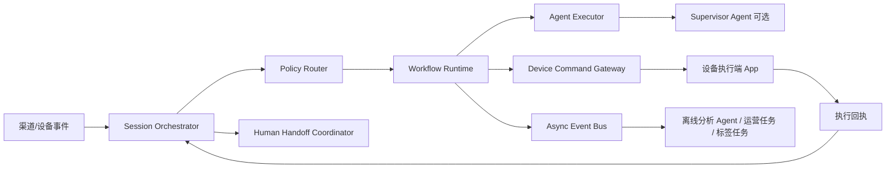
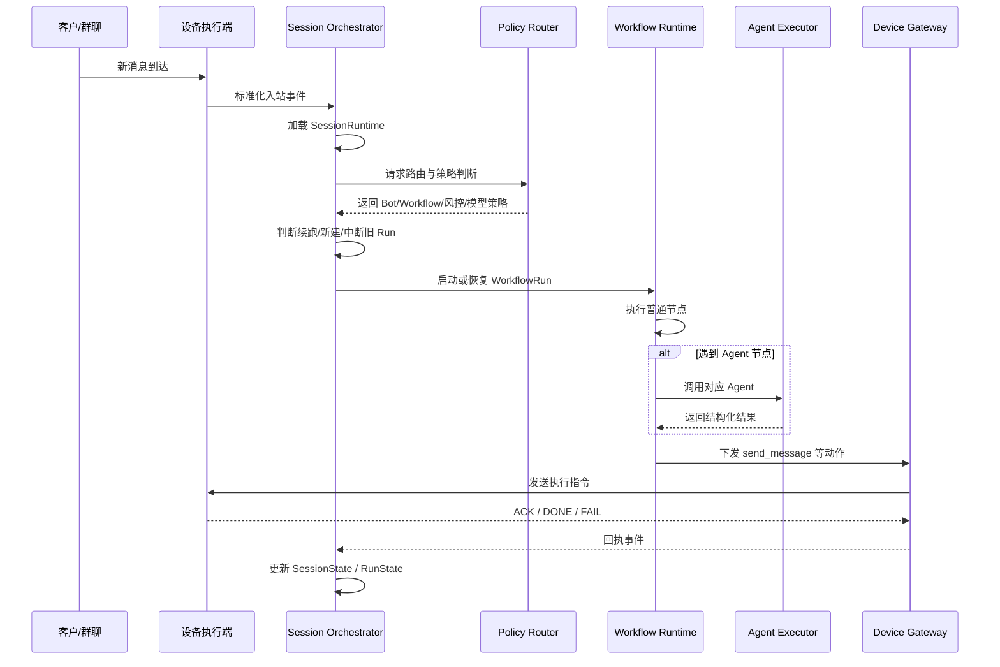
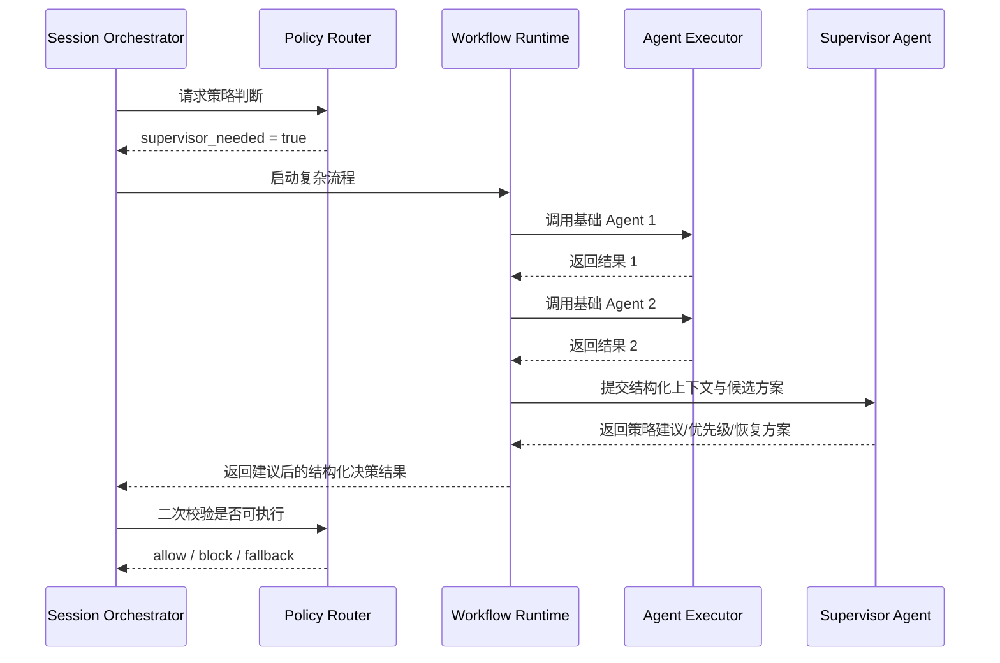
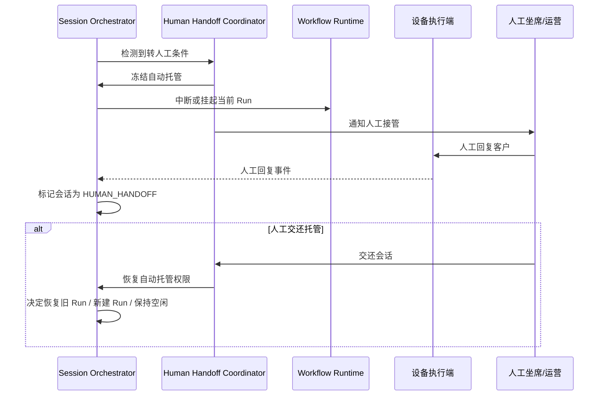
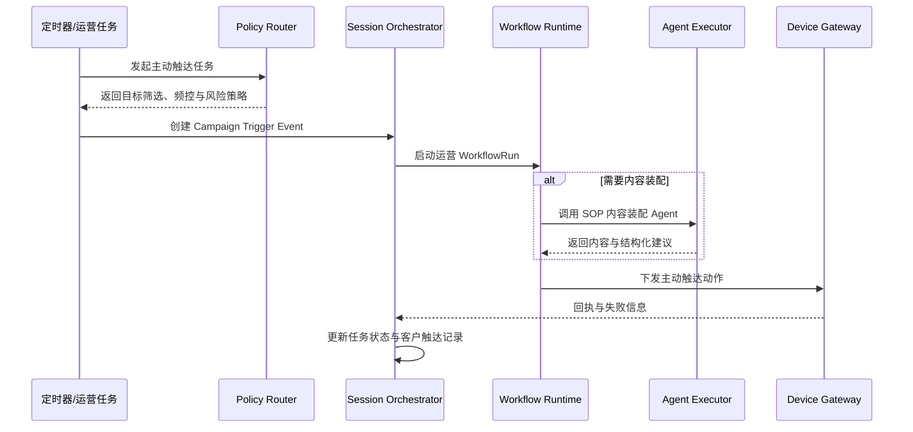
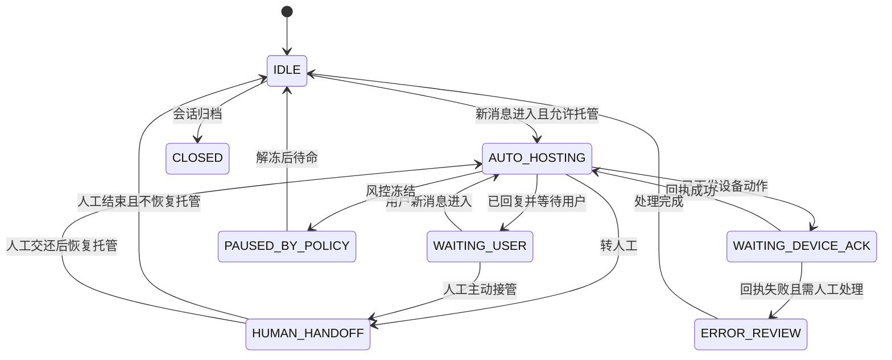
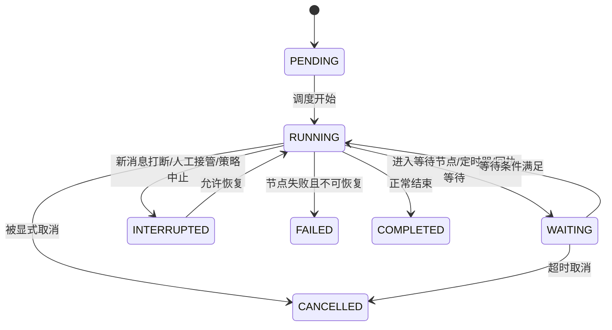

# Morphix 总控编排时序与状态图

这份文档是《`design-总控编排层详细设计.md`》的配套说明，重点把总控编排层的关键链路和状态流转画清楚，方便后续做领域建模、接口设计和运行时实现。

---

## 1. 总体关系图

一句话理解：
- **Orchestrator 控主链路**
- **Policy Router 控策略**
- **Runtime 控流程执行**
- **Agent Executor 控能力调用**
- **Device Gateway 控渠道动作落地**

---

## 2. 入站消息主链路时序图

这是最常见的一条链路：客户发来新消息，系统判断是否托管、该用哪个 Bot、走哪个 Workflow、是否需要调用 Agent，最后是否下发设备回复。

### 关键设计点
- **设备消息先标准化，再入 Orchestrator**，不要让上层直接处理渠道差异。
- **Policy Router 先于 Runtime**，否则流程已经跑起来了才做风控，顺序反了。
- **Agent 返回结构化结果，不直接决定全局下一步**。
- **设备回执必须反向回到 Orchestrator**，否则运行态会漂。

---

## 3. Supervisor Agent 触发链路

Supervisor Agent 不是每轮必经，而是高复杂度场景时才触发。

### 典型触发条件
- 高价值客户
- 多个 Agent 输出冲突
- 当前阶段判断不明确
- 连续失败需要恢复策略
- 风险高、收益也高的触达动作

### 核心原则
- **Supervisor Agent 给建议，不直接夺权**
- **最终采纳权仍在 Orchestrator + Policy Router**

---

## 4. 人工接管链路

这是系统落地时非常关键的一条链路。很多系统不是 AI 不会说，而是 AI 和人工一起说，最后把客户整懵了。

### 必须遵守的规则
- 人工接管期间，AI 不得继续发言。
- 接管和交还都必须形成审计事件。
- 人工交还后，不能默认把旧流程原地接着跑，必须重新判断上下文是否还有效。

---

## 5. 主动运营任务链路

主动运营和即时会话不要混成一条线。它们共享总控体系，但触发源不同。

### 关键差异
- 即时会话由“客户消息”驱动
- 主动运营由“任务计划”驱动
- 两者都应进入同一总控编排体系，但状态来源不同

---

## 6. 会话状态图

建议把会话状态设计成偏“控制权与等待关系”的状态，而不是把业务阶段全塞进去。

### 状态说明
- `IDLE`：会话空闲，可被新事件激活
- `AUTO_HOSTING`：AI 拥有主控制权
- `WAITING_USER`：当前不需要系统主动动作，等待客户输入
- `WAITING_DEVICE_ACK`：系统已生成动作，等待设备确认执行结果
- `HUMAN_HANDOFF`：人工拥有主控制权
- `PAUSED_BY_POLICY`：被策略冻结，通常因风控、设备异常或渠道限制
- `ERROR_REVIEW`：需要人工或系统排障
- `CLOSED`：归档，不再进入自动链路

---

## 7. 工作流运行状态图

工作流运行状态和会话状态要分开。

### 状态说明
- `PENDING`：已创建但尚未真正执行
- `RUNNING`：当前活跃执行中
- `WAITING`：暂停等待外部条件
- `INTERRUPTED`：被打断但可能恢复
- `FAILED`：失败且需排查
- `CANCELLED`：被系统或人工明确取消
- `COMPLETED`：成功完成

---

## 8. 中断策略说明

中断策略是总控编排层非常关键的一块。

建议至少支持以下策略：

### 8.1 `DROP_NEW`
- 新消息不打断旧流程
- 适合强事务型执行过程

### 8.2 `INTERRUPT_AND_REPLAN`
- 中断当前 Run
- 用新消息重新规划
- 适合即时对话场景

### 8.3 `QUEUE_NEW`
- 新消息排队，等待当前节点完成后再处理
- 适合短耗时节点密集场景

### 8.4 `MERGE_WINDOW`
- 短时间窗口内多消息合并成一批
- 适合用户连续发多条碎片消息的情况

### 推荐默认值
对私域即时沟通场景，默认更推荐：
- **短窗口合并 + 可中断重规划**

因为真实用户不会像接口文档一样一条消息说完整，经常是：
- “在吗”
- “我想问下价格”
- “还有课程周期”
- “能不能便宜点”

如果每条都独立起流程，系统会像喝了三杯浓缩一样过度兴奋。

---

## 9. 关键决策点清单

下面这些点建议都沉淀为可审计的 `PolicyDecision` 记录：

1. 是否允许 AI 托管
2. 选择哪个 Bot
3. 选择哪个 WorkflowVersion
4. 是否允许调用高成本模型
5. 是否需要 Supervisor Agent
6. 是否允许主动触达
7. 是否转人工
8. 是否打断旧 Run
9. 是否允许执行高风险设备动作
10. 失败后是重试、降级还是终止

---

## 10. MVP 实现顺序建议

### 第一批必须实现
1. 入站消息主链路
2. 会话状态机
3. 工作流运行状态机
4. 设备回执闭环
5. 人工接管闭环
6. 基础 Policy Router

### 第二批增强实现
1. 中断策略丰富化
2. 主动运营任务链路
3. Supervisor Agent 灰度接入
4. 成本分层策略
5. 审计与调试回放增强

---

## 11. 一句话结论

如果说《`design-总控编排层详细设计.md`》是在定义“谁负责什么”，那么这份文档定义的是“它们按什么顺序协作”。

核心原则只有一句：

**让总控编排层决定流程，让 Agent 提供能力，让设备执行层负责落地，让人工接管机制在必要时接管控制权。**
