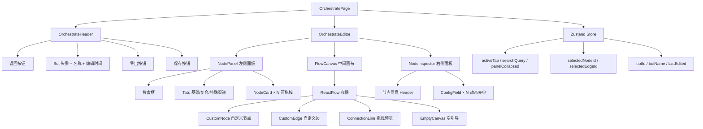
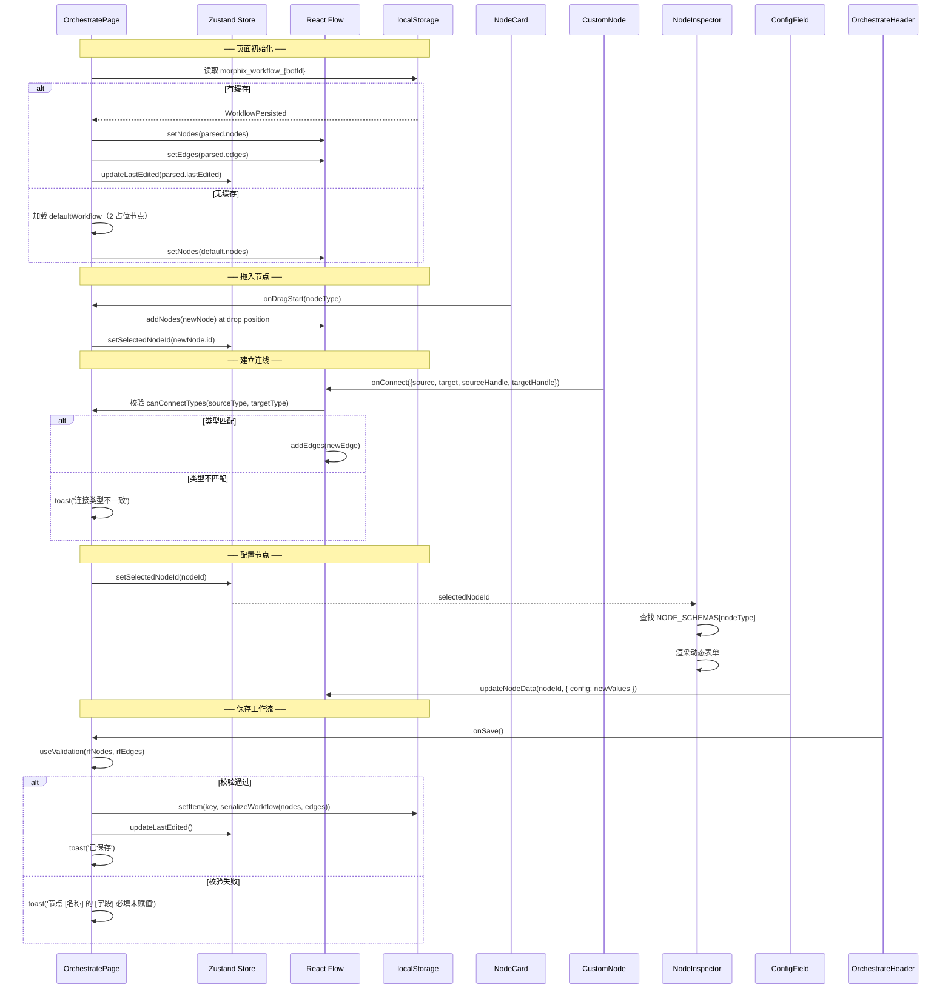
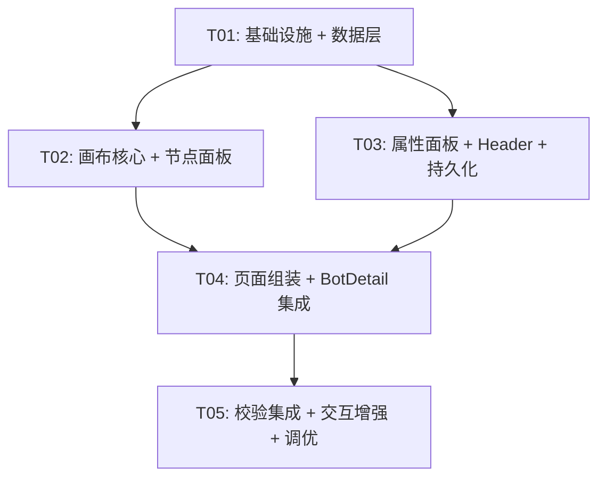

# Morphix 编排台 MVP 系统架构设计 + 任务分解

> **版本**：v1.0 | **日期**：2026-07-11 | **作者**：高见远（架构师）
> **前置依赖**：《PRD-编排台MVP实现范围.md》v1.0、prototype/index.html NODE_SCHEMAS

---

## 一、实现方案

### 1.1 整体架构概览

```
┌─────────────────────────────────────────────────────────┐
│                    OrchestratePage                      │
│  ┌───────────────────────────────────────────────────┐  │
│  │              OrchestrateHeader                     │  │
│  │  [←返回] [Bot头像+名称+编辑时间] [导出] [保存]      │  │
│  └───────────────────────────────────────────────────┘  │
│  ┌──────────┬──────────────────────┬─────────────────┐  │
│  │ NodePanel│     FlowCanvas       │  NodeInspector  │  │
│  │          │   (React Flow)       │                 │  │
│  │ [搜索框] │  ┌────┐   ┌────┐    │  节点名称       │  │
│  │          │  │Node│──→│Node│    │  ─────────────  │  │
│  │ [Tab:基] │  └────┘   └────┘    │  config字段1    │  │
│  │ [Tab:复] │      ╲   ╱          │  config字段2    │  │
│  │ [Tab:特] │       ╲ ╱           │  config字段3    │  │
│  │          │        X            │                 │  │
│  │ 分类1    │       ╱ ╲           │                 │  │
│  │  节点卡  │      ╱   ╲          │                 │  │
│  │  节点卡  │  ┌────┐   ┌────┐    │                 │  │
│  │ 分类2    │  │Node│   │Node│    │                 │  │
│  │  ...     │  └────┘   └────┘    │                 │  │
│  └──────────┴──────────────────────┴─────────────────┘  │
└─────────────────────────────────────────────────────────┘
```

### 1.2 框架选型理由

| 技术选型 | 理由 |
|----------|------|
| **React Flow (`@xyflow/react`)** | 原型已验证的流程图引擎，内置拖拽/缩放/连线/选择/Delete 键删除；自定义节点和边能力强 |
| **Zustand** | 轻量状态管理（~1KB），管理面板折叠/搜索/Tab/选中状态，避免 React Flow 内部状态与外层 React 状态冲突 |
| **localStorage** | MVP mock-first 策略，无需后端，数据以 `morphix_workflow_{botId}` 为 key 持久化 |
| **MUI + Tailwind CSS** | 与现有 morphix-console 保持一致，表单组件可直接复用 MUI TextField/Select |
| **lucide-react** | 已存在依赖，图标方案统一 |

### 1.3 架构模式

采用 **分层 + Hook 驱动** 模式：

```
┌─────────────────────────────────────┐
│  UI 层（Page + Components）          │
│  OrchestratePage / Header / Panel   │
│  / Canvas / Inspector / ConfigField │
├─────────────────────────────────────┤
│  Hook 层（业务逻辑）                  │
│  useWorkflowPersistence             │
│  useNodeDrag / useValidation        │
├─────────────────────────────────────┤
│  Store 层（Zustand）                 │
│  orchestrateStore                   │
│  - panel tab, search, collapsed     │
│  - selectedNodeId                   │
│  - botInfo                          │
├─────────────────────────────────────┤
│  Data 层（静态定义）                  │
│  nodeDefinitions / portTypes        │
│  defaultWorkflow                    │
│  types                              │
└─────────────────────────────────────┘
```

---

## 二、文件列表

### 2.1 新建文件

```
src/pages/Bots/Orchestrate/
├── index.ts                          # 统一导出
├── OrchestratePage.tsx               # 编排页主组件
├── OrchestratePage.css               # 编排页样式
├── types/
│   └── orchestrate.ts                # 所有 TS 类型定义
├── data/
│   ├── nodeDefinitions.ts            # NODE_SCHEMAS（13+1 节点完整协议）
│   ├── panelNodes.ts                 # ORCHESTRATE_NODES（面板 3 Tab 分类）
│   ├── portTypes.ts                  # PORT_TYPES 常量 + canConnectTypes
│   └── defaultWorkflow.ts            # 默认 2 节点占位工作流
├── store/
│   └── orchestrateStore.ts           # Zustand store
├── hooks/
│   ├── useWorkflowPersistence.ts     # localStorage 读写
│   ├── useNodeDrag.ts                # 面板→画布拖拽逻辑
│   └── useValidation.ts              # 保存前校验
└── components/
    ├── OrchestrateHeader.tsx          # 顶部 Header
    ├── OrchestrateHeader.css
    ├── NodePanel.tsx                  # 左侧节点面板
    ├── NodePanel.css
    ├── NodeCard.tsx                   # 单个节点卡片（可拖拽）
    ├── NodeCard.css
    ├── FlowCanvas.tsx                 # React Flow 画布包装
    ├── FlowCanvas.css
    ├── CustomNode.tsx                 # React Flow 自定义节点
    ├── CustomNode.css
    ├── CustomEdge.tsx                 # React Flow 自定义边（含删除按钮）
    ├── CustomEdge.css
    ├── ConnectionLine.tsx             # 拖拽连线时实时样式
    ├── NodeInspector.tsx              # 右侧属性面板
    ├── NodeInspector.css
    ├── ConfigField.tsx                # 动态表单字段渲染
    ├── ConfigField.css
    ├── EmptyCanvas.tsx                # 空画布引导
    └── EmptyCanvas.css
```

### 2.2 修改文件

```
src/router.tsx                         # 新增 /bots/:botId/orchestrate 路由
src/pages/Bots/BotDetail.tsx           # TABS 数组增加 "编排" Tab
src/pages/Bots/BotDetail.css           # Tab 样式适配（如有必要）
package.json                           # 新增 @xyflow/react, zustand 依赖
```

---

## 三、数据模型

### 3.1 TypeScript 接口定义

```typescript
// ──── 端口类型定义 ────

/** 7 种端口数据类型 */
type PortDataType = 'string' | 'number' | 'boolean' | 'chatHistory' | 'knowledgeRef' | 'any' | 'property';

interface PortTypeInfo {
  label: string;
  color: string;
  desc: string;
}

/** 端口类型常量表 */
type PortTypeMap = Record<PortDataType, PortTypeInfo>;

// ──── 节点协议（来自 NODE_SCHEMAS）────

/** 节点输入点定义 */
interface InputPortDef {
  key: string;           // 唯一标识
  name: string;          // 显示名
  varName: string;       // 变量名（用于变量引用）
  dataType: PortDataType;
  required: boolean;     // 是否必填（校验用）
  mode: 'connect' | 'input' | 'both'; // 输入方式
}

/** 节点输出点定义 */
interface OutputPortDef {
  name: string;          // 显示名
  varName: string;       // 变量名
  dataType: PortDataType;
}

/** Config 字段定义 */
interface ConfigFieldDef {
  key: string;
  label: string;
  fieldType: 'text' | 'textarea' | 'select' | 'number' | 'note';
  required: boolean;
  options?: string[];    // select 选项
  default?: any;         // 默认值
  placeholder?: string;
}

/** 节点 Schema（完整协议） */
interface NodeSchema {
  inputs: InputPortDef[];
  outputs: OutputPortDef[];
  config: ConfigFieldDef[];
}

// ──── 面板节点（ORCHESTRATE_NODES）────

/** 面板中的节点卡片定义 */
interface PanelNodeDef {
  id: string;            // 对应 NODE_SCHEMAS 的 key
  title: string;
  desc: string;
  color: string;
  icon: string;          // lucide icon name
}

/** 面板节点分类 */
interface PanelCategory {
  category: string;
  nodes: PanelNodeDef[];
}

/** 面板 3 Tab */
interface PanelTabs {
  basic: PanelCategory[];
  composite: PanelCategory[];
  special: PanelCategory[];
}

// ──── 运行时数据 ────

/** 画布上节点实例的自定义数据（React Flow node.data） */
interface NodeInstanceData {
  nodeType: string;               // 对应 NODE_SCHEMAS key
  config: Record<string, any>;    // config 字段的值映射，如 { model: 'DeepSeek', prompt: '...' }
  inputs: Record<string, any>;    // 直接输入值映射，如 { question: '...' }
}

/** 画布边实例（React Flow edge），使用默认类型即可 */
// React Flow 内置 Edge 类型，额外在 data 中存储端口类型信息用于校验

// ──── 持久化格式 ────

/** localStorage 序列化结构 */
interface WorkflowPersisted {
  botId: string;
  nodes: SerializedNode[];   // React Flow nodes (含 position + data)
  edges: SerializedEdge[];   // React Flow edges (含 source/target handle)
  lastEdited: string;        // ISO 8601
  version: number;           // 数据格式版本号（未来迁移用）
}

// ──── Zustand Store ────

interface OrchestrateStore {
  // 面板状态
  activeTab: 'basic' | 'composite' | 'special';
  panelCollapsed: boolean;
  searchQuery: string;
  panelWidth: number;

  // 选中状态
  selectedNodeId: string | null;
  selectedEdgeId: string | null;

  // Bot 信息
  botId: string;
  botName: string;
  lastEdited: string;

  // Actions
  setActiveTab: (tab: 'basic' | 'composite' | 'special') => void;
  setPanelCollapsed: (collapsed: boolean) => void;
  setSearchQuery: (query: string) => void;
  setPanelWidth: (width: number) => void;
  setSelectedNodeId: (id: string | null) => void;
  setSelectedEdgeId: (id: string | null) => void;
  setBotInfo: (id: string, name: string) => void;
  updateLastEdited: () => void;
}
```

### 3.2 localStorage 序列化格式

```json
{
  "botId": "yefengqiu",
  "version": 1,
  "lastEdited": "2026-07-11T10:30:00.000Z",
  "nodes": [
    {
      "id": "node-1",
      "type": "customNode",
      "position": { "x": 60, "y": 80 },
      "data": {
        "nodeType": "agentEmbed",
        "config": { "bot": "杨奇成健康机器人" },
        "inputs": {}
      }
    },
    {
      "id": "node-2",
      "type": "customNode",
      "position": { "x": 340, "y": 60 },
      "data": {
        "nodeType": "strongReminder",
        "config": { "way": "企微消息", "content": "" },
        "inputs": {}
      }
    }
  ],
  "edges": [
    {
      "id": "edge-1",
      "source": "node-1",
      "target": "node-2",
      "sourceHandle": "aiReply",
      "targetHandle": "trigger"
    }
  ]
}
```

> **Key 格式**：`morphix_workflow_{botId}`（与 PM 约定一致）

---

## 四、组件树与数据流

### 4.1 组件树（Mermaid）



### 4.2 数据流（Mermaid Sequence）



---

## 五、任务列表

> **约束说明**：遵循架构师角色硬性限制，任务数 ≤ 5。每个任务至少含 3 个关联文件，按功能模块/层次分组。

### T01 ─ 项目基础设施 + 数据层

| 项 | 内容 |
|----|------|
| **任务 ID** | T01 |
| **任务名称** | 项目基础设施 + 数据层 |
| **涉及文件** | `package.json`（修改）、`src/pages/Bots/Orchestrate/types/orchestrate.ts`（新建）、`src/pages/Bots/Orchestrate/data/nodeDefinitions.ts`（新建）、`src/pages/Bots/Orchestrate/data/panelNodes.ts`（新建）、`src/pages/Bots/Orchestrate/data/portTypes.ts`（新建）、`src/pages/Bots/Orchestrate/data/defaultWorkflow.ts`（新建）、`src/pages/Bots/Orchestrate/store/orchestrateStore.ts`（新建）、`src/pages/Bots/Orchestrate/index.ts`（新建）、`src/router.tsx`（修改） |
| **依赖** | 无 |
| **优先级** | P0 |

**完成标准**：
1. `package.json` 新增 `@xyflow/react`（^12.x）和 `zustand`（^4.x）依赖，`pnpm install` 成功
2. `types/orchestrate.ts` 完整定义：`PortDataType`、`InputPortDef`、`OutputPortDef`、`ConfigFieldDef`、`NodeSchema`、`PanelNodeDef`、`PanelCategory`、`PanelTabs`、`NodeInstanceData`、`WorkflowPersisted`、`OrchestrateStore`
3. `data/nodeDefinitions.ts` 导出 `NODE_SCHEMAS` 对象，包含 13 个可配置节点 + 1 个占位节点（strongReminder），完整拷贝自原型
4. `data/panelNodes.ts` 导出 `ORCHESTRATE_NODES: PanelTabs`，3 Tab × 多分类，MVP 范围内节点完整；占位节点在 `composite` Tab 仅显示 strongReminder
5. `data/portTypes.ts` 导出 `PORT_TYPES: PortTypeMap`（7 种颜色）和 `canConnectTypes()` 函数
6. `data/defaultWorkflow.ts` 导出默认 2 节点工作流（agentEmbed + strongReminder，无连线）
7. `store/orchestrateStore.ts` 用 Zustand 实现完整 store，含所有 state 和 actions
8. `router.tsx` 新增 `import OrchestratePage` 和 `<Route path="/bots/:botId/orchestrate" element={<OrchestratePage />} />`
9. `index.ts` 统一导出所有公共接口

---

### T02 ─ 画布核心（React Flow 集成 + 节点面板）

| 项 | 内容 |
|----|------|
| **任务 ID** | T02 |
| **任务名称** | 画布核心（React Flow + 节点面板） |
| **涉及文件** | `src/pages/Bots/Orchestrate/components/FlowCanvas.tsx`（新建）、`src/pages/Bots/Orchestrate/components/FlowCanvas.css`（新建）、`src/pages/Bots/Orchestrate/components/CustomNode.tsx`（新建）、`src/pages/Bots/Orchestrate/components/CustomNode.css`（新建）、`src/pages/Bots/Orchestrate/components/CustomEdge.tsx`（新建）、`src/pages/Bots/Orchestrate/components/CustomEdge.css`（新建）、`src/pages/Bots/Orchestrate/components/ConnectionLine.tsx`（新建）、`src/pages/Bots/Orchestrate/components/NodePanel.tsx`（新建）、`src/pages/Bots/Orchestrate/components/NodePanel.css`（新建）、`src/pages/Bots/Orchestrate/components/NodeCard.tsx`（新建）、`src/pages/Bots/Orchestrate/components/NodeCard.css`（新建）、`src/pages/Bots/Orchestrate/components/EmptyCanvas.tsx`（新建）、`src/pages/Bots/Orchestrate/components/EmptyCanvas.css`（新建）、`src/pages/Bots/Orchestrate/hooks/useNodeDrag.ts`（新建） |
| **依赖** | T01 |
| **优先级** | P0 |

**完成标准**：
1. `FlowCanvas.tsx` 包装 `<ReactFlow>`，集成 `nodeTypes`（customNode）、`edgeTypes`（customEdge）、`connectionLineComponent`，处理 `onConnect`（含类型校验）、`onNodeClick`（更新选中）、`onPaneClick`（取消选中）、`onEdgesChange`/`onNodesChange`、`deleteKeyCode="Delete"`，禁用 fitView
2. `CustomNode.tsx` 渲染节点卡片：Header（图标 + 名称，色块左侧装饰条）+ Body（左侧 input 端口列表、右侧 output 端口列表、中间描述文字）。使用 React Flow `Handle` 组件，颜色从 `PORT_TYPES` 取值
3. `CustomEdge.tsx` 贝塞尔曲线 SVG path，中间位置显示 × 删除按钮（hover 时出现），选中时描边红色加粗
4. `ConnectionLine.tsx` 拖拽连线预览，合法目标绿色、不合法目标红色
5. `NodePanel.tsx` 实现 3 Tab（基础/复合/特殊渠道）+ 顶部搜索框 + 折叠/展开切换（含右侧竖向 Tab 标签），搜索实时过滤，按分类分组展示
6. `NodeCard.tsx` 单个节点卡片：色块图标 + 标题 + 描述，`draggable` 属性，`onDragStart` 设置 `dataTransfer`
7. `EmptyCanvas.tsx` 空画布引导："拖拽左侧节点到此处开始编排"
8. `useNodeDrag.ts` hook：处理画布 drop 事件，从 `dataTransfer` 读取 `nodeType`，计算画布坐标，创建新节点实例
9. 所有 CSS 使用现有 CSS 变量（`var(--bg)`, `var(--surface)`, `var(--primary)` 等），与 morphix-console 风格一致

---

### T03 ─ 属性面板 + 配置表单 + Header + 持久化

| 项 | 内容 |
|----|------|
| **任务 ID** | T03 |
| **任务名称** | 属性面板 + 配置表单 + Header + 持久化 |
| **涉及文件** | `src/pages/Bots/Orchestrate/components/NodeInspector.tsx`（新建）、`src/pages/Bots/Orchestrate/components/NodeInspector.css`（新建）、`src/pages/Bots/Orchestrate/components/ConfigField.tsx`（新建）、`src/pages/Bots/Orchestrate/components/ConfigField.css`（新建）、`src/pages/Bots/Orchestrate/components/OrchestrateHeader.tsx`（新建）、`src/pages/Bots/Orchestrate/components/OrchestrateHeader.css`（新建）、`src/pages/Bots/Orchestrate/hooks/useValidation.ts`（新建）、`src/pages/Bots/Orchestrate/hooks/useWorkflowPersistence.ts`（新建） |
| **依赖** | T01（T02 非硬依赖，但建议 T02 先完成以端到端联调） |
| **优先级** | P0 |

**完成标准**：
1. `NodeInspector.tsx` 读取 `selectedNodeId` → 查找对应 node data → 查找 `NODE_SCHEMAS[nodeType]` → 渲染节点名称和 `config` 字段列表。无选中时显示 "点击节点查看属性" 占位
2. `ConfigField.tsx` 根据 `fieldType` 动态渲染：
   - `text` → `<input type="text">`
   - `textarea` → `<textarea>`
   - `select` → `<select>` + `<option>` 列表
   - `number` → `<input type="number">`
   - `note` → 只读灰色提示文字
   - 变更时回调 `onChange(key, value)` 更新 React Flow node data
3. `OrchestrateHeader.tsx` 显示：返回按钮（`navigate(-1)` 或 `/bots/:botId`）+ Bot 头像 + 名称 + "编辑于" 时间 + 导出按钮（JSON 下载）+ 保存按钮
4. `useValidation.ts` hook：遍历所有 nodes，对每个 node 的 schema inputs 检查 `required: true` 是否已连线或已直接输入值；对 config 检查 `required: true` 字段是否已填写。返回 `{ valid: boolean, errors: ValidationError[] }`
5. `useWorkflowPersistence.ts` hook：
   - `loadWorkflow(botId)`：从 `localStorage` 读取并反序列化
   - `saveWorkflow(botId, nodes, edges)`：序列化到 `localStorage`，更新 `lastEdited`
   - `exportWorkflow(botId, nodes, edges)`：生成 JSON Blob 并触发下载
   - Key 格式：`morphix_workflow_{botId}`

---

### T04 ─ 页面组装 + BotDetail 集成 + 全局样式

| 项 | 内容 |
|----|------|
| **任务 ID** | T04 |
| **任务名称** | 页面组装 + BotDetail 集成 + 全局样式 |
| **涉及文件** | `src/pages/Bots/Orchestrate/OrchestratePage.tsx`（新建）、`src/pages/Bots/Orchestrate/OrchestratePage.css`（新建）、`src/pages/Bots/BotDetail.tsx`（修改）、`src/pages/Bots/BotDetail.css`（修改） |
| **依赖** | T01, T02, T03 |
| **优先级** | P0 |

**完成标准**：
1. `OrchestratePage.tsx` 组装全部组件：
   - 从 URL params 获取 `botId`
   - 用 `useWorkflowPersistence` 加载/保存
   - 初始化 React Flow 的 `useNodesState` + `useEdgesState`
   - 布局：Header（全宽）+ Editor（NodePanel | FlowCanvas | NodeInspector 三栏）
   - 保存按钮触发校验 → 通过则持久化 + toast("已保存")，失败则 toast 具体错误
   - 导出按钮触发 JSON 下载
2. `OrchestratePage.css`：编排页整体布局，三栏 flex 布局，画布区域 `flex:1`，面板和属性面板固定宽 + 可拖拽调整宽度
3. `BotDetail.tsx` TABS 数组新增 `{ id: 'orchestrate', label: '编排', icon: GitBranch }`；`activeTab === 'orchestrate'` 时 `navigate(/bots/${botId}/orchestrate)`
4. `BotDetail.css` 如有必要微调（新增编排 Tab 无需特殊样式变更）

---

### T05 ─ 保存校验完整集成 + 交互增强 + 最终调优

| 项 | 内容 |
|----|------|
| **任务 ID** | T05 |
| **任务名称** | 保存校验集成 + 交互增强 + 最终调优 |
| **涉及文件** | `src/pages/Bots/Orchestrate/OrchestratePage.tsx`（修改）、`src/pages/Bots/Orchestrate/components/FlowCanvas.tsx`（修改）、`src/pages/Bots/Orchestrate/components/CustomEdge.tsx`（修改）、`src/pages/Bots/Orchestrate/components/NodeCard.tsx`（修改）、`src/pages/Bots/Orchestrate/hooks/useValidation.ts`（修改） |
| **依赖** | T04 |
| **优先级** | P0（校验）+ P1（交互增强） |

**完成标准**：
1. **P0-11 保存前校验完整集成**：`useValidation` 检查所有 `required: true` 的 input 端口是否有连线或直接输入值；检查所有 `required: true` 的 config 字段是否非空。失败时 toast："节点『{节点名}』的『{字段名}』为必填项，请完成配置"
2. **P0-07 画布交互完善**：键盘 Delete/Backspace 删除选中节点或连线（过滤 INPUT/TEXTAREA 焦点）；未保存提醒（离开页面前检测 `isDirty`，弹 confirm）
3. **P1-04 连线悬停高亮**：`CustomEdge` hover 时加粗 + 显示删除 × 按钮；选中后按 Delete 删除
4. **P1-05 导出 JSON**：Header 导出按钮 → Blob download `{botName}_workflow_{date}.json`
5. **P1-06 空画布引导**：画布无节点时显示 `EmptyCanvas` 组件
6. **P1-01 变量引用高亮**（可选，视进度）：config textarea 中 `{变量名}` 蓝色高亮
7. **P1-02 节点复制粘贴**（可选）：Ctrl+C/V
8. **P1-03 画布缩略图**（可选）：React Flow `<MiniMap>` 组件

---

## 六、依赖包列表

```
@xyflow/react@^12.4.0     # React Flow 流程图引擎（核心依赖）
zustand@^4.5.0            # 轻量状态管理
```

已有依赖（无需新增）：

```
react@^18.3.1              # UI 框架
react-dom@^18.3.1          # DOM 渲染
react-router-dom@^6.26.2   # 路由（已满足）
lucide-react@^0.460.0      # 图标库（已满足）
```

> 注：MUI/Tailwind CSS 已存在于项目中（从现有代码 CSS 变量和组件推断），无需额外安装。如需显式安装 Tailwind，按项目现有方式处理。

---

## 七、共享知识

### 7.1 跨文件约定

| 约定项 | 说明 |
|--------|------|
| **端口类型常量** | 定义在 `data/portTypes.ts`，导出 `PORT_TYPES` 和 `canConnectTypes()`，所有需要端口颜色的地方从此文件导入 |
| **节点 Schema 数据** | 定义在 `data/nodeDefinitions.ts`，导出 `NODE_SCHEMAS: Record<string, NodeSchema>`，是唯一的 schema 真相源 |
| **面板节点数据** | 定义在 `data/panelNodes.ts`，导出 `ORCHESTRATE_NODES: PanelTabs`，面板渲染和搜索从此取数据 |
| **localStorage Key** | `morphix_workflow_{botId}`，读写统一使用 `useWorkflowPersistence` hook |
| **React Flow 节点 type** | 统一为 `'customNode'`（`nodeTypes={{ customNode: CustomNode }}`） |
| **React Flow 边 type** | 统一为 `'customEdge'`（`edgeTypes={{ customEdge: CustomEdge }}`） |
| **节点 ID 格式** | `node-{自增数字}`，与原型保持一致 |
| **连线 ID 格式** | `edge-{自增数字}` |
| **CSS 变量** | 复用项目现有变量：`var(--bg)` / `var(--surface)` / `var(--primary)` / `var(--text)` / `var(--text-secondary)` / `var(--border-light)` / `var(--radius-sm)` 等 |
| **图标** | 统一使用 `lucide-react`，面板节点 icon 字段存 lucide icon 名称字符串 |
| **Toast** | 统一使用 `src/utils/toast.ts` 的 `toast(message)` 函数 |
| **TypeScript strict** | 遵循项目 `tsconfig` 的 `noUnusedLocals` / `noUnusedParameters` 约束 |

### 7.2 7 种端口类型颜色表

```typescript
export const PORT_TYPES: PortTypeMap = {
  string:        { label: '字符串',   color: '#3b82f6', desc: '字符串类型' },
  number:        { label: '数字',     color: '#f97316', desc: '数字类型' },
  boolean:       { label: '布尔',     color: '#22c55e', desc: '布尔值' },
  chatHistory:   { label: '聊天记录', color: '#06b6d4', desc: '专属类型，传递聊天记录' },
  knowledgeRef:  { label: '引用内容', color: '#ef4444', desc: '专属类型，传递知识库查询结果' },
  any:           { label: '任意',     color: '#eab308', desc: '任意类型' },
  property:      { label: '属性',     color: '#8b5cf6', desc: '专属类型' },
};
```

### 7.3 连线校验规则

```typescript
function canConnectTypes(sourceType: string, targetType: string): boolean {
  if (sourceType === 'any' || targetType === 'any') return true;
  return sourceType === targetType;
}
```

### 7.4 默认工作流

首次加载时（localStorage 无数据）展示 2 个占位节点：
- `node-1`：**智能体嵌入**（agentEmbed），位置 (60, 80)
- `node-2`：**强提醒子流程**（strongReminder），位置 (340, 60)
- 无连线

### 7.5 强提醒子流程节点（strongReminder）

该节点在 MVP 中为 **占位展示**，不可连线、不可配置。`NodeInspector` 中显示 "该节点暂不可用，完整功能将在后续版本开放"。

---

## 八、待明确事项

1. **编排台入口方式**：PM 建议在 BotDetail 页 Tabs 中增加"编排"Tab，与现有"训练对话/知识内容/素材内容"平级。但编排页的复杂度（全屏三栏布局）与现有 Tab 的内容区差异较大，是否需要独立页面（`/bots/:botId/orchestrate`）而非 Tab 内容区？**建议**：独立路由页面 + BotDetail Tabs 点击时 `navigate` 跳转，保持布局自由度。

2. **智能体嵌入节点的 Bot 选择**：MVP 中 `agentEmbed.config.bot` 是否直接用 `<input type="text">` 让用户输入 bot 名称（如原型），还是做一个 mock select 下拉框展示 3-5 个假 bot？**建议**：先用 `text` 输入框（原型一致），后续接入真实 API 后改为搜索选择器。

3. **未保存变更提醒**：当用户在画布上做了修改但未保存就离开页面（点击返回 / 切换路由）时，是否需要 `beforeunload` + React Router 拦截确认？**建议**：MVP 做轻量版——用 `isDirty` 状态 + React Router `useBlocker`（v6.4+），如果太复杂则降级为 `window.confirm` 提示。

---

## 附录：任务依赖图



---

> **设计总结**：本方案以 React Flow 为核心引擎、Zustand 为轻量状态管理、localStorage 为持久化后端，在 morphix-console 现有架构上最小化扩展。5 个任务严格按依赖顺序排列，每个任务内文件内聚度高，工程师可按 T01→T02→T03→T04→T05 顺序逐任务实施并验收。
