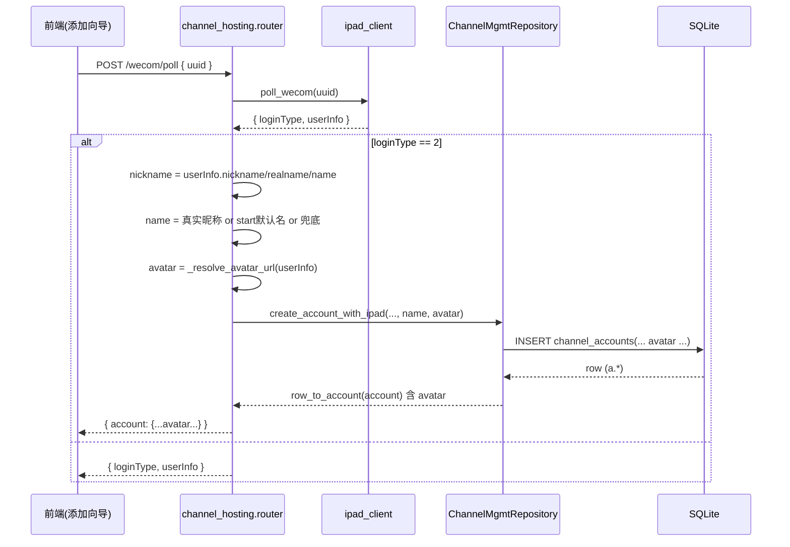
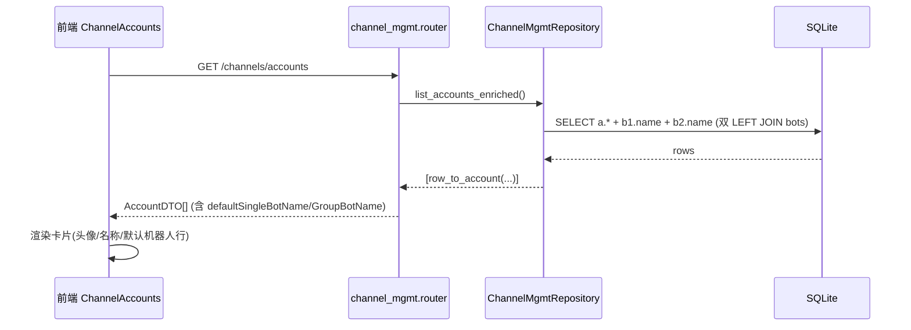
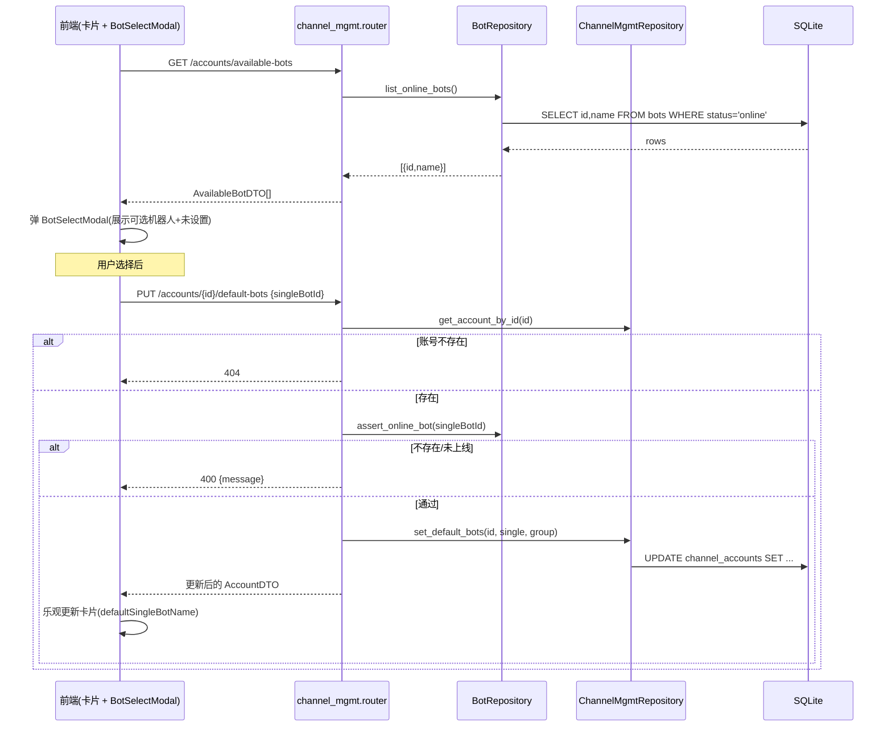

# 账号卡片增强 — 增量系统设计文档

> 项目：`software-morphix-account-card` ｜ 语言：中文
> 技术栈：后端 FastAPI + SQLite + SQLAlchemy 2.x(裸 SQL) + Pydantic v2；前端 Vite + React 18 + TypeScript
> 变更类型：增量（仅改账号卡片展示与默认机器人配置，不新增渠道类型）
> 上游输入：`docs/account-card-enhancement-prd.md`

---

## 1. 实现方案概述

本增量改动聚焦企业微信 iPad 协议账号卡片的「真实身份展示」与「默认单聊/群聊机器人配置」两块能力，并顺带修复 `poll_wecom` 把 `start` 传入默认名覆盖真实昵称的命名 Bug（PRD P0-1）。后端在三处协同：① 数据库 `channel_accounts` 表新增 `avatar` / `default_single_bot_id` / `default_group_bot_id` 三列（沿用项目既有 `migrate_schema` 幂等 ALTER 模式，保证旧库自动补列、新库由 `CREATE`/`init` SQL 直接带列）；② 仓储层 `ChannelMgmtRepository` / `BotRepository` 增加「写默认机器人」「列出已上线机器人」「聚合默认机器人名」能力，并在 `create_account_with_ipad` 落库时按 `avatar > headImgUrl > headimgurl` 优先级写入头像；③ 路由层新增「已上线机器人枚举」与「设置默认机器人」两个端点，后者复用模块级 `assert_online_bot` 统一校验「存在且已上线」。

前端把卡片由「头像+信息 | 会话数 | 按钮竖排」横向布局改为纵向堆叠：圆形真实头像（有图用 ``，失败回退首字母+底色）、名称旁绿色企微气泡图标、保留「ipad 在线」徽标、会话数、两行可点击的「默认单聊/群聊机器人」（空态「未设置」）、底部一行横排按钮。点击默认机器人行弹出选择器（数据源=已上线机器人），修改后乐观更新卡片并回写后端。换绑团队沿用 PRD 默认假设——仅做横排样式，点击仍 toast 占位，不实现真实换绑。

整体保持向后兼容：现有 `GET /channels/accounts` 返回的 `AccountDTO` 仅在原字段基础上**追加**新字段（不删不改旧字段），前端旧消费方不受影响；团队隔离校验因 `bots` 表无 `team_id` 字段暂不可行，本期仅校验「已上线」并列为待明确事项。

---

## 2. 文件列表（相对路径，标注新建/修改）

### 后端（目录基准：`project/backend/`）

| 文件 | 状态 | 改动要点 |
|---|---|---|
| `app/schema.py` | 修改 | `SCHEMA_SQL` 的 `channel_accounts` `CREATE` 增加 3 列；`migrate_schema` 增加幂等 `ALTER`（保持旧库兼容） |
| `database/init_morphix_mvp.sql` | 修改 | `channel_accounts` 建表语句同步增加 3 列，与 `SCHEMA_SQL` 对齐 |
| `app/repositories.py` | 修改 | `row_to_account` 追加新字段；`list_accounts_enriched` 增加 `bots` 双 `LEFT JOIN` 聚合默认机器人名；`create_account_with_ipad` 接受并写入 `avatar`；新增 `set_default_bots`；`BotRepository` 新增 `get` / `list_online_bots`；新增模块级 `_resolve_avatar_url` / `assert_online_bot` |
| `app/schemas.py` | 修改 | 新增 `AccountDefaultBotsRequest`（设置默认机器人请求体） |
| `app/routers/channel_mgmt.py` | 修改 | 新增 `GET /channels/accounts/available-bots`、`PUT /channels/accounts/{account_id}/default-bots` |
| `app/routers/channel_hosting.py` | 修改 | 修复 `poll_wecom` 命名优先级（真实昵称优先）+ 落库 `avatar` |

### 前端（目录基准：`src/`）

| 文件 | 状态 | 改动要点 |
|---|---|---|
| `types/channels.ts` | 修改 | `AccountDTO` 扩展 `avatar` / `defaultSingleBotId` / `defaultGroupBotId` / `defaultSingleBotName` / `defaultGroupBotName`；新增 `AvailableBotDTO` / `SetDefaultBotsRequest` |
| `api/client.ts` | 修改 | `channelsApi` 增加 `listAvailableBots()` / `setDefaultBots(accountId, data)` |
| `pages/Channels/ChannelAccounts.tsx` | 修改 | 卡片改纵向堆叠：圆形头像、`WecomNameIcon`、默认机器人可点击行、底部横排按钮；接入 `BotSelectModal` 与乐观更新 |
| `pages/Channels/shared/BotSelectModal.tsx` | 新建 | 默认机器人选择器弹层（数据源=已上线机器人，「未设置」可清空） |
| `pages/Channels/shared/WecomNameIcon.tsx` | 新建 | 名称旁绿色企微气泡图标（14px，`#07c160`） |
| `pages/Channels/Channels.css` | 修改 | `.channel-account-card` 改 `column`；`.channel-account-avatar` 改圆形；`.channel-account-actions` 改横排；新增 `.default-bot-row` / `.wecom-name-icon` / 头像 `` 样式 |

---

## 3. 数据结构和接口契约

### 3.1 `channel_accounts` 新增字段及迁移 SQL

新增 3 列，沿用项目「`TEXT NOT NULL DEFAULT ''` + 空串表示未设置」约定（与既有 `ipad_uuid` 等列一致），**不采用 PRD 中的 `NULL`**，以避免空值判空分支、与现有 DTO `.get(x, "")` 风格统一。

**字段定义**

| 列名 | 类型 | 默认 | 说明 |
|---|---|---|---|
| `avatar` | `TEXT` | `''` | 企微真实头像 URL，落库时按 `avatar>headImgUrl>headimgurl` 解析 |
| `default_single_bot_id` | `TEXT` | `''` | 默认单聊机器人；空串=未设置 |
| `default_group_bot_id` | `TEXT` | `''` | 默认群聊机器人；空串=未设置 |

**① `SCHEMA_SQL`（`app/schema.py`）CREATE 段追加**

```sql
CREATE TABLE IF NOT EXISTS channel_accounts (
  id TEXT PRIMARY KEY,
  channel TEXT NOT NULL,
  account_name TEXT NOT NULL,
  status TEXT NOT NULL,
  bound_bot TEXT NOT NULL,
  daily_quota INTEGER NOT NULL DEFAULT 0,
  team_id TEXT NOT NULL DEFAULT '',
  channel_type TEXT NOT NULL DEFAULT '',
  protocol TEXT NOT NULL DEFAULT '',
  sessions_count INTEGER NOT NULL DEFAULT 0,
  created_at TEXT NOT NULL DEFAULT CURRENT_TIMESTAMP,
  -- 企业微信 iPad 协议托管（T01）已有列
  ipad_uuid TEXT NOT NULL DEFAULT '',
  ipad_user_info TEXT NOT NULL DEFAULT '{}',
  host_status TEXT NOT NULL DEFAULT 'pending',
  sync_status TEXT NOT NULL DEFAULT '',
  last_sync_at TEXT NOT NULL DEFAULT '',
  callback_url TEXT NOT NULL DEFAULT '',
  callback_type TEXT NOT NULL DEFAULT '',
  -- 账号卡片增强（本期）
  avatar TEXT NOT NULL DEFAULT '',
  default_single_bot_id TEXT NOT NULL DEFAULT '',
  default_group_bot_id TEXT NOT NULL DEFAULT ''
);
```

**② `migrate_schema`（`app/schema.py`）幂等 ALTER（旧库补列）**

```python
# ---- 账号卡片增强迁移（本期） ----
_channel_account_card_cols = {
    "avatar": "TEXT NOT NULL DEFAULT ''",
    "default_single_bot_id": "TEXT NOT NULL DEFAULT ''",
    "default_group_bot_id": "TEXT NOT NULL DEFAULT ''",
}
for col, ddl in _channel_account_card_cols.items():
    if not _has_column(backend, "channel_accounts", col):
        backend.execute(f"ALTER TABLE channel_accounts ADD COLUMN {col} {ddl}")
```

**③ `database/init_morphix_mvp.sql` 同步**：在 `channel_accounts` 建表语句末尾追加相同 3 列，保证经该文件初始化的库一次带齐。

### 3.2 `AccountDTO` 字段扩展

后端 `row_to_account` 在现有字段基础上追加以下输出（`row.get` 容错，缺列旧库返回 `""`/`None`），并一次性 `LEFT JOIN bots` 聚合默认机器人**显示名**（满足 PRD P1「列表接口聚合默认机器人名称，减少二次请求」）：

```python
def row_to_account(row: dict) -> dict:
    return {
        # —— 既有字段（保持不变） ——
        "id": row["id"],
        "name": row["account_name"],
        "channel": row["channel"],
        "channelType": row["channel_type"],
        "protocol": row["protocol"],
        "status": row["status"],
        "online": (row["status"] == "online"),
        "sessionsCount": row["sessions_count"],
        "teamId": row.get("team_id", ""),
        "boundBot": row["bound_bot"],
        "seatsLeft": row.get("seats_left"),
        "onlineSessions": row.get("online_sessions"),
        "teamName": row.get("team_name"),
        "ipadUuid": row.get("ipad_uuid", ""),
        "ipadUserInfo": (json.loads(row.get("ipad_user_info") or "{}") or None),
        "hostStatus": row.get("host_status", "pending"),
        "syncStatus": row.get("sync_status", ""),
        "lastSyncAt": row.get("last_sync_at", ""),
        # —— 本期新增 ——
        "avatar": row.get("avatar", ""),
        "defaultSingleBotId": row.get("default_single_bot_id", ""),
        "defaultGroupBotId": row.get("default_group_bot_id", ""),
        "defaultSingleBotName": row.get("default_single_bot_name"),   # JOIN 聚合，可能为 None
        "defaultGroupBotName": row.get("default_group_bot_name"),     # JOIN 聚合，可能为 None
    }
```

配套 SQL（`list_accounts_enriched`）：

```sql
SELECT a.*, s.seats_left, s.online_sessions, t.name AS team_name,
       b1.name AS default_single_bot_name,
       b2.name AS default_group_bot_name
FROM channel_accounts a
LEFT JOIN channel_seats s ON s.channel_account_id = a.id
LEFT JOIN teams t ON t.id = a.team_id
LEFT JOIN bots b1 ON b1.id = a.default_single_bot_id
LEFT JOIN bots b2 ON b2.id = a.default_group_bot_id
ORDER BY a.created_at, a.id
```

**前端 `AccountDTO`（`src/types/channels.ts`）**

```typescript
export interface AccountDTO {
  id: string
  name: string
  channel: string
  channelType: 'wecom' | 'wechat' | 'whatsapp' | 'business_whatsapp' | string
  protocol: string
  status: 'online' | 'offline' | 'warning' | string
  online: boolean
  sessionsCount: number
  teamId: string
  boundBot: string
  seatsLeft?: number | null
  onlineSessions?: number | null
  teamName?: string | null
  // —— 本期新增 ——
  avatar?: string | null
  defaultSingleBotId?: string | null
  defaultGroupBotId?: string | null
  defaultSingleBotName?: string | null
  defaultGroupBotName?: string | null
}

/** 已上线机器人枚举项（选择器数据源）。 */
export interface AvailableBotDTO {
  id: string
  name: string
}

/** 设置默认单聊/群聊机器人请求体（null = 清空）。 */
export interface SetDefaultBotsRequest {
  singleBotId?: string | null
  groupBotId?: string | null
}
```

### 3.3 新增 / 修改的 API 端点

> 既有 `GET /channels/accounts`（列表）、`POST /channels/accounts/wecom/poll`（托管落库）为**修改**，返回体追加字段；以下为新增/修改契约明细。

#### (A) `GET /api/channels/accounts/available-bots` —— 已上线机器人枚举（PRD P0-6）

资源域裸数组（无信封，与 `GET /bots` 一致）。

```json
// 响应 200：AvailableBotDTO[]
[
  { "id": "yefengqiu", "name": "野风秋大健康机器人" },
  { "id": "fanfuni",   "name": "笑笑尼家效销售机器人" }
]
```
空场景返回 `[]`。团队隔离暂未实现（见 §8 Q4），当前返回全部 `status='online'` 的机器人。

#### (B) `PUT /api/channels/accounts/{account_id}/default-bots` —— 设置默认机器人（PRD P0-5 / P0-11）

请求体（`AccountDefaultBotsRequest`）：

```json
{ "singleBotId": "yefengqiu", "groupBotId": null }
```

| 字段 | 类型 | 说明 |
|---|---|---|
| `singleBotId` | `string \| null` | 默认单聊机器人；`null` 清空 |
| `groupBotId` | `string \| null` | 默认群聊机器人；`null` 清空 |

响应（成功 200，返回更新后的 `AccountDTO` 扩展体）：

```json
{
  "id": "acc_xxx",
  "name": "张伟",
  "avatar": "https://.../avatar.png",
  "defaultSingleBotId": "yefengqiu",
  "defaultGroupBotId": "",
  "defaultSingleBotName": "野风秋大健康机器人",
  "defaultGroupBotName": null
}
```

错误码：

| 状态码 | 触发条件 | 响应体 |
|---|---|---|
| `404` | `account_id` 不存在 | `{"detail":"账号不存在"}` |
| `400` | 机器人不存在 / 未上线（`status!='online'`） | `{"message":"机器人未上线，无法设为默认接管方"}` |

> 校验统一由模块级 `assert_online_bot(repo, bot_id)` 完成；传空串/`null` 视为「允许为空」，通过校验。

#### (C) `POST /api/channels/accounts/wecom/poll`（修改）—— 修正命名 + 写入 avatar

`loginType==2` 分支，命名优先级改为「真实昵称优先于 `start` 默认名」，并在落库 `create_account_with_ipad` 时传入 `avatar`：

```python
nickname = (
    user_info.get("nickname")
    or user_info.get("realname")
    or user_info.get("name")
)
name = nickname or state.get("name") or f"企业微信-{payload.uuid[:6]}"
avatar = _resolve_avatar_url(user_info)   # avatar > headImgUrl > headimgurl
account = repo.create_account_with_ipad(
    channel_type=channel_type, protocol="ipad", team_id=team_id,
    name=name, ipad_uuid=payload.uuid, ipad_user_info=user_info,
    host_status="hosted", avatar=avatar,
)
```

响应 `account` 字段随 `row_to_account` 一并携带 `avatar` / `defaultSingleBotId`('') / `defaultGroupBotName`(null) 等。

---

## 4. 程序调用流程（时序图，Mermaid）

### 4.1 托管落库：修正命名 + 写入 avatar（端点 C）



### 4.2 列表聚合：一次返回默认机器人名（端点 既有 GET /accounts）



### 4.3 设置默认机器人：校验在线 + 写库 + 前端乐观更新（端点 B）



### 4.4 数据结构关系（classDiagram）

```mermaid
classDiagram
    class ChannelAccount {
        +str id
        +str account_name
        +str status
        +str channel_type
        +str protocol
        +str ipad_uuid
        +str avatar
        +str default_single_bot_id
        +str default_group_bot_id
    }
    class AccountDTO {
        +str id
        +str name
        +str avatar
        +str defaultSingleBotId
        +str defaultGroupBotId
        +str defaultSingleBotName
        +str defaultGroupBotName
    }
    class Bot {
        +str id
        +str name
        +str status
    }
    class AvailableBotDTO {
        +str id
        +str name
    }
    class AccountDefaultBotsRequest {
        +str singleBotId
        +str groupBotId
    }
    class ChannelMgmtRepository {
        +list_accounts_enriched()
        +create_account_with_ipad(...)
        +set_default_bots(id, single, group)
        +get_account_by_id(id)
    }
    class BotRepository {
        +get(bot_id)
        +list_online_bots()
    }
    class ChannelMgmtRouter {
        +GET /accounts
        +GET /accounts/available-bots
        +PUT /accounts/{id}/default-bots
    }
    class ChannelHostingRouter {
        +POST /wecom/poll
    }

    ChannelAccount "1" --> "0..1" Bot : default_single_bot_id
    ChannelAccount "1" --> "0..1" Bot : default_group_bot_id
    ChannelMgmtRepository ..> ChannelAccount : row_to_account
    ChannelMgmtRepository ..> AccountDTO : 映射
    BotRepository ..> Bot : row_to_bot
    ChannelMgmtRouter ..> ChannelMgmtRepository
    ChannelHostingRouter ..> ChannelMgmtRepository : create_account_with_ipad
    ChannelMgmtRouter ..> BotRepository : assert_online_bot
    AccountDefaultBotsRequest ..> ChannelMgmtRouter : 请求体
```

---

## 5. 任务列表（按实现顺序排列，含依赖关系）

> 分组原则：后端数据/契约 → 后端接口 → 前端契约+组件 → 联调验证。每个实现任务均 ≥3 个相关文件。

| Task | 名称 | 涉及文件 | 依赖 | 优先级 |
|---|---|---|---|---|
| **T01** | 后端数据层 + 迁移 + 契约 | `app/schema.py`、`database/init_morphix_mvp.sql`、`app/repositories.py`、`app/schemas.py` | — | P0 |
| **T02** | 后端接口层 | `app/routers/channel_mgmt.py`、`app/routers/channel_hosting.py`、`app/schemas.py`（含 T01 的 `AccountDefaultBotsRequest`） | T01 | P0 |
| **T03** | 前端契约 + 卡片组件重构 | `src/types/channels.ts`、`src/api/client.ts`、`src/pages/Channels/ChannelAccounts.tsx`、`src/pages/Channels/shared/BotSelectModal.tsx`、`src/pages/Channels/shared/WecomNameIcon.tsx`、`src/pages/Channels/Channels.css` | T02 | P0 |
| **T04** | 联调与验证 | `project/backend/tests/test_account_card.py`、`project/backend/tests/test_default_bots_api.py`、`project/backend/tests/test_poll_avatar.py` | T01, T02, T03 | P0/P1 |

**依赖说明**
- T01 先行：所有 SQL/仓储/校验原语就绪，定义后端契约。
- T02 依赖 T01：`AccountDefaultBotsRequest` 与 `assert_online_bot` / `set_default_bots` 已在 T01 落地。
- T03 依赖 T02：前端类型与 API 客户端须对齐后端契约。
- T04 依赖全部：启动迁移、跑通 poll 落库、列表聚合、设置默认机器人、前端卡片对齐与单元/接口自测。

---

## 6. 依赖包列表

本期**无新增第三方依赖**。

| 层 | 既有包 | 说明 |
|---|---|---|
| 后端 | `fastapi`、`pydantic`、`sqlite3`（标准库） | 复用现有；`AccountDefaultBotsRequest` 用 Pydantic v2 `Optional` |
| 前端 | `react`、`react-router-dom`、`lucide-react` | `BotSelectModal` 复用 `lucide-react` 图标；无新包 |

> 若后续 P2 要做「头像懒加载 + 失败回退重试」，可引入 `react-lazy-load-image-component`，但本期不引入（P2 可选）。

---

## 7. 共享知识（跨文件约定）

1. **头像解析函数（唯一来源）**：`_resolve_avatar_url(user_info)` 定义为 `app/repositories.py` 模块级函数，优先级 `avatar > headImgUrl > headimgurl`，返回 `str`（空串表示无）。`create_account_with_ipad` 调用它写入 `avatar` 列；前端不再解析 `user_info`，直接使用 `AccountDTO.avatar`（空则首字母+`avatarColor(id)` 兜底，复用 `shared/avatar.ts` 既有 `avatarColor` / `avatarChar`）。

2. **机器人在线校验（唯一来源）**：`assert_online_bot(bot_repo, bot_id)` 定义为 `app/repositories.py` 模块级函数——`bot_id` 为空返回 `None`（允许空态）；否则 `BotRepository.get` 查存在性，`status != 'online'` 抛 `ValueError("机器人未上线，无法设为默认接管方")`。路由捕获 `ValueError` → `400`。所有「设置默认机器人」入口统一走此函数，避免校验逻辑散落。

3. **空值约定**：三列均以**空串 `''` 表示未设置**（与既有 `ipad_uuid` 等列一致），**不使用 SQL `NULL`**。前端判空用 `!a.defaultSingleBotId`（空串/undefined 均视为未设置），展示「未设置」。此点与 PRD「TEXT NULL」不同，已在 §3.1 说明。

4. **DTO 字段命名**：后端 DB snake_case → 前端 camelCase，统一在 `row_to_account` / `row_to_bot` 完成映射；新增接口请求/响应体同样遵循（如 `defaultSingleBotId`）。

5. **聚合默认机器人名**：`defaultSingleBotName` / `defaultGroupBotName` 由 `list_accounts_enriched` 的 `LEFT JOIN bots` 一次性算好（PRD P1），前端**禁止**再发起二次请求查机器人名。

6. **换绑团队占位**：`ChannelAccounts.tsx` 中「换绑团队」按钮延续 `toast('换绑团队（P2 暂未开放）')`，本期仅随卡片改横排样式，不实现换绑逻辑（见 §8 Q2）。

7. **乐观更新**：`PUT /default-bots` 成功后，前端直接用响应体的 `defaultSingleBotId/Name` 更新本地 `accounts` 状态，不重新拉全量列表（PRD P1）。

---

## 8. 待明确事项（仍依赖用户确认 / 决策点）

| # | 问题 | 本期处理（基于默认假设） |
|---|---|---|
| Q1 | 默认机器人是否允许为空？ | 按默认假设**允许为空**，空态显示「未设置」；`PUT` 接受 `null` 清空；校验对空值放行。 |
| Q2 | 换绑团队本次是否打通？ | 按默认假设**继续占位**（仅横排样式 + toast），不实现真实换绑。 |
| Q3 | 头像/昵称字段来源优先级？ | 头像 `avatar>headImgUrl>headimgurl`；昵称 `nickname>realname>name>start默认名>企业微信-{uuid[:6]}`。**存量「企业微信-xxx」账号是否回填修正脚本未确认**——本期不自动回填，仅新托管账号生效；如需回填需另出一次性脚本（参考 `fix1_account_name.py`）。 |
| Q4 | 默认机器人「属当前团队」如何校验？ | **当前 `bots` 表无 `team_id` 字段，无法按团队隔离**。本期仅校验「已上线」，团队隔离列为待产品决策；`GET /available-bots` 返回全部在线机器人。若后续要团队隔离，需先给 `bots` 表加 `team_id` 并迁移。 |
| Q5 | 是否要「已上线」之外的状态过滤？ | `available-bots` 仅返回 `status='online'`。若产品希望暴露「训练中」等，需扩展枚举与选择器文案。 |
| Q6 | 多渠道路由卡片样式复用（P2）？ | 本期只实现 wecom 的 `WecomNameIcon`；WhatsApp 等渠道复用同卡片样式、图标按需替换（P2 可选），不在本期范围。 |

---

## 附录：关键实现片段（参考）

**`app/repositories.py` 新增/修改要点**

```python
# 模块级 helper
def _resolve_avatar_url(user_info: dict | None) -> str:
    if not isinstance(user_info, dict):
        return ""
    for key in ("avatar", "headImgUrl", "headimgurl"):
        val = user_info.get(key)
        if val and str(val).strip():
            return str(val).strip()
    return ""

def assert_online_bot(repo: "BotRepository", bot_id: str | None) -> dict | None:
    if not bot_id:
        return None
    bot = repo.get(bot_id)
    if bot is None:
        raise ValueError("机器人不存在")
    if bot.get("status") != "online":
        raise ValueError("机器人未上线，无法设为默认接管方")
    return bot
```

```python
# ChannelMgmtRepository.set_default_bots
def set_default_bots(self, account_id: str, single_bot_id: str, group_bot_id: str) -> None:
    self._db.execute(
        "UPDATE channel_accounts SET default_single_bot_id = ?, default_group_bot_id = ? WHERE id = ?",
        (single_bot_id or "", group_bot_id or "", account_id),
    )
```

```python
# BotRepository 新增
def get(self, bot_id: str) -> dict | None:
    row = self._db.query_one("SELECT * FROM bots WHERE id = ?", (bot_id,))
    return row_to_bot(row) if row else None

def list_online_bots(self) -> list[dict]:
    rows = self._db.query("SELECT id, name FROM bots WHERE status = 'online' ORDER BY name")
    return [{"id": r["id"], "name": r["name"]} for r in rows]
```

**`app/routers/channel_mgmt.py` 新增端点**

```python
from ..repositories import BotRepository, ChannelMgmtRepository, assert_online_bot
from ..schemas import AccountDefaultBotsRequest

@router.get("/accounts/available-bots")
def list_available_bots():
    return BotRepository(get_backend()).list_online_bots()

@router.put("/accounts/{account_id}/default-bots")
def set_default_bots(account_id: str, payload: AccountDefaultBotsRequest):
    repo = ChannelMgmtRepository(get_backend())
    if repo.get_account_by_id(account_id) is None:
        return JSONResponse(status_code=404, content={"detail": "账号不存在"})
    bot_repo = BotRepository(get_backend())
    try:
        assert_online_bot(bot_repo, payload.singleBotId)
        assert_online_bot(bot_repo, payload.groupBotId)
    except ValueError as e:
        return JSONResponse(status_code=400, content={"message": str(e)})
    repo.set_default_bots(account_id, payload.singleBotId or "", payload.groupBotId or "")
    return repo.get_account_by_id(account_id)
```
