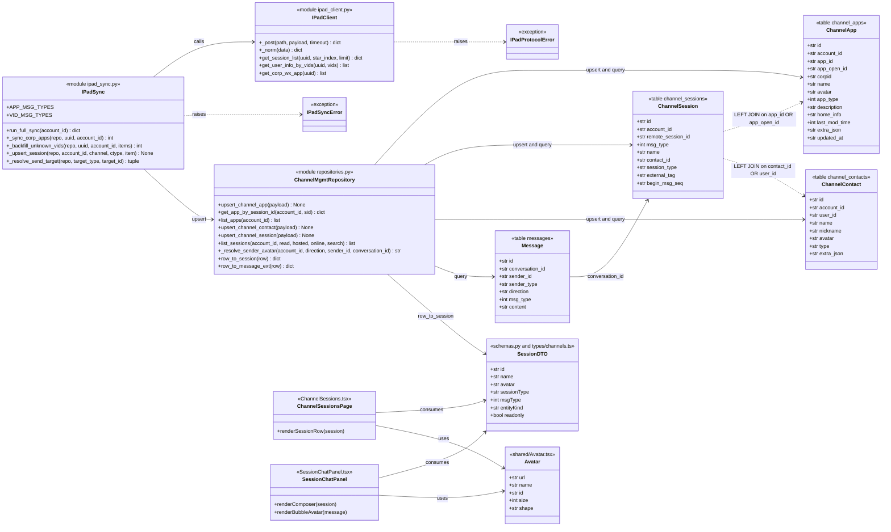
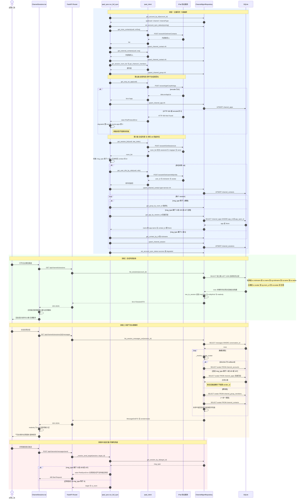
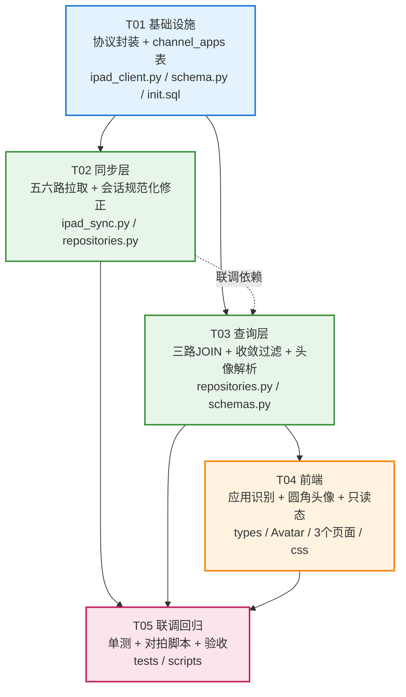

# 架构设计：企业微信应用会话正确显示名字和头像

| 项 | 内容 |
| --- | --- |
| Project Name | `wecom_app_display` |
| 文档版本 | v1.0（架构设计 + 任务分解） |
| 上游文档 | `docs/prd-wecom-app-display.md` |
| 技术栈 | Python 3.11 + FastAPI + SQLite（原生 SQL）+ Pydantic ｜ React 18 + Vite + TypeScript |
| 对拍环境 | 后端 `127.0.0.1:2181`、前端 `127.0.0.1:5183`、真实库 `database/morphix_mvp.db`、账号 `acc_c5b92c6d`（在线，`ipad_uuid=0de3615076d46ae2384881a286c85903`） |
| 对拍时间 | 2026-08-01 |
| 关联图 | `docs/class-diagram.mermaid`、`docs/sequence-diagram.mermaid` |

---

## 〇、执行摘要（先看这里）

本次设计阶段对真实数据做了完整对拍，得到 **3 条会改变 PRD 范围的结论**：

| # | 结论 | 影响 |
| --- | --- | --- |
| **A** | 用户截图的 3 个裸数字**没有一个是 `msg_type=3`** —— 它们分别是 `107` / `103` / `0`。PRD 的 F3/F5 归因不完整。 | **范围必须扩大**：应用族是 `msg_type ∈ {3, 103, 107}`，`6` 是开放平台，`0` 里还混着未同步的真人。 |
| **B** | **`getCorpWxApp` 在生产协议服务上返回 HTTP 404（未实现）**，而同服务 `GetRunClientInfo` 正常 200。 | **P0-1 存在硬阻塞**。方案必须"接口就绪即生效"，且在 404 期间**不产生视觉回归**。 |
| **C** | **`GetUserInfoByVids` 接口可用且已能解出 2/4 个可见裸数字**（`1688852792312821` → 企业微信团队，`5629499770789533` → AI数字员工）。 | **可先交付一半价值**，不依赖被阻塞的 `getCorpWxApp`。 |

据此，架构采用 **「双通道身份解析 + 解析收敛式过滤」**：

- **通道 1（今天可用）** `GetUserInfoByVids` → 落 `channel_contacts` → **复用现有 JOIN，查询层零改动**即可消除 `msg_type∈{0,6}` 的裸数字。
- **通道 2（接口就绪即生效）** `getCorpWxApp` → 落新表 `channel_apps` → 新增第三路 LEFT JOIN 解决 `msg_type∈{3,103,107}`。
- **收敛式过滤**：把硬编码的 `WHERE cs.msg_type != 3` 换成 **「名称已解析才显示」**。名称解析不出来就继续隐藏（= 当前行为，无回归）；一旦 `getCorpWxApp` 上线，应用会话**自动浮现**，无需再改代码。

---

## 一、前置验证（数据对拍结果）

> 全部为 2026-08-01 在真实库 / 真实协议服务上执行的实测结果，非推断。

### 1.1 问题一：裸数字到底出现在哪个列表？

**命令**

```bash
# DB 侧：按 msg_type 分组计数
python3 -c "
import sqlite3
con=sqlite3.connect('database/morphix_mvp.db'); con.row_factory=sqlite3.Row
for r in con.execute('SELECT msg_type, COUNT(*) c FROM channel_sessions GROUP BY msg_type ORDER BY msg_type'):
    print(dict(r))"

# DB 侧：所有「名称仍是裸 ID」的会话
sqlite3 database/morphix_mvp.db \
  "SELECT remote_session_id, name, msg_type, session_type, external_tag
   FROM channel_sessions WHERE name = remote_session_id ORDER BY msg_type;"

# API 侧
curl -s "http://127.0.0.1:2181/api/channels/sessions?accountId=acc_c5b92c6d&pageSize=1000" -o /tmp/sess.json
curl -s "http://127.0.0.1:2181/api/channels/contacts?accountId=acc_c5b92c6d&pageSize=1000" -o /tmp/cont.json
python3 -c "
import json,re
for f,l in (('/tmp/sess.json','会话'),('/tmp/cont.json','联系人')):
    items=json.load(open(f))
    nums=[i for i in items if re.fullmatch(r'\d+', str(i.get('name','')))]
    print(l, '总数', len(items), '纯数字', len(nums), [i['name'] for i in nums])"
```

**结果**

`channel_sessions` 的 `msg_type` 分布（共 847 条）：

| msg_type | 条数 | session_type | 备注 |
| --- | --- | --- | --- |
| 0 | 840 | 好友 | 其中 1 条名称仍是裸 ID |
| 1 | 4 | 群聊 | 名称正常 |
| **3** | **12** | 应用 | **全部裸 ID，但被 `msg_type != 3` 过滤，用户看不到** |
| **6** | **1** | 开放平台 | 裸 ID `5629499770789533`，**未被过滤，用户可见** |
| **103** | **1** | 其他 | 裸 ID `13102694783555467`，**未被过滤，用户可见** |
| **107** | **1** | 其他 | 裸 ID `10223`，**未被过滤，用户可见** |

「名称 == remote_session_id」的会话共 **16 条**，其中 **12 条被过滤**、**4 条可见**。

API 实测：

| 接口 | 返回条数 | 纯数字条目 |
| --- | --- | --- |
| `GET /api/channels/sessions` | 847 | **4 条真裸数字**：`10223`、`13102694783555467`、`1688852792312821`、`5629499770789533`（另有 1 条 `123`，是客户自设昵称，**有头像**，非本需求范围） |
| `GET /api/channels/contacts` | 839 | **0 条**（唯一的 `123` 是真实客户昵称，有头像） |

> **✅ 结论 1（回答 PRD Q4）**
> **裸数字 100% 来自会话列表接口，联系人列表完全没有问题。**
> 且**用户截图的 3 个数字全部不是 `msg_type=3`**——现有 `WHERE cs.msg_type != 3` 过滤恰好把 12 个真 `msg_type=3` 应用全藏起来了，用户看到的是**漏网的另外一族**。
> **PRD 中 F3/F5「裸数字根因 = msg_type=3」的归因不完整，本设计据此扩大范围。**

### 1.2 问题二：`sessionid` 与应用 ID 如何映射？

**命令**

```bash
# ① 直连协议服务调用 getCorpWxApp
curl -s -X POST "http://47.94.7.218:9912/wxwork/getCorpWxApp" \
  -H "Content-Type: application/json" \
  -d '{"uuid":"0de3615076d46ae2384881a286c85903"}' -w "\nHTTP %{http_code}\n"

# ② 对照组：确认服务本身可用、账号在线
curl -s -X POST "http://47.94.7.218:9912/wxwork/GetRunClientInfo" \
  -H "Content-Type: application/json" \
  -d '{"uuid":"0de3615076d46ae2384881a286c85903"}' -w "\nHTTP %{http_code}\n"

# ③ 端点命名变体探测
for p in getCorpWxApp GetCorpWxApp getcorpwxapp getCorpWxAppList GetWxAppList getCorpApp; do
  curl -s -o /dev/null -w "$p HTTP %{http_code}\n" -X POST \
    "http://47.94.7.218:9912/wxwork/$p" -H "Content-Type: application/json" \
    -d '{"uuid":"0de3615076d46ae2384881a286c85903"}'
done
```

**结果**

```
GetRunClientInfo   HTTP 200   {"data":{"loginType":2,"clientId":"bf9b9ade...","userInfo":{...}}}
getCorpWxApp       HTTP 404   {"status":404,"error":"Not Found","path":"/wxwork/getCorpWxApp"}
GetCorpWxApp       HTTP 404
getcorpwxapp       HTTP 404
getCorpWxAppList   HTTP 404
GetWxAppList       HTTP 404
getCorpApp         HTTP 404
```

> **🔴 结论 2A（阻塞项）**
> **生产协议服务 `47.94.7.218:9912` 未实现 `getCorpWxApp`，所有命名变体均 404。**
> 同一服务 `GetRunClientInfo` 返回 200，证明**服务可达、账号在线、uuid 有效** —— 这是**协议服务版本缺口**，不是配置或鉴权问题（文档第 20 节示例 URL 为 `127.0.0.1:8084`，疑似尚未发布到 9912 这台）。
> **`msg_type∈{3,103,107}` 共 14 条会话的名称与头像，在该接口上线前无法获得。**

**ID 空间分析**（`GetSessionList` 原始 payload + `channel_contacts` 前缀分布）

```bash
curl -s -X POST "http://47.94.7.218:9912/wxwork/GetSessionList" \
  -H "Content-Type: application/json" \
  -d '{"uuid":"0de3615076d46ae2384881a286c85903","starIndex":0,"limit":100}' | python3 -m json.tool
```

`room_list` 单条字段仅 **`sessionid` / `msgtype` / `unreadcnt` / `beginmsgseq`** —— **协议本身不返回名称**，必须靠旁路接口补齐（这点确认了方案方向）。

| ID 形态 | 长度 | 示例 | 归属空间 | 协议文档对照 |
| --- | --- | --- | --- | --- |
| `10004`…`10223` | 5 位 | `10004`、`10223` | **应用 appOpenId 空间** | 文档示例 `appOpenId=1000015` |
| `5629499*` | 16 位 | `5629499770789533` | **应用 appId 空间** | 文档示例 `appId=5629499961733838` |
| `13102694783555467` | 17 位 | 同左 | 应用族（另一 ID 段） | — |
| `1688*` / `7881*` | 16 位 | `1688852792312821` | **真人 vid 空间** | 本账号自身 vid=`1688858282236435`；`channel_contacts` 中 `1688*`×25、`7881*`×814 |

> **✅ 结论 2B（回答 PRD Q1）**
> **必须双键匹配 `sessionid == appId OR sessionid == appOpenId`**，两个键都要建索引。
> 理由：`10223`(5位) 落在 appOpenId 空间，`5629499770789533`(16位) 落在 appId 空间，**两族并存于同一份会话列表**，单键必漏。
>
> **同时确认 PRD Q1 的怀疑成立**：`1688852792312821` **不是应用**，它落在真人 vid 空间（与账号自身 vid 同前缀同长度），属于「未同步进 `channel_contacts` 的真人/服务号」，**需要另一条修复路径**。

**关键补充发现：`GetUserInfoByVids` 可用且能补齐真人族**

```bash
curl -s -X POST "http://47.94.7.218:9912/wxwork/GetUserInfoByVids" \
  -H "Content-Type: application/json" \
  -d '{"uuid":"0de3615076d46ae2384881a286c85903",
       "vids":[10004,10017,10049,10060,10067,10074,10097,10151,10165,10199,10205,10212,
               10223,13102694783555467,5629499770789533,1688852792312821]}'
```

请求 16 个 ID，**命中 2 个**：

| ID | msg_type | 解析结果 | 头像 |
| --- | --- | --- | --- |
| `1688852792312821` | 0 | **企业微信团队** | ✅ `https://wwcdn.weixin.qq.com/node/wework/images/avatar_wecom@3x.png` |
| `5629499770789533` | 6 | **AI数字员工** | ✅ `https://wework.qpic.cn/wwpic3az/438595_.../0` |
| 其余 14 个（10xxx / 13102694783555467） | 3/103/107 | ❌ 未命中 | — |

> **✅ 结论 2C（本次对拍最大收益）**
> **`GetUserInfoByVids` 现在就能解掉用户可见 4 个裸数字中的 2 个**，且返回的是标准 `user_id/nickname/avatar` 结构，**落 `channel_contacts` 即可被 `list_sessions` 现有的 `cc.user_id = cs.remote_session_id` JOIN 直接命中——查询层零改动**。
> 覆盖边界非常干净：**vid 空间走 `GetUserInfoByVids`，应用空间走 `getCorpWxApp`，互不重叠。**

### 1.3 问题三：应用消息的 `sender_id` 形态？

**命令**

```bash
python3 -c "
import sqlite3
con=sqlite3.connect('database/morphix_mvp.db'); con.row_factory=sqlite3.Row
ids=[r[0] for r in con.execute('SELECT id FROM channel_sessions WHERE msg_type IN (3,6,103,107)')]
q=','.join('?'*len(ids))
for r in con.execute(f'SELECT sender_id, sender_type, direction, COUNT(*) c FROM messages WHERE conversation_id IN ({q}) GROUP BY sender_id, sender_type, direction', ids):
    print(dict(r))"
```

**结果**

| conversation_id | sender_id | sender_type | direction | 条数 |
| --- | --- | --- | --- | --- |
| `acc_c5b92c6d:10004` | `10004` | user | inbound | 2 |
| `acc_c5b92c6d:10017` | `10017` | user | inbound | 9 |
| `acc_c5b92c6d:10060` | `10060` | user | inbound | 2 |
| `acc_c5b92c6d:10067` | `10067` | user | inbound | 4 |
| `acc_c5b92c6d:10074` | `10074` | user | inbound | 2 |
| `acc_c5b92c6d:10151` | `10151` | user | inbound | 1 |
| `acc_c5b92c6d:10165` | `10165` | user | inbound | 1 |
| `acc_c5b92c6d:10199` | `10199` | user | inbound | 2 |
| `acc_c5b92c6d:10212` | `10212` | user | inbound | 3 |
| `acc_c5b92c6d:10223` | `10223` | user | inbound | 1 |
| `acc_c5b92c6d:5629499770789533` | `5629499770789533` | user | **inbound** | 79 |
| `acc_c5b92c6d:5629499770789533` | `1688858282236435`（本账号 vid） | user | **outbound** | 111 |

- 应用会话的 inbound 消息 **`sender_id` 恒等于 `remote_session_id`**（10/10 一致，无例外、无空值）。
- 应用消息 `msg_type` 多为 `2001` / `2055`（系统/卡片类），`content` 常为空。
- ⚠️ `msg_type=6`（开放平台 AI数字员工）**存在 outbound 消息 111 条** —— 说明**开放平台会话是可双向的**，不应与「只读应用」一刀切。

> **✅ 结论 3（回答 PRD Q3）**
> **按会话维度解析，不按 `sender_id` 解析。**
> 虽然实测 `sender_id == remote_session_id` 使两种方式当前等价，但会话维度更稳健：
> ① 不依赖 `sender_id` 非空（未来卡片类消息可能缺失）；
> ② 与 `list_sessions` 的 JOIN 键完全一致，避免两处逻辑漂移；
> ③ 天然覆盖 `msg_type=107`（`10223`）这类 `sender_id` 同形但不属 `msg_type=3` 的情形。
>
> **同时修正 PRD P0-8**：`msg_type=6` 有真实 outbound 记录，**不能设为只读**；只读仅适用于 `msg_type ∈ {3,103,107}`。

### 1.4 前置验证结论汇总

| PRD 假设 | 对拍结果 | 处置 |
| --- | --- | --- |
| 裸数字 = `msg_type=3` 应用 | ❌ 用户可见的 4 个裸数字是 `msg_type` 0/6/103/107，`msg_type=3` 反而被藏起来了 | 扩大范围为 `{3,103,107}` 应用族 + `{0,6}` vid 族 |
| 裸数字可能来自联系人列表（Q4） | ❌ 联系人列表 0 条问题 | 联系人列表**不改动** |
| `appId` vs `appOpenId`（Q1） | ✅ 两族并存，必须双键 | 双键索引 + `OR` 匹配 |
| `1688852792312821` 可能是 vid（Q1 备注） | ✅ 确认为真人 vid 空间 = **企业微信团队** | 走 `GetUserInfoByVids` 通道 |
| 新建 `channel_apps` 表（Q2） | ✅ 采纳（详见 §3.1 决策依据） | 新建 |
| 头像按会话维度解析（Q3） | ✅ 采纳 | 会话维度 |
| `getCorpWxApp` 可调用 | 🔴 **HTTP 404 未实现** | **阻塞项，见 §9-U1**；方案降级不回归 |
| 应用会话只读（P0-8） | ⚠️ 部分错误，`msg_type=6` 有 111 条 outbound | 只读范围收窄至 `{3,103,107}` |

---

## 二、实现方案与框架选型

### 2.1 核心技术难点

| # | 难点 | 应对策略 |
| --- | --- | --- |
| D1 | **协议接口未实现（404）**，但需求不能无限期挂起 | **双通道解析**：`GetUserInfoByVids`（可用）先交付 vid 族；`getCorpWxApp`（阻塞）代码与表结构一次做完，接口上线后**无需改码**自动生效 |
| D2 | **解除过滤有回归风险**：直接删掉 `msg_type != 3`，会让 12 条裸数字应用暴露给用户（比现状更差） | **解析收敛式过滤**：条件从「按类型隐藏」改为「**未解析出名称才隐藏**」。解析成功自动浮现，失败维持隐藏，天然满足 PRD 验收项 5 |
| D3 | **ID 空间异构**：5 位 appOpenId / 16 位 appId / 17 位另一段，同表并存 | `channel_apps` 双列 `app_id` + `app_open_id`，各建索引，JOIN 用 `OR` 双键；统一以 **TEXT** 存储（避免 SQLite 整型与 TS `number` 精度丢失，17 位已超 `Number.MAX_SAFE_INTEGER`） |
| D4 | 会话名称解析链已有两路（联系人/群），再加一路易劣化为面条 SQL | 保持既有 `COALESCE` 链式风格，**只追加第三路 LEFT JOIN**，不重构；`COALESCE(cc.nickname, cc.name, cg.nickname, ca.name, cs.name)` |
| D5 | 前端需区分「应用/人」，但 `SessionDTO` **当前不透出 `msgType`** | `row_to_session` 补 `msgType` / `entityKind` / `readonly` 三个派生字段，前端只消费语义字段，不在 UI 层散落 magic number |
| D6 | 单路协议失败不得拖垮全量同步 | 沿用现有 `try/except` 分路容错；应用路失败仅置 `degraded=true` 并记 `counts.apps=0` |

### 2.2 框架与技术选型

**完全沿用现有栈，不引入任何新依赖**（详见 §6）。

| 层 | 选型 | 理由 |
| --- | --- | --- |
| 协议客户端 | `httpx` + 现有 `_post()` | 已封装 errcode 归一化与超时；**本次不修改 `_post`**，只新增两个调用它的函数（遵守约束） |
| 持久层 | SQLite + 原生 SQL | 与 `repositories.py` 现有全部实现一致，不引入 ORM |
| Schema 演进 | `schema.py::migrate_schema()` 幂等 | `CREATE TABLE IF NOT EXISTS` + `_has_column()` 守卫 ALTER，与 `_channel_contacts_cols` 范式一致 |
| API 契约 | Pydantic（`schemas.py`） | 现有 `SessionDTO` 扩字段 |
| 前端 | React 18 + TS + 现有 `Avatar` 组件 | `Avatar` 已含 URL→首字兜底，仅需扩 `shape` prop |

### 2.3 模块改动总览

```
┌─────────────────── 协议层 ipad_client.py ───────────────────┐
│ ＋ get_corp_wx_app(uuid)        → /wxwork/getCorpWxApp      │  🔴 服务端 404
│ ＋ get_user_info_by_vids(uuid, vids) → /wxwork/GetUserInfoByVids │ ✅ 可用
│ ○ _post() 不改动（遵守约束）                                  │
└──────────────────────────┬───────────────────────────────────┘
                           │
┌─────────────────── 同步层 ipad_sync.py ─────────────────────┐
│ ＋ _sync_corp_apps()        第五路：应用列表（会话规范化之前）  │
│ ＋ _backfill_unknown_vids() 第六路：未知 vid 兜底补拉          │
│ ～ _upsert_session()        应用分支 + contact_id=None 修正   │
│ ～ _resolve_send_target()   只读拦截扩至 {3,103,107}          │
│ ＋ APP_MSG_TYPES / VID_MSG_TYPES 常量                        │
└──────────────────────────┬───────────────────────────────────┘
                           │
┌─────────────────── 数据层 schema.py ────────────────────────┐
│ ＋ CREATE TABLE IF NOT EXISTS channel_apps                  │
│ ＋ 3 个索引（account+app_id / account+app_open_id / uk）     │
└──────────────────────────┬───────────────────────────────────┘
                           │
┌───────────────── 仓储层 repositories.py ────────────────────┐
│ ＋ upsert_channel_app / get_app_by_session_id / list_apps   │
│ ～ list_sessions()          第三路 JOIN + 收敛式过滤          │
│ ～ _resolve_sender_avatar() 应用分支（会话维度）               │
│ ～ row_to_session()         透出 msgType/entityKind/readonly │
└──────────────────────────┬───────────────────────────────────┘
                           │
┌──────────────────── 前端 src/ ──────────────────────────────┐
│ ～ types/channels.ts        Session 扩 3 字段                │
│ ～ shared/Avatar.tsx        ＋ shape: 'circle' | 'rounded'   │
│ ～ ChannelSessions.tsx      应用徽标 + 圆角头像 + 隐藏托管     │
│ ～ SessionChatPanel.tsx     只读输入区 + 气泡圆角头像          │
│ ～ RightPanelHeader.tsx     标题栏徽标 + 置灰托管下拉          │
└──────────────────────────────────────────────────────────────┘
```

---

## 三、数据模型设计

### 3.1 新建表 `channel_apps`（回答 PRD Q2：**采纳新建**）

**决策依据**（对拍后加强）：
1. 应用有 `app_type` / `home_info` / `corpid` / `last_mod_time` 等联系人语义没有的字段，塞 `extra_json` 牺牲可查询性；
2. **对拍证实应用 ID 空间与真人 vid 空间完全不重叠**（10xxx/5629499\* vs 1688\*/7881\*），混表会让 `cc.user_id = cs.remote_session_id` 这条既有 JOIN 产生跨语义误命中风险；
3. 应用不可聊天、不进客户档案，混入 `channel_contacts` 会污染 839 条联系人统计；
4. 现有 avatar JOIN 已是「联系人 / 群」双路，加第三路与既有架构最自洽。

```sql
CREATE TABLE IF NOT EXISTS channel_apps (
    id            TEXT PRIMARY KEY,              -- {account_id}:{app_id}
    account_id    TEXT NOT NULL,                 -- 账号隔离
    app_id        TEXT NOT NULL DEFAULT '',      -- 协议 appId（TEXT 存，防精度丢失）
    app_open_id   TEXT NOT NULL DEFAULT '',      -- 协议 appOpenId
    corpid        TEXT NOT NULL DEFAULT '',
    name          TEXT NOT NULL DEFAULT '',      -- 应用名称（显示名来源）
    avatar        TEXT NOT NULL DEFAULT '',      -- 协议 imgId（URL，与 contacts.avatar 命名对齐）
    app_type      INTEGER NOT NULL DEFAULT 0,    -- 2=小程序
    description   TEXT NOT NULL DEFAULT '',      -- 协议 desc（desc 是 SQL 保留字，改名）
    home_info     TEXT NOT NULL DEFAULT '',
    last_mod_time INTEGER NOT NULL DEFAULT 0,    -- 协议时间戳，用于 P1 增量
    extra_json    TEXT NOT NULL DEFAULT '{}',    -- appFlag/stat/groupId/businessId 等原样镜像
    updated_at    TEXT NOT NULL DEFAULT ''       -- 本地同步时间，用于 TTL
);

-- 双键索引：对拍结论 2B，appId / appOpenId 两族并存必须都能命中
CREATE INDEX IF NOT EXISTS idx_channel_apps_account_appid
    ON channel_apps(account_id, app_id);
CREATE INDEX IF NOT EXISTS idx_channel_apps_account_openid
    ON channel_apps(account_id, app_open_id);
CREATE UNIQUE INDEX IF NOT EXISTS uk_channel_apps_account_appid
    ON channel_apps(account_id, app_id);
```

**字段映射**

| 协议字段 | 表列 | 类型转换 | 说明 |
| --- | --- | --- | --- |
| `appId` | `app_id` | Long → **TEXT** | ⚠️ 17 位超 JS 安全整数，全链路字符串化 |
| `appOpenId` | `app_open_id` | Long → **TEXT** | 同上 |
| `corpid` | `corpid` | Long → TEXT | |
| `name` | `name` | String | 显示名第一优先级 |
| `imgId` | **`avatar`** | String(URL) | 刻意改名，与 `channel_contacts.avatar` / `channel_groups.room_url` 语义对齐 |
| `appType` | `app_type` | Integer | P1-3 区分「应用/小程序」 |
| `desc` | **`description`** | String | `desc` 为 SQL 保留字 |
| `homeInfo` | `home_info` | String | P2-2 主页跳转 |
| `lastModTime` | `last_mod_time` | Long | P1-1 增量判断 |
| 其余（`appFlag`/`stat`/`groupId`/`businessId`/`isReportOpen`…） | `extra_json` | JSON | 原样镜像，不丢信息 |

**自然键**：`(account_id, app_id)`；`id = f"{account_id}:{app_id}"`。
`app_id` 缺失时（协议异常）以 `app_open_id` 兜底构造，保证主键非空。

### 3.2 `channel_sessions` —— **不新增列**

对拍结论：显示名与头像**全部可由 JOIN 派生**（与现有 `avatar` 的处理方式完全一致，PRD F6）。冗余列会引入「同步时点快照 vs 实时」的一致性问题，且应用改名后需额外回填。
**已有的 `msg_type` 列足以承载全部判定逻辑**，本次零 schema 变更。

> 唯一的数据修正是**存量脏数据**：12 条 `msg_type=3` 会话当前带着指向不存在联系人的伪 `contact_id`（PRD F4 已确认，对拍复现）。修正在 `_upsert_session` 置 `None`，下次同步 UPSERT 自动纠正，**无需写迁移脚本**。

### 3.3 `channel_contacts` —— **不改 schema，仅扩数据来源**

`GetUserInfoByVids` 返回的 `user_id/nickname/avatar/acctid/corpid` 与现有列**完全对齐**，直接 `upsert_channel_contact` 即可：

| 协议字段 | 现有列 |
| --- | --- |
| `user_id` | `user_id` |
| `nickname` / `realname` | `nickname` / `name` |
| `avatar` | `avatar` |
| 其余 | `extra_json` |

新增约定：此路补拉的记录 `type = 'service'`、`source = 'vid_backfill'`，便于与真人联系人区分、且**不污染客户统计**（现有统计按 `type IN ('customer','internal')`，需在 T03 校验）。

> **架构收益**：因 `list_sessions` 已有 `cc.user_id = cs.remote_session_id` 的 JOIN 条件，**vid 族的裸数字修复在查询层零改动** —— 数据一落库，`1688852792312821` 立刻显示为「企业微信团队」。

### 3.4 `messages` —— **不改 schema**

对拍结论 3：`sender_id == remote_session_id`，且解析改走会话维度，无需新列。仅 `_resolve_sender_avatar` 增加一条分支。

### 3.5 API 契约扩展（`SessionDTO`）

```ts
interface Session {
  // ... 现有字段不变
  msgType: number                                    // 新增：原始协议类型（3/6/103/107/0/1）
  entityKind: 'person' | 'group' | 'app' | 'service' // 新增：语义分类，前端只消费这个
  readonly: boolean                                  // 新增：是否禁止发送（true = 应用族）
}
```

`entityKind` 派生规则（后端单点计算，前端不做 magic number 判断）：

| msg_type | entityKind | readonly | 头像形状 |
| --- | --- | --- | --- |
| 0 | `person` | false | 圆形 |
| 1 | `group` | false | 圆形 |
| **3 / 103 / 107** | **`app`** | **true** | **圆角矩形** |
| **6** | **`service`** | **false**（对拍：有 111 条 outbound） | 圆形 |
| 其他 | `person` | false | 圆形 |

---

## 四、文件列表（相对 `/Users/stevenmac/Desktop/工作目录/Morphix`）

### 4.1 修改文件

| # | 路径 | 改动摘要 | 任务 |
| --- | --- | --- | --- |
| 1 | `project/backend/app/ipad_client.py` | ＋`get_corp_wx_app(uuid)`、＋`get_user_info_by_vids(uuid, vids)`；**不改 `_post`** | T01 |
| 2 | `project/backend/app/schema.py` | `migrate_schema()` ＋`channel_apps` 建表 ＋3 索引（幂等） | T01 |
| 3 | `database/init_morphix_mvp.sql` | ＋`channel_apps` DDL，与 `schema.py` 保持字节级一致 | T01 |
| 4 | `project/backend/app/ipad_sync.py` | ＋`_sync_corp_apps` / `_backfill_unknown_vids` / 常量；～`run_full_sync` 五六路；～`_upsert_session` 应用分支；～`_resolve_send_target` 拦截扩围 | T02 |
| 5 | `project/backend/app/repositories.py` | ＋`upsert_channel_app`/`get_app_by_session_id`/`list_apps`；～`list_sessions` 第三路 JOIN＋收敛过滤；～`_resolve_sender_avatar` 应用分支；～`row_to_session` 透出 3 字段 | T03 |
| 6 | `project/backend/app/schemas.py` | `SessionDTO` ＋`msgType`/`entityKind`/`readonly` | T03 |
| 7 | `src/types/channels.ts` | `Session` 接口 ＋3 字段 | T04 |
| 8 | `src/pages/Channels/shared/Avatar.tsx` | ＋`shape?: 'circle' \| 'rounded'` prop | T04 |
| 9 | `src/pages/Channels/ChannelSessions.tsx` | 应用行：圆角头像 ＋「应用」徽标 ＋ 隐藏托管控件 | T04 |
| 10 | `src/pages/Channels/sessions/SessionChatPanel.tsx` | `readonly` → 输入区禁用＋提示；气泡头像圆角 | T04 |
| 11 | `src/pages/Channels/sessions/RightPanelHeader.tsx` | 标题栏应用徽标 ＋ 置灰托管下拉 | T04 |
| 12 | `src/pages/Channels/channels.css`（或就近样式文件） | `.avatar-rounded` / `.session-row-type-app` / `.composer-disabled` | T04 |

### 4.2 新增文件

| # | 路径 | 用途 | 任务 |
| --- | --- | --- | --- |
| 13 | `project/backend/tests/test_wecom_app_display.py` | 单测：协议解析、双键匹配、收敛过滤、头像解析、只读拦截 | T05 |
| 14 | `scripts/verify_wecom_app_display.py` | 真实库对拍脚本（复现本文 §1 全部结论，作为回归基线） | T05 |

### 4.3 文档

| # | 路径 | 状态 |
| --- | --- | --- |
| 15 | `docs/arch-wecom-app-display.md` | 本文 |
| 16 | `docs/class-diagram.mermaid` | 已生成 |
| 17 | `docs/sequence-diagram.mermaid` | 已生成 |

---

## 五、程序调用流程

### 5.1 类图

见 `docs/class-diagram.mermaid`。



### 5.2 时序图

见 `docs/sequence-diagram.mermaid`（含流程一同步、流程二查询、流程三头像、流程四发送拦截）。



### 5.3 核心 SQL：收敛式过滤（本设计的关键机制）

```sql
SELECT cs.*,
       COALESCE(cc.nickname, cc.name, cg.nickname, ca.name, cs.name) AS name,
       COALESCE(cc.avatar,   cg.room_url,          ca.avatar, '')    AS avatar,
       ca.app_type AS app_type
FROM channel_sessions cs
LEFT JOIN channel_contacts cc
       ON cc.account_id = cs.account_id
      AND (cc.id = cs.contact_id OR cc.user_id = cs.remote_session_id)
LEFT JOIN channel_groups cg
       ON cg.account_id = cs.account_id
      AND cg.room_id = cs.remote_session_id
-- 第三路（新增）：双键匹配 appId / appOpenId（对拍结论 2B）
LEFT JOIN channel_apps ca
       ON ca.account_id = cs.account_id
      AND (ca.app_id = cs.remote_session_id OR ca.app_open_id = cs.remote_session_id)
-- 收敛式过滤：取代硬编码 `WHERE cs.msg_type != 3`
-- 语义 = 「名称已解析出来的才显示」，而非「按类型隐藏」
WHERE COALESCE(cc.nickname, cc.name, cg.nickname, ca.name, '') <> ''
   OR cs.name <> cs.remote_session_id
```

**行为矩阵（基于真实 847 条数据推演）**

| 场景 | 条数 | `getCorpWxApp` 404 时 | 接口就绪后 |
| --- | --- | --- | --- |
| 真人/群，名称正常 | 831 | ✅ 显示（无回归） | ✅ 显示 |
| `msg_type=3` 应用 | 12 | 🔒 隐藏（= 现状） | ✅ 显示真名+图标 |
| `msg_type=103/107` | 2 | 🔒 隐藏（**比现状更好**，当前是裸数字） | ✅ 显示真名+图标 |
| `msg_type=0` 企业微信团队 | 1 | ✅ **立即修复**（`GetUserInfoByVids`） | ✅ |
| `msg_type=6` AI数字员工 | 1 | ✅ **立即修复**（`GetUserInfoByVids`） | ✅ |
| 客户昵称 `123` | 1 | ✅ 显示（有头像，非本需求） | ✅ |

> **✅ 满足 PRD 验收红线「绝不允许再回落到裸数字 ID」——在接口 404 的当下即可达成。**
> **✅ 满足 PRD 验收项 5「接口异常时其余同步正常且不回退到数字」。**
> **✅ `getCorpWxApp` 上线后无需任何代码改动，应用会话自动浮现。**

---

## 六、依赖包列表

### 6.1 Python

**无需新增任何 pip 包。**

| 包 | 版本 | 用途 | 状态 |
| --- | --- | --- | --- |
| `fastapi` | 现有 | Web 框架 | ✅ 已装 |
| `httpx` | 现有 | 协议 HTTP（`_post` 已用） | ✅ 已装 |
| `pydantic` | 现有 | DTO 校验 | ✅ 已装 |
| `sqlite3` | 标准库 | 持久化 | ✅ 内置 |
| `pytest` | 现有 | 单测 | ✅ 已装 |

### 6.2 前端

**无需新增任何 npm 包。**

| 包 | 版本 | 用途 | 状态 |
| --- | --- | --- | --- |
| `react` | ^18 | UI | ✅ 已装 |
| `typescript` / `vite` | 现有 | 构建 | ✅ 已装 |
| `vitest` | 现有 | 单测 | ✅ 已装 |

> 圆角矩形头像用 `border-radius: 8px` 内联/CSS 实现，**不引入 UI 库**。

---

## 七、任务列表（有序，含依赖）

> 严格遵守 ≤5 任务、每任务 ≥3 文件、按层次分组。

### T01 — 基础设施：协议封装 + 表结构

| 项 | 内容 |
| --- | --- |
| **Task ID** | `T01` |
| **优先级** | **P0** |
| **依赖** | 无 |
| **源文件** | `project/backend/app/ipad_client.py`、`project/backend/app/schema.py`、`database/init_morphix_mvp.sql` |

**内容**
1. `ipad_client.py` ＋`get_corp_wx_app(uuid) -> list[dict]`
   - `_post("wxwork/getCorpWxApp", {"uuid": uuid})` → `_norm()` → 取 `data.wxAppList[]`
   - **不补 mock 分支**（既有决策）；**不改 `_post`**（约束）
   - 所有 Long 型 ID **立即 `str()` 化**再返回（防 JS 精度丢失）
2. `ipad_client.py` ＋`get_user_info_by_vids(uuid, vids: list[str]) -> list[dict]`
   - `_post("wxwork/GetUserInfoByVids", {"uuid": uuid, "vids": [int(v) for v in vids]})`
   - ⚠️ 请求体 `vids` 必须是**整型数组**（对拍验证）；返回 `data` 是**顶层 list**，不是 `{list:[]}`
   - 分批：单次 ≤100 个 vid
3. `schema.py::migrate_schema()` ＋`channel_apps` 建表与 3 个索引（§3.1 DDL），用 `CREATE TABLE IF NOT EXISTS` + `CREATE INDEX IF NOT EXISTS` 幂等
4. `init_morphix_mvp.sql` 同步 DDL，与 `schema.py` **保持一致**

**验收**
- `python -c "from app import ipad_client; print(ipad_client.get_user_info_by_vids(UUID, ['1688852792312821']))"` → 返回「企业微信团队」
- `get_corp_wx_app` 当前应抛 `IPadProtocolError`（404），**这是预期行为**
- 重启后端两次，`channel_apps` 表与索引存在且无重复建表报错

---

### T02 — 同步层：五六路拉取 + 会话规范化修正

| 项 | 内容 |
| --- | --- |
| **Task ID** | `T02` |
| **优先级** | **P0** |
| **依赖** | `T01` |
| **源文件** | `project/backend/app/ipad_sync.py`、`project/backend/app/repositories.py`（仅新增 app CRUD 三方法） |

**内容**
1. 常量：`APP_MSG_TYPES = {3, 103, 107}`、`VID_MSG_TYPES = {0, 6}`；扩展 `_MSG_TYPE_LABEL` ＋`{103: "应用", 107: "应用"}`
2. `repositories.py` ＋`upsert_channel_app(payload)` / `get_app_by_session_id(account_id, sid)` / `list_apps(account_id)`
   - `get_app_by_session_id` 用双键 `WHERE account_id=? AND (app_id=? OR app_open_id=?)`
3. `_sync_corp_apps(repo, uuid, account_id) -> int`：第五路，**置于会话规范化之前**；`try/except IPadProtocolError` → 记 `degraded`、返回 0，**不阻断其余路**
4. `_backfill_unknown_vids(repo, uuid, account_id, session_items) -> int`：第六路
   - 从 `room_list` 挑出 `msg_type ∈ VID_MSG_TYPES` 且本地 `channel_contacts` 无对应 `user_id` 的 sessionid
   - 批量 `get_user_info_by_vids`，命中的 `upsert_channel_contact(type='service', source='vid_backfill')`
   - 同样 `try/except` 容错
5. `run_full_sync()` 编排：内部 → 外部 → 群 → **应用（第五路）** → 会话（内含**第六路补拉，须在 `_upsert_session` 循环之前**）；`counts` ＋`apps` / `vids`
6. `_upsert_session()` 分支重构：
   - `msg_type in APP_MSG_TYPES` → `get_app_by_session_id` 取 `name`；**`contact_id = None`**（修 PRD F4）；未命中则 `name = sessionid`（由查询层隐藏）
   - `msg_type == 1` 群聊逻辑不变
   - `msg_type in VID_MSG_TYPES` 走联系人分支（不变）
7. `_resolve_send_target()`：拦截条件 `msg_type == 3` → **`msg_type in APP_MSG_TYPES`**
   - ⚠️ **`msg_type=6` 不拦截**（对拍：有 111 条 outbound）

**验收**
- 触发全量同步，12 条 `msg_type=3` 会话 `contact_id` 全部变为 `NULL`
- `1688852792312821` 在 `channel_contacts` 出现，`nickname='企业微信团队'` 且 `avatar` 非空
- `5629499770789533` 同上，`nickname='AI数字员工'`
- `getCorpWxApp` 404 时同步整体 `degraded=true` 但前四路 `counts` 正常

---

### T03 — 查询层：三路 JOIN + 收敛过滤 + 头像解析

| 项 | 内容 |
| --- | --- |
| **Task ID** | `T03` |
| **优先级** | **P0** |
| **依赖** | `T01`（表结构）；可与 `T02` 并行开发，联调时需 `T02` |
| **源文件** | `project/backend/app/repositories.py`、`project/backend/app/schemas.py`、`project/backend/app/ipad_sync.py`（共享 `entityKind` 常量） |

**内容**
1. `list_sessions()`：
   - ＋第三路 `LEFT JOIN channel_apps ca`（双键）
   - `COALESCE` 链扩为 `cc.nickname → cc.name → cg.nickname → ca.name → cs.name`
   - avatar 链扩为 `cc.avatar → cg.room_url → ca.avatar → ''`
   - **删除 `WHERE cs.msg_type != 3`，替换为 §5.3 的收敛式过滤**
   - `search` 分支同步支持 `ca.name LIKE ?`
2. `_resolve_sender_avatar()` ＋应用分支：
   - `direction == 'outbound'` 判定后、群消息分支**之前**插入
   - 由 `conversation_id` 拆出 `remote_session_id` → 查 `channel_sessions.msg_type`
   - `msg_type in APP_MSG_TYPES` → 查 `channel_apps`（双键）取 `avatar`；未命中返回 `""`
   - **按会话维度，不依赖 `sender_id`**（对拍结论 3）
3. `row_to_session()` ＋`msgType` / `entityKind` / `readonly`（§3.5 派生规则）
4. `schemas.py` `SessionDTO` 同步扩字段
5. **回归校验**：确认客户统计口径（`type IN ('customer','internal')`）不被 `type='service'` 的补拉记录污染

**验收**
- `GET /api/channels/sessions?accountId=acc_c5b92c6d` **纯数字条目 = 0**
- 返回条数 ≥ 833（831 正常 + 企业微信团队 + AI数字员工 + `123`）
- `msg_type=3/103/107` 在应用表为空时**不出现在返回中**
- `GET /api/channels/contacts` 返回条数与统计口径**无变化**（无回归）

---

### T04 — 前端：应用识别、圆角头像、只读态

| 项 | 内容 |
| --- | --- |
| **Task ID** | `T04` |
| **优先级** | **P0** |
| **依赖** | `T03`（依赖 DTO 新字段） |
| **源文件** | `src/types/channels.ts`、`src/pages/Channels/shared/Avatar.tsx`、`src/pages/Channels/ChannelSessions.tsx`、`src/pages/Channels/sessions/SessionChatPanel.tsx`、`src/pages/Channels/sessions/RightPanelHeader.tsx`、`src/pages/Channels/channels.css` |

**内容**
1. `types/channels.ts`：`Session` ＋`msgType: number`、`entityKind: 'person'|'group'|'app'|'service'`、`readonly: boolean`
2. `Avatar.tsx` ＋`shape?: 'circle' | 'rounded'`（默认 `circle`）；`rounded` → `borderRadius: 8`；**首字兜底色块同步应用形状**（PRD 5.3 三处一致）
3. `ChannelSessions.tsx`：`entityKind === 'app'` →
   - `<Avatar shape="rounded" />`
   - 名称右侧「应用」徽标（`app_type === 2` 时显示「小程序」，P1-3）
   - **不渲染** `HostedBotBadge` 与托管控件
4. `SessionChatPanel.tsx`：`session.readonly` →
   - 输入框 `disabled`，`placeholder="应用通知会话，暂不支持回复"`
   - 发送/附件按钮禁用
   - 空态「暂无应用通知」
   - 气泡头像 `shape="rounded"`
5. `RightPanelHeader.tsx`：应用头像圆角 ＋「应用」徽标 ＋ 托管下拉置灰
6. `channels.css`：`.avatar-rounded`、`.session-row-type-app`、`.composer-disabled`

**验收**
- `http://127.0.0.1:5183` 企业微信渠道列表**无裸数字**
- 「企业微信团队」「AI数字员工」显示名称与头像
- 应用会话（接口就绪后）圆角头像 + 徽标 + 输入区禁用
- 真人/群会话展示**无任何视觉变化**

---

### T05 — 联调、回归与对拍基线

| 项 | 内容 |
| --- | --- |
| **Task ID** | `T05` |
| **优先级** | **P0** |
| **依赖** | `T02`、`T03`、`T04` |
| **源文件** | `project/backend/tests/test_wecom_app_display.py`、`scripts/verify_wecom_app_display.py`、`docs/arch-wecom-app-display.md`（回填实测结果） |

**内容**
1. 单测 `test_wecom_app_display.py`
   - `get_corp_wx_app` 解析（含 Long→str）
   - 双键匹配：`app_id` 命中 / `app_open_id` 命中 / 都不命中
   - 收敛过滤：应用表空 → 隐藏；有数据 → 显示
   - `_resolve_sender_avatar` 应用分支
   - `_resolve_send_target` 对 `{3,103,107}` 抛错、对 `6` 放行
   - `_upsert_session` 对应用 `contact_id is None`
2. 对拍脚本 `verify_wecom_app_display.py`：复现本文 §1 全部断言，作为回归基线（CI 可跑）
3. 真实环境联调：触发全量同步 → 校验 API → 前端目视
4. 回归清单：联系人列表条数、客户统计、群聊/真人会话名称头像、发送功能
5. 把实测结果回填本文 §9

**验收**
- `pytest project/backend/tests/test_wecom_app_display.py` 全绿
- `python scripts/verify_wecom_app_display.py` 全绿
- PRD §七 验收标准 1/3/5/6 通过；2/4 待 `getCorpWxApp` 上线（见 §9-U1）

---

### 7.6 任务依赖图



> `T02` 与 `T03` 仅在 `T01` 之后即可**并行开发**（分别属同步层与查询层，文件重叠仅 `repositories.py` 的不同方法）。

---

## 八、共享知识 / 跨文件约定

### 8.1 msg_type 语义表（**唯一事实来源**）

| msg_type | 语义 | `session_type` 文案 | `entityKind` | 名称来源 | 头像来源 | 可发送 | 头像形状 |
| --- | --- | --- | --- | --- | --- | --- | --- |
| 0 | 好友 | 好友 | `person` | `channel_contacts` | `cc.avatar` | ✅ | 圆形 |
| 1 | 群聊 | 群聊 | `group` | `channel_groups` | `cg.room_url` | ✅ | 圆形 |
| **3** | 应用 | 应用 | `app` | `channel_apps` | `ca.avatar` | ❌ | **圆角 8px** |
| **6** | 开放平台 | 开放平台 | `service` | `channel_contacts`（vid 补拉） | `cc.avatar` | **✅**（实测 111 条 outbound） | 圆形 |
| **103** | 应用（变体） | 应用 | `app` | `channel_apps` | `ca.avatar` | ❌ | **圆角 8px** |
| **107** | 应用（变体） | 应用 | `app` | `channel_apps` | `ca.avatar` | ❌ | **圆角 8px** |

```python
# ipad_sync.py —— 全项目唯一定义，其他模块 import，禁止散落字面量
APP_MSG_TYPES = {3, 103, 107}   # 应用族：只读、圆角头像、走 channel_apps
VID_MSG_TYPES = {0, 6}          # vid 族：走 channel_contacts（含 GetUserInfoByVids 补拉）
```

### 8.2 ID 空间与精度约定

- **所有企微 ID（`appId`/`appOpenId`/`corpid`/`vid`/`sessionid`）在 DB、DTO、TS 中一律 `TEXT`/`string`。**
  原因：`13102694783555467` 已超 `Number.MAX_SAFE_INTEGER`（9007199254740991），JSON 反序列化会静默丢精度。
- **唯一例外**：`get_user_info_by_vids` 的**请求体** `vids` 必须是整型数组（协议服务要求，对拍验证）。在客户端函数内部 `int()` 转换，**不外泄**。
- ID 空间参考（同一账号内不重叠）：

| 空间 | 形态 | 归属 |
| --- | --- | --- |
| `10xxx`（5 位） | 应用 `appOpenId` | `channel_apps` |
| `5629499*`（16 位） | 应用 `appId` | `channel_apps` |
| `1688*` / `7881*`（16 位） | 真人 `vid` | `channel_contacts` |

### 8.3 名称 / 头像解析链（三处必须一致）

```
名称:  cc.nickname → cc.name → cg.nickname → ca.name → cs.name（裸ID，仅作占位）
头像:  cc.avatar   → cg.room_url          → ca.avatar → ''（前端首字兜底）
```

- 落在 `cs.name`（裸 ID）的会话，**由收敛式过滤在查询层隐藏，绝不透出到前端**（PRD 核心验收红线）。
- `channel_apps` **恒排在联系人与群之后**：真人昵称优先级最高，避免 ID 空间万一重叠时误显示。

### 8.4 协议约定

- **不修改 `_post()`**：其 `errcode` 校验、超时、异常归一化是既有契约。
- **不补 mock 分支**：新协议函数失败即抛 `IPadProtocolError`，由同步层 `try/except` 降级。
- **分路容错**：`run_full_sync` 每一路独立 `try/except`，单路失败 → `degraded=true` + 该路 `counts=0`，**不影响其余路**。
- 应用列表**无分页参数**，一次性全量返回。
- `GetUserInfoByVids` 单批 ≤100 个 vid。

### 8.5 Schema 演进约定

- 一律走 `schema.py::migrate_schema()`，`CREATE TABLE IF NOT EXISTS` / `_has_column()` 守卫 ALTER / `CREATE INDEX IF NOT EXISTS`。
- **禁止**写一次性数据迁移脚本 —— 存量脏数据（应用会话的伪 `contact_id`）由下次全量同步 UPSERT 自动纠正。
- `database/init_morphix_mvp.sql` 与 `schema.py` 的 DDL **必须保持一致**。

### 8.6 UI 约定

- 圆角矩形 `border-radius: 8px`，应用在**会话列表行 / 聊天标题栏 / 消息气泡**三处，**含首字兜底色块**。
- 「应用」徽标：弱色浅底，字号小于名称，紧跟名称右侧。
- 只读文案统一：**「应用通知会话，暂不支持回复」**。
- 应用会话空态：**「暂无应用通知」**。
- 前端**只消费 `entityKind` / `readonly`**，禁止在组件内写 `msgType === 3` 之类的 magic number。

---

## 九、待明确事项

| # | 事项 | 状态 | 建议 |
| --- | --- | --- | --- |
| **U1** | 🔴 **`getCorpWxApp` 在 `47.94.7.218:9912` 返回 404（未实现）** | **阻塞 P0-1/P0-2/P0-6，需主理人决策** | 已验证 `GetRunClientInfo` 200，排除配置/鉴权/账号问题，确认是**协议服务版本缺口**（文档示例 URL 为 `127.0.0.1:8084`）。**建议：① 联系协议服务方确认发布计划或提供已实现该接口的实例地址；② 本方案已设计为「接口就绪即生效」，T01~T05 可全部先行落地，届时零改码。** |
| **U2** | `msg_type = 103 / 107` 的**确切协议语义**未在文档中定义 | 已按证据归类为「应用族」 | 证据：`10223`(107) 与 12 个 `msg_type=3` 应用同处 `10xxx` ID 空间；`13102694783555467`(103) 与真人 vid 空间不重叠；两者 `sender_id == remote_session_id` 且全为 inbound。**建议向协议方确认 1xx 是否为「应用子类型 = 100 + 基础类型」编码规则。** 若确认，`APP_MSG_TYPES` 可改为 `{3} ∪ {t for t in ... if t % 100 == 3}` 等规则式判定。 |
| **U3** | `getCorpWxApp` 上线后，`103/107` 是否真能被 `appId`/`appOpenId` 匹配到 | **无法预先验证** | 已设计双键 `OR` 匹配最大化命中率。T05 需在接口可用后**立即复跑对拍**；若 `13102694783555467` 仍不命中，则它属第三 ID 空间，需再向协议方索取对应查询接口。**收敛式过滤保证此情况下它仍被隐藏，不产生裸数字。** |
| **U4** | 应用列表刷新频率与配额（PRD Q5 / P1-1） | 建议 P0 即采用 TTL | 应用数量级小（企业通常 <100），但接口无分页、疑似有频控。**建议：`channel_apps.updated_at` + 24h TTL，`_sync_corp_apps` 内判断跳过；配合 P1-2「遇未知应用 ID 触发带节流的补拉」。** 已在 T02 预留 `updated_at` 与 `last_mod_time` 列，实现成本极低。 |
| **U5** | `type='service'` 的 vid 补拉记录是否会污染客户统计 | **T03 必须校验** | 「企业微信团队」「AI数字员工」不是真实客户。现有统计若按 `type IN ('customer','internal')` 过滤则安全；**T03 需实测确认 `GET /api/channels/contacts` 条数与客户数看板无变化**。若受影响，改为在统计 SQL 显式排除 `type='service'`。 |
| **U6** | `msg_type=6`（开放平台）UI 归类 | 已定为 `service`、**可发送** | 对拍发现 111 条 outbound，与 PRD P0-8「应用会话只读」冲突。**已按实测收窄只读范围至 `{3,103,107}`。** 若产品希望「AI数字员工」也视为应用外观（圆角头像），可单独把 `entityKind='service'` 映射为圆角但保持可发送 —— **需主理人确认视觉取向。** |
| **U7** | 12 条 `msg_type=3` 应用会话中 3 条 `begin_msg_seq=''`（`10049`/`10097`/`10205`） | 不影响本需求 | 表示从未拉取过消息，属正常状态（无历史通知）。名称头像解析不依赖该字段。 |

---

## 十、验收标准映射

| PRD 验收项 | 本方案覆盖 | `getCorpWxApp` 404 时 | 接口就绪后 |
| --- | --- | --- | --- |
| 1. 会话列表无裸数字条目 | T02+T03 收敛式过滤 | ✅ **达成** | ✅ 达成 |
| 2. 应用显示名称/头像/徽标 | T02+T03+T04 | ⏸ 应用隐藏（不违反红线） | ✅ 达成 |
| 3. 气泡头像 + 输入区禁用 | T03+T04 | ⏸ 同上 | ✅ 达成 |
| 4. 改名后自动更新 | T02 UPSERT + `last_mod_time` | ⏸ | ✅ 达成 |
| 5. 接口异常时其余同步正常、不回退数字 | T02 分路容错 + T03 收敛过滤 | ✅ **达成** | ✅ 达成 |
| 6. 真人/群聊无回归 | T03 只追加 JOIN，不改前两路 | ✅ **达成** | ✅ 达成 |
| **额外交付**（PRD 未覆盖） | `GetUserInfoByVids` 修复企业微信团队 / AI数字员工 | ✅ **立即达成** | ✅ |

---

*文档结束 · 架构师 Bob · 2026-08-01*
