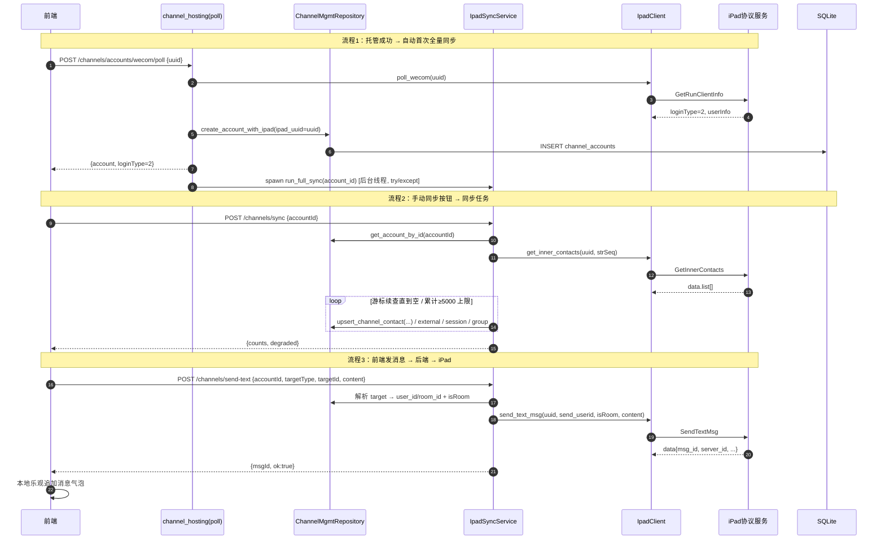

# Morphix 增量设计：渠道会话 + 客户管理（iPad 协议同步与发消息）

> 文档类型：系统设计 + 任务拆解（增量，基于 `docs/ipad-sync-prd.md` 与主理人已拍板决策）
> 作者：高见远（架构师）
> 技术栈：后端 Python / FastAPI / SQLite（复用 `ipad_client` + `repositories` + `schema`）；前端 React + Vite + TS（复用现有页面骨架）
> 协议 base：`http://47.94.7.218:9912`，路径拼 `/wxwork/<Action>`（与 `ipad_client._base_url()` 一致）

---

## 1. 实现方案 + 框架选型

### 1.1 技术难点与选型

| 难点 | 选型 / 方案 |
| --- | --- |
| iPad 协议接入（真实为主、mock 兜底） | **沿用现有 `ipad_client.py` 模式**：新增 6 个协议调用（`_post` + `_norm`，失败抛 `IPadProtocolError`）。不新建 HTTP 客户端，`httpx` 已具备。 |
| 同步编排（拉取→去重落库→游标分页→互斥） | **新增 `app/ipad_sync.py`** 作为同步服务层，封装 `run_full_sync(account_id)`；仓储 upsert 复用 `ChannelMgmtRepository`。 |
| 后端路由暴露 | **新增 `app/routers/ipad_sync.py`**（前缀 `/channels`，由 `api_router` 挂载），与既有 `channel_mgmt.py` 同级；不在 `channel_hosting.py` 里堆接口。 |
| 自动触发同步 | 在 `channel_hosting.poll` 中 `loginType==2` 落库后，**后台线程** `spawn run_full_sync(account_id)`（daemon，`try/except` 吞掉异常，保证托管不崩）。 |
| 单账号同步串行互斥 | 进程内 `dict` + `threading.Lock`（`_sync_locks`），重复触发返回 `{skipped:true}`。 |
| 群实体隔离 | 新建 `channel_groups` + `channel_group_members`，**不污染 `channel_contacts`**（决策 #1）。 |
| 前端接线 | 复用 `channelsApi` 客户端 + `SessionChatPanel`/`ChannelSessions`/`ChannelContacts` 现有骨架；发消息替换 `handleSend` stub。 |
| 发送目标解析 | 后端 `send-text` 接口接受 `{targetType: contact|room|session, targetId}`，由后端从 DB 反查 `user_id`/`room_id` 与 `isRoom`，前端无需感知 iPad 原始 id（决策 #6）。 |

### 1.2 架构模式

- 后端分层：`Router（参数校验/错误码） → Service（ipad_sync 编排） → Client（ipad_client 协议） → Repository（SQLite 落库）`。
- 沿用既有「裸数据 / 无信封」响应风格（与 `channel_mgmt` 一致），错误用 `JSONResponse(status_code=…)`。
- 前端：`api/client.ts` 统一封装 + `react` hooks 调接口；沿用 `toast`/`errText` 错误提示。

### 1.3 建表机制确认（重要）

本项目**主库建表不走 Alembic**（Alembic 仅服务契约库 `morphix_contract.db`）。主库表结构在 `app/schema.py` 中：
- 新表：在 `SCHEMA_SQL` 常量里追加 `CREATE TABLE IF NOT EXISTS`（随 `init_schema()` 在 `main.py` 启动时执行）。
- 旧表加列：在 `migrate_schema()` 中用 `PRAGMA table_info` + `ALTER TABLE ADD COLUMN`（幂等）。
- 本设计的新列（如 `channel_contacts.user_id`、`customer_profiles.tags`）一律走 `migrate_schema` 幂等 ALTER，保证旧库平滑升级。

---

## 2. 文件列表（新增 / 修改）

### 后端（Python）
| 路径 | 操作 | 说明 |
| --- | --- | --- |
| `project/backend/app/schema.py` | 修改 | `SCHEMA_SQL` 追加 `channel_groups` / `channel_group_members`；`migrate_schema()` 追加列（`channel_contacts`/`channel_sessions`/`customer_profiles`/`channel_accounts`）。 |
| `project/backend/app/repositories.py` | 修改 | 新增 `upsert_channel_contact` / `upsert_customer_profile_for_contact` / `upsert_channel_session` / `upsert_channel_group` / `upsert_channel_group_member` / `get_account_by_id` / `list_groups` / 同步状态读写。 |
| `project/backend/app/ipad_client.py` | 修改 | 新增 `get_inner_contacts` / `get_external_contacts` / `get_session_list` / `get_chatroom_members` / `get_room_user_list` / `send_text_msg`（沿用 `_post`/`_norm`/`IPadProtocolError`）。 |
| `project/backend/app/ipad_sync.py` | **新增** | 同步编排服务 `run_full_sync` + 游标分页 + 互斥锁/状态。 |
| `project/backend/app/routers/ipad_sync.py` | **新增** | `POST /channels/sync`、`POST /channels/send-text`、`GET /channels/groups`、`GET /channels/sync/status`。 |
| `project/backend/app/routers/channel_hosting.py` | 修改 | `poll` 落库成功后后台触发 `run_full_sync`。 |
| `project/backend/app/schemas.py` | 修改 | 新增 `SyncRequest` / `SendTextRequest` / `SyncResult` / `SendTextResult` / `GroupDTO` / `SyncStatusDTO`。 |

### 前端（TS/React）
| 路径 | 操作 | 说明 |
| --- | --- | --- |
| `src/api/client.ts` | 修改 | `channelsApi` 新增 `syncAccount` / `getSyncStatus` / `sendTextMessage` / `listGroups`。 |
| `src/types/channels.ts` | 修改 | 新增 `GroupDTO` / `SyncResultDTO` / `SendTextResultDTO` / `SyncStatusDTO`；`AccountDTO` 已有 `ipadUuid`/`hostStatus`（无需改）。 |
| `src/pages/Channels/ChannelSessions.tsx` | 修改 | 顶部加「同步」按钮（调用 `syncAccount`，同步后刷新会话列表）。 |
| `src/pages/Channels/sessions/SessionChatPanel.tsx` | 修改 | `handleSend` 替换为真实调用 `sendTextMessage`（乐观追加消息气泡）。 |
| `src/pages/Channels/ChannelContacts.tsx` | 修改 | 「客户群聊 / 内部群聊」tab 改调 `listGroups`；账号区加「同步」入口。 |
| `src/pages/Channels/contacts/ContactDetailPanel.tsx` | 修改 | 「发消息」按钮接真实 `sendTextMessage`（targetType=contact）。 |
| `src/pages/Customers/CustomerDetailDrawer.tsx` | 修改 | 「发消息」按钮接真实 `sendTextMessage`（targetType=contact，customer.id=contact.id）。 |

---

## 3. 数据结构 / 表结构

### 3.1 新增表

```sql
-- 客户群 / 内部群（不污染 channel_contacts，决策 #1）
CREATE TABLE IF NOT EXISTS channel_groups (
  id              TEXT PRIMARY KEY,            -- = "{account_id}:{room_id}"
  account_id      TEXT NOT NULL DEFAULT '',
  room_id         TEXT NOT NULL DEFAULT '',    -- iPad room_id（发送群消息用）
  group_type      TEXT NOT NULL DEFAULT 'customer_group', -- customer_group | internal_group
  nickname        TEXT NOT NULL DEFAULT '',
  total           INTEGER NOT NULL DEFAULT 0,  -- 群人数
  room_url        TEXT NOT NULL DEFAULT '',
  notice_content  TEXT NOT NULL DEFAULT '',
  create_time     TEXT NOT NULL DEFAULT '',
  update_time     TEXT NOT NULL DEFAULT '',
  extra_json      TEXT NOT NULL DEFAULT '{}',
  created_at      TEXT NOT NULL DEFAULT CURRENT_TIMESTAMP,
  updated_at      TEXT NOT NULL DEFAULT CURRENT_TIMESTAMP
);
CREATE INDEX IF NOT EXISTS idx_channel_groups_account ON channel_groups(account_id, group_type);

-- 群成员关系（P0 建表、P1 由 GetRoomUserList 填充，决策 #1）
CREATE TABLE IF NOT EXISTS channel_group_members (
  id              TEXT PRIMARY KEY,            -- = "{group_id}:{uin or user_id}"
  group_id        TEXT NOT NULL DEFAULT '',
  uin             TEXT NOT NULL DEFAULT '',
  user_id         TEXT NOT NULL DEFAULT '',
  nickname        TEXT NOT NULL DEFAULT '',
  realname        TEXT NOT NULL DEFAULT '',
  avatar          TEXT NOT NULL DEFAULT '',
  room_nickname   TEXT NOT NULL DEFAULT '',
  sex             INTEGER NOT NULL DEFAULT 0,
  mobile          TEXT NOT NULL DEFAULT '',
  join_time       TEXT NOT NULL DEFAULT '',
  created_at      TEXT NOT NULL DEFAULT CURRENT_TIMESTAMP
);
CREATE INDEX IF NOT EXISTS idx_channel_group_members_group ON channel_group_members(group_id);
```

### 3.2 既有表新增字段（幂等 ALTER，写入 `migrate_schema`）

**`channel_contacts`**（P0-1/P0-2 落库所需）
- `user_id TEXT NOT NULL DEFAULT ''` —— iPad `user_id`，自然键 `(account_id, user_id)` 一部分；发送好友消息时反查用。
- `label_ids TEXT NOT NULL DEFAULT '[]'` —— 外部联系人 `labelid[]` 原样镜像（JSON 数组）。
- `raw_status TEXT NOT NULL DEFAULT ''` —— iPad 外部联系人 status（0/1/2049/其他），与 `status`(online/offline) 解耦。
- `extra_json TEXT NOT NULL DEFAULT '{}'` —— `SelfAttrInfo` / `corpid` / `partyid` / `english_name` / `position` 等冗余字段。

**`channel_sessions`**（P0-3）
- `remote_session_id TEXT NOT NULL DEFAULT ''` —— iPad 原始 `sessionid`（发送会话消息反查用）。
- `msg_type INTEGER NOT NULL DEFAULT 0` —— iPad `msgtype`（0 好友 / 1 群聊 / 3 应用 / 6 开放平台）；发送时据此判定 `isRoom` 与禁用应用（决策 #6）。
- `begin_msg_seq TEXT NOT NULL DEFAULT ''`。

**`customer_profiles`**（决策 #2）
- `tags TEXT NOT NULL DEFAULT '[]'` —— 外部联系人 `labelid[]` 原样存入（JSON 数组）；P1 再做 labelid→tag 映射。

**`channel_accounts`**（同步状态呈现）
- `sync_status TEXT NOT NULL DEFAULT ''` —— `'' | syncing | success | degraded | error`。
- `last_sync_at TEXT NOT NULL DEFAULT ''`。

### 3.3 类图 / 表关系

```mermaid
classDiagram
    class channel_accounts {
        +TEXT id PK
        +TEXT ipad_uuid
        +TEXT host_status
        +TEXT sync_status
        +TEXT last_sync_at
    }
    class channel_contacts {
        +TEXT id PK
        +TEXT account_id
        +TEXT user_id
        +TEXT type
        +TEXT label_ids
        +TEXT raw_status
        +TEXT extra_json
    }
    class customer_profiles {
        +TEXT id PK
        +TEXT contact_id
        +TEXT tags
    }
    class channel_sessions {
        +TEXT id PK
        +TEXT account_id
        +TEXT remote_session_id
        +INTEGER msg_type
        +TEXT session_type
    }
    class channel_groups {
        +TEXT id PK
        +TEXT account_id
        +TEXT room_id
        +TEXT group_type
        +TEXT nickname
        +INTEGER total
        +TEXT room_url
    }
    class channel_group_members {
        +TEXT id PK
        +TEXT group_id
        +TEXT uin
        +TEXT user_id
    }
    class IpadClient {
        +get_inner_contacts()
        +get_external_contacts()
        +get_session_list()
        +get_chatroom_members()
        +get_room_user_list()
        +send_text_msg()
    }
    class IpadSyncService {
        +run_full_sync(account_id)
        +_sync_contacts()
        +_sync_sessions()
        +_sync_groups()
    }
    class ChannelMgmtRepository {
        +upsert_channel_contact()
        +upsert_channel_session()
        +upsert_channel_group()
        +list_groups()
    }
    class IpadSyncRouter {
        +POST /channels/sync
        +POST /channels/send-text
        +GET /channels/groups
        +GET /channels/sync/status
    }
    IpadSyncService --> IpadClient : 调用协议
    IpadSyncService --> ChannelMgmtRepository : 落库
    IpadSyncRouter --> IpadSyncService
    channel_contacts "1" --> "1" customer_profiles : contact_id
    channel_groups ||--o{ channel_group_members : group_id
    channel_accounts ||--o{ channel_contacts : account_id
    channel_accounts ||--o{ channel_sessions : account_id
    channel_accounts ||--o{ channel_groups : account_id
```

> 自然键（upsert 去重）：contacts `(account_id, user_id)`、groups `(account_id, room_id)`、group_members `(group_id, uin|user_id)`、sessions `(account_id, remote_session_id)`。所有 `id` 统一用 `"{account_id}:{原始id}"` 拼接，既唯一又便于反查。

---

## 4. 程序调用流程（时序图）



> 应用类会话（`msg_type==3`）在前端禁用发送；后端若收到 `targetType=session` 且解析为应用会话，返回 `400`。

---

## 5. 任务列表（有序 / 依赖 / 按实现顺序）

> 聚焦 **P0 全部**（T01–T03）；P1/P2 列于 T04/T05 作为后续任务。每组任务 ≥3 个文件、按功能模块分组、依赖尽量仅挂 T01。

### T01 · 数据层与协议层基础设施  【P0】 优先级 P0
- **源文件**：`app/schema.py`、`app/repositories.py`、`app/ipad_client.py`
- **依赖**：无
- **内容**：
  1. `schema.py`：`SCHEMA_SQL` 追加 `channel_groups`/`channel_group_members`；`migrate_schema()` 幂等 ALTER 新增 `channel_contacts.user_id/label_ids/raw_status/extra_json`、`channel_sessions.remote_session_id/msg_type/begin_msg_seq`、`customer_profiles.tags`、`channel_accounts.sync_status/last_sync_at`。
  2. `ipad_client.py`：新增 6 个协议调用（沿用 `_post`/`_norm`，失败抛 `IPadProtocolError`）。
  3. `repositories.py`：新增 upsert（`upsert_channel_contact`/`upsert_customer_profile_for_contact`/`upsert_channel_session`/`upsert_channel_group`/`upsert_channel_group_member`）、`get_account_by_id`、`list_groups`、同步状态读写。

### T02 · 同步服务与后端路由  【P0】 优先级 P0
- **源文件**：`app/ipad_sync.py`（新增）、`app/routers/ipad_sync.py`（新增）、`app/routers/channel_hosting.py`、`app/schemas.py`
- **依赖**：T01
- **内容**：
  1. `ipad_sync.py`：`run_full_sync(account_id)` 编排（四路拉取 + 游标分页 + 5000 上限 + 进程内互斥锁/状态）；按决策 #9 过滤 `is_department=1`；按决策 #2 将 `labelid[]` 写 `customer_profiles.tags`；`auto` 模式协议失败返回 `degraded` 不崩（决策 #7）。
  2. `routers/ipad_sync.py`：`POST /channels/sync`、`POST /channels/send-text`（后端反查 `user_id/room_id` + `isRoom`，应用会话 400）、`GET /channels/groups`、`GET /channels/sync/status`。
  3. `channel_hosting.py`：`poll` 落库成功后后台线程触发 `run_full_sync`。
  4. `schemas.py`：新增对应请求/响应模型。

### T03 · 前端接线（同步按钮 + 真实发送）  【P0】 优先级 P0
- **源文件**：`src/api/client.ts`、`src/types/channels.ts`、`src/pages/Channels/ChannelSessions.tsx`、`src/pages/Channels/sessions/SessionChatPanel.tsx`、`src/pages/Channels/ChannelContacts.tsx`、`src/pages/Channels/contacts/ContactDetailPanel.tsx`、`src/pages/Customers/CustomerDetailDrawer.tsx`
- **依赖**：T01、T02
- **内容**：
  1. `client.ts`/`types.ts`：新增 `syncAccount`/`getSyncStatus`/`sendTextMessage`/`listGroups` 与 DTO。
  2. `ChannelSessions.tsx`：顶部「同步」按钮（调 `syncAccount` → 刷新会话列表；同步中禁用）。
  3. `SessionChatPanel.tsx`：`handleSend` 真实调用（乐观追加；`hosted` 或 `msgType==3` 禁用）。
  4. `ChannelContacts.tsx`：客户群/内部群 tab 接 `listGroups`（只读展示，P0）。
  5. `ContactDetailPanel.tsx` 与 `CustomerDetailDrawer.tsx`：「发消息」接 `sendTextMessage`（targetType=contact）。

### T04 · P1 群成员抽屉 + 标签映射 + 搜索添加  【P1】 优先级 P1
- **源文件**：`app/ipad_client.py`（已含 `get_room_user_list`）、`app/routers/ipad_sync.py`、`src/pages/Channels/contacts/GroupDetailDrawer.tsx`（新增）、`src/pages/Channels/ChannelContacts.tsx`
- **依赖**：T01、T03
- **内容**：`GetRoomUserList` 填充 `channel_group_members`；新增群成员抽屉（昵称/真实名/头像/群昵称/性别/手机/加入时间/群公告）；`labelid→tag` 映射写入 `customer_tag_relations`；`SearchContact` + 搜索添加外部联系人弹窗。

### T05 · P2 消息历史回填  【P2】 优先级 P2
- **源文件**：`app/ipad_sync.py`、`app/repositories.py`、`src/pages/Channels/sessions/SessionChatPanel.tsx`
- **依赖**：T01
- **内容**：`GetMsg` 按 `server_id` 游标回填 `messages`（`conversation_id=session_id`）；已读/未读回写；富消息扩展。

---

## 6. 依赖包列表

**无新增依赖。**
- 后端 `httpx==0.28.1`（已安装，现有 `ipad_client` 已用）、`fastapi`/`pydantic`（已有）。
- 前端 `lucide-react`/`react`/`react-router-dom`（已有），无新 UI 库（遵循 PRD：不引入 MUI）。

---

## 7. 共享知识（跨文件约定）

1. **`ipad_uuid` 取值约定**：所有同步/发送均从 `channel_accounts.ipad_uuid` 取真实协议 uuid；账号范围 = `ipad_uuid` 非空（决策 #8，见下方「待明确」关于 `protocol` 字段说明）。
2. **Mock / 降级约定**：沿用 `IPAD_PROTOCOL_MODE`（`auto`/`real`/`mock`）。新协议调用失败统一抛 `IPadProtocolError`：
   - `real` 模式 → 路由返回 **502**（与现有托管接口一致）。
   - `auto` 模式 → 同步任务返回 `{degraded:true, counts:0}`（不崩、不补 mock 联系人数据，决策 #7）；发送接口返回 **502 友好提示**（前端 toast）。
   - 本期 **不补 mock 联系人/群数据**。
3. **错误码约定**：
   - `400` 参数缺失 / 应用会话禁止发送 / target 解析失败；
   - `404` 账号不存在或非 iPad 托管（`ipad_uuid` 为空）；
   - `409` 该账号正在同步中（`{skipped:true}`）；
   - `502` iPad 协议服务不可用（消息：`iPad 协议服务不可用（{action}）`）。
4. **分页游标约定**：
   - `GetInnerContacts`：`strSeq`（字符串游标，初值 `''`）；
   - `GetExternalContacts`：`seq`（整数游标，初值 `0`）；
   - `GetSessionList` / `GetChatroomMembers`：`star_index`（整数游标，初值 `0`）；
   - 每页 `limit` 默认 `100`；**游标续查直到返回空数组，或单账号单次同步累计 ≥ 5000 条时强制停止**（决策 #4）。
5. **发送目标解析约定**（后端 `send-text`）：
   - `targetType=contact` → 查 `channel_contacts.user_id`，`isRoom=false`；
   - `targetType=room` → 查 `channel_groups.room_id`，`isRoom=true`；
   - `targetType=session` → 查 `channel_sessions`：`msg_type==1` 取 `remote_session_id`+`isRoom=true`；否则取 `contact_id`→`user_id`+`isRoom=false`；`msg_type==3` → `400`；
   - `kf_id` 默认 `0`。
6. **互斥与状态约定**：`ipad_sync._sync_locks`（account_id 级）保证单账号同步串行；状态写入 `channel_accounts.sync_status` + 进程内 `_sync_status`（重启后失效，可接受）。
7. **实体 id 约定**：所有同步实体 `id = "{account_id}:{iPad原始id}"`，便于反查与去重 upsert。

---

## 8. 待明确事项（仅列无法用决策覆盖、需工程师/用户判断的点）

1. **客户群 vs 内部群区分**：`GetChatroomMembers` 返回字段未明确区分「客户群」与「内部群」。P0 建议统一以 `group_type='customer_group'` 落库并在「客户群聊」tab 展示，「内部群聊」tab 暂复用同一数据源或置空，待 P1 结合 `GetSessionList`/`GetInnerContacts` 的部门/群关系细化。**需 PM 确认是否接受 P0 统一处理。**
2. **`protocol` 字段取值不一致**（已在共享知识 #1 兜底，但需知会）：现有 `create_account_with_ipad` 落 `protocol='ipad'`，而决策 #8 文字写「`protocol=='wecom'`」。本设计以 **`ipad_uuid` 非空** 作为权威筛选条件（与代码实际一致），不依赖 `protocol` 值。若后续希望用 `protocol` 过滤，需先统一托管落库值（建议统一为 `wecom` 或新增 `ipad` 枚举）。

> 其余所有点（标签映射 P1、群成员 P1、消息历史 P2、部门树 P1、搜索添加 P1）均已在决策中明确分期，无遗留歧义。
