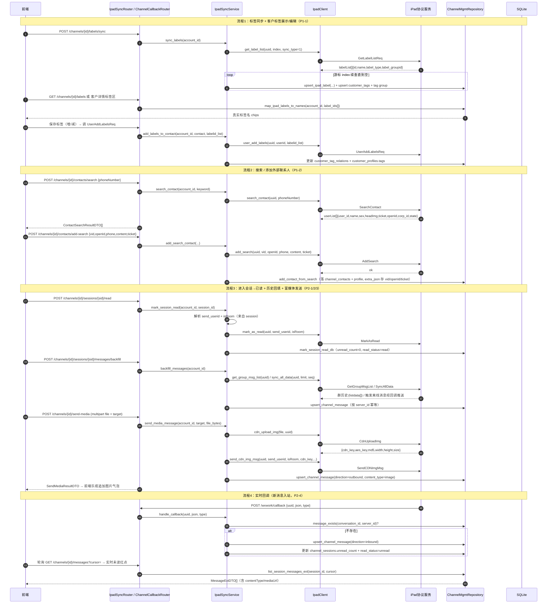
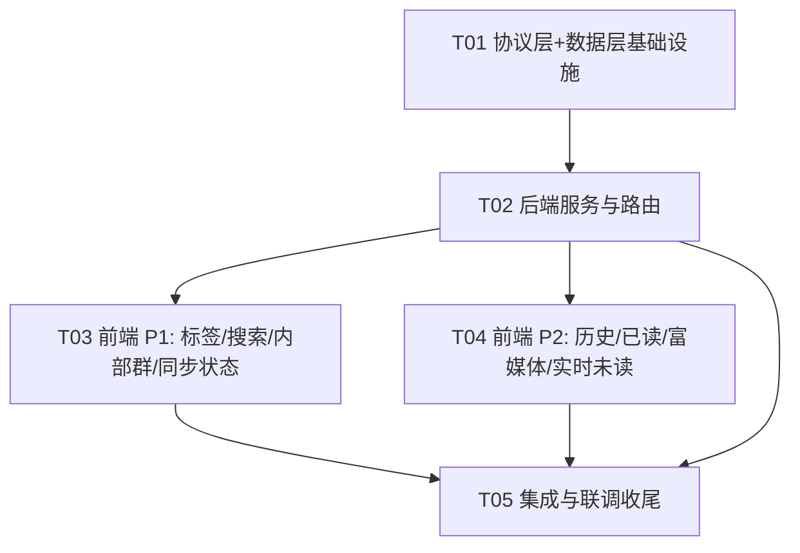

# Morphix 增量架构设计：渠道会话 + 客户管理（P1 + P2，iPad 协议同步增量）

> 文档类型：**增量系统设计与任务拆解**（基于 P0 已实现的 iPad 协议同步层 + PM 的 `ipad-sync-p1p2-prd.md`）
> 作者：高见远（架构师 / Bob）
> 技术栈（沿用 P0）：后端 Python / FastAPI / SQLite（`ipad_client` + `repositories` + `schema`）；前端 React + Vite + TS（`channelsApi` + 既有页面骨架）
> 协议 base：`http://47.94.7.218:9912`，路径拼 `/wxwork/<Action>`（与 `ipad_client._base_url()` 一致）
> 关联文档：`docs/ipad-sync-design.md`（P0 设计）、`docs/ipad-sync-p1p2-prd.md`（P1+P2 PRD）

---

## 1. 实现方案 + 框架选型

### 1.1 技术难点与选型

| 难点 | 选型 / 方案 |
| --- | --- |
| iPad 协议扩展（P1/P2 共 13 个新 Action） | **沿用现有 `ipad_client.py` 模式**：每个 Action 一个函数，复用 `_post`/`_norm`/`IPadProtocolError`，**不新建 HTTP 客户端、不补 mock 分支**（决策 #7，与 P0 一致）。 |
| 标签体系打通（iPad labelid ↔ Morphix 标签） | 新增 `ipad_label_map` 映射表（幂等键 `(account_id, ipad_label_id)`），**同时**把每个 iPad 标签落为 Morphix `customer_tags` 行 + 每账号一个 iPad 标签组，使既有 `CustomerTagModal`、客户列表标签筛选可直接复用。 |
| 消息历史回填与实时入站 | **统一复用 `messages` 表**（`conversation_id = session_id`，决策 #6）；扩展列承载 `server_id/msg_type/direction/content_type/media_*`；回填走 `GetGroupMsgList` + `SyncAllData`（触发回调），实时走 `POST /wxwork/callback`。 |
| 富媒体发送 | **后端代理 CDN 上传**（前端传文件给后端，后端 `multipart` 转发 iPad CDN 拿 `cdn_key` 等，再调 `SendCDNImgMsg/FileMsg`），避免把 `uuid`/密钥暴露给前端（采纳 PRD §5 #4 建议）。 |
| 实时回调地址 | 新增配置 `IPAD_CALLBACK_PUBLIC_URL`；生产配置公网可达地址并在托管成功后 `SetCallbackUrl` 注册；**未配置时降级为「仅手动同步」**（PRD §5 #5），不阻塞。 |
| 前端接线 | 复用 `channelsApi` + `SessionChatPanel`/`ChannelContacts`/`CustomerDetailDrawer` 既有骨架，仅在既有位置追加入口/字段，新增组件：搜索添加弹窗、富媒体发送逻辑。 |

### 1.2 架构模式（沿用 P0）

- 后端分层不变：`Router（参数校验/错误码） → Service（ipad_sync 编排） → Client（ipad_client 协议） → Repository（SQLite 落库）`。
- 新增一个独立回调路由 `routers/channel_callback.py`（前缀 `/wxwork`，**不经 `/api`**），由 iPad 服务公网直推，解析 `{uuid, json, type}`。
- 沿用「裸数据 / 无信封」响应风格（与 `channel_mgmt`/`ipad_sync` 一致）；错误用 `JSONResponse(status_code=…)`。
- 前端：`api/client.ts` 统一封装 + hooks 调接口；沿用 `toast`/`errText`。

### 1.3 建表 / 改表机制（重要，沿用 P0 §1.3）

主库建表**不走 Alembic**。新表在 `app/schema.py` 的 `SCHEMA_SQL` 追加 `CREATE TABLE IF NOT EXISTS`；旧表加列在 `migrate_schema()` 用 `PRAGMA table_info` + `ALTER TABLE ADD COLUMN`（幂等）。本设计的新列（如 `messages.server_id`、`channel_accounts.callback_url`、`ipad_label_map` 整表）一律走此机制，保证旧库平滑升级。

---

## 2. 文件列表（新增 / 修改）

### 后端（Python，均位于 `project/backend/app/`）

| 路径 | 操作 | 说明 |
| --- | --- | --- |
| `app/schema.py` | 修改 | `SCHEMA_SQL` 追加 `ipad_label_map`；`migrate_schema()` 追加列：`messages`(server_id/msg_type/sender_id/direction/content_type/media_url/media_meta/is_read/channel_account_id)、`channel_accounts`(callback_url/callback_type)。 |
| `app/ipad_client.py` | 修改 | 新增 13 个协议函数：`get_label_list` / `user_add_labels` / `search_contact` / `add_search` / `add_wx_user` / `agree_user` / `get_group_msg_list` / `sync_all_data` / `mark_as_read` / `cdn_upload_img` / `cdn_upload_file` / `send_cdn_img_msg` / `send_cdn_file_msg` / `set_callback_url`。 |
| `app/repositories.py` | 修改 | 新增：`upsert_ipad_label` / `get_ipad_labels` / `map_ipad_labels_to_names` / `upsert_channel_message` / `list_session_messages_ext` / `message_exists` / `set_account_callback` / `add_contact_from_search` / `mark_session_read_db` / `list_labels_for_contact`。 |
| `app/ipad_sync.py` | 修改 | 新增：`sync_labels` / `search_contact` / `add_search_contact` / `mark_session_read` / `backfill_messages` / `send_media_message` / `handle_callback` / `register_callback`。 |
| `app/routers/ipad_sync.py` | 修改 | 新增端点（见 §4）：labels 同步/查询、contacts 搜索/添加、session 已读、消息历史回填、富媒体发送、扩展消息列表。 |
| `app/routers/channel_callback.py` | **新增** | `POST /wxwork/callback` 解析 iPad 推送 → `ipad_sync.handle_callback`。 |
| `app/routers/channel_hosting.py` | 修改 | 托管落库 + 自动同步成功后，best-effort 调 `ipad_sync.register_callback`（仅当 `IPAD_CALLBACK_PUBLIC_URL` 已配置）。 |
| `app/schemas.py` | 修改 | 新增：`LabelDTO` / `LabelSyncResultDTO` / `ContactSearchResultDTO` / `AddSearchRequest` / `MarkReadRequest` / `SendMediaRequest` / `MessageExtDTO` / `BackfillResultDTO` / `SendMediaResultDTO` / `CallbackPayloadDTO`。 |
| `app/config.py` | 修改 | 新增 `ipad_callback_public_url`（`IPAD_CALLBACK_PUBLIC_URL`，缺省空串）、`ipad_callback_type`（`HTTP`/`RABBITMQ`）。 |

### 前端（TS/React，均位于 `src/`）

| 路径 | 操作 | 说明 |
| --- | --- | --- |
| `src/types/channels.ts` | 修改 | 新增 `LabelDTO` / `ContactSearchResultDTO` / `MessageExtDTO`（扩展 `MessageDTO`，含 serverId/msgType/direction/contentType/mediaUrl/mediaMeta/isRead）；`SyncStatusDTO` 增加 `message`。 |
| `src/api/client.ts` | 修改 | `channelsApi` 新增 `syncLabels` / `listLabels` / `searchContact` / `addSearchContact` / `markSessionRead` / `backfillSessionMessages` / `getSessionMessages` / `sendMediaMessage`。 |
| `src/pages/Customers/CustomerDetailDrawer.tsx` | 修改 | 「iPad 标签」区改为经 `ipad_label_map` 显示**真实标签名**（不再显示原始 labelid）；标签编辑走 iPad 标签（保存时调 `UserAddLabelsReq` + 更新 `customer_tag_relations`）。 |
| `src/pages/Channels/ChannelContacts.tsx` | 修改 | 顶部「搜索添加」入口 + 搜索结果弹窗（`SearchContact`+`AddSearch`/`AddWxUser`）；内部群聊 tab 空态说明；同步状态角标/降级 toast/首次同步空态引导。 |
| `src/pages/Channels/contacts/ContactDetailPanel.tsx` | 修改 | 复用标签展示/编辑（与 CustomerDetailDrawer 一致）。 |
| `src/pages/Channels/sessions/SessionChatPanel.tsx` | 修改 | 进入会话触发「已读 + 历史回填」；图片/文件按钮 + 后端代理上传发送 + 乐观追加图片/文件气泡；按 `contentType` 渲染气泡；实时未读刷新。 |
| `src/pages/Channels/ChannelSessions.tsx` | 修改 | 会话列表未读角标随已读/回调实时清零；可选轻量未读提醒。 |
| `src/pages/Channels/ChannelAccounts.tsx` | 修改 | 账号卡片同步状态角标（绿=成功/灰=未同步/黄=同步中/红=失败）+ 降级提示。 |
| `src/pages/Channels/contacts/SearchAddContactModal.tsx` | **新增** | 搜索添加外部联系人弹窗（输入框 + 搜索按钮 + 验证语 + 结果列表 + 发送申请 + 加入联系人）。 |

---

## 3. 数据结构 / 表结构

### 3.1 新增 / 修改表

```sql
-- iPad 标签 ↔ Morphix 标签 映射（幂等键 account_id + ipad_label_id）
CREATE TABLE IF NOT EXISTS ipad_label_map (
  account_id      TEXT NOT NULL DEFAULT '',
  ipad_label_id   TEXT NOT NULL DEFAULT '',
  label_name      TEXT NOT NULL DEFAULT '',
  label_type      INTEGER NOT NULL DEFAULT 0,
  label_group_id  TEXT NOT NULL DEFAULT '',
  tag_id          TEXT NOT NULL DEFAULT '',   -- 对应 customer_tags.id
  sync_type       INTEGER NOT NULL DEFAULT 0, -- 1=企业标签 2=个人标签
  PRIMARY KEY (account_id, ipad_label_id)
);
CREATE INDEX IF NOT EXISTS idx_ipad_label_map_account ON ipad_label_map(account_id);

-- channel_accounts 增加回调配置列（migrate_schema ALTER）
ALTER TABLE channel_accounts ADD COLUMN callback_url TEXT NOT NULL DEFAULT '';
ALTER TABLE channel_accounts ADD COLUMN callback_type TEXT NOT NULL DEFAULT '';

-- messages 扩展（migrate_schema ALTER，全部带默认，不破坏既有 conversation 域）
ALTER TABLE messages ADD COLUMN server_id          TEXT NOT NULL DEFAULT '';
ALTER TABLE messages ADD COLUMN msg_type           INTEGER NOT NULL DEFAULT 0;  -- 0文本 1图片 2文件 3应用 ...
ALTER TABLE messages ADD COLUMN sender_id          TEXT NOT NULL DEFAULT '';   -- iPad user_id/room_id
ALTER TABLE messages ADD COLUMN direction          TEXT NOT NULL DEFAULT 'inbound'; -- inbound|outbound
ALTER TABLE messages ADD COLUMN content_type       TEXT NOT NULL DEFAULT 'text';   -- text|image|file
ALTER TABLE messages ADD COLUMN media_url          TEXT NOT NULL DEFAULT '';
ALTER TABLE messages ADD COLUMN media_meta         TEXT NOT NULL DEFAULT '{}';  -- {width,height,size,md5,fileName,...}
ALTER TABLE messages ADD COLUMN is_read            INTEGER NOT NULL DEFAULT 0;
ALTER TABLE messages ADD COLUMN channel_account_id TEXT NOT NULL DEFAULT '';
CREATE INDEX IF NOT EXISTS idx_messages_account ON messages(channel_account_id, conversation_id, created_at);
CREATE INDEX IF NOT EXISTS idx_messages_server ON messages(conversation_id, server_id);
```

> **复用既有表**：`customer_tags` / `customer_tag_groups` / `customer_tag_relations`（承载 iPad 标签的 Morphix 侧呈现，使既有标签筛选/编辑可用）、`customer_profiles.tags`（继续存 iPad `labelid[]` 原样镜像）、`channel_contacts`（`extra_json` 存搜索结果带来的 `vid/openId/ticket`，无需新增列）、`channel_sessions`（`unread_count`/`read_status` 由已读回写）、`channel_groups`（`group_type` 字段已预留，P1-3 兼容方案复用）。

### 3.2 类图 / 表关系

```mermaid
classDiagram
    class channel_accounts {
        +TEXT id PK
        +TEXT ipad_uuid
        +TEXT sync_status
        +TEXT last_sync_at
        +TEXT callback_url
        +TEXT callback_type
    }
    class channel_contacts {
        +TEXT id PK
        +TEXT account_id
        +TEXT user_id
        +TEXT type
        +TEXT label_ids
        +TEXT extra_json
    }
    class customer_profiles {
        +TEXT id PK
        +TEXT contact_id
        +TEXT tags
    }
    class messages {
        +TEXT id PK
        +TEXT conversation_id
        +TEXT sender_type
        +TEXT content
        +TEXT server_id
        +INTEGER msg_type
        +TEXT sender_id
        +TEXT direction
        +TEXT content_type
        +TEXT media_url
        +TEXT media_meta
        +INTEGER is_read
        +TEXT channel_account_id
    }
    class ipad_label_map {
        +TEXT account_id PK
        +TEXT ipad_label_id PK
        +TEXT label_name
        +TEXT label_group_id
        +TEXT tag_id
        +INTEGER sync_type
    }
    class customer_tags {
        +TEXT id PK
        +TEXT group_id
        +TEXT name
    }
    class customer_tag_relations {
        +TEXT customer_id PK
        +TEXT tag_id PK
    }
    class channel_sessions {
        +TEXT id PK
        +TEXT account_id
        +TEXT remote_session_id
        +INTEGER unread_count
        +TEXT read_status
    }
    class channel_groups {
        +TEXT id PK
        +TEXT account_id
        +TEXT group_type
    }
    class IpadClient {
        +get_label_list(uuid, index, sync_type)
        +user_add_labels(uuid, userid, labelid_list)
        +search_contact(uuid, phoneNumber)
        +add_search(uuid, vid, openId, phone, content, ticket)
        +add_wx_user(uuid, vid, content)
        +agree_user(uuid, corpid, vid)
        +get_group_msg_list(uuid)
        +sync_all_data(uuid, limit, seq)
        +mark_as_read(uuid, send_userid, isRoom)
        +cdn_upload_img(file, uuid)
        +cdn_upload_file(file, uuid)
        +send_cdn_img_msg(...)
        +send_cdn_file_msg(...)
        +set_callback_url(uuid, url, callbackType)
    }
    class IpadSyncService {
        +sync_labels(account_id)
        +search_contact(account_id, keyword)
        +add_search_contact(...)
        +mark_session_read(account_id, session_id)
        +backfill_messages(account_id)
        +send_media_message(account_id, target, file)
        +handle_callback(uuid, json, type)
        +register_callback(account_id)
    }
    class ChannelMgmtRepository {
        +upsert_ipad_label()
        +get_ipad_labels(account_id)
        +map_ipad_labels_to_names(account_id, label_ids)
        +upsert_channel_message(msg)
        +list_session_messages_ext(session_id, cursor)
        +message_exists(conversation_id, server_id)
        +set_account_callback(account_id, url, type)
        +add_contact_from_search(account_id, item)
        +mark_session_read_db(session_id)
    }
    class IpadSyncRouter {
        +POST /channels/{id}/labels/sync
        +GET /channels/{id}/labels
        +POST /channels/{id}/contacts/search
        +POST /channels/{id}/contacts/add-search
        +POST /channels/{id}/sessions/{sid}/read
        +POST /channels/{id}/sessions/{sid}/messages/backfill
        +POST /channels/{id}/send-media
        +GET /channels/{id}/messages
    }
    class ChannelCallbackRouter {
        +POST /wxwork/callback
    }
    IpadSyncService --> IpadClient : 调用协议
    IpadSyncService --> ChannelMgmtRepository : 落库
    IpadSyncRouter --> IpadSyncService
    ChannelCallbackRouter --> IpadSyncService
    channel_accounts ||--o{ channel_contacts : account_id
    channel_accounts ||--o{ channel_sessions : account_id
    channel_accounts ||--o{ channel_groups : account_id
    channel_accounts ||--o{ ipad_label_map : account_id
    channel_accounts ||--o{ messages : channel_account_id
    channel_sessions ||--o{ messages : conversation_id
    ipad_label_map --> customer_tags : tag_id
    customer_profiles "1" --> "0..*" customer_tag_relations : id
    customer_tag_relations --> customer_tags : tag_id
    channel_contacts "1" --> "1" customer_profiles : contact_id
```

---

## 4. 程序调用流程（时序图）



> 应用类会话（`msg_type==3`）、`hosted` 会话沿用 P0 禁用发送逻辑；富媒体发送同样受此约束。

---

## 5. 待明确事项 / 假设（架构层面拍板，部分需主理人确认）

| # | 事项 | 本设计决策 / 假设 |
| --- | --- | --- |
| 1 | 内部群区分（PRD §5 #1） | **接受兼容方案**：内部群聊 tab 渲染空态说明（「当前协议不支持区分内部群」），`group_type` 字段已预留；不新建数据通道、不产生脏数据。若后续协议支持可无缝切换。 |
| 2 | `GetGroupMsgList` 的 room 参数（PRD §5 #2） | 文档示例仅 `{uuid}`，疑似返回当前/最近群。设计 `backfill_messages` 先按 `GetGroupMsgList`（全局）回填，若实际支持 `room_id` 参数则逐群回填（实现期由工程师用真实服务验证并调整入参）。 |
| 3 | 消息回填游标 / 上限（PRD §5 #3） | `conversation_id = session_id`（决策 #6）；回填游标取该会话最大 `server_id/seq`；单会话默认回填上限 **1000 条**，前端分页步长 20。可按需调参。 |
| 4 | 富媒体 CDN 上传方式（PRD §5 #4） | **后端代理上传**（前端传文件 → 后端 `multipart` 转发 iPad CDN → 再发送），不暴露 `uuid`/密钥。`CdnUploadFile` 返回的 `fileid` 作为 `SendCDNFileMsg` 的 `cdnKey`（**工程期需联调确认映射**）。 |
| 5 | 本地回调地址（PRD §5 #5） | 新增 `IPAD_CALLBACK_PUBLIC_URL` 环境变量；**仅当配置**时才在托管成功后 `SetCallbackUrl` 注册；未配置则跳过注册、降级为「仅手动同步」，并在前端提示「实时消息需配置回调」。开发期内网穿透（ngrok/frp）暴露 `/wxwork/callback`。 |
| 6 | 1:1 与群是否共用 messages 表（PRD §5 #6） | **是**，统一落 `messages`（`conversation_id = session_id`），1:1 与群均适用（决策 #6）。 |
| 7 | P2-1 与 P2-4 强耦合（PRD §5 #7） | 接受降级：**回调可用时**回填 1:1 历史（经 `SyncAllData` 触发 + 回调收）；**回调不可用时**仅群聊历史（`GetGroupMsgList`）可用，1:1 历史暂缺。前端对缺历史会话显示空态引导而非报错。 |
| 8 | `sync_type` 范围（PRD §5 #8） | 默认**两类都同步**（企业=1、个人=2），`ipad_label_map.sync_type` 记录来源；若 PM 确认仅个人标签，实现时只传 `sync_type=2`。**需 PM 最终确认**。 |
| 9 | 标签编辑落库双写 | 给 iPad 联系人加/减标签时：**先**调 `UserAddLabelsReq`（真实 iPad 生效），**再**更新 Morphix `customer_tag_relations` + `customer_profiles.tags`；协议失败则回滚本地并 toast，避免两侧不一致。 |

---

## 6. 依赖包列表

**无新增第三方依赖。**
- 后端 `httpx==0.28.1`（multipart 上传用 `files=` 参数，已具备）、`fastapi`/`pydantic`（已有）。
- 前端 `lucide-react`/`react`/`react-router-dom`（已有），无新 UI 库（遵循 PRD：不引入 MUI）。

---

## 7. 任务列表（有序 / 依赖 / 按实现顺序，≤5 个任务）

> 遵循「首个任务=基础设施底座，其余任务尽量仅依赖 T01/T02，每组 ≥3 文件」原则。

### T01 · 协议层 + 数据层基础设施（P1+P2 底座） 【前置】 优先级 P0
- **源文件**：`app/schema.py`、`app/ipad_client.py`、`app/repositories.py`
- **依赖**：无
- **内容**：
  1. `schema.py`：`SCHEMA_SQL` 追加 `ipad_label_map`；`migrate_schema()` 幂等 ALTER `messages`（server_id/msg_type/sender_id/direction/content_type/media_url/media_meta/is_read/channel_account_id）与 `channel_accounts`（callback_url/callback_type）；补 `idx_messages_*` 索引。
  2. `ipad_client.py`：新增 13 个协议函数（§2 列表），沿用 `_post`/`_norm`/`IPadProtocolError`，**不补 mock**。
  3. `repositories.py`：新增 `upsert_ipad_label` / `get_ipad_labels` / `map_ipad_labels_to_names` / `upsert_channel_message` / `list_session_messages_ext` / `message_exists` / `set_account_callback` / `add_contact_from_search` / `mark_session_read_db` / `list_labels_for_contact`。

### T02 · 后端服务与路由（标签 / 搜索 / 已读 / 富媒体 / 历史回填 / 回调） 【核心后端】 优先级 P0
- **源文件**：`app/ipad_sync.py`、`app/routers/ipad_sync.py`、`app/routers/channel_callback.py`（新增）、`app/routers/channel_hosting.py`、`app/schemas.py`、`app/config.py`
- **依赖**：T01
- **内容**：
  1. `ipad_sync.py`：实现 `sync_labels` / `search_contact` / `add_search_contact` / `mark_session_read` / `backfill_messages`（GetGroupMsgList + SyncAllData 触发）/ `send_media_message`（CDN 代理）/ `handle_callback` / `register_callback`。
  2. `routers/ipad_sync.py`：新增 8 个端点（§4 流程 1-3）。
  3. `routers/channel_callback.py`：**新增** `POST /wxwork/callback`（解析 `{uuid,json,type}` → `handle_callback`，幂等按 server_id）。
  4. `channel_hosting.py`：自动同步成功后 best-effort `register_callback`（仅当 `IPAD_CALLBACK_PUBLIC_URL` 配置）。
  5. `schemas.py` / `config.py`：新增请求/响应模型与回调环境变量。

### T03 · 前端 P1（标签管理 + 搜索添加 + 内部群 + 同步状态） 优先级 P1
- **源文件**：`src/types/channels.ts`、`src/api/client.ts`、`src/pages/Customers/CustomerDetailDrawer.tsx`、`src/pages/Channels/ChannelContacts.tsx`、`src/pages/Channels/contacts/ContactDetailPanel.tsx`、`src/pages/Channels/contacts/SearchAddContactModal.tsx`（新增）、`src/pages/Channels/ChannelAccounts.tsx`
- **依赖**：T01、T02
- **内容**：
  1. `types/channels.ts` + `client.ts`：新增 `LabelDTO` / `ContactSearchResultDTO` / `MessageExtDTO` 与 `channelsApi.syncLabels` / `listLabels` / `searchContact` / `addSearchContact` / `markSessionRead` 等。
  2. `CustomerDetailDrawer.tsx` / `ContactDetailPanel.tsx`：标签区经 `ipad_label_map` 显示**真实标签名**；编辑标签走 iPad 标签（保存时双写 `UserAddLabelsReq` + `customer_tag_relations`）。
  3. `SearchAddContactModal.tsx`（新增）+ `ChannelContacts.tsx`：搜索添加入口/弹窗（`SearchContact` + `AddSearch`/`AddWxUser` + 加入联系人）；内部群聊 tab 空态说明；同步按钮 loading + 降级/成功/失败 toast 区分 + 首次同步空态引导。
  4. `ChannelAccounts.tsx`：账号卡片同步状态角标（绿/灰/黄/红）+ 降级提示。

### T04 · 前端 P2（消息历史 + 已读 + 富媒体发送 + 实时未读） 优先级 P2
- **源文件**：`src/pages/Channels/sessions/SessionChatPanel.tsx`、`src/pages/Channels/ChannelSessions.tsx`、`src/api/client.ts`、`src/types/channels.ts`
- **依赖**：T01、T02
- **内容**：
  1. `SessionChatPanel.tsx`：进入会话自动「已读 + 历史回填加载」（分页游标）；图片/文件按钮 + 后端代理上传发送 + 乐观追加图片缩略图/文件卡片气泡；按 `contentType` 渲染；轮询实时未读刷新。
  2. `ChannelSessions.tsx`：会话列表未读角标随已读/回调实时清零；可选轻量未读 toast。
  3. `MessageExtDTO` 扩展字段贯穿。

### T05 · 集成与联调收尾（回调注册 + 降级策略 + 端到端验证） 优先级 P2
- **源文件**：`app/routers/channel_callback.py`、`app/ipad_sync.py`（handle_callback 完善）、`app/config.py`、`docs/ipad-sync-p1p2-design.md`（补充联调清单）
- **依赖**：T02、T03、T04
- **内容**：
  1. 回调端点完整实现 + 幂等 + 失败兜底；`SetCallbackUrl` 注册（生产公网/开发期内网穿透降级）。
  2. P1/P2 端到端联调：标签同步→展示→编辑双写；搜索添加闭环；进入会话已读+历史+富媒体；回调实时未读；同步状态体验打磨全链路验证；降级（auto 模式/无回调）不崩。

---

## 8. 共享知识（跨文件约定，沿用并扩展 P0）

1. **`ipad_uuid` 取值约定**：所有同步/发送从 `channel_accounts.ipad_uuid` 取真实协议 uuid；账号范围 = `ipad_uuid` 非空（沿用 P0 共享知识 #1）。
2. **Mock / 降级约定（沿用 P0 #2）**：`IPAD_PROTOCOL_MODE`（`auto`/`real`/`mock`）；新协议函数失败统一抛 `IPadProtocolError`。`auto` 模式同步失败标记 `degraded` 不崩；`real` 标记 `error`。**本期仍不补 mock 联系人/群数据**。
3. **错误码约定（沿用并扩展）**：
   - `400` 参数缺失 / 应用会话禁发 / 目标解析失败 / 标签编辑协议失败；
   - `404` 账号不存在或未托管 iPad / 群不存在 / 会话不存在；
   - `409` 该账号正在同步中（`{skipped:true}`）；
   - `502` iPad 协议服务不可用（消息：`iPad 协议服务不可用（{action}）`）。
4. **分页游标约定（沿用 P0 #4）**：标签 `GetLabelListReq` 用 `index` 游标；其余沿用 `strSeq`/`seq`/`star_index`；每页 `limit` 默认 100。
5. **消息 id / 去重约定**：渠道消息 `id = chmsg-{conversation_id}:{server_id}`（server_id 缺失时用 uuid），`upsert_channel_message` 用 `INSERT OR REPLACE` 幂等；`message_exists(conversation_id, server_id)` 用于回调二次确认。
6. **发送目标解析约定（沿用 P0 #5）**：`targetType=contact|room|session` 后端反查 `user_id`/`room_id` + `isRoom`；`msg_type==3` → 400；富媒体发送同样受 `hosted`/`msg_type==3` 禁用约束。
7. **标签双写约定（本增量 #9）**：编辑 iPad 联系人标签先调 `UserAddLabelsReq` 生效 iPad 侧，再落 Morphix `customer_tag_relations` + `customer_profiles.tags`；协议失败回滚本地并 toast。
8. **回调配置约定（本增量 #5）**：`IPAD_CALLBACK_PUBLIC_URL` 为空则不注册回调、降级手动同步；路由前缀 `/wxwork`（不经 `/api`），iPad 服务公网直推。

---

## 9. 任务依赖图


