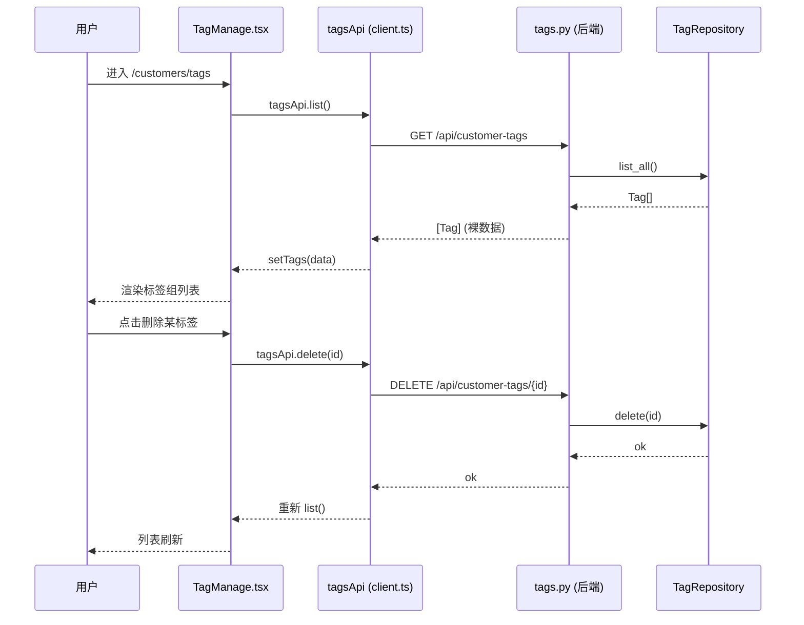

# Morphix 控制台 · 12 个占位子模块 → 真实页面：架构设计与任务分解

> 架构师：高见远（software-architect）
> 输入：原型 `prototype/index.html`（权威 UI 规格）、后端契约 `openapi-morphix-unified.yaml`、已存在资源域 router（`project/backend/app/routers/`）、现有真实页（`src/pages/Bots`、`Customers`、`Channels` 等）
> 范围：将 router.tsx 中 12 个 `PlaceholderPage` 落地为真实页面，含前端实现分解与后端缺口分析
> 语言：中文；本报告只做设计与分解，不写实现代码

---

## 一、总览（A / B / C 三类统计）

按"后端接口现状"将 12 页分为三类：

| 类别 | 含义 | 数量 | 页面 |
|------|------|------|------|
| **A 类** | 已有 router 可复用 / 仅需小幅扩展（补 GET list 或 DELETE/PUT） | 2 | `/customers/tags`、`/operations/sops` |
| **B 类** | 需新增后端端点（建议 path + 方法 + 字段，对齐现有 router 风格） | 8 | `/bots/logs`、`/customers/groups`、`/channels/settings`、`/operations/tasks`、`/organization/auth`、`/organization/roles`、`/resources`、`/resources/orders` |
| **C 类** | 纯前端配置表单，可用 mock / 本地态先行落地（后端持久化可后置） | 2 | `/organization/info`、`/llm-config` |

补充说明：
- **A 类**两个页面后端 router 已存在，但功能不完整（tags 缺删除/更新、sops 缺列表查询），需后端小补，可与前端并行。
- **B 类**中 `/operations/tasks` 概念上**不等于** `workflows.py`（无代码编排工作流），它是营销群发/定时任务，应作为独立域新增端点（详见待明确事项 #1）。
- **B 类**页面建议"前端先用 mock 落地 UI、后端端点就绪后切换 api 实现"，前端不被后端阻塞。

---

## 二、逐页规格

### 1. `/bots/logs` 托管消息日志
- **原型位置**：`prototype/index.html` L7667–7730+（`'message-logs'` 模板）。结构：顶部 toolbar（刷新 / 筛选 / 列设置图标按钮）→ `card` 内 filters 区（AI 回复 id、用户问题、所属会话【分组下拉：联系人 / 群聊】、所属机器人 select、AI 回复状态 select【成功/失败/处理中】、回复时间范围 date-range）→ 下方为日志表格（原型该片段为筛选区，表格由前端渲染，需补）。
- **需要的数据**：
  - 字段：`aiReplyId`、`question`（用户问题）、`conversationId`/`conversationName`（所属会话）、`botName`（所属机器人）、`status`（success/failed/processing）、`replyTime`（回复时间）、可选 `answer`（回复内容）。
  - 分页：**是**（日志量大）。筛选/搜索：会话、机器人、状态、时间范围、关键字（AI 回复 id / 用户问题）。列设置（自定义展示列）。新建/编辑/删除：**只读日志，无**。
- **后端现状 → B 类（需新增）**：当前 `conversations.py` 有 `/conversations/{id}/messages`（聊天消息，非 AI 回复日志），**不可混用**。建议新增独立端点：
  - `GET /api/ai-reply-logs` — 参数：`reply_id?`、`question?`、`conversation_id?`、`bot_id?`、`status?`、`start_time?`、`end_time?`、`page`、`pageSize`；响应对齐现有分页风格 `{items, total, page, pageSize}`。
  - 可选 `GET /api/ai-reply-logs/{id}` 详情。

### 2. `/channels/settings` 特殊渠道设置
- **原型位置**：L8470–8484（`'channel-settings'`）。结构：标题"特殊渠道配置" + "新增企微主体"按钮 → grid 卡片：每张卡=一个企微主体（企微应用配置：企业全称 / 企业简称 / 企业 ID + 保存 / 取消）→ 末尾"新增企微主体"虚线卡。
- **需要的数据**：
  - 实体 `WecomSubject`：`id`、`enterpriseName`（企业全称）、`enterpriseShortName`（企业简称）、`enterpriseId`（企业 ID）、`appConfig?`、`createdAt`。
  - 分页：卡片网格，数量少可不分页。筛选/搜索：可选按企业名。新建/编辑/删除：**是**（新增企微主体、保存、删除）。
- **后端现状 → B 类（需新增）**：`channels.py` 仅有 `channel-accounts`（托管账号），无"企微主体"实体。建议扩展或新建：
  - `GET /api/wecom-subjects`、`POST /api/wecom-subjects`、`PUT /api/wecom-subjects/{id}`、`DELETE /api/wecom-subjects/{id}`。
  - **C 类备选**：后端暂不上时，前端用 mock 卡片 + 本地 state 落地。

### 3. `/customers/groups` 客户分组管理
- **原型位置**：L8610–8656（`'customer-groups'`）。结构：`card` → group-tip（提示"去客户列表选择后保存客户分组"）+ filter-row（客户分组名 input、类型 select【system/custom】、重置 / 查询）+ `table`（客户分组、类型、当前客户数、创建时间、编辑时间、编辑人）+ 空态。
- **需要的数据**：
  - 实体 `CustomerGroup`：`id`、`name`（客户分组）、`type`（`'system' | 'custom'`）、`memberCount`（当前客户数）、`createdAt`、`updatedAt`、`editor`（编辑人）。
  - 分页：**是**（表格）。筛选/搜索：名称、类型。查询/重置：是。新建/编辑/删除：原型"新建"入口在客户列表侧（tip 引导），本页建议至少支持**列表查询 + 可选删除**；新建/编辑可后置或跳转客户列表。
- **后端现状 → B 类（需新增）**：无分组 router。建议：
  - `GET /api/customer-groups` — 参数：`name?`、`type?`、`page`、`pageSize`。
  - 可选 `POST/PUT/DELETE /api/customer-groups/{id}`。

### 4. `/customers/tags` 标签管理
- **原型位置**：L8658–8664（`'tags'`）。结构：`card` → `card-header`（标题"标签管理" + "添加标签组"按钮）→ `card-body`（`id=tagsPageContainer`，由 JS 渲染标签组列表；`openCreateTagGroupModal` 等逻辑在原型别处）。
- **需要的数据**：
  - 实体：标签组 / 标签。`tags.py` 现有 `POST /api/customer-tags` body：`name`、`color`、`rule`。
  - 分页：可选。筛选/搜索：前端渲染标签组。新建（添加标签组）/ 编辑 / 删除：**是**（需补 DELETE/PUT）。
- **后端现状 → A 类（已有，需小幅扩展）**：`tags.py` 已有 `GET /api/customer-tags`、`POST /api/customer-tags`。缺口：缺 `DELETE /api/customer-tags/{id}`、`PUT /api/customer-tags/{id}`，以及 `TagRepository` 对应方法、`TagUpdateRequest` schema（可选）。`routers/__init__.py` 已注册，无需新增注册。

### 5. `/operations/tasks` 运营任务
- **原型位置**：L8666–8699（`'operation-tasks'` 列表）+ L8701–8750+（创建向导 `operation-task-create` / `-params` / `-targets`）。结构：banner（标题 + 描述"群发任务·机器人定时任务…" + 插画）→ filter-bar（搜索任务、类型 select【群发/机器人定时】、启用状态、运行状态、创建按钮）→ 卡片网格（"创建运营任务"虚线卡 + 任务卡：badge 类型、switch 启用、名称、渠道类型·运行频率、下次运行时间、编辑 / 运营记录按钮）。创建为多步向导（选类型 → 设参数 → 选对象 → 设运行时间）。
- **需要的数据**：
  - 实体 `OperationTask`：`id`、`name`、`type`（`'mass' | 'bot_timer' | 'moments'`）、`channelType`、`runFrequency`、`nextRunTime`、`enabled`（bool）、`status`（运行中 / 未运行）、`targets`。
  - 分页：网格 + 筛选。筛选/搜索：类型、启用、运行、关键字。新建（多步向导）/ 编辑 / 查看运营记录：**是**。
- **后端现状 → B 类（需新增，独立域）**：⚠️ 与 `workflows.py`（无代码编排工作流引擎）**不是同一概念**。建议作为独立域新增：
  - `GET /api/operation-tasks`、`POST /api/operation-tasks`、`PUT /api/operation-tasks/{id}`、`PATCH /api/operation-tasks/{id}/enable`、`GET /api/operation-tasks/{id}/records`。
  - **C 类备选**：本期前端用 mock 卡片 + 向导交互先落地，后端分批补。

### 6. `/operations/sops` 运营SOP
- **原型位置**：L8994–9058（`'operation-sops'` 列表 + 空态）+ L9060–9110+（创建 `sop-create-customer` / `-group` 含流程编辑器）。结构：banner（标题 + 描述 + 插画）→ sop-filter-bar（搜索、类型 select【客户SOP/群聊SOP】、启用状态、运行状态、排序）→ 空态"暂无运营SOP" + "去创建"（弹窗选 客户SOP / 群聊SOP）→ 流程编辑器（拖拽节点：流程设置 / 发送消息 / 等待）。
- **需要的数据**：
  - 实体 `Sop`：`id`、`name`、`type`（`'customer' | 'group'`）、`trigger`、`enabled`、`status`、`nodes`（流程定义，节点数组）、`createdAt`、`updatedAt`。
  - 分页：列表 + 筛选 + 搜索 + 排序。新建（流程编辑器，复杂度高）/ 启用停用 / 编辑：**是**。
- **后端现状 → A 类（部分，需补列表）**：`sops.py` 已有 `POST /api/sops`（body：`name`、`trigger`）。缺口：缺 `GET /api/sops`（分页 + type/enabled/status/sort/keyword）、`GET /api/sops/{id}`、`PATCH /api/sops/{id}/enable`、`PUT /api/sops/{id}`。`SopRepository` 应已有 `create`，需补 `list`。流程节点存储可复用 workflow 节点风格或新增 `sop_nodes` 表。

### 7. `/resources` 我的资源
- **原型位置**：L9119–9158（`'my-resources'`）。结构：`card`（套餐徽章 Basic、自动续费开关、可用余额【充值+赠送−未结清】、充值 / 收支明细 / 月账单按钮）→ resource-cards（系统动能值 908 点、机器人额度 2/2、渠道账号 1/1，各带充值/购买/续费按钮）→ 第二个 `card`（tabs：动能值明细 / 席位到期日 + filter-bar【消耗/获得、日期范围、导出】+ table【时间 / 动能值 / 类型】）。
- **需要的数据**：
  - 聚合 `ResourceQuota` / `Billing`：`plan`、`autoRenew`（bool）、`balance`、`rechargeAmount`、`giftAmount`、`unsettledAmount`、`kineticEnergy{remaining, todayUsed}`、`botQuota{used, total}`、`channelSeat{used, total}`、`details[]`（time, points, type）。
  - 分页：明细表分页。tab 切换、筛选（类型 / 日期）、导出：是。新建/编辑/删除：无（展示 + 跳转充值）。
- **后端现状 → B 类（账单/配额域，需新增）**：当前无对应 router。建议 `GET /api/resources/overview`、`GET /api/resources/kinetic-logs`（分页 + type + 日期）。**C 类备选**：先用 mock（余额/额度均为 0 态）落地 UI，后端后续补。

### 8. `/resources/orders` 我的订单
- **原型位置**：L9160–9170（`'my-orders'`）。结构：`card` → filter-bar（订单号 input、日期范围、重置 / 查询 / 导出）+ `table`（订单号、商品、订单类型【新购/版本订阅】、创建时间、支付开通时间、订单状态【已支付】、应付金额、操作【详情】）。
- **需要的数据**：
  - 实体 `Order`：`id`（订单号）、`product`、`orderType`（`'new' | 'subscription'`）、`createdAt`、`paidAt`、`status`（`'paid' | ...`）、`amount`、`detail`。
  - 分页：是。筛选（订单号 / 日期）、查询、导出、详情：是。新建/编辑/删除：无。
- **后端现状 → B 类（需新增）**：无 router。建议 `GET /api/resource-orders`（分页 + `order_no?` + 日期范围）。**C 类备选**：mock 两条数据先落地。

### 9. `/organization/info` 组织信息管理
- **原型位置**：L9172–9186（`'org-info'`）。结构：banner（标题 + 英文副标题）→ `card`（3 列 grid 表单：组织名、联系人、联系方式 + "确认"按钮 → toast 保存成功）。
- **需要的数据**：
  - `OrgInfo`：`orgName`、`contactName`、`contactPhone`。
  - 分页/列表/筛选：无。仅需读取当前组织信息 + 保存（PUT）。
- **后端现状 → C 类（纯前端，可后置）**：先前端表单 + mock 初始值 + 本地态（或 localStorage）；后端可后置为小补 `GET/PUT /api/organization/info`。

### 10. `/organization/auth` 授权用户管理
- **原型位置**：L9188–9217（`'org-auth'`）。结构：auth-user-card → filter（登录账号 input、用户昵称 input、重置 / 查询 / 新增）+ `table`（登录账号、用户昵称、所属角色、操作【空态】）。
- **需要的数据**：
  - 实体 `AuthUser`（RAM 风格）：`id`、`loginAccount`（登录账号）、`nickname`（用户昵称）、`roleId`/`roleName`（所属角色）、`createdAt`。
  - 分页/列表：是。筛选（账号 / 昵称）、查询、新增（弹窗）、编辑、删除、绑定角色：是。
- **后端现状 → B 类（需新增）**：无 router。建议 `GET /api/org/auth-users`（分页 + filters）、`POST /api/org/auth-users`、`PUT /api/org/auth-users/{id}`、`DELETE /api/org/auth-users/{id}`。**C 类备选**：mock 空态先落地 UI。

### 11. `/organization/roles` 角色权限管理
- **原型位置**：L9219–9229（`'org-roles'`）。结构：`card` → filter-bar（角色 input、重置 / 查询 / 新增角色）+ `table`（角色【badge】、角色描述、操作：编辑角色 / 编辑权限 / 删除）。
- **需要的数据**：
  - 实体 `Role`：`id`、`name`（角色）、`description`（角色描述）、`permissions[]`。
  - 列表、筛选、新增、编辑（角色信息）、编辑权限（权限树/勾选）、删除：是。
- **后端现状 → B 类（需新增）**：无 router。建议 `GET /api/org/roles`、`POST /api/org/roles`、`PUT /api/org/roles/{id}`、`DELETE /api/org/roles/{id}`、`GET/PUT /api/org/roles/{id}/permissions`。**C 类备选**：mock 三个角色（管理员 / 团队组长 / 普通成员）先落地。

### 12. `/llm-config` LLM 配置
- **原型位置**：L9231–9316（`'llm-config'`）。结构：标题 + 说明 + 提示条（默认支持模型：DeepSeek V4 · 通义千问 · Hy3 · GLM-5.2 · Claude 4.8 Opus · Gemini 3.1 Pro Preview · Openai/GPT-5.5）→ 两张 `card`（主模型 / 副模型）：各含 模型厂商/模型（select）、API Key（password + 显示切换 eye）、API 地址（可选）、测试连接 + 保存配置；主模型"已启用"badge、副模型"未配置"。
- **需要的数据**：
  - `LlmConfig`：`primary{ model, apiKey, apiBaseUrl, enabled }`、`secondary{ model, apiKey, apiBaseUrl }`。
  - 分页/列表：无。仅需读取 + 保存（PUT/POST）。测试连接为前端模拟（toast）。
- **后端现状 → C 类（纯前端，可后置）**：先前端表单 + 本地态（mock 初始值）。后端可后置 `GET/PUT /api/llm-config`。⚠️ 密钥敏感，若落后端需加密存储（原型文案已说明"仅保存于当前租户，加密存储"）。

---

## 三、文件清单

### 3.1 前端（React，根 `src/`）

> 约定：每个真实页一个目录，含 `Xxx.tsx` + `Xxx.css`；复用 `components/common/Button`、`prototype.css` 的 `proto-*` 类。类型统一放 `src/types/resource.ts`，API 封装扩展 `src/api/client.ts`。

| 页面 | 新增文件 | 说明 |
|------|----------|------|
| `/bots/logs` | `src/pages/MessageLogs/MessageLogs.tsx` + `MessageLogs.css` | 筛选 + 分页日志表 |
| `/channels/settings` | `src/pages/ChannelSettings/ChannelSettings.tsx` + `ChannelSettings.css` | 企微主体卡片网格 + 新增/编辑 |
| `/customers/groups` | `src/pages/CustomerGroups/CustomerGroups.tsx` + `CustomerGroups.css` | 筛选 + 分组表 |
| `/customers/tags` | `src/pages/Tags/TagManage.tsx` + `TagManage.css` | 标签组容器 + 添加标签组 |
| `/operations/tasks` | `src/pages/OperationTasks/OperationTasks.tsx` + `OperationTasks.css` + `OperationTaskWizard.tsx` | 卡片网格 + 多步创建向导 |
| `/operations/sops` | `src/pages/OperationSops/OperationSops.tsx` + `OperationSops.css` + `SopEditor.tsx`（二期） | 列表 + 空态 + 流程编辑器（二期） |
| `/resources` | `src/pages/Resources/Resources.tsx` + `Resources.css` | 配额卡片 + 明细 tab 表 |
| `/resources/orders` | `src/pages/Resources/Orders.tsx` + `Orders.css` | 订单表 |
| `/organization/info` | `src/pages/Organization/OrgInfo.tsx` + `OrgInfo.css` | 组织信息表单 |
| `/organization/auth` | `src/pages/Organization/OrgAuth.tsx` + `OrgAuth.css` | 授权用户表 + 新增 |
| `/organization/roles` | `src/pages/Organization/OrgRoles.tsx` + `OrgRoles.css` | 角色表 + 编辑/权限 |
| `/llm-config` | `src/pages/LlmConfig/LlmConfig.tsx` + `LlmConfig.css` | 主/副模型配置表单 |
| 共享类型 | `src/types/resource.ts`（新建） | CustomerGroup / Tag / OperationTask / Sop / WecomSubject / AiReplyLog / ResourceQuota / Order / AuthUser / Role / LlmConfig 等 interface |
| API 封装 | `src/api/client.ts`（扩展） | 新增各域 `xxxApi` 对象 + mock 开关；扩展 `tagsApi.delete/update`、`sopsApi.list/enable` |
| 路由接入 | `src/router.tsx`（修改） | 12 个 `PlaceholderPage` 替换为真实组件 import（icon/title 已备） |

### 3.2 后端（Python，根 `project/backend/app/`）

| 页面 | 改动点 |
|------|--------|
| `/customers/tags` (A) | `routers/tags.py` 补 `GET/PUT/DELETE /customer-tags/{id}`；`schemas.py` 补 `TagUpdateRequest`（可选）；`repositories.py` 补 `TagRepository.delete/update` |
| `/operations/sops` (A) | `routers/sops.py` 补 `GET /sops`（+ 筛选）、`GET /sops/{id}`、`PATCH /sops/{id}/enable`、`PUT /sops/{id}`；`repositories.py` 补 `SopRepository.list` |
| `/bots/logs` (B) | 新建 `routers/ai_reply_logs.py`（或并入 `conversations.py`）；`repositories.py` 补 `AiReplyLogRepository` + `ai_reply_logs` 表 |
| `/customers/groups` (B) | 新建 `routers/customer_groups.py`；`repositories.py` 补 `CustomerGroupRepository` + `customer_groups` 表 |
| `/channels/settings` (B) | `routers/channels.py` 扩展 或 新建 `routers/wecom_subjects.py`；`WecomSubjectRepository` + `wecom_subjects` 表 |
| `/operations/tasks` (B) | 新建 `routers/operation_tasks.py`（独立域）；`OperationTaskRepository` + `operation_tasks` 表 |
| `/organization/auth` (B) | 新建 `routers/org_auth.py`；`AuthUserRepository` + 表 |
| `/organization/roles` (B) | 新建 `routers/org_roles.py`；`RoleRepository` + `roles`/`role_permissions` 表 |
| `/resources`、`/resources/orders` (B) | 新建 `routers/resources.py`（overview + kinetic-logs）、`routers/resource_orders.py`；对应 repository + 表 |
| 注册 | `routers/__init__.py` 对新 router 执行 `api_router.include_router(...)`（tags/sops 已注册，无需改） |

> 风格对齐：资源域返回**裸数据**（数组 / 对象）；列表统一用分页信封 `{items, total, page, pageSize}`（参考 `channels.py` 的 `list_channel_accounts_paged` + `paginate_result`）。新端点 path 以 `/api/` 为前缀，与现有资源域一致（`/api/customer-tags`、`/api/channel-accounts` 等）。

---

## 四、任务列表（有序、分批、含依赖）

> 说明：批次 0 为前置基础设施；批次 1–2 几乎不依赖后端新增端点（可立即开工）；批次 3–6 为 B 类，建议"前端先 mock 落地 UI，后端端点就绪后切换 api 实现"，前端不被后端阻塞。

### 批次 0 — 基础设施（所有批次的前置依赖）
- **T0-1 共享类型**：新建 `src/types/resource.ts`，定义 12 页所需 interface 与枚举（见第三节）。
- **T0-2 API 封装骨架**：扩展 `src/api/client.ts`，为各域新增 `xxxApi` 对象，并在封装层预留 `USE_MOCK` 开关（B/C 类页先返回 mock，后端就绪后关闭开关）。
- **T0-3 路由接入壳**：修改 `src/router.tsx`，将 12 个 `PlaceholderPage` 替换为真实组件 import（先创建空壳组件保证编译通过，再逐批填充）。
- **依赖**：无。 **优先级**：P0。

### 批次 1 — C 类纯前端（0 后端依赖，可最先并行）
- **T1 `/llm-config`**：`LlmConfig.tsx` + `.css`，主/副模型配置表单（select 模型、API Key 密码框 + 显示切换、API 地址、测试连接模拟、保存本地态）。
- **T2 `/organization/info`**：`OrgInfo.tsx` + `.css`，3 列表单（组织名/联系人/联系方式）+ 确认（mock 本地态）。
- **依赖**：T0。 **后端**：无。 **优先级**：P1。

### 批次 2 — A 类（后端小补，可与前端并行）
- **T3 `/customers/tags`**：`TagManage.tsx` + `.css`，标签组容器 + "添加标签组"；调用 `tagsApi.list`，补 `tagsApi.delete/update`；后端补 `tags.py` 删除/更新端点。
- **T4 `/operations/sops`**：`OperationSops.tsx` + `.css`，banner + 筛选 + 列表/空态 + "去创建"入口；调用 `sopsApi.list`（需后端补 `GET /sops`）；流程编辑器 `SopEditor.tsx` 建议放二期。
- **依赖**：T0（数据接口 T3/T4 后端小补可与前端并行）。 **优先级**：P1。

### 批次 3 — B 类·轻量 I（新增端点，可先 mock）
- **T5 `/customers/groups`**：`CustomerGroups.tsx` + `.css`，筛选（名称/类型）+ 分组表（分页/空态）；先 mock，后端就绪切 `customerGroupsApi`。
- **T6 `/channels/settings`**：`ChannelSettings.tsx` + `.css`，企微主体卡片网格 + 新增/编辑；先 mock，后端就绪切 `wecomSubjectsApi`。
- **依赖**：T0（后端 `customer_groups.py` / `wecom_subjects` 可与前端并行）。 **优先级**：P2。

### 批次 4 — B 类·轻量 II（新增端点，可先 mock）
- **T7 `/organization/auth`**：`OrgAuth.tsx` + `.css`，筛选 + 授权用户表 + 新增；先 mock 空态。
- **T8 `/organization/roles`**：`OrgRoles.tsx` + `.css`，角色表（badge）+ 编辑角色/权限/删除；先 mock 三角色。
- **依赖**：T0（后端 `org_auth.py` / `org_roles.py` 可与前端并行）。 **优先级**：P2。

### 批次 5 — B 类·复杂 I（独立域 + 较复杂交互）
- **T9 `/bots/logs`**：`MessageLogs.tsx` + `.css`，筛选（会话/机器人/状态/时间/关键字）+ 分页日志表 + 列设置；先 mock，后端 `ai_reply_logs` 就绪切换。
- **T10 `/operations/tasks`**：`OperationTasks.tsx` + `OperationTaskWizard.tsx`，卡片网格 + 多步创建向导（选类型→设参数→选对象→设运行时间）；先 mock，后端 `operation_tasks` 就绪切换。
- **依赖**：T0（后端独立域，可与前端并行；交互较复杂，排在后）。 **优先级**：P2。

### 批次 6 — B 类·复杂 II（账单 / 配额域）
- **T11 `/resources`**：`Resources.tsx` + `.css`，套餐/余额/额度卡片 + 明细 tab 表（分页/筛选/导出）；先 mock 0 态。
- **T12 `/resources/orders`**：`Orders.tsx` + `.css`，订单筛选表（分页/查询/导出/详情）；先 mock 两条。
- **依赖**：T0（后端 `resources.py` / `resource_orders.py` 可与前端并行）。 **优先级**：P2。

**分批依赖图**（前端视角，后端端点可与对应批次并行；前端用 mock 不阻塞）：
```
T0 ──► T1,T2 (C类, 无后端)
  └──► T3,T4 (A类, 后端小补并行)
  └──► T5,T6 (B类轻量I, 后端并行)
  └──► T7,T8 (B类轻量II, 后端并行)
  └──► T9,T10 (B类复杂I, 后端并行)
  └──► T11,T12 (B类复杂II, 后端并行)
```
即：T0 是唯一硬前置；T1–T12 之间无相互依赖，可独立成批实现（工程师按批次领取即可）。

---

## 五、共享约定（从现有真实页抽取，统一遵循）

1. **页面骨架**：统一三件套
   ```tsx
   <div className="proto-page">
     <div className="page-header">
       <div><h2 className="page-title">标题</h2><p className="page-subtitle">副标题</p></div>
       <Button icon={<Plus size={16} />}>新建</Button>
     </div>
     <div className="proto-card">
       <table className="proto-table"> … </table>
     </div>
   </div>
   ```
   参考 `src/pages/Customers/CustomerList.tsx`、`src/pages/Channels/ChannelAccounts.tsx`。

2. **卡片**：优先复用 `prototype.css` 的 `.proto-card` / `.proto-card-title`；需要 header/body 结构的（如 LLM 配置、组织信息）复用 `Home.css` 的 `.card` / `.card-header` / `.card-title` / `.card-body`。不要新造卡片样式。

3. **表格**：统一 `.proto-table`（已含 thead 样式、行 hover）；多列表格用 `.table-card`（`styles.css`，`overflow-x:auto`）包一层防止溢出。操作列用 `.proto-actions` 内嵌 `Button variant="ghost" size="sm"`。

4. **徽章 / 状态**：统一 `.proto-badge` + 修饰类 `-success / -warning / -danger / -info / -neutral`。状态映射用 `Record<Enum, {label, cls}>` 写法（参考 `ChannelAccounts.tsx` 的 `STATUS_META`）。

5. **按钮**：一律用 `components/common/Button`（变体 `primary | secondary | ghost | danger`，尺寸 `sm | md | lg`，`icon` 插槽）。**不要用原生 `<button class="btn">`**（原型里的 `.btn-primary` 等是 HTML 原型类，React 端已由 `Button` 组件覆盖）。

6. **图标**：统一 `lucide-react`。路由 icon 已在 `src/router.tsx` 引入（`MessageSquare / Settings / UsersRound / Tags / ListTodo / ClipboardList / ShoppingBag / Building2 / KeyRound / ShieldCheck / Cpu`），页面内再用其它图标按需 import。

7. **加载 / 空 / 错误态**：
   - 加载：`<div className="page-loading"><Activity className="spinner" size={32}/><p>加载中...</p></div>`（参考 `Bots.tsx`）。
   - 空态：原型 `.group-empty` / `.sop-empty` 风格，React 端建议补 `.proto-empty` 约定（图标 + "暂无数据"），或页内 inline。
   - 错误：统一 `try/catch` + `console.error`，建议补 `.page-error` 提示条（文案 + 重试按钮）。

8. **数据获取**：统一经 `src/api/client.ts` 的 `api.get/post/put/patch/delete` 或封装的 `xxxApi`。资源域返回**裸数据**（数组/对象，如 `botsApi.list`）；契约域（`/api/control/*`）返回**信封** `{requestId, success, data, error}` 由 client 自动解包。本批 12 页多数走资源域（`/api/...` 裸数据）。

9. **类型定义**：放 `src/types/resource.ts`（与 `control.ts` 分开，`control.ts` 专用于 `/api/control` 契约）。interface 命名 `Xxx`，枚举用 `type X = 'a'|'b'` + `Record` 映射；日期字段统一 `string`（ISO）。

10. **Mock 策略**：B/C 类页在后端未就绪时，页内 `const MOCK: Xxx[] = [...]`（参考 `CustomerList.tsx` / `ChannelAccounts.tsx` 的 `MOCK`），并在 `src/api/client.ts` 封装层预留 `USE_MOCK` 开关，后端就绪后仅切换 api 实现，页面组件不动。

11. **路由接入**：`src/router.tsx` 将 12 个 `PlaceholderPage` 逐一替换为真实组件 import；保持现有 lucide icon 与 title 不变。

---

## 六、待明确事项（需 team-lead / 后端确认）

1. **`/operations/tasks` 与 `workflows.py` 是否同一概念？** 原型"运营任务"是营销群发/机器人定时/朋友圈任务，而 `workflows.py` 是无代码编排工作流引擎（节点/运行时），二者不同。建议作为**独立域**新增端点。需确认是否复用 workflow 引擎，还是新建 `operation_tasks` 域。
2. **`/bots/logs` 数据来源**：是独立 `ai_reply_logs` 表，还是复用 `conversations` 消息？建议独立端点（AI 回复日志语义不同）。需确认数据落库位置。
3. **`/customers/groups` 的"新建"入口**：原型 tip 引导"去客户列表建分组"，本页是否仅做只读列表 + 查询，新建/编辑放在客户列表侧？需明确本页操作范围。
4. **资源 / 订单 / 组织 / 角色 / 授权 后端排期**：是否本期必须落地真实端点？建议前端先 mock，后端按 B 类分批补；需确认后端排期以免"假阻塞"。
5. **`/llm-config` 与 `/organization/info` 是否需要真实持久化？** 涉及密钥加密存储（LLM）与组织主数据。建议 C 类先前端表单 + 本地态，后端端点（含加密）后置。
6. **SOP 流程编辑器复杂度**：拖拽节点编辑器工作量大，是否本期做完整编辑器，还是先做"列表 + 模板选择新建（客户SOP/群聊SOP）"，编辑器放二期？本报告已将 `SopEditor.tsx` 标为二期。
7. **分页/筛选统一风格**：现有资源域 router 有的返回数组（`list_all`）、有的返回分页信封（`{items,total,page,pageSize}`）。建议所有**新增列表端点统一用分页信封**，与 `channels.py` 的 `list_channel_accounts_paged` + `paginate_result` 对齐。

---

## 附：核心数据模型（classDiagram，节选）


## 附：典型调用流（sequenceDiagram — 标签管理 列表 + 删除）


