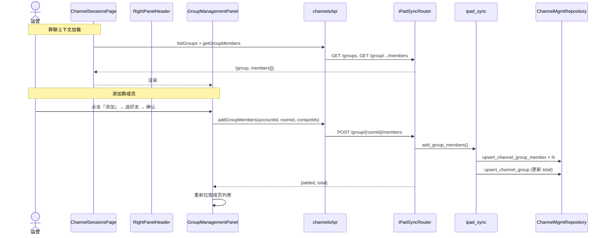

# 渠道会话管理页 · 右侧合并区域 — 系统架构设计

> 文档版本：v1.0
> 编写人：主理人齐活林
> 日期：2026-07-23
> 关联 PRD：`docs/session-detail-panel-prd.md`

## 0. 决策摘要

| 编号 | 决策 | 理由 |
|------|------|------|
| D1 | chat 头部从 `SessionChatPanel` 内部上提到合并区域 `RightPanelHeader`，聊天面板接受 `hideHeader` prop | 头部是区域级而非面板级，区域级统一才能与右栏联动 |
| D2 | 客户详情宽度由右栏内部分栏控制（280-520px 区间），非外层 grid | 客户详情宽度是区域内交互，跨会话可保持 |
| D3 | 折叠状态/宽度仅本组件内 useState，**不持久化** | 简化 MVP；如需持久化可加 localStorage |
| D4 | 群聊 vs 单聊用 `session.sessionType === '群聊'` 分发 | 已存在的字段，无新增 |
| D5 | 群管理 5 项操作全部 mock-first | 协议未确认时不阻塞 UI；落库返回成功 |
| D6 | AI 总结走**前端直连 LLM**（用 `llmConfigApi` 拿主备配置） | 无需新增后端代理；prompt 固定 |
| D7 | 备注/基本信息编辑复用 `customersApi.updateProfile` | 已存在，避免新增后端 |
| D8 | 沟通记录复用 `customersApi.createCommunication` | 已支持 `aiSummary` 字段 |

## 1. 实现方案

### 1.1 文件清单

**新增**
- `src/pages/Channels/sessions/RightPanelArea.tsx` — 合并区域容器
- `src/pages/Channels/sessions/RightPanelHeader.tsx` — 区域头部
- `src/pages/Channels/sessions/GroupManagementPanel.tsx` — 群管理
- `src/pages/Channels/sessions/SessionDetailPanel.tsx` — 单聊详情 + 抽屉/弹窗
- `project/backend/tests/test_group_mgmt.py` — 群管理测试

**修改**
- `project/backend/app/ipad_sync.py` — 6 个新函数
- `project/backend/app/repositories.py` — 5 个新方法
- `project/backend/app/routers/ipad_sync.py` — 5 个新路由
- `project/backend/app/schemas.py` — 3 个新 Request
- `src/api/client.ts` — 5 个新方法
- `src/pages/Channels/ChannelSessions.tsx` — 替换右两栏为 RightPanelArea
- `src/pages/Channels/sessions/SessionChatPanel.tsx` — 加 `hideHeader` prop
- `src/pages/Channels/Channels.css` — 新增合并区域/抽屉/折叠/群管理等样式

### 1.2 时序图（创建群聊 + 添加成员）



### 1.3 群管理后端函数签名

```python
def add_group_members(account_id, room_id, contact_ids) -> dict
def remove_group_member(account_id, room_id, member_id) -> dict
def set_group_notice(account_id, room_id, notice) -> dict
def transfer_group_owner(account_id, room_id, new_owner_user_id) -> dict
def dismiss_group(account_id, room_id) -> dict
```

### 1.4 关键约定

- **DTO 转换**：`row_to_group` 返回 camelCase，`upsert_channel_group` 期望 snake_case；通过 `_group_dto_to_row` 工具函数桥接。
- **错误码**：账号不存在 → 404，群不存在 → 400，参数缺失 → 400，事务内失败 → 400 + message。
- **AI 总结**：`runAiSummary(content)` 走 `llmConfigApi.getAll()` 取主备配置，主失效用备；prompt 固定为「请针对这段话进行总结提炼：{text}」；调用失败 → 弹 toast，结果为空字符串。

## 2. 验证结果

- `py_compile` 后端 5 文件：通过
- `npx tsc --noEmit`：通过（0 错误）
- `pytest tests/test_session_ui.py`：6/6 绿
- `pytest tests/test_group_mgmt.py`：8/8 绿
- 后端 `2181` 重启健康：`GET /api/health` 200
