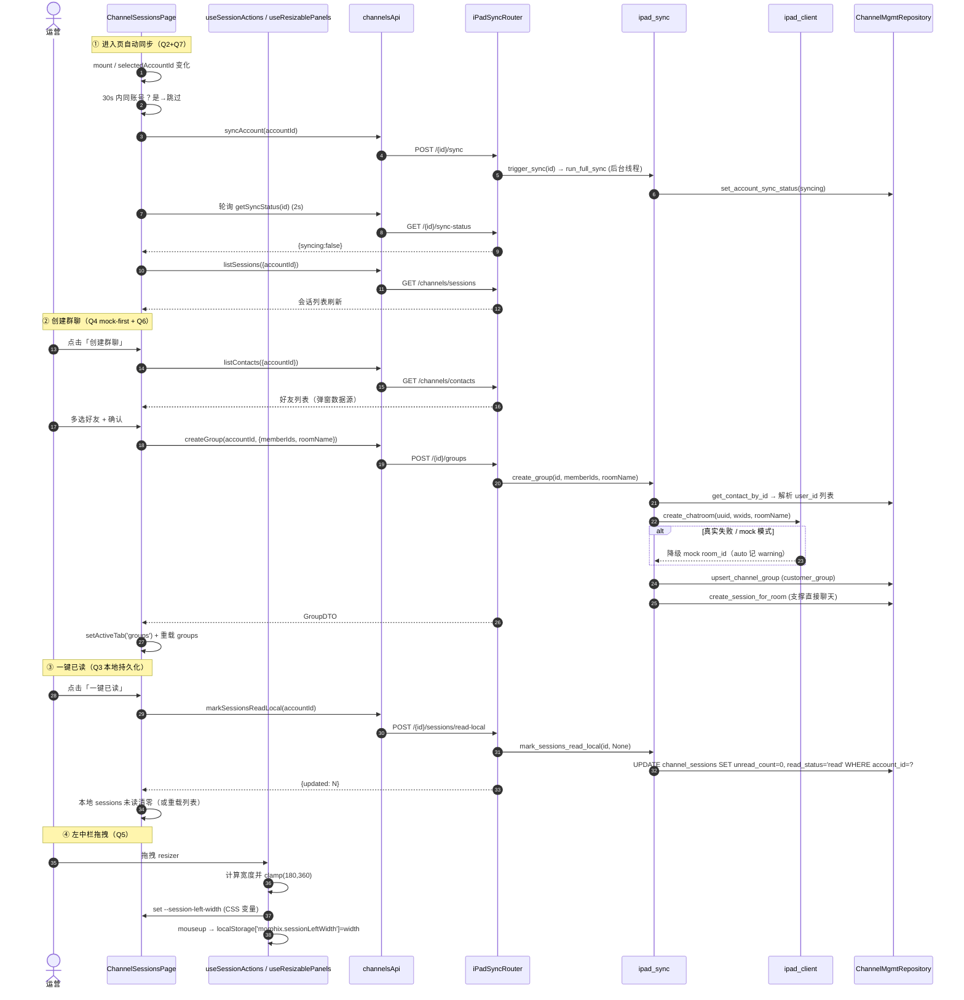
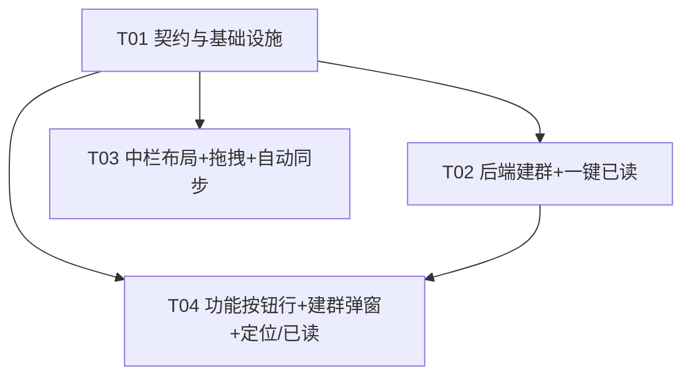

# 渠道会话管理页 UI 改造 — 系统架构设计

> 文档版本：v1.0（架构设计）
> 编写人：高见远（架构师）
> 日期：2025-07-23
> 关联 PRD：`docs/session-ui-prd.md`
> 关联页面：`src/pages/Channels/ChannelSessions.tsx`

---

## 0. 决策摘要（7 项待确认问题结论）

| 编号 | 待确认问题 | 架构结论 | 理由 / 取舍 |
|------|-----------|---------|------------|
| **Q1** | 企业微信下拉框具体元素 + 目标字号 | 元素 = 左栏渠道下拉 `.channel-select-trigger`（含其下拉项 `.channel-select-option`）；目标 **font-size: 13px**，与「全部/在线/离线」`.account-status-tab`（13px）对齐。**纯 CSS 修改，零逻辑改动**。 | 状态 Tab 即 PRD 指定的基准；当前 trigger 未显式设字号（继承 14px），统一为 13px 即可。 |
| **Q2** | 进入页自动同步：全量 vs 增量 | **复用现有全量 `run_full_sync`**（`trigger_sync` 入口），**后端零新增接口**。前端挂载时调 `channelsApi.syncAccount` + 轮询。 | 现有 `ipad_sync.trigger_sync` 已是后台线程 + 互斥保护；新增 seq 增量分支需评估游标语义、风险高、收益低，本期不做。 |
| **Q3** | 一键已读是否持久化 | **后端落库持久化**。新增 `POST /api/channels/{account_id}/sessions/read-local`，复用 `repo.mark_session_read_db` 逻辑（`unread_count=0, read_status='read'`），**不调 iPad `mark_as_read`**。 | 满足「清红点又不打扰客户侧」诉求；刷新后保持已读；与现有进入会话已读（动 iPad）解耦。 |
| **Q4** | 建群协议（当前 `ipad_client` 无建群函数） | **mock-first 兜底**：新增 `ipad_client.create_chatroom`，沿用项目既有 `auto/real/mock` 模式。真实失败（或 mock 模式）则本地生成 room 并**落库**，保证前端可演示、UI 不阻塞。 | 真实 iPad 建群端点（`wxwork/CreateChatRoom`）可用性未确认，但 `auto` 模式降级可保证演示链路完整；前端恒拿到 GroupDTO。 |
| **Q5** | 拖拽宽度约束 + 持久化 | 左栏 **180–360px**；通过 CSS 变量 `--session-left-width` 驱动 `.session-mgmt` 首列，**持久化到 `localStorage`（key `morphix.sessionLeftWidth`）**。 | 仅首列可变、中栏 `minmax(0,1fr)` 自适应，右两栏固定，符合「左中栏为一个整体区域」。 |
| **Q6** | 建群好友数据源 | 复用中栏「好友」Tab 已有的 `listContacts({accountId})`，弹窗内做**客户端关键字过滤**；不新增分页/搜索接口（好友量大时列为 P2）。 | 零新增后端；前端已持有好友列表。 |
| **Q7** | 自动同步节流 | 同账号 **30s 内不重复触发**（前端 `lastAutoSyncAt` ref 节流）；后端 `_sync_active` 互斥 + 409 skip 作二重保护。 | 避免频繁进出页面反复触发；与后台互斥标志不冲突。 |

**结论：无需要回退 PM 的阻塞性歧义。** Q1/Q2/Q3/Q5/Q6/Q7 均为可直接落地的务实决策；Q4 采用 mock-first 已规避协议可用性风险。仅 1 处需验收时确认（见 §8）：真实建群端点名 `CreateChatRoom` 为假设，不影响 mock 兜底。

---

## 1. 实现方案 + 框架选型

### 1.1 技术难点
1. **左中栏拖拽**：`.session-mgmt` 原为固定 4 列 grid，需改为「首列变量 + 6px 分隔 + 中栏自适应」的 5 列 grid，且分隔条需为 grid 直接子元素参与布局。
2. **自动同步 + 节流**：避免重复触发与后台 `_sync_active` 互斥冲突。
3. **建群协议缺失**：真实建群端点未确认，必须前端不阻塞地降级。
4. **一键已读本地化**：与「进入会话动 iPad 的已读」区分，仅清本地。

### 1.2 框架 / 库选型
- **前端**：React 18 + Vite + TypeScript；样式沿用现有自定义 CSS（`Channels.css`）+ `lucide-react` 图标。**不引入 MUI/Tailwind，零新增前端依赖。**
- **后端**：FastAPI + SQLite（沿用）；**零新增第三方依赖**。`create_chatroom` 沿用既有 `httpx` + `auto/real/mock` 模式。
- **拖拽实现**：纯 DOM（`onMouseDown` + `mousemove`/`mouseup` 监听）+ CSS 变量，**不引入拖拽库**。
- **架构模式**：前端以现有函数组件 + hooks 局部状态为主；新增 2 个 hooks（`useResizablePanels`、`useSessionActions`）收敛交互逻辑。

### 1.3 mock-first 约定（强约束）
所有 iPad 协议调用（含新增 `create_chatroom`）遵循：
- `real` 模式失败 → 抛 `IPadProtocolError`（路由转 400/502）；
- `auto`/`mock` 模式失败 → 降级为本地 mock 结果，`auto` 记 warning 日志；
- 前端**永不因协议失败而阻塞 UI**：建群失败兜底仍落库并返回 GroupDTO。

---

## 2. 文件列表（相对路径）

### 前端（改动 / 新增）
| 路径 | 变更 | 说明 |
|------|------|------|
| `src/pages/Channels/ChannelSessions.tsx` | 改 | 搜索框置顶独占行；移除同步按钮（保留状态小字）；插入 resizer；进入页自动同步 effect（30s 节流）；新增 5 功能按钮行 + 处理器；接入建群/已读 API。 |
| `src/pages/Channels/Channels.css` | 改 | `.channel-select-trigger/.channel-select-option` 字号 13px；`.session-search-top` 独占行；`.session-action-bar`+`.session-action-btn`；`.session-resizer`；`.session-mgmt` 改 5 列变量网格 + 响应式。 |
| `src/pages/Channels/shared/Resizer.tsx` | 新增 | 可拖拽分隔条组件（受控 `onResizeStart`）。 |
| `src/pages/Channels/shared/CreateGroupModal.tsx` | 新增 | 建群弹窗（好友多选 + 关键字过滤 + 确认/取消）。 |
| `src/pages/Channels/shared/useResizablePanels.ts` | 新增 | 拖拽宽度状态 + localStorage 持久化（180–360）。 |
| `src/pages/Channels/shared/useSessionActions.ts` | 新增 | 回到顶部 / 定位未读 / 定位选中 / 一键已读的列表滚动与状态逻辑。 |
| `src/api/client.ts` | 改 | `channelsApi` 新增 `createGroup`、`markSessionsReadLocal`。 |
| `src/types/channels.ts` | 改 | 新增 `CreateGroupRequestDTO`、`MarkReadLocalResultDTO`。 |

### 后端（改动 / 新增）
| 路径 | 变更 | 说明 |
|------|------|------|
| `project/backend/app/schemas.py` | 改 | 新增 `CreateGroupRequest`、`MarkSessionsReadLocalRequest`。 |
| `project/backend/app/ipad_client.py` | 改 | 新增 `create_chatroom` + `_mock_create_chatroom`（auto/real/mock）。 |
| `project/backend/app/ipad_sync.py` | 改 | 新增 `create_group`、`mark_sessions_read_local`。 |
| `project/backend/app/repositories.py` | 改 | 新增 `create_session_for_room`（群 → channel_sessions 行，支撑「直接聊天」）。 |
| `project/backend/app/routers/ipad_sync.py` | 改 | 新增 `POST /{account_id}/groups`、`POST /{account_id}/sessions/read-local`。 |

> 最小变更原则：仅改上述文件，不重写无关模块；`AccountListPanel.tsx` 无需改逻辑（按 grid track 自适应填充）。

---

## 3. 数据结构 / API 接口

### 3.1 新增 / 修改后端端点

| 方法 & 路径 | 入参（request body / query） | 行为 | 响应 | 错误码 |
|-------------|------------------------------|------|------|--------|
| `POST /api/channels/{account_id}/groups` | `CreateGroupRequest{ memberIds: string[]; roomName?: string }` | 校验账号 → 解析 `memberIds`→`user_id` → `ipad_sync.create_group` → upsert `channel_groups`(group_type=`customer_group`) + upsert `channel_sessions`(群) | `GroupDTO` | 404 账号不存在；400 `memberIds` 空 |
| `POST /api/channels/{account_id}/sessions/read-local` | `MarkSessionsReadLocalRequest{ sessionIds?: string[] \| null }` | **仅本地**：`sessionIds` 给定则逐条 `mark_session_read_db`；否则 `UPDATE channel_sessions SET unread_count=0, read_status='read' WHERE account_id=?`。**不调 iPad。** | `{ updated: int }` | 404 账号不存在 |

> 复用既有：`POST /api/channels/{account_id}/sync`（全量触发）、`GET .../sync-status`（轮询）、`GET /api/channels/contacts`（建群好友源）。

### 3.2 请求 / 响应 DTO（JSON Schema）

```json
// ---- CreateGroupRequest（schemas.py / CreateGroupRequestDTO） ----
{
  "type": "object",
  "properties": {
    "memberIds": { "type": "array", "items": { "type": "string" }, "minItems": 1,
                   "description": "Morphix 联系人 id 列表（后端解析为 iPad user_id）" },
    "roomName":  { "type": "string", "description": "可选群名（P2 自定义群名），缺省由成员昵称派生" }
  },
  "required": ["memberIds"]
}

// ---- MarkSessionsReadLocalRequest（schemas.py） ----
{
  "type": "object",
  "properties": {
    "sessionIds": { "type": ["array", "null"], "items": { "type": "string" },
                    "description": "null = 清空当前账号全部会话未读" }
  }
}

// ---- 响应：GroupDTO（复用，行_to_group） ----
{
  "id": "acc-x:grp_abc123", "accountId": "acc-x", "roomId": "grp_abc123",
  "groupType": "customer_group", "name": "新群聊", "total": 3,
  "roomUrl": "", "noticeContent": "", "createTime": "", "updateTime": ""
}

// ---- 响应：{ "updated": 12 } ----
```

### 3.3 前端类型（`src/types/channels.ts` 新增）
```ts
/** 建群请求体（memberIds = Morphix 联系人 id；后端解析为 iPad user_id）。 */
export interface CreateGroupRequestDTO {
  memberIds: string[]
  roomName?: string
}

/** 一键已读（本地）响应。 */
export interface MarkReadLocalResultDTO {
  updated: number
}
```

### 3.4 前端 API 封装（`src/api/client.ts` 新增）
```ts
/** 建群（mock-first：真实失败仍落库返回 GroupDTO）。 */
createGroup: (accountId: string, payload: CreateGroupRequestDTO) =>
  api.post<GroupDTO>(`/channels/${accountId}/groups`, payload),

/** 一键已读（仅清本地未读，不动 iPad）。sessionIds 省略=清空当前账号全部。 */
markSessionsReadLocal: (accountId: string, sessionIds?: string[]) =>
  api.post<MarkReadLocalResultDTO>(`/channels/${accountId}/sessions/read-local`,
    { sessionIds: sessionIds ?? null }),
```

### 3.5 新增后端函数签名
```python
# ipad_client.py
def create_chatroom(uuid: str, wxids: list[str], room_name: str = "") -> dict:
    """返回 {"room_id": str, "ok": bool, "mock": bool}；real 失败抛 IPadProtocolError，auto/mock 降级 mock。"""

# ipad_sync.py
def create_group(account_id: str, member_ids: list[str], room_name: str = "") -> dict:
    """解析 user_id → create_chatroom → upsert_group + upsert_session_for_room → 返回 GroupDTO(dict)。"""

def mark_sessions_read_local(account_id: str, session_ids: list[str] | None = None) -> dict:
    """仅本地清零未读；返回 {"updated": int}。"""

# repositories.py
def create_session_for_room(self, account_id: str, room_id: str, name: str,
                            channel: str, channel_type: str) -> dict | None:
    """INSERT channel_sessions（session_type='group', msg_type=1, unread=0, read_status='read'），已存在则跳过。"""
```

---

## 4. 程序调用流程（时序图）



> 类图见附录 `docs/class-diagram.mermaid`，时序图另存 `docs/sequence-diagram.mermaid`。

---

## 5. 任务列表（有序 + 依赖）

> 约束：≤5 任务；每任务 ≥3 文件；T01 为基础设施；任务尽量仅依赖 T01。

| 任务 | 名称 | 涉及文件 | 依赖 | 优先级 |
|------|------|----------|------|--------|
| **T01** | 契约与基础设施（类型 / API 封装 / 后端 Schema / 全局样式变量与类） | `src/types/channels.ts`、`src/api/client.ts`、`project/backend/app/schemas.py`、`src/pages/Channels/Channels.css` | — | P0 |
| **T02** | 后端：建群(mock-first) + 一键已读(本地持久化) | `project/backend/app/ipad_client.py`、`project/backend/app/ipad_sync.py`、`project/backend/app/repositories.py`、`project/backend/app/routers/ipad_sync.py` | T01 | P0 |
| **T03** | 中栏布局改造：搜索置顶 + 移除同步按钮 + 左中栏可拖拽分隔 + 进入页自动同步 | `src/pages/Channels/ChannelSessions.tsx`、`src/pages/Channels/shared/Resizer.tsx`、`src/pages/Channels/shared/useResizablePanels.ts` | T01 | P0 |
| **T04** | 中栏功能按钮行 + 建群弹窗 + 定位/一键已读行为 | `src/pages/Channels/ChannelSessions.tsx`、`src/pages/Channels/shared/CreateGroupModal.tsx`、`src/pages/Channels/shared/useSessionActions.ts` | T01, T02 | P0 |

依赖关系（`mermaid graph`）：


**实现顺序建议**：T01 →（T02、T03 可并行）→ T04 → 联调验收（R3-P0-3 扫码自动同步回归）。

---

## 6. 共享知识（跨文件约定）

1. **命名**：DTO 用 camelCase（`CreateGroupRequestDTO`）；DB 列 snake_case；端点统一 `/api/channels/{account_id}/...`；后端函数 `create_*`/`mark_*` 动宾。
2. **错误处理**：账号不存在 → 404；参数缺失 → 400；`IPadSyncError` → 400；iPad 真实协议失败且 `real` 模式 → 502。前端对 `syncAccount` 的 409（正在同步）视为「已跳过」并仍启动轮询，不弹错误。
3. **mock-first**：所有 iPad 协议调用失败在 `auto`/`mock` 模式下降级，前端永不阻塞；`create_chatroom` 真实失败仍落库返回 GroupDTO。
4. **拖拽实现**：`.session-mgmt` 首列宽度由 CSS 变量 `--session-left-width` 驱动；分隔条为 grid 第 2 个 track（6px）；JS `clamp(180,360)`；`mouseup` 写 `localStorage['morphix.sessionLeftWidth']`。
5. **自动同步节流**：前端 `lastAutoSyncAt: Record<accountId, number>` ref，同账号 30s 内不重复触发；与后端 `_sync_active` 互斥互补。
6. **一键已读语义**：仅清本地 `unread_count`/`read_status`，**不动 iPad 侧未读**；与「进入会话已读（`mark_session_read`，动 iPad）」严格区分。
7. **建群群归属**：好友均为客户 → 新群 `group_type=customer_group`；同时写入 `channel_sessions`（`session_type=group`）以便「直接点击聊天」。
8. **好友数据源**：建群弹窗复用 `listContacts({accountId})` + 客户端关键字过滤，不新增后端接口。

---

## 7. 布局改造要点（前端实施指引）

### 7.1 `.session-mgmt` 网格（Channels.css）
```css
.session-mgmt {
  grid-template-columns: var(--session-left-width, 260px) 6px minmax(0, 1fr) 380px 320px;
}
@media (max-width: 1280px) {
  .session-mgmt { grid-template-columns: var(--session-left-width, 240px) 6px minmax(0, 1fr) 340px; }
  .session-mgmt .session-detail { display: none; }
}
@media (max-width: 1024px) {
  .session-mgmt { grid-template-columns: 1fr; }
  .session-resizer { display: none; }
}
```
`ChannelSessions.tsx` 在 `AccountListPanel` 与 `<section className="session-main">` 之间插入 `<Resizer onResizeStart={...} />`（grid 第 2 track）。

### 7.2 中栏自上而下结构
1. **搜索行**（独占一行，整行宽）：`请输入会话名称`。
2. **筛选行**：阅读 / 托管下拉 + 右侧同步状态小字（原按钮位，无按钮）。
3. **Tab 行**：会话 / 好友 / 群聊（不变）。
4. **功能按钮行**（新增 5 等宽按钮）：回到顶部 / 定位未读 / 定位选中 / 创建群聊 / 一键已读。
5. **列表区**（不变）。

### 7.3 进入页自动同步（伪码）
```ts
const lastAutoSyncAt = useRef<Record<string, number>>({})
useEffect(() => {
  if (!selectedAccountId) return
  const now = Date.now()
  if (lastAutoSyncAt.current[selectedAccountId] && now - lastAutoSyncAt.current[selectedAccountId] < 30000) return
  lastAutoSyncAt.current[selectedAccountId] = now
  channelsApi.syncAccount(selectedAccountId)
    .then(() => startSyncPolling(selectedAccountId))
    .catch((e) => { if (e.code === 'HTTP_409') startSyncPolling(selectedAccountId); else toast(...) })
}, [selectedAccountId])
```

---

## 8. 待明确事项（Assumptions / 验收确认项）

1. **Q1 字号 13px** 以 `.account-status-tab` 为基准，属低风险假设；如 PM 期望其他值（如 12px）需微调 CSS 一处。
2. **真实建群端点名** 假设为 `wxwork/CreateChatRoom`（参考既有 `sync_all_data`→`wxwork/SyncAllData` 命名规律）。因 `auto` 模式降级，即便名不对也仅影响真实环境建群、不影响演示；**建议验收时向协议侧确认**，但不阻塞本期。
3. **建群群归属** 默认 `customer_group`；若业务需区分内部群，需后续扩展 `groupType` 入参（本期不含）。
4. **好友量大**（>500）时建群弹窗客户端过滤可能卡顿，列为 P2：届时新增服务端搜索接口（`GET /channels/contacts?search=` 已支持 search 参数，可直接复用分页）。
5. **R3-P0-3 扫码自动同步** 仅做回归验收，不新增逻辑（后端 `channel_hosting.poll_wecom` 已包含 `trigger_sync`）。
