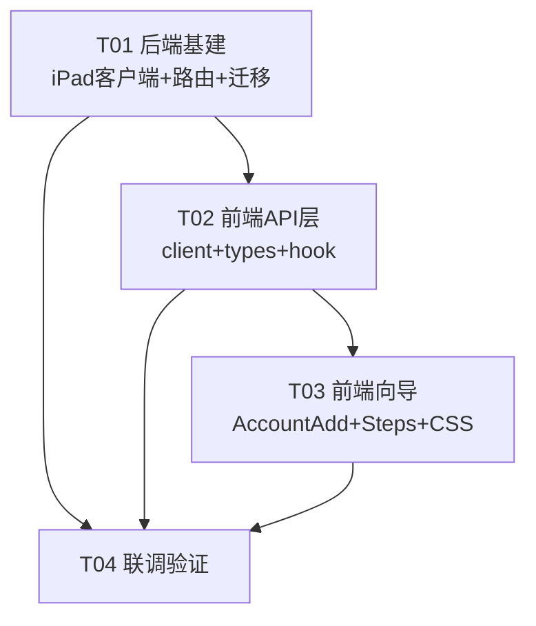

# 系统架构设计：添加渠道账号（企业微信 iPad 协议托管）

> 作者：高见远（Bob，架构师）｜阶段：标准 SOP 第一步（仅设计 + 任务分解，不含实现代码）
> 范围：前端 `morphix-console` + 后端 `project/backend` 中「添加渠道账号」向导与企业微信 iPad 协议托管接入。
> 配套图：`docs/class-diagram.mermaid`、`docs/sequence-diagram.mermaid`

---

## 0. 关键决策摘要（给主理人 / 评审）

1. **后端端点决策：补齐新域 `/api/channels/accounts/wecom/*`，不复用遗留 `/channel-accounts`。**
   经核查，`routers/channel_mgmt.py` **已实装** `POST /api/channels/accounts`（→ `ChannelMgmtRepository.create_account`），前端 `channelsApi.createAccount` 的新域契约后端是接上的；真正缺失的是 **iPad 托管子路由** 与 `ipad_uuid / ipad_user_info / host_status` 字段。遗留 `/channel-accounts` 的契约（`ChannelAccountCreateRequest: channel/accountName/boundBot/dailyQuota`）不含 iPad 托管信息，回退需改前端且丢失字段。**故补齐新域最省改动、契约一致。**
2. **mock 兜底策略**：iPad 客户端每个方法先试真实服务（`httpx`，超时 3s）；连接失败 / 非 200 / 超时 → 返回合成数据，使前端完整 UI 流转可演示。真实服务可达时自动走真实接口。模式由 `IPAD_PROTOCOL_MODE=auto|real|mock` 控制（默认 `auto`）。
3. **状态有状态性**：`uuid`/`qrcodeKey` 由 `start` 返回前端持有，前端在 `verify`/`poll` 时回传；后端**无状态**（不存中间态），mock 的"已验证"标记用进程内 `MockState` 按 uuid 记忆。
4. **前端结构**：把 `AccountAdd.tsx` 拆为容器 `AccountAdd.tsx` + 步骤展示 `ChannelAddSteps.tsx` + 轮询/状态机 hook `useWecomHosting.ts`，并新建 `ChannelAdd.css` 补齐向导专有样式。

---

## 1. 实现方案 + 框架选型

### 1.1 技术难点
- **外部协议接入 + 高可用兜底**：iPad 协议服务可能未启动，需优雅降级到 mock，且 mock 与真实返回**同构**。
- **长轮询状态机**：前端需在「等待扫码 → 输入验证码 → 托管成功」之间切换，依赖 `loginType`（0/1/2）驱动步骤迁移。
- **契约缺口闭合**：新域已有列表/创建端点，但缺托管子流程与持久化字段。
- **二维码有效期（Ttl）**：需倒计时 + 过期刷新（`start` 重建）。

### 1.2 框架 / 库选型
| 层 | 选型 | 理由 |
|---|---|---|
| 后端 HTTP 客户端 | **httpx**（已装 `0.28.1`） | 同步调用外部协议、可设超时；FastAPI 路由内同步调用即可（无需 async 外部依赖） |
| 后端路由 | 复用 FastAPI `APIRouter`（新增 `channel_hosting.py`，前缀 `/channels/accounts/wecom`） | 与现有 `channel_mgmt.py` 同构，挂载到 `api_router`（自动带 `/api` 前缀） |
| 后端持久化 | 裸 SQL（`DatabaseBackend` + `ChannelMgmtRepository`） | 与现有 `channel_accounts` 表一致，增量 ALTER 加列 |
| 前端框架 | React 18 + react-router-dom v6 + TypeScript（现状） | 不改 |
| 前端状态 | `useState` + 自定义 hook（无新库） | 轮询用 `setInterval`，无需引入状态库 |
| 前端请求 | 现有 `channelsApi`（fetch 封装） | 新增 3 个方法即可 |
| **前端新依赖** | **无** | 真实 / mock 二维码均由后端返回 base64，前端直接 ``，无需本地生成 |

### 1.3 架构模式
- 后端：**分层** —— Router（契约/编排）→ iPad 客户端（外部适配 + mock 兜底）→ Repository（持久化）。iPad 客户端对上层屏蔽"真实 vs mock"差异。
- 前端：**容器 / 展示分离** —— `AccountAddPage`（容器，持有 hook 状态）+ `ChannelAddSteps`（纯展示）+ `useWecomHosting`（状态机 + 轮询编排）。
- 契约：**资源域裸 JSON**（与 `channel_mgmt` 一致，非统一封套域），错误返回 `{message}`。

### 1.4 端点决策（明确选择）
**采用 `/api/channels/accounts/wecom/*`（新域）。** 理由见第 0 节。最终暴露：
- `POST /api/channels/accounts/wecom/start`
- `POST /api/channels/accounts/wecom/verify`
- `POST /api/channels/accounts/wecom/poll`（loginType==2 时自动持久化并返回新建账号）

---

## 2. 文件列表（新建 / 修改，相对路径）

> 根：`/Users/stevenmac/Desktop/工作目录/Morphix/`
> 约定：后端相对 `project/backend/`，前端相对 `morphix-console/`（`src/`）。

### 后端（新建 + 修改）
| 动作 | 路径 | 说明 |
|---|---|---|
| 新建 | `app/ipad_client.py` | iPad 协议客户端：真实调用 + mock 兜底 + base URL/模式读取 + `MockState` |
| 新建 | `app/routers/channel_hosting.py` | 托管路由 `start/verify/poll`（前缀 `/channels/accounts/wecom`） |
| 修改 | `app/schemas.py` | 新增 `WecomHostStartRequest / WecomHostVerifyRequest / WecomHostPollRequest` |
| 修改 | `app/config.py` | 新增 `ipad_protocol_base_url`、`ipad_protocol_mode` 配置项 |
| 修改 | `app/schema.py` | `channel_accounts` 增量 DDL（幂等 ALTER：`ipad_uuid / ipad_user_info / host_status`） |
| 修改 | `app/repositories.py` | `ChannelMgmtRepository.create_account_with_ipad(...)` + `row_to_account` 暴露新字段 |
| 修改 | `app/routers/__init__.py` | 挂载 `channel_hosting.router` |
| 修改 | `.env.example` | 补充 `IPAD_PROTOCOL_BASE_URL`、`IPAD_PROTOCOL_MODE` 说明 |

### 前端（新建 + 修改）
| 动作 | 路径 | 说明 |
|---|---|---|
| 修改 | `src/api/client.ts` | `channelsApi` 新增 `startWecomScan / verifyWecomCode / pollWecomLogin` |
| 修改 | `src/types/channels.ts` | 新增 `WecomHostStartResp / WecomHostVerifyResp / WecomHostPollResp / WecomUserInfo` |
| 新建 | `src/pages/Channels/useWecomHosting.ts` | 向导状态机 + 轮询编排 hook |
| 修改 | `src/pages/Channels/AccountAdd.tsx` | 重写为 6 步容器（选类型→选协议→二维码→等待→验证码→完成） |
| 新建 | `src/pages/Channels/ChannelAddSteps.tsx` | 各步骤纯展示组件（StepType/StepProtocol/StepQr/StepWaiting/StepVerify） |
| 新建 | `src/pages/Channels/ChannelAdd.css` | 向导专有样式（见下） |

### CSS 决策（重要）
- 核查结果：`src/pages/prototype.css` **无任何** `.channel-*` 类（grep 0 匹配）；`src/pages/Channels/Channels.css` 含 50 处 `channel-` 匹配，但**仅** `.channel-account-protocol` 与向导相关，缺少 `phone-mock / verify-box / qr-img / account-add / account-qr / account-waiting / account-verify` 等原型专有类。
- **结论**：新建 `src/pages/Channels/ChannelAdd.css` 补齐向导专有类（`ChannelAdd.tsx` 内 `import './ChannelAdd.css'`），不污染 `Channels.css` 与 `prototype.css`。

---

## 3. 数据结构与接口（类图 + JSON Schema）

> 类图见 `docs/class-diagram.mermaid`（已在第 0–2 节引用的 `IpadClient / ChannelHostingRouter / ChannelMgmtRepository / WecomHostingHook / AccountAddPage` 等）。

### 3.1 iPad 客户端归一化结构（mock 与真实同构）

```python
# app/ipad_client.py —— 仅签名与返回结构（设计，不含实现体）
class IpadInitResult:    uuid: str;        is_login: bool
class IpadQrResult:      qrcode: str|None; qrcode_data: str|None; ttl: int; qrcode_key: str
class IpadCheckResult:   ok: bool;         skip: bool
class IpadClientInfo:    loginType: int;   userInfo: dict|None;       longLinkState: str

# 模块级函数
init()                 -> IpadInitResult
get_qrcode(uuid)       -> IpadQrResult
check_code(uuid,key,code) -> IpadCheckResult
get_run_client_info(uuid) -> IpadClientInfo
start_wecom(team_id,name) -> dict   # {uuid, qrcode, qrcode_data, ttl, qrcodeKey, mock}
verify_wecom(uuid,key,code) -> dict # {ok, skip}
poll_wecom(uuid)       -> dict      # {loginType, userInfo, longLinkState, mock}
```

### 3.2 后端接口契约（给前端的 3 个端点）

**`POST /api/channels/accounts/wecom/start`**
请求：
```json
{ "teamId": "team-initial", "name": "企业微信-新账号", "channelType": "wecom" }
```
响应（200）：
```json
{
  "uuid": "427d7ee5-...",
  "qrcode": "http://.../x.png | null",
  "qrcodeData": "/9j/4AAQ... (base64 PNG) | null",
  "qrcodeKey": "5DBC31948BB057101F9C6B93569FB39B",
  "ttl": 600,
  "mock": false
}
```

**`POST /api/channels/accounts/wecom/verify`**
请求：`{ "uuid": "...", "qrcodeKey": "...", "code": "369130" }`
响应（200）：`{ "ok": true }` 或 `{ "ok": true, "skip": true }`（`qrcode_not need verify` 时）

**`POST /api/channels/accounts/wecom/poll`**
请求：`{ "uuid": "..." }`
响应（进行中，200）：
```json
{ "loginType": 1, "userInfo": null, "longLinkState": "CONNECTING", "mock": false }
```
响应（托管成功，200，后端已自动持久化）：
```json
{
  "loginType": 2,
  "userInfo": { "nickname": "林建", "corpName": "通天晕", "avatar": "...", "userId": 1688xxx, "corpId": "..." },
  "longLinkState": "CONNECTED",
  "mock": false,
  "account": { "id": "acc-xxx", "name": "...", "channelType": "wecom", "ipadUuid": "...", "hostStatus": "hosted", "..." }
}
```
错误：资源域返回 `{"message": "..."}` + 合适状态码（如 400 参数缺失 / 502 iPad 服务异常且 mock 也失败）。

### 3.3 `channel_accounts` 表 DDL 增量（幂等 ALTER，加入 `schema.py` 现有迁移循环）

```sql
-- 追加到 schema.py 的 _channel_account_cols 迁移循环（沿用 _has_column 幂等模式）
ALTER TABLE channel_accounts ADD COLUMN ipad_uuid      TEXT NOT NULL DEFAULT '';
ALTER TABLE channel_accounts ADD COLUMN ipad_user_info TEXT NOT NULL DEFAULT '{}';   -- JSON 字符串
ALTER TABLE channel_accounts ADD COLUMN host_status    TEXT NOT NULL DEFAULT 'pending'; -- pending|hosted|failed|expired
```
> 说明：初始 `CREATE TABLE` 可不改（迁移循环覆盖旧库）；新库经 `CREATE IF NOT EXISTS` 后同样由循环补齐。默认值保证旧 `INSERT` 语句（不含新列）仍有效。

### 3.4 `ChannelMgmtRepository` 扩展（仅签名）
```python
def create_account_with_ipad(self, channel_type, protocol, team_id, name,
                             ipad_uuid, ipad_user_info, host_status="hosted") -> dict:
    # INSERT 含全部列：... , ipad_uuid, ipad_user_info, host_status
    # 复用 _generate_id("acc")；channel_label 同 create_account；status='online'
```
`row_to_account` 增加：`ipadUuid = row.get("ipad_uuid","")`；`ipadUserInfo = json.loads(row.get("ipad_user_info") or "{}") or None`；`hostStatus = row.get("host_status","pending")`。

### 3.5 前端 `channelsApi` 新增方法 + 类型
```typescript
// src/api/client.ts —— channelsApi 内新增
startWecomScan: (d: { teamId: string; name?: string; channelType?: string }) =>
  api.post<WecomHostStartResp>('/channels/accounts/wecom/start', d),
verifyWecomCode: (d: { uuid: string; qrcodeKey: string; code: string }) =>
  api.post<WecomHostVerifyResp>('/channels/accounts/wecom/verify', d),
pollWecomLogin: (d: { uuid: string }) =>
  api.post<WecomHostPollResp>('/channels/accounts/wecom/poll', d),

// src/types/channels.ts 新增
export interface WecomUserInfo { acctid?: string; avatar?: string; corpId?: string|number;
  mobile?: string; nickname?: string; realname?: string; userId?: string|number; corpName?: string }
export interface WecomHostStartResp { uuid: string; qrcode: string|null; qrcodeData: string|null;
  qrcodeKey: string; ttl: number; mock: boolean }
export interface WecomHostVerifyResp { ok: boolean; skip?: boolean }
export interface WecomHostPollResp { loginType: 0|1|2; userInfo: WecomUserInfo|null;
  longLinkState: string; mock: boolean; account?: AccountDTO }
```

---

## 4. 程序调用流程（时序图，mermaid）

> 完整时序见 `docs/sequence-diagram.mermaid`。要点：
> 1. **start**：前端 → 路由 → `IpadClient.start_wecom`（先试真实 `init`+`getQrCode`，失败转 mock）→ 返回 `uuid/qrcodeData/qrcodeKey/ttl/mock`。
> 2. **轮询（扫码前）**：每 2s `poll`，`loginType` 0→1 表示已扫码；前端由 step4(waiting) 自动跳 step5(verify)。
> 3. **verify**：用户输 6 位码 → `CheckCode`；遇 `qrcode_not need verify` 视为 `ok+skip`；mock 下标记 `MockState[ uuid ].verified=true`。
> 4. **轮询（验证后）**：继续 `poll`，mock 下 `verified` 后返回 `loginType=2` + 合成 `userInfo`；真实下由 iPad 服务返回。
> 5. **持久化**：路由在 `loginType==2` 时调用 `create_account_with_ipad(...)` 落库，返回含 `account` 的响应；前端 toast + `navigate('/channels/accounts')`。

---

## 5. 待明确事项（UNCLEAR / 假设）

1. **pc 协议 / 非 wecom 渠道本期如何处理？** 当前仅设计 **wecom + ipad** 完整扫码流。wechat / whatsapp / pc 协议建议 MVP 走「暂未接入」提示或简单 `createAccount`，不在本期实现真实对接。（假设：仅 wecom/ipad 走向导流程）
2. **席位校验**：原型显示「剩余席位 1 个」。是否要在 `start` 前校验 `teams.seats_left` 并阻止超限？超限提示语？添加成功后是否扣减 `seats_left`？（假设：本期不校验、不扣减，仅展示）
3. **托管成功后是否立即绑定 bot？** 现有 `create_account` 写死 `bound_bot='yefengqiu'`。是否改为可选 / 让用户选 / 保持默认？（假设：保持默认 `yefengqiu`）
4. **`daily_quota` 默认值**：新账号当前 `0`，是否合理？（假设：保持 0，后续产品定）
5. **二维码过期刷新**：`ttl` 到期后是否提供「刷新」按钮重新 `start`？（假设：提供刷新 → 重新 `start`）
6. **`vid` 复用 / 自动登录**：本期是否持久化 `vid` 以跳过验证码？（假设：不处理，每次新设备，强制走验证码）
7. **`longLinkState` 是否展示/持久化**：建议仅随 `userInfo` 返回前端展示，不落库（或落 `ipad_user_info` JSON）。（假设：不单独落库）
8. **团队选择**：当前 `listTeams()` 取第一个 `teamId`。是否要用户在 step1/step2 选择团队？（假设：取第一个，后续增强）

---

## 6. 任务列表（有序、含依赖、按实现顺序）

> ⚠️ **硬上限遵守**：任务数 ≤ 5，每个任务 ≥ 3 个文件，按模块分组。以下为**官方任务分解**（4 个）；用户原始 T1–T6 细粒度映射见 6.2。

### 6.1 官方任务分解

| ID | 任务 | 文件 | 负责 | 依赖 | 优先级 |
|---|---|---|---|---|---|
| **T01** | 后端：iPad 协议客户端 + 托管路由 + 表字段迁移 | `app/ipad_client.py`(新)、`app/routers/channel_hosting.py`(新)、`app/schemas.py`(改)、`app/config.py`(改)、`app/schema.py`(改)、`app/repositories.py`(改)、`app/routers/__init__.py`(改) | 后端 | 无 | P0 |
| **T02** | 前端：API 层 + 类型 + 轮询 hook | `src/api/client.ts`(改)、`src/types/channels.ts`(改)、`src/pages/Channels/useWecomHosting.ts`(新) | 前端 | T01 | P0 |
| **T03** | 前端：AccountAdd 向导重写 + 步骤组件 + 样式 | `src/pages/Channels/AccountAdd.tsx`(改/重写)、`src/pages/Channels/ChannelAddSteps.tsx`(新)、`src/pages/Channels/ChannelAdd.css`(新) | 前端 | T02 | P0 |
| **T04** | 联调验证（mock + 真实）+ 配置与文档 | `tests/test_channel_hosting.py`(新)、`.env.example`(改)、`docs/runbook-channel-add.md`(新) | 前后端 | T01,T02,T03 | P1 |

### 6.2 （附）用户 T1–T6 与官方任务映射（参考，不计入硬上限）
- T1 iPad 客户端 + mock 兜底 → **T01**
- T2 托管路由 + 表字段迁移 → **T01**
- T3 channelsApi 新增方法 → **T02**
- T4 AccountAdd 向导重写（5 步 + 轮询 + 验证码）→ **T02 + T03**（hook 在 T02，UI 在 T03）
- T5 ChannelAdd.css 补齐样式 → **T03**
- T6 联调验证 → **T04**

### 6.3 任务依赖图


---

## 7. 依赖包列表

| 包 | 用途 | 状态 |
|---|---|---|
| `httpx==0.28.1` | 后端调用 iPad 协议服务（已写入 `requirements.txt`） | ✅ 已装，无需新增 |
| `pydantic` | 请求模型（FastAPI 自带） | ✅ |
| 前端：`react` / `react-router-dom` / `lucide-react` | 现有 | ✅ 无新依赖 |
| 二维码生成库（`qrcode` 等） | **不需要**——二维码由 iPad 服务 / mock 后端返回 base64 | ➖ 不引入 |

---

## 8. 共享知识（跨文件约定）

- **环境变量**：`IPAD_PROTOCOL_BASE_URL`（默认 `http://127.0.0.1:9912`，即服务 host:port 根；客户端自动拼接 `/wxwork/<Action>`）、`IPAD_PROTOCOL_MODE`（`auto`|`real`|`mock`，默认 `auto`）。`auto` = 先真实，失败转 mock。
- **真实调用超时**：`httpx` `timeout=3s`；连接异常 / HTTP 非 200 / 超时 → 转 mock（返回合成数据，`mock:true`）。
- **mock 二维码样本**：占位 base64（1×1 透明 PNG 或灰色占位图），前端以 `` 渲染，**不可真实扫码**，仅演示。占位 data URL 示例：`data:image/png;base64,iVBORw0KGgoAAAANSUhEUgAAAAEAAAABCAQAAAC1HAwCAAAAC0lEQVR42mP8z8BQDwAEhQGAhKmMIQAAAABJRU5ErkJggg==`。
- **UUID 生成**：mock 用 `uuid.uuid4()`；真实由 `init` 返回并原样透传。
- **loginType 推进规则（mock）**：`start` 后 `poll` 立即返回 `loginType=1`（已"扫码"，用于演示跳到验证码步骤）；`verify_wecom` 调用后 `MockState[uuid].verified=True`；此后 `poll` 返回 `loginType=2` + 合成 `userInfo`。真实模式完全由 iPad 服务决定。
- **错误码 `qrcode_not need verify`**：视为 `ok=true, skip=true`，前端跳过"等待"直接进入登录完成态（等价于已验证）。
- **前端轮询**：`poll` 间隔 **2000ms**；整体超时 = `ttl + 60s`（默认 660s）或固定 120s；超时提示「二维码已过期，请刷新」→ 重新 `start`。
- **二维码字段优先级**：后端同时返回 `qrcode`(url) 与 `qrcodeData`(base64)；前端优先用 `qrcodeData` 渲染（避免跨域/本地服务不可达问题）。
- **错误响应格式**：资源域错误返回 `{"message": "..."}` + 合适状态码；前端 `ApiClientError` 取 `message` 字段展示。
- **持久化时机**：仅当 `poll` 返回 `loginType==2` 时，由**后端**自动 `create_account_with_ipad` 落库（带 `uuid` + `userInfo`），返回 `account`；前端不单独调用 `createAccount`。
- **步骤状态机**（前端 `useWecomHosting`）：`type → protocol → qr → (waiting ⇄ verify) → done`。`qr` 即启动轮询；`loginType` 驱动 `waiting↔verify` 与最终 `done`。

---

_交付物：`docs/system_design.md`、`docs/class-diagram.mermaid`、`docs/sequence-diagram.mermaid`。下一步（SOP 后续）：T01–T04 实施、真实 iPad 服务联调、非 wecom 渠道接入策略确认。_
