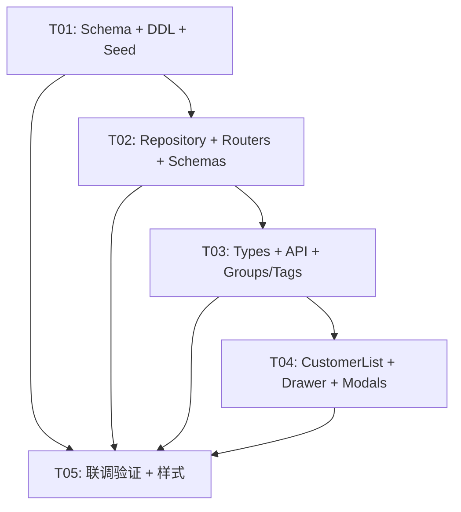

# Morphix「客户管理」栏目 — 系统架构设计与任务分解

> 设计者：高见远（software-architect）　|　依据：PRD `docs/prd-customers.md` + 原型 `prototype/index.html`（行号溯源）+ 现有前后端代码
> 后端：FastAPI + 裸 SQL `DatabaseBackend`（SQLite，`database/morphix_mvp.db`，端口 2181）；`MORPHIX_DEV=1` 启动 `init_schema()` + `seed_defaults()`
> 前端：Vite + React18 + TS(strict) + MUI + Tailwind + lucide-react（端口 5183，代理 `/api` → 2181）
> 交付物：`docs/system_design_customers.md` / `docs/class-diagram_customers.mermaid` / `docs/sequence-diagram_customers.mermaid`

---

## 一、实现方案与框架选型

**沿用既有技术栈，不引入任何新框架/依赖（零新增 npm/pip 包）。**

- **后端**：FastAPI + `DatabaseBackend`（裸 SQL，占位符 `?`）+ Pydantic v2。沿用 Repository 模式（SQL 集中在 `repositories.py`，Router 只调方法）。新增 `routers/customers.py`（`GET /api/customers` 聚合列表）、扩展 `routers/tags.py`（标签分组模型 CRUD）。`routers/__init__.py` 中 `include_router(customers.router)` 挂载。
- **前端**：React + TS(strict)，复用 `src/api/client.ts` 的 `api` 客户端与 `channelsApi.getContactDetail()`，复用 `src/components/common/Modal.tsx`，复用 `src/utils/toast.ts`。新增 `types/customers.ts` 定义客户管理域 DTO。
- **架构模式**：经典「Router → Repository → DatabaseBackend」三层；前端「页面组件 → customersApi → 后端」单向数据流。详情抽屉与渠道联系人详情**同源不同 UI**：共用 `GET /api/contacts/{id}` 聚合数据，但客户管理用 Drawer（从右侧滑出）、渠道管理用 Panel（右栏）。

**核心策略**
1. **复用优先**：`channel_contacts` / `customer_profiles` / `communication_records` / `custom_attributes` 四个表完全复用；详情聚合复用 `ChannelMgmtRepository.get_contact_detail()`；`GET /api/contacts/{id}` 路由复用。
2. **扩展而非替换**：`customer_profiles` 增加 `ai_summary_enabled`；`customer_tags` 增加 `group_id`；新增 `customer_tag_groups` / `customer_tag_relations` / `customer_groups` / `customer_group_members` 四张表。
3. **标签分组模型**：两级「组→标签」，`customer_tag_groups`(id, name, is_hot) + `customer_tags.group_id`，`customer_tags` 唯一约束由 `name UNIQUE` 改为 `(group_id, name) UNIQUE`。
4. **AI 总结开关**：`customer_profiles.ai_summary_enabled INTEGER DEFAULT 0`，客户列表行 toggle → `PUT /api/contacts/{id}/profile`。
5. **分组创建流程**：P0 仅交付分组列表 + 后端 API；从客户列表勾选保存分组的完整创建链路放 P1。
6. **内部成员**：纳入「内部成员」Tab，走同一详情抽屉（`type='internal'`），档案字段空时显示 `--` 占位。
7. **文案统一**：操作列按钮「客户背面」→「详情」。

---

## 二、文件列表（新增 / 修改，相对仓库根）

### 后端（`project/backend/app/`）
| 文件 | 动作 | 说明 |
|---|---|---|
| `schema.py` | 修改 | `SCHEMA_SQL` 追加 4 张新表 + 扩展 `customer_profiles.ai_summary_enabled`；`INDEX_SQL` 追加新索引；`migrate_schema` 追加幂等 ALTER；`seed_defaults` 追加客户域种子块 |
| `database/init_morphix_mvp.sql` | 修改 | 同步追加相同 DDL（运行时以 `schema.py` 为准，此文件作独立初始化快照） |
| `repositories.py` | 修改 | 新增 `CustomerRepository`（list_customers 聚合 / profile 更新 / 沟通记录 CRUD / 自定义属性 CRUD / 标签关系 / 客户分组）+ `row_to_*` 映射 |
| `routers/customers.py` | 新增 | 客户管理路由（`/customers` 列表聚合、`/customers/{id}/communications`、`/customers/{id}/attributes`、`/customer-groups`、`/customer-tag-groups`、`/customer-tag-relations`） |
| `routers/tags.py` | 修改 | 扩展为标签分组模型 CRUD（新增 `GET/POST/PUT/DELETE /customer-tag-groups`，保留旧 `/customer-tags` 扁平兼容但内部走分组模型） |
| `routers/channel_mgmt.py` | 修改 | 新增 `PUT /contacts/{contact_id}/profile`（更新 customer_profiles + ai_summary_enabled） |
| `routers/__init__.py` | 修改 | `include_router(customers.router)` |
| `schemas.py` | 修改 | 新增 `CustomerProfileUpdateRequest`、`CommunicationCreateRequest`、`CustomAttributeCreateRequest`、`CustomerTagRelationRequest`、`CustomerGroupCreateRequest`、`TagGroupCreateRequest`、`TagGroupUpdateRequest` |

### 前端（`src/`）
| 文件 | 动作 | 说明 |
|---|---|---|
| `api/client.ts` | 修改 | 新增 `customersApi`（list/paged、profile update、communications CRUD、attributes CRUD、tag-relations、groups、tag-groups） |
| `types/customers.ts` | 新增 | 客户管理域 DTO（CustomerListItem / CustomerGroup / TagGroupDTO / TagDTO / TagRelation / CustomerFilter 等） |
| `types/resource.ts` | 修改 | 扩展 `TagGroup` / `Tag` 类型以匹配后端分组模型（新增 `groupId` / `isHot` 等字段） |
| `pages/Customers/CustomerList.tsx` | 重写 | 按原型 8486-8608 完全重写：外部/内部 Tabs、9 列表格、筛选栏（搜索+渠道下拉+更多筛选+重置+搜索+名片导入）、分页、跨页全选、行点击→抽屉 |
| `pages/Customers/CustomerDetailDrawer.tsx` | 新增 | 客户详情抽屉（原型 6948-6967）：Header（头像+名称+添加标签+账号·渠道）+ Body（备注+基本信息+Tabs[沟通记录/历史备注]+关联渠道+自定义属性）+ Footer（关闭/发消息） |
| `pages/Customers/CustomerTagModal.tsx` | 新增 | 打标签弹窗（原型 5628-5649）：搜索+标签管理跳转+标签组列表（热标签徽标）+可选标签 toggle+清除+确定 |
| `pages/Customers/CustomerFilterPopover.tsx` | 新增 | 「更多筛选」气泡（原型 8513-8522）：全部筛选字段的 popover 组件 |
| `pages/Customers/CardImportModal.tsx` | 新增 | 名片导入弹窗（原型 6890-6907）：拖拽上传区 + 文件预览 + 提交 mock |
| `pages/Customers/Groups.tsx` | 修改 | `USE_MOCK=false`，接 `/api/customer-groups`；数据模型与后端对齐 |
| `pages/Customers/Tags.tsx` | 修改 | 数据模型对齐原型分组模型（组→标签层级）；`USE_MOCK=false`，接 `/api/customer-tag-groups` + `/api/customer-tags` |
| `pages/Customers/Customers.css` | 新增 | 客户管理域样式（抽屉/标签弹窗/筛选气泡/名片导入），复用 `prototype.css` 既有 `.customer-*` / `.customer-detail-*` class |

---

## 三、数据库 Schema 变更（DDL）

### 3.1 扩展 `customer_profiles`（追加列）
```sql
ALTER TABLE customer_profiles ADD COLUMN ai_summary_enabled INTEGER NOT NULL DEFAULT 0;
```

### 3.2 新增表（CREATE IF NOT EXISTS，并入 `SCHEMA_SQL`）
```sql
-- 标签分组（组→标签 两级）
CREATE TABLE IF NOT EXISTS customer_tag_groups (
  id          TEXT PRIMARY KEY,
  name        TEXT NOT NULL,
  is_hot      INTEGER NOT NULL DEFAULT 0,
  created_at  TEXT NOT NULL DEFAULT CURRENT_TIMESTAMP
);

-- customer_tags 增加 group_id（同时修改既有表：migrate_schema 中 ALTER ADD，新库由 CREATE 改动）
-- 注意：customer_tags 的 name UNIQUE 约束改为 (group_id, name) UNIQUE
-- SQLite 不支持直接修改约束，做法：新建表 → 迁移数据 → 删旧表 → 重命名
-- 新库直接建新结构，旧库由 migrate_schema 执行迁移。

-- 客户→标签 关联
CREATE TABLE IF NOT EXISTS customer_tag_relations (
  customer_id TEXT NOT NULL,  -- FK customer_profiles.id
  tag_id      TEXT NOT NULL,  -- FK customer_tags.id
  PRIMARY KEY (customer_id, tag_id)
);

-- 客户分组
CREATE TABLE IF NOT EXISTS customer_groups (
  id          TEXT PRIMARY KEY,
  name        TEXT NOT NULL,
  type        TEXT NOT NULL DEFAULT 'custom',  -- system | custom
  count       INTEGER NOT NULL DEFAULT 0,
  created_at  TEXT NOT NULL DEFAULT CURRENT_TIMESTAMP,
  updated_at  TEXT NOT NULL DEFAULT CURRENT_TIMESTAMP,
  editor      TEXT NOT NULL DEFAULT ''
);

-- 客户分组→成员 关联
CREATE TABLE IF NOT EXISTS customer_group_members (
  group_id    TEXT NOT NULL,  -- FK customer_groups.id
  customer_id TEXT NOT NULL,  -- FK customer_profiles.id
  PRIMARY KEY (group_id, customer_id)
);
```

### 3.3 `customer_tags` 表结构变更

**目标结构**（替代现有 `customer_tags`）：
```sql
CREATE TABLE IF NOT EXISTS customer_tags (
  id          TEXT PRIMARY KEY,
  group_id    TEXT NOT NULL,                    -- FK customer_tag_groups.id（新增）
  name        TEXT NOT NULL,
  color       TEXT NOT NULL DEFAULT 'blue',
  rule        TEXT NOT NULL DEFAULT '',
  created_at  TEXT NOT NULL DEFAULT CURRENT_TIMESTAMP,
  UNIQUE(group_id, name)
);
```

**迁移策略**（`migrate_schema` 中执行）：
1. 检测 `customer_tags` 是否有 `group_id` 列，若无则：
   a. `ALTER TABLE customer_tags ADD COLUMN group_id TEXT NOT NULL DEFAULT ''`
   b. 重建唯一约束：创建新表 `customer_tags_v2`（含 `UNIQUE(group_id, name)`）→ 迁移数据 → DROP 旧表 → RENAME
   c. 将现有无组标签归入默认组 `tg-default`（由种子创建）

### 3.4 索引（并入 `INDEX_SQL`）
```sql
CREATE INDEX IF NOT EXISTS idx_customer_tag_groups_name  ON customer_tag_groups(name);
CREATE INDEX IF NOT EXISTS idx_customer_tags_group       ON customer_tags(group_id);
CREATE INDEX IF NOT EXISTS idx_customer_tag_relations_cust ON customer_tag_relations(customer_id);
CREATE INDEX IF NOT EXISTS idx_customer_tag_relations_tag  ON customer_tag_relations(tag_id);
CREATE INDEX IF NOT EXISTS idx_customer_groups_type       ON customer_groups(type);
CREATE INDEX IF NOT EXISTS idx_customer_group_members_g   ON customer_group_members(group_id);
CREATE INDEX IF NOT EXISTS idx_customer_group_members_c   ON customer_group_members(customer_id);
```

### 3.5 DDL 同步
在 `database/init_morphix_mvp.sql` 末尾追加 **完全相同** 的扩展列 + 4 张新表 DDL + `customer_tags` 新结构 + 索引，保证与 `schema.py` 一致。

---

## 四、后端 API 设计

### 4.1 路由总表

新增路由文件 `routers/customers.py`：`APIRouter(prefix="/customers", tags=["customers"])`；标签组管理路由扩展现有 `routers/tags.py`：`APIRouter(prefix="/customer-tag-groups", tags=["tags"])`；档案更新路由扩展 `routers/channel_mgmt.py`：现有 `prefix="/channels"` 下新增。

| 方法 | 路径 | 说明 | 查询/路径参数 | 请求体 |
|---|---|---|---|---|
| GET | `/customers` | **客户列表聚合**（JOIN contacts+profile+最新沟通+标签，支持筛选+分页） | `type, accountId, channel, keyword, tagIds, startDate, endDate, page, pageSize` | — |
| GET | `/customers/{customer_id}` | 单个客户聚合详情（复用 get_contact_detail 逻辑，包一层） | — | — |
| POST | `/customers/{customer_id}/communications` | 新增沟通记录 | — | `{content, type?, aiSummary?}` |
| POST | `/customers/{customer_id}/attributes` | 新增自定义属性 | — | `{name, value}` |
| PUT | `/channels/contacts/{contact_id}/profile` | **更新客户档案**（基本信息+备注+AI总结开关） | — | `{phone?, email?, company?, position?, region?, age?, birthday?, remark?, aiSummaryEnabled?}` |
| GET | `/customer-tag-groups` | 标签组列表（含组内标签） | — | — |
| POST | `/customer-tag-groups` | 新建标签组（名称+标签列表） | — | `{name, isHot?, tags: [{name, color?}]}` |
| PUT | `/customer-tag-groups/{id}` | 编辑标签组（名称+标签增删改） | — | `{name?, isHot?, tags?}` |
| DELETE | `/customer-tag-groups/{id}` | 删除标签组（级联删除组内标签+关系） | — | — |
| GET | `/customer-tag-relations/{customer_id}` | 获取某客户的标签列表 | — | — |
| PUT | `/customer-tag-relations/{customer_id}` | 批量设置客户标签（替换式） | — | `{tagIds: string[]}` |
| GET | `/customer-groups` | 客户分组列表（筛选） | `name?, type?` | — |
| POST | `/customer-groups` | 新建客户分组 | — | `{name, type?, customerIds?}` |
| PUT | `/customer-groups/{id}` | 编辑客户分组（P1） | — | `{name?, customerIds?}` |
| DELETE | `/customer-groups/{id}` | 删除客户分组（P1） | — | — |

> **路径说明**：`/customer-tag-groups` 与 `/customer-groups` 是不同资源（标签组 vs 客户分组），命名有意区分。`GET /api/contacts/{id}` 复用不变；`PUT /api/channels/contacts/{id}/profile` 在 channel_mgmt 路由下新增（与 contacts 资源域一致）。

### 4.2 关键响应结构

#### `GET /api/customers` 返回分页信封
```json
{
  "items": [{
    "id": "cp-xxx",
    "contactId": "c-xxx",
    "name": "通天草-林瞰",
    "account": "竹绿-健康@医林通",
    "accountId": "acc-zhulu",
    "channel": "微信",
    "channelType": "wechat",
    "type": "customer",
    "aiSummaryEnabled": true,
    "lastCommunicationTime": "2026-07-11 01:13:13",
    "lastCommunicationContent": "今天的聊天主要发生在...",
    "lastCommunicationAiSummary": "客户咨询产品使用方法...",
    "addTime": "2026-07-03 15:35:45",
    "tags": [{"id":"tag-1","name":"高意向","color":"green","groupId":"tg-1","groupName":"意向程度"}],
    "remark": "重点跟进客户",
    "phone": "13800001234"
  }],
  "total": 30,
  "page": 1,
  "pageSize": 10,
  "hasMore": true
}
```

#### `GET /api/contacts/{id}` 复用不变
```json
{
  "contact": { ... },
  "profile": { ..., "aiSummaryEnabled": 1 },
  "communications": [ ... ],
  "attributes": [ ... ]
}
```

#### `GET /api/customer-tag-groups` 返回
```json
[{
  "id": "tg-1",
  "name": "沟通阶段",
  "isHot": true,
  "tags": [
    {"id": "tag-101", "name": "未沟通", "color": "blue", "rule": ""},
    {"id": "tag-102", "name": "单方沟通", "color": "blue", "rule": ""}
  ]
}]
```

### 4.3 `CustomerRepository` 方法清单（`repositories.py`）

**客户列表聚合**
- `list_customers(type?, account_id?, channel?, keyword?, tag_ids?, start_date?, end_date?, page, page_size)` → 分页信封。核心 SQL 结构：
  ```sql
  SELECT cp.*, cc.name, cc.account_id, cc.channel, cc.channel_type, cc.type,
         cc.add_time AS contact_add_time,
         cp.ai_summary_enabled,
         latest_comm.created_at AS last_comm_time,
         latest_comm.content AS last_comm_content,
         latest_comm.ai_summary AS last_comm_ai_summary
  FROM customer_profiles cp
  JOIN channel_contacts cc ON cc.id = cp.contact_id
  LEFT JOIN (
    SELECT customer_id, created_at, content, ai_summary,
           ROW_NUMBER() OVER (PARTITION BY customer_id ORDER BY created_at DESC) AS rn
    FROM communication_records
  ) latest_comm ON latest_comm.customer_id = cp.id AND latest_comm.rn = 1
  WHERE cc.type = COALESCE(?, cc.type)
    AND cc.account_id = COALESCE(?, cc.account_id)
    AND ...
  ORDER BY cp.created_at DESC
  LIMIT ? OFFSET ?
  ```
  标签通过二次查询 `customer_tag_relations` + `customer_tags` + `customer_tag_groups` 批量聚合（避免 JOIN 爆炸）。

**档案更新**
- `update_customer_profile(contact_id, **fields)` → 更新 `customer_profiles` 指定字段

**沟通记录**
- `create_communication(customer_id, content, type?, ai_summary?)` → `communication_records` INSERT
- `list_communications(customer_id)` → 按 `created_at DESC`

**自定义属性**
- `create_attribute(customer_id, name, value)` → `custom_attributes` INSERT
- `list_attributes(customer_id)` → 按 `created_at`

**标签关系**
- `get_customer_tags(customer_id)` → JOIN `customer_tag_relations` + `customer_tags` + `customer_tag_groups`
- `set_customer_tags(customer_id, tag_ids)` → 事务内 DELETE + INSERT（替换式）

**标签分组**
- `list_tag_groups()` → `customer_tag_groups` + 组内 `customer_tags`
- `create_tag_group(name, is_hot, tags)` → 事务内 INSERT group + 批量 INSERT tags
- `update_tag_group(id, name?, is_hot?, tags?)` → UPDATE group + 标签增量（保留+新增+删除）
- `delete_tag_group(id)` → 级联删除组内标签 + 关联关系

**客户分组**
- `list_customer_groups(name?, type?)` → `customer_groups`
- `create_customer_group(name, type, customer_ids?)` → INSERT group + `customer_group_members`
- `update_customer_group(id, name?, customer_ids?)` → UPDATE + 成员替换
- `delete_customer_group(id)` → 级联删除成员

### 4.4 `schemas.py` 新增请求模型

```python
class CustomerProfileUpdateRequest(BaseModel):
    phone: Optional[str] = None
    email: Optional[str] = None
    company: Optional[str] = None
    position: Optional[str] = None
    region: Optional[str] = None
    age: Optional[int] = None
    birthday: Optional[str] = None
    remark: Optional[str] = None
    aiSummaryEnabled: Optional[bool] = None

class CommunicationCreateRequest(BaseModel):
    content: str
    type: str = "note"
    aiSummary: Optional[str] = ""

class CustomAttributeCreateRequest(BaseModel):
    name: str
    value: str

class CustomerTagRelationRequest(BaseModel):
    tagIds: list[str] = []

class TagGroupCreateRequest(BaseModel):
    name: str
    isHot: bool = False
    tags: list[dict] = []  # [{name, color?}]

class TagGroupUpdateRequest(BaseModel):
    name: Optional[str] = None
    isHot: Optional[bool] = None
    tags: Optional[list[dict]] = None

class CustomerGroupCreateRequest(BaseModel):
    name: str
    type: str = "custom"
    customerIds: Optional[list[str]] = None
```

---

## 五、前端组件拆分

### 5.1 客户列表（`/customers`）
```
CustomerListPage
├─ Tabs[外部客户 | 内部成员]
├─ FilterBar
│   ├─ SearchInput                    (搜索框, 180px)
│   ├─ ChannelSelect                  (触达渠道 分组下拉, import-select)
│   ├─ CustomerFilterPopover          (更多筛选 气泡, P1)
│   ├─ ResetButton / SearchButton
│   └─ CardImportButton               (名片导入, P0 仅 UI)
├─ SelectAllRow                       (跨页全选)
├─ CustomerTable (外部)
│   ├─ 9 列: ☑ | 客户名(头像+name+note) | 所属私域账号 | AI总结开关 | 最后沟通时间 | 最后沟通记录 | 添加时间 | 标签 | 备注 | 操作(详情)
│   └─ CustomerRow (onClick → openDrawer)
├─ MemberTable (内部)
│   └─ 2 列: 内部成员(头像+name) | 所属渠道
├─ Pagination                         (条数 + 页码 + 每页条数)
├─ CustomerDetailDrawer               (openCustomerDrawer → 复用 GET /api/contacts/{id})
│   ├─ DrawerHeader                   (头像 + name + 添加标签 + account·channel + close)
│   ├─ DrawerBody (main + side 双栏)
│   │   ├─ Main
│   │   │   ├─ RemarkSection          (可编辑, 1000字)
│   │   │   ├─ BasicInfoSection       (可编辑: 电话/邮箱/公司/职位/区域/年龄/生日/添加时间)
│   │   │   └─ CommTabs               (沟通记录(N) / 历史备注(N))
│   │   │       ├─ AddCommButton      (+添加新的沟通记录)
│   │   │       └─ CommList           (日期 + AI总结徽标 + 内容)
│   │   └─ Side
│   │       ├─ LinkedChannelsSection  (渠道类型/昵称/签名/关联账号/渠道备注/关联会话)
│   │       └─ CustomAttrSection      (+新建 / name-value 行)
│   └─ DrawerFooter                   (关闭 / 发消息)
├─ CustomerTagModal                   (搜索 + 标签组列表 + 热标签 + toggle选中 + 清除 + 确定)
├─ EditNoteModal                      (备注 textarea, maxLength=1000)
├─ EditBasicInfoModal                 (电话/邮箱/公司/职位/区域/年龄/生日/性别)
├─ AddCommunicationModal              (沟通记录 textarea, maxLength=500)
└─ CardImportModal                    (拖拽上传 + 文件预览 + 提交, P0 UI+mock)
```

### 5.2 客户分组管理（`/customers/groups`）
```
CustomerGroupsPage                   (Groups.tsx 重接后端)
├─ GroupTip                           (跳转客户列表)
├─ FilterRow                          (名称输入 + 类型 select + 重置/查询)
├─ GroupTable                         (6 列: 客户分组/类型/当前客户数/创建时间/编辑时间/编辑人)
└─ GroupEmpty                         (空态: folder图标 + 暂无数据)
```

### 5.3 标签管理（`/customers/tags`）
```
TagsPage                              (Tags.tsx 对齐原型分组模型)
├─ Header                             (标题 + 添加标签组按钮)
├─ TagGroupList
│   └─ TagGroupItem                   (组标题[名称+热标签徽标] + 标签徽标列表 + [编辑])
├─ CreateTagGroupModal                (名称 + 多行标签增删行)
└─ EditTagGroupModal                  (改名称 + 标签增删)
```

---

## 六、依赖包列表

**无新增依赖。**
- 后端：沿用 FastAPI / SQLite（标准库）/ Pydantic v2，`DatabaseBackend` 裸 SQL，不引入 ORM 或任何第三方库。
- 前端：图标复用已装的 `lucide-react`（`Upload`, `Search`, `Filter`, `Check`, `X`, `Plus`, `Edit`, `MessageCircle`）；MUI/Tailwind 已在栈；不新增 npm 包。

---

## 七、PRD 第 8 节「9 个待确认问题」设计决策与理由

| # | 问题 | 决策 | 理由 |
|---|---|---|---|
| Q1 | 标签分组模型如何落地 | **新增 `customer_tag_groups`，`customer_tags` 加 `group_id`，唯一约束改为 `(group_id, name)`，`is_hot` 作为 `customer_tag_groups.is_hot`** | 原型明确为「组→标签」两级（原型 2202-2206：沟通阶段/意向程度/满意度 3 组各含子标签），且所有组均展示「热标签」徽标（6869）；扁平模型无法表达层级。`customer_tags` 既有 name UNIQUE 需解除——SQLite 不支持直接 DROP UNIQUE，通过 CREATE V2 → 迁移 → DROP → RENAME 完成。 |
| Q2 | AI 总结开关存储 | **`customer_profiles.ai_summary_enabled INTEGER DEFAULT 0`** | 默认关闭（0=关/1=开），语义清晰；原型 8533 列头「是否开启AI总结」即布尔开关，Toggle/Switch 组件绑定此字段。 |
| Q3 | 客户分组创建流程范围 | **P0 仅交付分组列表 + 后端 API；创建流程放 P1** | 原型提示 8612「新建客户分组请前往客户列表进行选择后保存」，本页无新建按钮。P0 完成查询/展示/筛选即可（Groups.tsx 已基本就绪），从客户列表勾选→保存分组需跨页面联动，复杂度高，合理后置。 |
| Q4 | 最后沟通时间/记录来源 | **取 `communication_records` 最新一条的 `created_at`/`content`；若无沟通记录则回退 `channel_contacts.add_time` + 空内容** | 沟通记录表为权威来源；窗口函数 `ROW_NUMBER() OVER (PARTITION BY customer_id ORDER BY created_at DESC)` 取最新一条；无记录时回退 add_time 保证列表总有时间显示。 |
| Q5 | 内部成员是否纳入 | **纳入「内部成员」Tab，走同一详情抽屉，档案字段空时显示 `--`** | 原型 8489「内部成员」Tab 与 8573 两列表格已定义；内部成员 `type='internal'`，`customer_profiles` 可能存在但字段多为空（或无 profile 行），Drawer 中空字段统一显示 `--` 占位。 |
| Q6 | 客户等级/价值分层 | **以原型为准，不引入等级列** | 原型 8533 客户列表无等级列；原 `CustomerList.tsx` stub 有 等级/VIP 为占位假设，与原型不符。PRD 明确「以原型为准」。 |
| Q7 | 「客户背面」文案 | **操作列统一为「详情」** | 原型 8543 `customer-op` class 为「客户背面」，功能实为打开详情；命名有歧义，前端统一为「详情」。 |
| Q8 | 名片导入 | **P0 仅 UI 占位 + mock 提交（toast 提示），真实 OCR 建客户放 P2** | 原型 6890 弹窗含拖拽区 + 文件预览 + 提交按钮（点击 toast「名片导入任务已提交」）；P0 实现弹窗 UI 和点击提交 mock，不接后端。 |
| Q9 | 复用确认 | **客户详情抽屉 ≡ 渠道联系人详情共用 `GET /api/contacts/{id}` 聚合** | `ChannelMgmtRepository.get_contact_detail` 已返回 `{contact, profile, communications, attributes}`，正是客户详情抽屉需要的全量数据；`PUT /api/channels/contacts/{id}/profile` 作为写入端点。客户管理不再自建详情/写入接口。 |

---

## 八、种子数据方案（表 / 量级 / 幂等守卫落地位置）

### 8.1 幂等守卫约定
沿用既有 `_count(backend, "SELECT COUNT(*) AS c FROM <表>") == 0:` 守卫；扩展列通过 `migrate_schema` 的 `_has_column` 检测后 `ALTER TABLE` 幂等追加。**改种子后验证需删除 `database/morphix_mvp.db` 重启后端重新生成**。

### 8.2 种子量级与关键行

| 表 | 量级 | 关键内容 |
|---|---|---|
| `customer_profiles` | **扩展至 ~30**（原 5→30） | 覆盖现有 7 个 `channel_contacts` 客户（Cloud/didi/小星星/常胜将军/开心/拾柒 + 新增 23 个），每个档案含 `ai_summary_enabled`（部分客户=1） |
| `channel_contacts` | **扩展 ~12→~35** | 新增约 23 个外部客户 + 19 个内部成员（对齐原型 8535-8544 外部 10 行 + 8575-8593 内部 19 行） |
| `communication_records` | **30-90** | 每客户 1-3 条，含 `ai_summary`（部分带 AI 总结内容，对齐原型 8535 `ai-summary-popover`） |
| `custom_attributes` | **0-60** | 每客户 0-2 条（如「客户等级=VIP」「来源渠道=扫码」） |
| `customer_tag_groups` | **3** | 严格按原型 tagGroups 2202-2206：沟通阶段(is_hot=1)、意向程度(is_hot=1)、满意度(is_hot=1) |
| `customer_tags` | **12**（3 组各含标签） | 沟通阶段: 未沟通/单方沟通/沟通中/沟通中自定义；意向程度: 高/中/低；满意度: 非常满意/满意/一般/不满意/非常不满意 |
| `customer_tag_relations` | **~30** | 为 ~10 个客户各关联 1-3 个标签 |
| `customer_groups` | **4** | 高意向客户(system, count=128)、618大促触达(custom, 56)、沉睡唤醒(custom, 312)、复购潜力(system, 89)，与 Groups.tsx Mock 完全一致 |
| `customer_group_members` | **~30** | 为 4 个分组各关联若干客户（部分交叉） |

### 8.3 种子数据新增位置

`schema.py` 的 `seed_defaults()` 函数末尾追加以下种子块（每个块由 `_count` 守卫）：

1. `customer_tag_groups` 种子（3 组）
2. `customer_tags` 种子（12 个标签，`group_id` 关联对应组）
3. `customer_tag_relations` 种子（~30 条关联）
4. `customer_profiles` 扩展种子：保留现有 5 条 + 新增 ~25 条（`ai_summary_enabled` 部分=1）
5. `channel_contacts` 扩展种子：保留现有 12 条 + 新增 ~23 条外部客户 + 19 条内部成员
6. `communication_records` 扩展种子：从现有 1 条扩展到 ~30-90 条（部分含 `ai_summary`）
7. `custom_attributes` 扩展种子：从现有 1 条扩展到 ~0-60 条
8. `customer_groups` 种子（4 组）
9. `customer_group_members` 种子（~30 条关联）

> **注意**：现有种子 `channel_contacts` 已有 12 条、`customer_profiles` 已有 5 条、`communication_records` 已有 1 条、`custom_attributes` 已有 1 条。扩展种子时需在守卫内部追加 INSERT（使用 `INSERT OR IGNORE` 或先判断 count == 现有量），避免与既有种子数据冲突。开发库若有旧数据需删除 `database/morphix_mvp.db` 重启后端重新种子。

---

## 九、共享知识（跨文件约定）

- **状态枚举**：`type ∈ {customer, internal, customer_group, internal_group}`；`channel_type ∈ {wecom, wechat, whatsapp, business_whatsapp}`。
- **命名转换**：DB snake_case → DTO camelCase，沿用 `row_to_*` 映射（`ai_summary_enabled→aiSummaryEnabled`、`is_hot→isHot`、`group_id→groupId` 等）。
- **日期展示**：`YYYY-MM-DD HH:mm:ss` 格式；列表「最后沟通时间」取 `communication_records.created_at` 最新一条，无记录时取 `channel_contacts.add_time`。
- **分页结构**：`GET /api/customers` 返回 `{items, total, page, pageSize, hasMore}`（`paginate_result`）；`GET /api/customer-groups` 全量返回（数据量小 4 条）。
- **档案空值**：前端抽屉中 profile 字段为空字符串时显示 `--` 占位。
- **AI 总结开关**：客户列表 Toggle → `PUT /api/channels/contacts/{id}/profile {aiSummaryEnabled: bool}`。
- **操作文案**：操作列按钮统一显示「详情」。
- **详情数据同源**：客户管理详情抽屉与渠道联系人详情共用 `GET /api/contacts/{id}`，但前端 UI 各自独立实现（Drawer vs Panel），数据同源即可。

---

## 十、任务列表（有序 + 依赖，按子版面分组，≤5 个任务）

> 实现顺序：T01 后端基础 → T02 后端 API → T03 前端基础 → T04 前端核心 → T05 联调。P0 优先。

### 任务总览

| Task | 子版面 | 名称 | 涉及文件 | 依赖 | 优先级 | 验收点 |
|---|---|---|---|---|---|---|
| T01 | 后端基础 | Schema 扩展 + DDL + 种子数据 | `schema.py`（SCHEMA_SQL/INDEX_SQL/migrate_schema/seed_defaults 全量修改）、`database/init_morphix_mvp.sql` | — | P0 | `customer_profiles` 含 `ai_summary_enabled`；4 张新表存在；`customer_tags` 含 `group_id`+(group_id,name)唯一；索引建立；删库重启后种子数据全部落库（profiles~30/contacts~35/communications 30-90/attributes 0-60/tag_groups 3/tags 12/relations~30/groups 4/members~30） |
| T02 | 后端 API | Repository + Routers + Schemas | `repositories.py`（新增 CustomerRepository + row_to_*）、`routers/customers.py`（新增）、`routers/tags.py`（修改）、`routers/channel_mgmt.py`（新增 PUT /profile）、`routers/__init__.py`（注册）、`schemas.py`（新增 7 个请求模型） | T01 | P0 | `GET /api/customers` 返回聚合分页列表（含筛选+分页）；`PUT /api/channels/contacts/{id}/profile` 可更新档案；`POST /api/customers/{id}/communications` 可新增沟通记录；`POST /api/customers/{id}/attributes` 可新增自定义属性；`GET/PUT /api/customer-tag-relations/{id}` 可读写标签；`GET/POST/PUT/DELETE /api/customer-tag-groups` CRUD 正常；`GET /api/customer-groups` 返回分组列表 |
| T03 | 前端基础 | Types + API + Groups 接后端 + Tags 对齐 | `types/customers.ts`（新增）、`types/resource.ts`（修改）、`api/client.ts`（新增 customersApi）、`pages/Customers/Groups.tsx`（USE_MOCK=false）、`pages/Customers/Tags.tsx`（对齐分组模型+USE_MOCK=false） | T02 | P0 | `customersApi` 封装全部端点；DTO 类型齐全；Groups 页从 `/api/customer-groups` 取数（4 组种子渲染正确）；Tags 页从 `/api/customer-tag-groups` 取数（3 组+12 标签渲染正确） |
| T04 | 前端核心 | CustomerList 重写 + 详情抽屉 + 标签弹窗 | `pages/Customers/CustomerList.tsx`（重写）、`pages/Customers/CustomerDetailDrawer.tsx`（新增）、`pages/Customers/CustomerTagModal.tsx`（新增）、`pages/Customers/CustomerFilterPopover.tsx`（新增，P1 更多筛选）、`pages/Customers/CardImportModal.tsx`（新增，P0 UI+mock）、`pages/Customers/Customers.css`（新增） | T03 | P0 | 外部/内部 Tabs 切换正常；外部客户 9 列表格与原型 8533 完全一致（含 AI 总结 Toggle+popover）；行点击打开详情抽屉（含备注/基本信息/沟通记录 Tab/关联渠道/自定义属性）；抽屉内编辑备注+编辑基本信息可保存；添加沟通记录/自定义属性可保存；打标签弹窗（3 组+标签 toggle+确定）；发消息跳转至渠道会话；分页 10/20/50 可用；名片导入弹窗 UI 到位（mock 提交 toast） |
| T05 | 联调 | 联调验证 + 样式对齐 | 仓库根（前端 `npm run build`、后端启动）、`pages/Customers/Customers.css`、`pages/prototype.css` | T01-T04 | P1 | tsc 无错；3 个子版面数据均从 DB 加载；视觉对齐原型 class/状态标签；抽屉与 CON 同源验证（修改一处两处同步）；刷新后种子数据保留且一致 |

### 任务详细说明

#### T01: 后端数据库层（Schema + DDL + Seed）

**涉及文件**：
- `project/backend/app/schema.py` — SCHEMA_SQL、INDEX_SQL、migrate_schema、seed_defaults

**改动要点**：
1. `SCHEMA_SQL` 追加 `customer_tag_groups`、`customer_tag_relations`、`customer_groups`、`customer_group_members` 4 张表 DDL
2. `SCHEMA_SQL` 中 `customer_tags` 表结构变更为含 `group_id` + `UNIQUE(group_id, name)`
3. `SCHEMA_SQL` 中 `customer_profiles` 增加 `ai_summary_enabled INTEGER NOT NULL DEFAULT 0`
4. `INDEX_SQL` 追加 7 个新索引
5. `migrate_schema` 追加：`customer_profiles.ai_summary_enabled` ALTER；`customer_tags` v1→v2 迁移（旧表→新表→RENAME）
6. `seed_defaults` 末尾追加客户域种子（9 个守卫块，见 §八）
7. `database/init_morphix_mvp.sql` 同步追加（与 SCHEMA_SQL 对齐）

**验收点**：
- 删除 `database/morphix_mvp.db` → 重启后端 → 所有新表和列存在 → 种子入库量级正确

#### T02: 后端 API 层（Repository + Routers + Schemas）

**涉及文件**（5 个）：
- `project/backend/app/repositories.py` — 新增 `CustomerRepository`
- `project/backend/app/routers/customers.py` — 新增路由文件
- `project/backend/app/routers/tags.py` — 扩展标签分组 CRUD
- `project/backend/app/routers/channel_mgmt.py` — 新增 `PUT /contacts/{id}/profile`
- `project/backend/app/routers/__init__.py` — 注册 customers router
- `project/backend/app/schemas.py` — 新增请求模型

**改动要点**：
1. `CustomerRepository`：实现 §4.3 全部方法（list_customers 聚合 SQL 为核心难点——ROW_NUMBER 窗口函数取最新沟通）
2. `routers/customers.py`：`APIRouter(prefix="/customers")`，暴露 §4.1 全部 `/customers` 端点 + `/customer-groups` + `/customer-tag-relations`
3. `routers/tags.py`：新增 `/customer-tag-groups` CRUD（4 个端点），保留旧 `/customer-tags` 端点但改为在分组模型下工作
4. `routers/channel_mgmt.py`：新增 `PUT /contacts/{contact_id}/profile`（调用 `CustomerRepository.update_customer_profile`）
5. 所有端点返回裸数据（无封套），与资源域一致

**验收点**：
- curl `GET /api/customers?page=1&pageSize=10` → 返回分页聚合列表（含标签数组）
- curl `PUT /api/channels/contacts/c-cloud/profile -d '{"remark":"测试","aiSummaryEnabled":true}'` → 返回 200
- curl `GET /api/customer-tag-groups` → 返回 3 组含标签
- curl `GET /api/customer-groups` → 返回 4 组
- 所有端点可用

#### T03: 前端基础（Types + API + Groups/Tags 接后端）

**涉及文件**（5 个）：
- `src/types/customers.ts` — 新增
- `src/types/resource.ts` — 修改 Tag/TagGroup 类型
- `src/api/client.ts` — 新增 customersApi
- `src/pages/Customers/Groups.tsx` — USE_MOCK=false，接后端
- `src/pages/Customers/Tags.tsx` — 对齐分组模型，USE_MOCK=false

**改动要点**：
1. `types/customers.ts`：定义 `CustomerListItem`（对应 `/api/customers` items）、`CustomerGroupDTO`、`TagGroupDTO`、`TagDTO`、`TagRelationDTO`、`CustomerFilter`
2. `types/resource.ts`：Tag 增加 `groupId` / `groupName`；TagGroup 改为对齐 `TagGroupDTO`（含 `isHot`）
3. `api/client.ts`：`customersApi` 封装全部端点（list / getDetail / updateProfile / createCommunication / createAttribute / getTags / setTags / listGroups / listTagGroups / createTagGroup / updateTagGroup / deleteTagGroup）
4. `Groups.tsx`：`USE_MOCK = false` → `useEffect` 调用 `customersApi.listGroups()`；数据模型改为 `CustomerGroupDTO`；筛选逻辑保留（前端筛，因数据量小 4 条）
5. `Tags.tsx`：`USE_MOCK = false` → `useEffect` 调用 `customersApi.listTagGroups()`；CRUD 操作调用后端 API；UI 对齐原型「热标签」徽标

**验收点**：
- Groups 页数据来自 `/api/customer-groups`（4 组渲染）
- Tags 页数据来自 `/api/customer-tag-groups`（3 组+12 标签+热标签徽标）
- Types 编译无错

#### T04: 前端核心（CustomerList + 详情抽屉 + 弹窗）

**涉及文件**（6 个）：
- `src/pages/Customers/CustomerList.tsx` — 完全重写
- `src/pages/Customers/CustomerDetailDrawer.tsx` — 新增
- `src/pages/Customers/CustomerTagModal.tsx` — 新增
- `src/pages/Customers/CustomerFilterPopover.tsx` — 新增
- `src/pages/Customers/CardImportModal.tsx` — 新增
- `src/pages/Customers/Customers.css` — 新增

**改动要点**：
1. **CustomerList.tsx 重写**：从空白 `CustomerListPage`（当前仅 stub）重写为完整页面
   - 状态：`tab`（external/internal）、`search`、`channelFilter`、`page/pageSize`、`selectedIds`
   - 外部客户表：9 列对齐原型 8533（客户名含头像+name+note、AI 总结 Toggle+popover、操作列「详情」）
   - 内部成员表：2 列（头像+name、所属渠道）
   - `useEffect` 调用 `customersApi.list({type, keyword, page, pageSize})`
   - AI 总结 Toggle：`onChange` → `customersApi.updateProfile(contactId, {aiSummaryEnabled})`
   - 操作列「详情」→ `openDrawer(contactId)`
2. **CustomerDetailDrawer.tsx**：
   - 通过 `GET /api/contacts/{id}` 获取聚合数据
   - 主区：备注（可编辑）、基本信息（可编辑）、沟通记录 Tabs、添加沟通记录
   - 侧区：关联私域渠道、自定义属性
   - 编辑备注/基本信息 → Modal → `PUT /api/channels/contacts/{id}/profile`
   - 添加沟通记录/自定义属性 → Modal → `POST /api/customers/{id}/communications|attributes`
3. **CustomerTagModal.tsx**：
   - 加载 `GET /api/customer-tag-groups` → 按组渲染（含热标签徽标）
   - 搜索过滤；选中 toggle；确定 → `PUT /api/customer-tag-relations/{id}`
4. **CustomerFilterPopover.tsx**（P1）：更多筛选气泡含全部字段（最后沟通时间/天数/记录/添加时间/标签/备注/区域/年龄/生日）
5. **CardImportModal.tsx**（P0 UI+mock）：拖拽区 + 文件预览 + 提交 toast
6. **Customers.css**：抽屉/弹窗/筛选气泡样式，复用 `prototype.css` 既有 class

**验收点**：
- 外部客户 9 列表格与原型 8533 完全一致
- 行点击抽屉所有字段正确显示（数据来自 DB）
- 编辑备注/基本信息可保存且实时刷新
- 打标签弹窗 3 组渲染且可 toggle+保存
- 名片导入弹窗 UI 到位（点击「开始导入」toast）
- AI 总结 Toggle 可切换且持久化

#### T05: 联调验证

**涉及文件**：仓库根（全栈联调）+ CSS 微调

**改动要点**：
1. 删除 `database/morphix_mvp.db` → 重启后端 → 确认种子完整入库
2. 前端 `npm run build` 确认 tsc 无错
3. 手动验证 3 个子版面：数据正确、交互流畅、视觉对齐原型
4. 验证客户详情与渠道联系人详情同源：在客户管理抽屉修改备注 → 渠道联系人面板查看同步
5. 刷新页面 → 数据持久（来自 DB）

**验收点**：tsc 无错；3 页面数据均从 DB 加载；抽屉与 CON 同源验证通过

---

## 十一、任务依赖图



---

## 十二、附：Mermaid 图

- 类图：`docs/class-diagram_customers.mermaid`
- 时序图：`docs/sequence-diagram_customers.mermaid`
