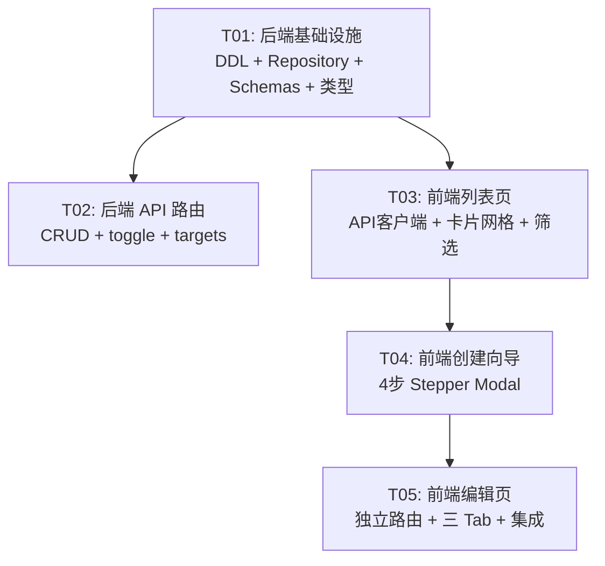

# 运营任务 — 系统架构设计与任务分解

> 架构师：高见远（Bob / software-architect-3）
> 日期：2026-07-19
> 依据：PRD `prd-operations-tasks.md` + 原型 8666-8756 + 现有前后端代码

---

## Part A：系统设计

### 1. 实现方式分析

#### 核心难点

| 难点 | 说明 |
|------|------|
| **内容块 JSON** | content_blocks 存为 JSON 字符串，P0 只含文本块，P1 扩展图片/视频/文件/卡片链接 |
| **4 步 Stepper Modal** | 类型→参数→对象→时间，每步受控组件，最终一次性 POST |
| **编辑三 Tab** | 独立路由 `/operations/tasks/:id/edit`，Tab 间状态共享、按需加载目标数据 |
| **Switch 即时切换** | PATCH `/api/operations/tasks/:id/toggle`，前端乐观更新 |
| **运营对象选择** | 复用 `channel_sessions` 表，带分页+多选 checkbox |

#### 框架与库（沿用现有技术栈）

- **后端**：FastAPI + 裸 SQL（`DatabaseBackend` Protocol）+ SQLite
- **前端**：Vite + React 18 + TypeScript + MUI（已引入） + Tailwind CSS + lucide-react
- **无需新增第三方依赖**，全部基于现有代码库扩展

#### 架构模式

```
┌─ 前端 ─────────────────────────────────────────────┐
│  OperationTasks.tsx  (列表页)                        │
│  OperationTaskCreateModal.tsx (4 步 Stepper Modal)  │
│  OperationTaskEdit.tsx (独立路由，三 Tab)            │
│       │                                              │
│       ▼  api/operations.ts                          │
└───────┼──────────────────────────────────────────────┘
        │  HTTP /api/operations/...
┌───────┼──────────────────────────────────────────────┐
│  routers/operations.py  (FastAPI Router)             │
│       │                                              │
│  operations_schemas.py  (Pydantic 模型)              │
│       │                                              │
│  operations_repository.py  (Repository)              │
│       │                                              │
│  SQLite  (via DatabaseBackend)                       │
│       │                                              │
│  operation_tasks / operation_task_targets            │
└──────────────────────────────────────────────────────┘
```

---

### 2. 文件列表

```
project/backend/app/
├── schema.py                            # [修改] 追加 DDL + 索引 + 种子函数
├── routers/
│   ├── __init__.py                      # [修改] 注册 operations router
│   └── operations.py                    # [新增] 运营任务路由（CRUD + toggle + targets + logs）
├── operations_schemas.py                # [新增] Pydantic 请求/响应模型
└── operations_repository.py             # [新增] 数据访问层

src/
├── router.tsx                           # [修改] 添加 /operations/tasks/:id/edit 路由
├── api/
│   └── operations.ts                    # [新增] 运营任务 API 封装
├── types/
│   └── operations.ts                    # [新增] TypeScript 类型定义
└── pages/Operations/
    ├── OperationTasks.tsx                # [重写] 任务列表页（接入真实 API）
    ├── OperationTasks.css                # [已有] 样式（增量修改）
    ├── OperationTaskCreateModal.tsx      # [新增] 创建向导 Modal（4 步 Stepper）
    ├── OperationTaskEdit.tsx             # [新增] 编辑页（独立路由，三 Tab）
    └── components/
        ├── TaskCard.tsx                  # [新增] 任务卡片组件
        ├── ContentBlockEditor.tsx        # [新增] 内容块编辑器（P0 文本）
        ├── TargetSelector.tsx            # [新增] 运营对象选择器（含静态选择）
        └── ScheduleForm.tsx              # [新增] 运行时间设置表单
```

---

### 3. 数据结构和接口

#### 3.1 DDL

```sql
-- 运营任务主表
CREATE TABLE IF NOT EXISTS operation_tasks (
  id               TEXT PRIMARY KEY,
  name             TEXT NOT NULL,
  task_type        TEXT NOT NULL,              -- 群发任务 | 机器人定时任务 | 朋友圈任务
  channel_type     TEXT NOT NULL DEFAULT '',   -- 企业微信
  session_type     TEXT NOT NULL DEFAULT '',   -- 群聊 | 单聊
  content_blocks   TEXT NOT NULL DEFAULT '[]', -- JSON: [{"type":"text","content":"..."}]
  hosting_action   TEXT NOT NULL DEFAULT '保持不变', -- 保持不变 | 取消托管 | bot_id
  run_frequency    TEXT NOT NULL DEFAULT '一次', -- 一次 | 每天 | 每周 | 每月 | Cron表达式
  run_time         TEXT NOT NULL DEFAULT '',   -- 运行时间 YYYY-MM-DD HH:mm:ss 或 HH:mm
  effective_start  TEXT NOT NULL DEFAULT '',   -- 生效开始日期
  effective_end    TEXT NOT NULL DEFAULT '',   -- 生效结束日期
  cron_expression  TEXT NOT NULL DEFAULT '',   -- Cron 表达式
  run_status       TEXT NOT NULL DEFAULT '未运行', -- 运行中 | 未运行 | 已完成 | 失败 | 已暂停
  enabled          INTEGER NOT NULL DEFAULT 1,
  next_run_time    TEXT NOT NULL DEFAULT '',   -- 下次运行时间
  created_at       TEXT NOT NULL DEFAULT CURRENT_TIMESTAMP,
  updated_at       TEXT NOT NULL DEFAULT CURRENT_TIMESTAMP
);

-- 运营任务目标会话（关联表）
CREATE TABLE IF NOT EXISTS operation_task_targets (
  id            TEXT PRIMARY KEY,
  task_id       TEXT NOT NULL,
  target_type   TEXT NOT NULL DEFAULT 'static', -- static | dynamic
  session_id    TEXT NOT NULL,                   -- 关联 channel_sessions.id
  filter_rules  TEXT NOT NULL DEFAULT '{}',      -- JSON: 动态选择过滤条件
  created_at    TEXT NOT NULL DEFAULT CURRENT_TIMESTAMP,
  FOREIGN KEY (task_id) REFERENCES operation_tasks(id) ON DELETE CASCADE
);
```

#### 3.2 索引

```sql
CREATE INDEX IF NOT EXISTS idx_operation_tasks_type   ON operation_tasks(task_type, enabled);
CREATE INDEX IF NOT EXISTS idx_operation_tasks_status ON operation_tasks(run_status);
CREATE INDEX IF NOT EXISTS idx_operation_tasks_enabled ON operation_tasks(enabled, next_run_time);
CREATE INDEX IF NOT EXISTS idx_op_task_targets_task    ON operation_task_targets(task_id);
CREATE INDEX IF NOT EXISTS idx_op_task_targets_session ON operation_task_targets(session_id);
```

#### 3.3 类图（classDiagram）

```
classDiagram
    %% ---- 后端 Pydantic Schemas ----
    class OperationTaskCreateRequest {
        +str name
        +str task_type
        +str channel_type
        +str session_type
        +list[ContentBlock] content_blocks
        +str hosting_action
        +str run_frequency
        +str run_time
        +str effective_start
        +str effective_end
        +str cron_expression
        +list[TaskTargetInput] targets
    }

    class ContentBlock {
        +str type
        +str content
    }

    class TaskTargetInput {
        +str session_id
        +str target_type
    }

    class OperationTaskUpdateRequest {
        +optional str name
        +optional str task_type
        +optional str channel_type
        +optional str session_type
        +optional list[ContentBlock] content_blocks
        +optional str hosting_action
        +optional str run_frequency
        +optional str run_time
        +optional str effective_start
        +optional str effective_end
        +optional str cron_expression
        +optional bool enabled
    }

    class OperationTaskResponse {
        +str id
        +str name
        +str task_type
        +str channel_type
        +str session_type
        +list[ContentBlock] content_blocks
        +str hosting_action
        +str run_frequency
        +str run_time
        +str effective_start
        +str effective_end
        +str cron_expression
        +str run_status
        +bool enabled
        +str next_run_time
        +int target_count
        +str created_at
        +str updated_at
    }

    class OperationTaskTargetResponse {
        +str id
        +str task_id
        +str target_type
        +str session_id
        +str session_name
        +str account_name
        +str session_type
        +str hosted_status
        +dict filter_rules
    }

    class TargetSessionQuery {
        +optional str account_id
        +optional str search
        +optional str session_type
    }

    class TargetSessionResponse {
        +str id
        +str name
        +str account_name
        +str session_type
        +str hosted_status
        +str add_time
        +bool selected
    }

    %% ---- 前端 TypeScript 类型 ----
    class OperationTask {
        +string id
        +string name
        +TaskType task_type
        +string channel_type
        +string session_type
        +ContentBlock[] content_blocks
        +string hosting_action
        +string run_frequency
        +string run_time
        +string effective_start
        +string effective_end
        +string cron_expression
        +RunStatus run_status
        +boolean enabled
        +string next_run_time
        +number target_count
        +string created_at
        +string updated_at
    }

    class TaskType {
        <<enumeration>>
        群发任务
        机器人定时任务
        朋友圈任务
    }

    class RunStatus {
        <<enumeration>>
        运行中
        未运行
        已完成
        失败
        已暂停
    }

    %% ---- Repository ----
    class OperationTaskRepository {
        -DatabaseBackend _db
        +list_all(filters) tuple[list[dict], int]
        +get(task_id) Optional[dict]
        +create(data) dict
        +update(task_id, data) dict
        +toggle(task_id) dict
        +delete(task_id) None
        +list_targets(task_id) list[dict]
        +set_targets(task_id, targets) None
        +list_sessions_for_targeting(filters) list[dict]
    }

    OperationTaskCreateRequest --> ContentBlock : contains
    OperationTaskCreateRequest --> TaskTargetInput : contains
    OperationTaskResponse --> ContentBlock : contains
    OperationTask ..> TaskType : uses
    OperationTask ..> RunStatus : uses
    OperationTaskRepository --> OperationTaskResponse : returns
    OperationTaskRepository --> OperationTaskTargetResponse : returns
    OperationTaskRepository --> TargetSessionResponse : returns
```

---

### 4. 程序调用流程

#### 4.1 创建运营任务（4 步 Stepper → 一次性 POST）

```
sequenceDiagram
    actor User
    participant ListPage as OperationTasks.tsx
    participant CreateModal as OperationTaskCreateModal
    participant API as api/operations.ts
    participant Router as routers/operations.py
    participant Repo as operations_repository.py
    participant DB as SQLite

    User->>ListPage: 点击"创建运营任务"
    ListPage->>CreateModal: open (step=1)
    Note over CreateModal: Step 1: 选择任务类型

    User->>CreateModal: 选择"群发任务"
    CreateModal->>CreateModal: step=2 (Stepper 高亮)
    Note over CreateModal: Step 2: 设置任务参数

    User->>CreateModal: 填写名称/渠道/会话类型/内容块/托管
    CreateModal->>CreateModal: step=3
    Note over CreateModal: Step 3: 选择运营对象

    CreateModal->>API: GET /api/operations/targets/sessions
    API->>Router: HTTP GET
    Router->>Repo: list_sessions_for_targeting()
    Repo->>DB: SELECT FROM channel_sessions
    DB-->>Repo: rows
    Repo-->>Router: list[dict]
    Router-->>API: JSON
    API-->>CreateModal: TargetSessionResponse[]

    User->>CreateModal: 勾选目标会话 (checkbox)
    CreateModal->>CreateModal: step=4
    Note over CreateModal: Step 4: 设置运行时间

    User->>CreateModal: 选择频率/时间/生效区间
    User->>CreateModal: 点击"创建任务"
    CreateModal->>API: POST /api/operations/tasks
    API->>Router: HTTP POST (OperationTaskCreateRequest)
    Router->>Repo: create(data) + set_targets(task_id, targets)
    Repo->>DB: BEGIN; INSERT operation_tasks; INSERT operation_task_targets...; COMMIT
    DB-->>Repo: ok
    Repo-->>Router: task dict
    Router-->>API: 201 + OperationTaskResponse
    API-->>CreateModal: success
    CreateModal->>CreateModal: close + toast "运营任务创建成功"
    CreateModal-->>ListPage: onCreated() → 刷新列表
```

#### 4.2 列表加载 + 筛选 + Switch 切换

```
sequenceDiagram
    actor User
    participant ListPage as OperationTasks.tsx
    participant API as api/operations.ts
    participant Router as routers/operations.py
    participant Repo as operations_repository.py
    participant DB as SQLite

    Note over ListPage: 页面 mount
    ListPage->>API: GET /api/operations/tasks
    API->>Router: HTTP GET
    Router->>Repo: list_all(search, type, enabled, run_status)
    Repo->>DB: SELECT ... WHERE ... ORDER BY created_at DESC
    DB-->>Repo: rows
    Repo-->>Router: (items, total)
    Router-->>API: list[OperationTaskResponse]
    API-->>ListPage: OperationTask[]
    ListPage->>ListPage: render 卡片网格

    User->>ListPage: 修改筛选条件
    ListPage->>ListPage: 本地过滤 / 重新请求

    User->>ListPage: 点击 Switch 切换启用
    ListPage->>API: PATCH /api/operations/tasks/:id/toggle
    API->>Router: HTTP PATCH
    Router->>Repo: toggle(task_id)
    Repo->>DB: UPDATE operation_tasks SET enabled = NOT enabled, updated_at = ...
    DB-->>Repo: ok
    Repo-->>Router: updated task dict
    Router-->>API: OperationTaskResponse
    API-->>ListPage: updated task
    ListPage->>ListPage: 乐观更新卡片 Switch 状态
```

#### 4.3 编辑页（独立路由，三 Tab）

```
sequenceDiagram
    actor User
    participant EditPage as OperationTaskEdit.tsx
    participant API as api/operations.ts
    participant Router as routers/operations.py
    participant Repo as operations_repository.py
    participant DB as SQLite

    User->>EditPage: 导航到 /operations/tasks/:id/edit
    EditPage->>API: GET /api/operations/tasks/:id
    API->>Router: HTTP GET
    Router->>Repo: get(task_id)
    Repo->>DB: SELECT FROM operation_tasks WHERE id=?
    DB-->>Repo: row
    Repo-->>Router: task dict
    Router-->>API: OperationTaskResponse
    API-->>EditPage: OperationTask

    EditPage->>API: GET /api/operations/tasks/:id/targets
    Router->>Repo: list_targets(task_id)
    Repo->>DB: SELECT ot.*, cs.name FROM operation_task_targets JOIN channel_sessions ...
    DB-->>Repo: rows
    Repo-->>Router: list[dict]
    Router-->>API: OperationTaskTargetResponse[]
    API-->>EditPage: targets

    Note over EditPage: Tab 1: 任务参数（回填表单）
    User->>EditPage: 修改内容块
    User->>EditPage: 切换到 Tab 2: 运营对象
    User->>EditPage: 增删目标会话
    User->>EditPage: 切换到 Tab 3: 任务时间
    User->>EditPage: 修改频率/时间

    User->>EditPage: 点击"保存"
    EditPage->>API: PUT /api/operations/tasks/:id (任务参数+时间)
    API->>Router: HTTP PUT
    Router->>Repo: update(task_id, data)
    Repo->>DB: UPDATE operation_tasks SET ...
    DB-->>Repo: ok

    EditPage->>API: PUT /api/operations/tasks/:id/targets
    Router->>Repo: set_targets(task_id, targets)
    Repo->>DB: DELETE targets + INSERT new targets
    DB-->>Repo: ok
    Router-->>API: success
    EditPage->>EditPage: toast "保存成功" → 返回列表
```

---

### 5. 不清楚/假设

| 项目 | 决策 |
|------|------|
| **运营记录（P0）** | toast 占位 "查看运营记录"，不落表 |
| **排序下拉（P1）** | 本次不实现，列表默认按 `created_at DESC` 排序 |
| **动态选择对象（P2）** | `operation_task_targets.target_type = 'dynamic'` 列已预留，P0 仅 static |
| **Cron 表达式** | `cron_expression` 列已预留，P0 前端仅展示单次/每天/每周/每月 radio |
| **种子任务运行状态** | 按 `next_run_time` 与当前时间比较派生：未来→未运行，过去→已完成 |
| **hosting_action** | P0 默认 "保持不变"，下拉从 `BOT_NAMES` 常量取 |
| **任务类型扩展 P1** | 特定节点×2（特定节点定时任务、特定节点机器人定时任务）DDL 已支持任意 task_type |

---

## Part B：任务分解

### 6. 所需第三方包

```
无额外依赖。全部基于现有技术栈：
- react@^18, react-router-dom@^6
- @mui/material (已引入，Stepper 组件)
- tailwindcss, lucide-react
- fastapi, pydantic
```

---

### 7. 任务列表（按 P0→P1 分组，≤5 个任务）

#### T01：后端数据层 + DDL + 种子 + 类型定义

| 字段 | 内容 |
|------|------|
| **任务 ID** | T01 |
| **任务名称** | 后端基础设施：DDL、索引、Repository、Pydantic Schemas、种子 |
| **源文件** | `project/backend/app/schema.py`（修改）<br>`project/backend/app/operations_schemas.py`（新增）<br>`project/backend/app/operations_repository.py`（新增）<br>`src/types/operations.ts`（新增） |
| **依赖** | 无 |
| **优先级** | P0 |

**验收点**：
- [ ] `operation_tasks` 和 `operation_task_targets` 两张表 DDL 正确写入 `schema.py`
- [ ] 索引全部创建
- [ ] `OperationTaskRepository` 实现 `list_all/get/create/update/toggle/list_targets/set_targets/list_sessions_for_targeting`
- [ ] Pydantic 模型覆盖 Create/Update/Response/TargetResponse/TargetSessionResponse
- [ ] TypeScript 类型 `OperationTask / TaskType / RunStatus / ContentBlock` 定义完整
- [ ] 种子函数写入 4 个任务（杨奇成第一课/第一节课/每日早安问候/周末活动推送），覆盖不同 type/status/frequency
- [ ] 每种子任务关联 2-3 个 `channel_sessions`
- [ ] 种子仅在空表时写入（幂等）

---

#### T02：后端 API 路由 + 注册

| 字段 | 内容 |
|------|------|
| **任务 ID** | T02 |
| **任务名称** | 后端路由层：CRUD 端点 + toggle + targets + sessions 查询 |
| **源文件** | `project/backend/app/routers/operations.py`（新增）<br>`project/backend/app/routers/__init__.py`（修改） |
| **依赖** | T01 |
| **优先级** | P0 |

**验收点**：
- [ ] `GET /api/operations/tasks` 支持筛选参数（search/type/enabled/run_status），返回列表
- [ ] `POST /api/operations/tasks` 接受完整创建请求体（含 targets），事务写入
- [ ] `GET /api/operations/tasks/:id` 返回任务详情
- [ ] `PUT /api/operations/tasks/:id` 更新任务参数
- [ ] `PATCH /api/operations/tasks/:id/toggle` 翻转 enabled 并返回新状态
- [ ] `GET /api/operations/tasks/:id/targets` 返回目标会话列表（JOIN channel_sessions）
- [ ] `PUT /api/operations/tasks/:id/targets` 全量替换目标（DELETE + INSERT）
- [ ] `GET /api/operations/targets/sessions` 可选目标会话列表（支持筛选 account_id/search/session_type）
- [ ] Router 在 `__init__.py` 注册到 `api_router`，prefix `/api/operations`
- [ ] 所有端点返回 HTTP 200/201 且响应结构一致

---

#### T03：前端 API 客户端 + 列表页（Banner + 筛选 + 卡片网格）

| 字段 | 内容 |
|------|------|
| **任务 ID** | T03 |
| **任务名称** | 前端任务列表页：API 封装 + 卡片网格 + 筛选栏 + Switch 切换 |
| **源文件** | `src/api/operations.ts`（新增）<br>`src/pages/Operations/OperationTasks.tsx`（重写）<br>`src/pages/Operations/OperationTasks.css`（增量修改）<br>`src/pages/Operations/components/TaskCard.tsx`（新增） |
| **依赖** | T01（类型定义） |
| **优先级** | P0 |

**验收点**：
- [ ] `src/api/operations.ts` 封装 `listTasks / createTask / getTask / updateTask / toggleTask / listTargets / updateTargets / listTargetSessions`
- [ ] Banner 区与原型一致（标题"运营任务"+ 描述 + 装饰 SVG）
- [ ] 筛选栏：搜索框 + 类型下拉（全部/群发/机器人定时/朋友圈）+ 启用状态下拉（全部/已启用/已停用）+ 运行状态下拉（全部/运行中/未运行/已完成/失败/已暂停）
- [ ] 卡片网格：首张虚线创建入口卡 + 任务卡片列表
- [ ] 任务卡片显示：类型 badge + Switch + 名称 + 渠道/频率 + 下次运行时间 + 编辑/运营记录按钮
- [ ] Switch 切换立即 PATCH API + 乐观更新
- [ ] 空态显示"没有符合条件的运营任务"
- [ ] 首次加载从 API 获取数据（替换 mock）

---

#### T04：前端创建向导 Modal（4 步 Stepper）

| 字段 | 内容 |
|------|------|
| **任务 ID** | T04 |
| **任务名称** | 创建向导：4 步 Stepper Modal + 内容块编辑器 + 目标选择器 |
| **源文件** | `src/pages/Operations/OperationTaskCreateModal.tsx`（新增）<br>`src/pages/Operations/components/ContentBlockEditor.tsx`（新增）<br>`src/pages/Operations/components/TargetSelector.tsx`（新增）<br>`src/pages/Operations/components/ScheduleForm.tsx`（新增） |
| **依赖** | T03（API 客户端 + TaskCard 可复用） |
| **优先级** | P0 |

**验收点**：
- [ ] Modal 内嵌 MUI Stepper（步骤 1-4），步骤可回退不可跳跃
- [ ] Step 1「选择任务类型」：3 张选择卡片（群发/机器人定时/朋友圈），点击进入下一步
- [ ] Step 2「设置任务参数」：任务名称（max 10 字 + 计数）、群发渠道下拉、会话类型下拉、内容块编辑器（P0 仅文本 tab，textarea）、托管机器下拉
- [ ] `ContentBlockEditor` 组件：P0 只有一个文本区块，P1 预留 multi-tab（文本/图片/视频/文件/卡片链接）结构
- [ ] Step 3「选择运营对象」：静态选择，调用 `listTargetSessions` 获取可选会话，表格多选 checkbox
- [ ] `TargetSelector` 组件：搜索框 + 账号筛选 + AI 机器人筛选 + 标签筛选 + 表格（会话/客户昵称/所属账号/会话类型/添加时间/托管状态）
- [ ] Step 4「设置任务运行时间」：运行频率 radio（单次/每天/每周/每月/Cron）+ 运行时间 datetime-local + 生效区间 date range
- [ ] `ScheduleForm` 组件：根据频率切换显示不同时间控件
- [ ] 最后一步点击「创建任务」POST API，成功后 toast "运营任务创建成功" 并关闭 Modal 刷新列表

---

#### T05：前端编辑页 + 路由注册 + 集成调试

| 字段 | 内容 |
|------|------|
| **任务 ID** | T05 |
| **任务名称** | 编辑页（独立路由）+ 前端路由注册 + 上下游集成 |
| **源文件** | `src/pages/Operations/OperationTaskEdit.tsx`（新增）<br>`src/router.tsx`（修改）<br>`src/pages/Operations/OperationTasks.tsx`（增量修改）<br>`src/pages/Operations/OperationTasks.css`（增量修改） |
| **依赖** | T04（复用 ContentBlockEditor / TargetSelector / ScheduleForm 组件） |
| **优先级** | P0 |

**验收点**：
- [ ] `/operations/tasks/:id/edit` 路由注册到 `router.tsx`
- [ ] 编辑页顶部返回栏："← 编辑：{任务名称}"，点击返回列表
- [ ] 三 Tab 切换（任务参数 / 运营对象 / 任务时间），Tab 间不丢失已修改状态
- [ ] Tab 1「任务参数」：回填名称/渠道/会话类型/内容块/托管，复用 `ContentBlockEditor`
- [ ] Tab 2「运营对象」：回填已选目标，可增删，复用 `TargetSelector`
- [ ] Tab 3「任务时间」：回填频率/时间/生效区间，复用 `ScheduleForm`
- [ ] 保存时调用 `PUT /api/operations/tasks/:id` + `PUT /api/operations/tasks/:id/targets`
- [ ] 保存成功 toast 后 `navigate('/operations/tasks')`
- [ ] 列表页「编辑」按钮跳转到 `/operations/tasks/:id/edit`（替换原 Modal 编辑）
- [ ] 「运营记录」按钮 toast "查看运营记录" 占位
- [ ] 列表页「创建」按钮打开 T04 的 `OperationTaskCreateModal`

---

### 8. 共享知识

```
- API 前缀统一 /api/operations/...
- 所有响应直接返回数据（无信封），与现有 /api/bots 等端点风格一致
- 数据库时间格式统一 ISO 8601：YYYY-MM-DD HH:mm:ss
- Repository 方法签名统一：list 返回 (items, total)，单条返回 dict | None
- 前端 API 调用统一通过 src/api/operations.ts 封装
- 内容块 JSON 格式：[{"type":"text","content":"..."}]
- 任务类型枚举：群发任务 | 机器人定时任务 | 朋友圈任务
- 运行状态枚举：运行中 | 未运行 | 已完成 | 失败 | 已暂停
- 运行频率枚举：一次 | 每天 | 每周 | 每月 | Cron表达式
- 种子 id 前缀：opt- 用于 operation_tasks，optt- 用于 operation_task_targets
```

---

### 9. 任务依赖图



---

## 附录：种子数据方案

### operation_tasks（4 条）

| id | name | task_type | channel_type | session_type | run_frequency | run_time | enabled | next_run_time | run_status |
|----|------|-----------|-------------|-------------|---------------|----------|---------|---------------|------------|
| opt-1 | 杨奇成第一课 | 群发任务 | 企业微信 | 群聊 | 一次 | 2026-07-10 04:02:00 | 1 | 2026-07-10 04:02:00 | 已完成 |
| opt-2 | 第一节课 | 群发任务 | 企业微信 | 群聊 | 一次 | 2026-07-11 04:02:00 | 0 | 2026-07-11 04:02:00 | 未运行 |
| opt-3 | 每日早安问候 | 机器人定时任务 | 企业微信 | 单聊 | 每天 | 08:00 | 1 | 2026-07-20 08:00:00 | 未运行 |
| opt-4 | 周末活动推送 | 朋友圈任务 | 企业微信 | 群聊 | 每周 | 10:00 | 1 | 2026-07-25 10:00:00 | 未运行 |

### operation_task_targets（每任务 2-3 个）

| 任务 | 关联 sessions |
|------|--------------|
| opt-1 杨奇成第一课 | ses-drjack, ses-tongtian, ses-zhizu |
| opt-2 第一节课 | ses-fushou, ses-drjack |
| opt-3 每日早安问候 | ses-tongtian, ses-zhizu, ses-fushou |
| opt-4 周末活动推送 | ses-drjack, ses-tongtian |

### content_blocks 种子示例

```json
[{"type":"text","content":"打"}]
```
