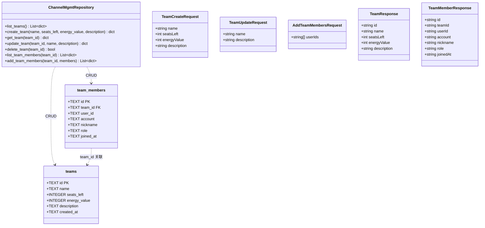
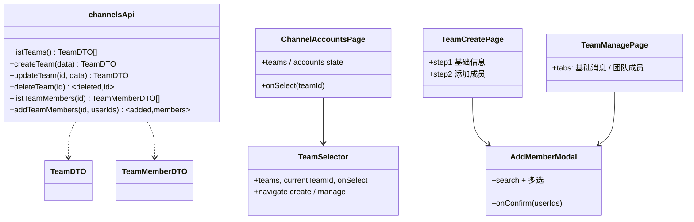
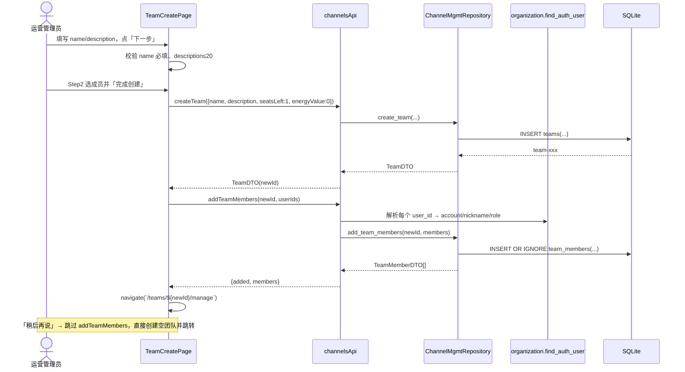
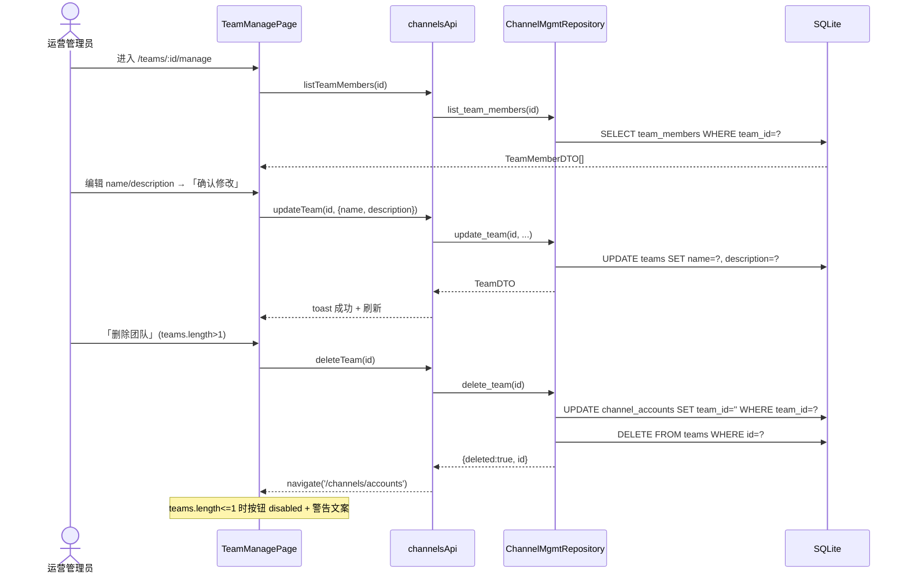
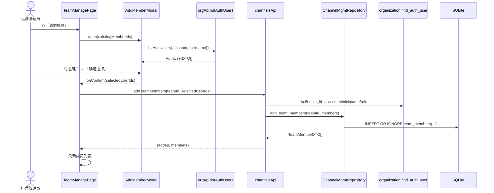
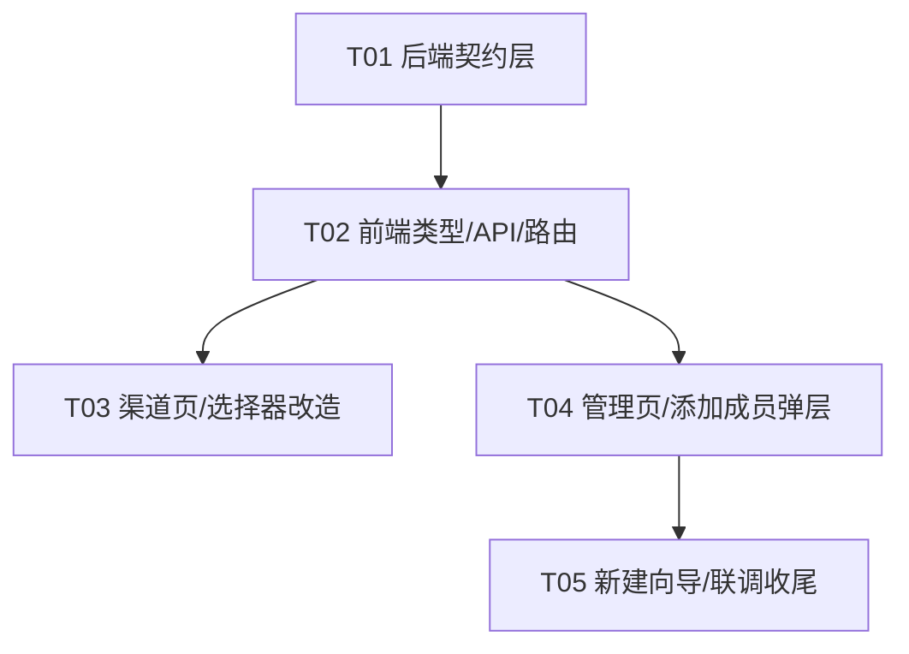

# 渠道账号页 - 团队管理链路改造 · 系统架构设计

> **文档版本**: v1.0
> **作者**: 高见远（架构师）
> **日期**: 2026-07-23
> **依据**: `docs/team-mgmt-prd.md`（许清楚，v1.0）
> **项目**: Morphix 私域运营 AI 协同平台

---

## 0 核心结论（给主理人）

1. **无新增第三方依赖**：后端沿用 FastAPI + 裸 SQL + Repository 模式（Pydantic 已有）；前端沿用现有 `lucide-react` + 自定义 `Button` + `prototype.css`/`Channels.css`，**不引入 MUI/Tailwind**（与默认栈模板不同，以现有工程约定为准）。
2. **迁移策略**：`teams` 表加 `description` 列不能用 `CREATE TABLE IF NOT EXISTS` 自动生效，需在 `init_db` 中追加**幂等迁移**（`PRAGMA table_info` 检测 + `ALTER TABLE`）；`team_members` 为全新表，直接 `CREATE TABLE IF NOT EXISTS`。
3. **成员冗余字段解析**：授权用户是 organization 模块**内存列表**，无对应 DB 表。后端 `POST /teams/{id}/members` 仅收 `userIds`，由 channel_mgmt 路由调用 organization 导出的 `find_auth_user()` 解析 `account/nickname/role` 后冗余落库。
4. **删除团队策略**：硬删团队 + 将关联 `channel_accounts.team_id` 置空 `''`（保留账号数据可用），前后端双重保护禁止删除最后一个团队。
5. **任务分解**：5 个任务，T01 后端契约层为地基，T02/T03/T04 可并行推进，T05 依赖 T04。每条链路（新建/管理/添加成员）均覆盖。

---

## 1 实现方案与框架选型

### 1.1 技术难点与决策

| 难点 | 决策 |
|------|------|
| `teams` 表已有数据，新增 `description` 列如何生效 | 在 `schema.py init_db` 追加幂等迁移：检测 `PRAGMA table_info(teams)` 是否含 `description`，缺失则 `ALTER TABLE teams ADD COLUMN description TEXT NOT NULL DEFAULT ''` |
| `team_members` 为新表 | `CREATE TABLE IF NOT EXISTS team_members(...)`，并在 `idx_team_members_team`/`idx_team_members_user` 建索引 |
| 成员 `account/nickname/role` 来自 organization 内存用户，无 DB 表 | organization 模块导出 `find_auth_user(user_id)` 辅助；channel_mgmt 路由解析后冗余写入 `team_members` |
| 删除团队时 `channel_accounts.team_id` 外键孤儿 | 后端 `delete_team` 先 `UPDATE channel_accounts SET team_id='' WHERE team_id=?` 再 `DELETE teams`；前端 `teams.length<=1` 时禁用删除按钮 |
| 前端 Wizard / Tabs / Modal / 步骤条 | 复用现有 CSS 约定（`.channel-*` / `prototype.css`），新增 `src/pages/Teams/Teams.css` 承载团队域样式；组件用 `lucide-react` 图标 |

### 1.2 框架与库选型

- **后端**：FastAPI + SQLite + 裸 SQL（`DatabaseBackend` 接口）+ Pydantic v2。✅ 沿用现状，**无新增依赖**。
- **前端**：React 18 + TypeScript + Vite + `react-router-dom` + `lucide-react` + 自定义组件。✅ 沿用现状，**无新增依赖**。
- **架构模式**：后端 Repository 模式（Router 只调 Repository，不写 SQL）；前端 页面组件 + `channelsApi` 薄封装 + `useState` 局部状态（无状态库）。

---

## 2 文件列表（相对路径，标注 新增/修改）

> 相对项目根 `/Users/stevenmac/Desktop/工作目录/Morphix/`

### 2.1 后端（Python）

| 状态 | 路径 | 说明 |
|------|------|------|
| 修改 | `project/backend/app/schema.py` | `teams` 表迁移 `description` 列 + 新建 `team_members` 表 + 迁移函数 |
| 修改 | `project/backend/app/repositories.py` | `ChannelMgmtRepository` 扩展 7 个方法（见 §3.3） |
| 修改 | `project/backend/app/schemas.py` | `TeamCreateRequest` 加 `description`；新增 4 个 Pydantic 模型 |
| 修改 | `project/backend/app/routers/channel_mgmt.py` | 新增 `PUT/DELETE /teams/{id}`、`GET/POST /teams/{id}/members` |
| 修改 | `project/backend/app/routers/organization.py` | 导出 `find_auth_user(user_id)` 辅助（供成员冗余解析） |

### 2.2 前端（TypeScript/React）

| 状态 | 路径 | 说明 |
|------|------|------|
| 修改 | `src/types/channels.ts` | `TeamDTO` 加 `description`；新增 `TeamMemberDTO`、`TeamUpdateRequest`、`AddTeamMembersRequest` |
| 修改 | `src/api/client.ts` | `channelsApi` 扩展 `updateTeam`/`deleteTeam`/`listTeamMembers`/`addTeamMembers` |
| 修改 | `src/router.tsx` | 注册 `/teams/create`、`/teams/:id/manage` 路由 |
| 修改 | `src/pages/Channels/ChannelAccounts.tsx` | R01 删除顶部按钮；R02 用 `TeamSelector` 替换 `TeamInfoBar` |
| 修改 | `src/pages/Channels/shared/TeamSelector.tsx` | R03 字体对齐；R04/R05 注入 `useNavigate` 跳转 |
| 修改 | `src/pages/Channels/Channels.css` | `TeamSelector` 字体/下拉样式，对齐 `.sidebar-user-name` |
| 新增 | `src/pages/Teams/TeamCreate.tsx` | 新建团队两步向导（R07/R08） |
| 新增 | `src/pages/Teams/TeamManage.tsx` | 团队管理页（R09–R13） |
| 新增 | `src/pages/Teams/shared/AddMemberModal.tsx` | 添加成员弹层（R14） |
| 新增 | `src/pages/Teams/Teams.css` | 团队域页面样式（步骤条/Tab/表格/弹层） |
| 删除 | `src/pages/Channels/shared/TeamInfoBar.tsx` | 被 `TeamSelector` 取代，T05 清理引用后删除 |

---

## 3 数据结构和接口

### 3.1 数据库表

```sql
-- 现有 teams 表（新增 description 列，通过 init_db 迁移追加）
CREATE TABLE IF NOT EXISTS teams (
  id           TEXT PRIMARY KEY,
  name         TEXT NOT NULL,
  seats_left   INTEGER NOT NULL DEFAULT 0,
  energy_value INTEGER NOT NULL DEFAULT 0,
  description  TEXT NOT NULL DEFAULT '',          -- ← 本期新增（迁移）
  created_at   TEXT NOT NULL DEFAULT CURRENT_TIMESTAMP
);

-- 新增 team_members 表
CREATE TABLE IF NOT EXISTS team_members (
  id        TEXT PRIMARY KEY,                     -- UUID 前缀 tm_
  team_id   TEXT NOT NULL,                        -- 外键 → teams.id
  user_id   TEXT NOT NULL,                        -- 关联 organization 内存用户 id
  account   TEXT NOT NULL DEFAULT '',             -- 冗余：auth_users.account
  nickname  TEXT NOT NULL DEFAULT '',             -- 冗余：auth_users.nickname
  role      TEXT NOT NULL DEFAULT '',             -- 冗余：auth_users.role
  joined_at TEXT NOT NULL DEFAULT CURRENT_TIMESTAMP
);
CREATE INDEX IF NOT EXISTS idx_team_members_team ON team_members(team_id);
CREATE INDEX IF NOT EXISTS idx_team_members_user ON team_members(user_id);
```

### 3.2 Pydantic 模型（`schemas.py`）

```python
# ---- 团队（扩展/新增） ----
class TeamCreateRequest(BaseModel):
    name: str
    seatsLeft: Optional[int] = None   # 缺省由路由默认 1（见 Q1 决策）
    energyValue: Optional[int] = None  # 缺省由路由默认 0
    description: Optional[str] = ""    # ← 新增

class TeamUpdateRequest(BaseModel):
    """部分更新：name / description 至少传其一。"""
    name: Optional[str] = None
    description: Optional[str] = None

class TeamResponse(BaseModel):
    """团队响应 DTO（snake_case DB → camelCase）。"""
    id: str
    name: str
    seatsLeft: int = 0
    energyValue: int = 0
    description: str = ""

class TeamMemberResponse(BaseModel):
    """团队成员 DTO。"""
    id: str
    teamId: str
    userId: str
    account: str = ""
    nickname: str = ""
    role: str = ""
    joinedAt: str = ""

class AddTeamMembersRequest(BaseModel):
    """批量添加成员请求体。"""
    userIds: list[str] = []
```

### 3.3 Repository 方法（`ChannelMgmtRepository`）

| 方法 | 签名 | 说明 |
|------|------|------|
| `list_teams` | `list_teams() -> list[dict]` | 返回含 `description` 的团队字典列表 |
| `create_team` | `create_team(name, seats_left=1, energy_value=0, description='') -> dict` | 默认 seats=1/energy=0（Q1）；返回含 description |
| `get_team` | `get_team(team_id) -> dict \| None` | 按 id 取团队（含 description） |
| `update_team` | `update_team(team_id, name=None, description=None) -> dict \| None` | 部分更新，回查返回最新 |
| `delete_team` | `delete_team(team_id) -> bool` | 先清关联账号 `team_id=''`，再删团队；返回是否删除成功 |
| `list_team_members` | `list_team_members(team_id) -> list[dict]` | 返回该团队成员字典列表 |
| `add_team_members` | `add_team_members(team_id, members: list[dict]) -> list[dict]` | `members` 为已解析的 `{user_id, account, nickname, role}`；`INSERT OR IGNORE` 去重 |

> 字典键约定：`team_id`→`teamId`、`user_id`→`userId`、`joined_at`→`joinedAt`、`seats_left`→`seatsLeft`、`energy_value`→`energyValue`。

### 3.4 前端类型（`src/types/channels.ts`）

```typescript
/** 团队（扩展 description）。 */
export interface TeamDTO {
  id: string
  name: string
  seatsLeft: number
  energyValue: number
  description: string   // ← 新增
}

/** 团队成员（新增）。 */
export interface TeamMemberDTO {
  id: string
  teamId: string
  userId: string
  account: string
  nickname: string
  role: string
  joinedAt: string
}

/** 更新团队请求体（新增）。 */
export interface TeamUpdateRequest {
  name?: string
  description?: string
}

/** 批量添加成员请求体（新增）。 */
export interface AddTeamMembersRequest {
  userIds: string[]
}
```

### 3.5 API 接口清单

| Method | Path | 说明 | Request | Response |
|--------|------|------|---------|----------|
| GET | `/api/channels/teams` | 团队列表 | — | `TeamDTO[]` |
| POST | `/api/channels/teams` | 新建团队 | `TeamCreateRequest` | `TeamDTO` |
| **PUT** | **`/api/channels/teams/{id}`** | **更新团队** | `TeamUpdateRequest` | `TeamDTO` |
| **DELETE** | **`/api/channels/teams/{id}`** | **删除团队** | — | `{ deleted: true, id }` |
| **GET** | **`/api/channels/teams/{id}/members`** | **成员列表** | — | `TeamMemberDTO[]` |
| **POST** | **`/api/channels/teams/{id}/members`** | **添加成员** | `AddTeamMembersRequest` | `{ added: number, members: TeamMemberDTO[] }` |
| GET | `/api/org/auth-users?account=&nickname=` | 复用：成员搜索数据源 | — | `AuthUserDTO[]` |

### 3.6 类图（Mermaid）

后端实体 + Repository + Schemas：



前端组件 + API 客户端：



---

## 4 程序调用流程（时序图）

### 4.1 新建团队链路（两步向导）



### 4.2 管理团队链路（更新 / 删除）



### 4.3 添加成员链路（来自管理页 Tab）



---

## 5 任务列表（有序、含依赖、按实现顺序）

> 说明：本项目为存量工程，无需新增构建/依赖配置文件，**无字面意义的「项目基础设施」任务**；**T01 后端契约层**承担地基角色（所有前端任务依赖其接口契约），遵循 Bob「第一个任务为基础设施」的等效精神。

### T01 — 后端数据层与 API 基础设施（P0）

- **源文件**：`project/backend/app/schema.py`、`project/backend/app/repositories.py`、`project/backend/app/schemas.py`、`project/backend/app/routers/channel_mgmt.py`、`project/backend/app/routers/organization.py`
- **依赖**：无
- **交付**：
  1. `schema.py`：`teams` 表 `description` 幂等迁移 + `team_members` 表建表 + 索引
  2. `repositories.py`：`ChannelMgmtRepository` 扩展 7 个方法（§3.3）
  3. `schemas.py`：`TeamCreateRequest.description` + 新增 `TeamUpdateRequest`/`TeamResponse`/`TeamMemberResponse`/`AddTeamMembersRequest`
  4. `channel_mgmt.py`：`PUT/DELETE /teams/{id}`、`GET/POST /teams/{id}/members` 路由（含删除末团队 400 守卫、团队不存在 404）
  5. `organization.py`：导出 `find_auth_user(user_id)` 辅助

### T02 — 前端类型、API 客户端与路由注册（P0）

- **源文件**：`src/types/channels.ts`、`src/api/client.ts`、`src/router.tsx`
- **依赖**：T01
- **交付**：
  1. `types/channels.ts`：`TeamDTO.description` + `TeamMemberDTO` + `TeamUpdateRequest` + `AddTeamMembersRequest`
  2. `api/client.ts`：`channelsApi` 扩展 `updateTeam`/`deleteTeam`/`listTeamMembers`/`addTeamMembers`
  3. `router.tsx`：import 并注册 `TeamCreatePage`（`/teams/create`）、`TeamManagePage`（`/teams/:id/manage`）

### T03 — 渠道账号页与团队选择器改造（P0）

- **源文件**：`src/pages/Channels/ChannelAccounts.tsx`、`src/pages/Channels/shared/TeamSelector.tsx`、`src/pages/Channels/Channels.css`
- **依赖**：T02
- **交付**：
  1. `ChannelAccounts.tsx`：R01 删除顶部「添加渠道账号」按钮；R02 用 `TeamSelector` 替换 `TeamInfoBar`（传 `teams`/`currentTeamId`/`onSelect`）
  2. `TeamSelector.tsx`：R03 字体对齐 `.sidebar-user-name`；R04/R05 注入 `useNavigate`，「新建团队」→ `/teams/create`，「管理」→ `/teams/:id/manage`
  3. `Channels.css`：补充 `TeamSelector` 触发器字体/下拉面板样式

### T04 — 团队管理页 + 添加成员弹层（P0）

- **源文件**：`src/pages/Teams/TeamManage.tsx`、`src/pages/Teams/shared/AddMemberModal.tsx`、`src/pages/Teams/Teams.css`
- **依赖**：T02
- **交付**：
  1. `TeamManage.tsx`：标题「管理：{teamName}」+ 返回；Tab（基础消息/团队成员）；基础消息表单更新/删除；成员列表表格 + 「添加成员」按钮
  2. `AddMemberModal.tsx`：搜索（account/nickname）+ 查询/重置 + 多选表格 + 空状态 + 「确定选择」；调 `orgApi.listAuthUsers`
  3. `Teams.css`：步骤条/Tab/表格/弹层样式

### T05 — 新建团队向导页 + 联调收尾（P0）

- **源文件**：`src/pages/Teams/TeamCreate.tsx`、`src/pages/Teams/TeamCreate.css`、`src/pages/Channels/shared/TeamInfoBar.tsx`（删除）
- **依赖**：T04（复用 `AddMemberModal`）、T02
- **交付**：
  1. `TeamCreate.tsx`：两步向导（Step1 基础信息→Step2 添加成员），校验 name 必填/description≤20，复用 `AddMemberModal`，创建后跳转管理页；提供「稍后再说」跳过
  2. `TeamCreate.css`：向导页样式（含并入 `Teams.css` 共享部分）
  3. 删除 `TeamInfoBar.tsx` 并清理 `ChannelAccounts.tsx` 残留 import；三条链路联调与边界校验（单团队禁用删除、必填、字数计数）

### 任务依赖图



---

## 6 依赖包列表

| 包 | 版本 | 用途 | 是否新增 |
|----|------|------|---------|
| fastapi | 现有 | 后端 Web 框架 | 否 |
| pydantic | 现有（v2） | 请求/响应模型 | 否 |
| sqlite3（标准库） | — | 数据库 | 否 |
| react | ^18 | 前端 UI | 否 |
| react-router-dom | 现有 | 路由（useNavigate） | 否 |
| lucide-react | 现有 | 图标（Plus/Settings/ChevronDown） | 否 |
| typescript / vite | 现有 | 构建 | 否 |

**结论：本期零新增依赖。**

---

## 7 共享知识（跨文件约定）

1. **命名规范**
   - 资源域路由统一前缀 `/channels`；团队相关 `/channels/teams`，成员 `/channels/teams/{id}/members`。
   - Repository 方法：`list_/get_/create_/update_/delete_/add_`；ID 生成沿用 `_generate_id("team")` / `_generate_id("tm")` 前缀约定。
   - 前端类型集中于 `src/types/channels.ts`；API 方法挂 `channelsApi` 对象。
2. **类型映射（snake_case DB → camelCase DTO）**
   - `seats_left → seatsLeft`、`energy_value → energyValue`、`team_id → teamId`、`user_id → userId`、`joined_at → joinedAt`、`created_at → createdAt`。
   - 空值约定：以空串 `''` 表示「未设置」（与项目一致，不用 `NULL`）；`description` 默认 `''`。
3. **错误处理**
   - 后端：团队不存在 → `404 {detail:"团队不存在"}`；删除最后一个团队 → `400 {message:"当前团队为最后一个团队，无法删除"}`；`user_id` 解析失败 → 跳过该用户（不报错）。统一 `JSONResponse`。
   - 前端：`ApiClientError` → `toast(errText(e))`；删除团队双保险（前端 disabled + 后端 400）。
4. **路由命名 / 响应信封**
   - `/api/channels/*` 为资源域裸数据（无信封），`client.ts` 原样返回（与 `listTeams` 等一致）。
   - `POST /teams/{id}/members` 返回 `{ added: number, members: TeamMemberDTO[] }`。
5. **成员去重**
   - 后端 `add_team_members` 使用 `INSERT OR IGNORE`（以 `team_id+user_id` 自然键或先查重），避免重复添加同一用户（覆盖 PRD R25 部分诉求）。

---

## 8 待明确事项 — PRD Q1–Q5 架构决策建议

| # | 问题 | 架构决策建议 | 落地位置 |
|---|------|-------------|---------|
| **Q1** | 新建团队 `seatsLeft`/`energyValue` 默认值 | **seatsLeft 默认 1，energyValue 默认 0**（对齐种子「初始团队」逻辑）。向导 Step1 不暴露这两个字段；`create_team` 默认值改 `seats_left=1, energy_value=0`，路由对 `None` 回落 1/0 | `repositories.py` `create_team` 默认参；`channel_mgmt.py` POST 路由 |
| **Q2** | 删除团队时关联账号处理 | **硬删团队 + 关联 `channel_accounts.team_id` 置空 `''`**（保留账号数据可用，不清删账号）。前端 `teams.length<=1` 禁删 | `repositories.py` `delete_team`；`channel_mgmt.py` 删除守卫 |
| **Q3** | 团队成员角色是否独立于组织角色 | **本期直接复用 `auth_users.role`**（团队级角色体系归入 P2）。`team_members.role` 冗余存储全局角色，列表展示免 JOIN | `organization.py` `find_auth_user`；`add_team_members` |
| **Q4** | TeamSelector 是否支持多团队切换刷新账号列表 | **P0 仅 UI 切换**（`onSelect` 更新本地 `currentTeamId` 高亮，不做数据联动）；账号列表过滤（P1 R20）后续做。`currentTeamId` 由 `ChannelAccountsPage` 本地 state 维护 | `ChannelAccounts.tsx` state；`TeamSelector.tsx` `onSelect` |
| **Q5** | 新建向导第二步「添加成员」是否必须 | **允许跳过**：Step2 提供「稍后再说」直接创建空团队；完成创建后跳转管理页（一并实现 R22，成本低） | `TeamCreate.tsx` |

### 额外建议（非 PRD 提问，但影响落地）

- **迁移幂等性**：`description` 列迁移须用 `PRAGMA table_info(teams)` 检测，避免重复 `ALTER` 报错（SQLite `ALTER ADD COLUMN` 不可重复执行）。
- **成员实时性**：`team_members` 冗余 `account/nickname/role`，若授权用户后续改名，列表不自动同步（P2 可加刷新任务）；本期可接受。
- **种子数据**：不强制为「初始团队」播种成员；US4 由运营手动添加。

---

## 附录：关键现状验证（来自代码走查）

| 文件 | 发现 | 与需求对应 |
|------|------|-----------|
| `repositories.py` L1271-1289 | `list_teams` 无 description；`create_team` 默认 seats=0/energy=0 | R15/R16 需扩展 |
| `schemas.py` L111-114 | `TeamCreateRequest` 无 description | 需扩展 |
| `routers/channel_mgmt.py` | 仅 GET/POST `/teams` | R17-R19 需新增 |
| `routers/organization.py` L51 | `_auth_users` 为内存列表，未导出查找辅助 | 需导出 `find_auth_user` |
| `src/types/channels.ts` L4-9 | `TeamDTO` 缺 description | R15 |
| `src/api/client.ts` L213-214 | `channelsApi` 仅 `listTeams/createTeam` | R17-R19 |
| `src/router.tsx` | 无 `/teams/*` | R06 |
| `ChannelAccounts.tsx` L122-126 | 顶部「添加渠道账号」按钮待删 | R01 |
| `TeamSelector.tsx` | 下拉结构就绪，onClick 空操作 | R03/R04/R05 |
